# 警方通报！90 后团伙洗钱数百亿

> 原文：[`mp.weixin.qq.com/s?__biz=MzIyMDYwMTk0Mw==&mid=2247538485&idx=4&sn=c5b9a34b73f3e2ae4829e365787c9acc&chksm=97cb9c0da0bc151b66ca432a69f7a72be82e231aef2ba22c98976c8f99b0a880d3fc271ca98d&scene=27#wechat_redirect`](http://mp.weixin.qq.com/s?__biz=MzIyMDYwMTk0Mw==&mid=2247538485&idx=4&sn=c5b9a34b73f3e2ae4829e365787c9acc&chksm=97cb9c0da0bc151b66ca432a69f7a72be82e231aef2ba22c98976c8f99b0a880d3fc271ca98d&scene=27#wechat_redirect)

没有正当工作，父母在家务农，来自偏远乡镇的他们，却开着豪车，频繁出入娱乐场所，一次消费便是数万元。他们口中的“老板”及妻子更是挥金如土，不仅豪掷数百万元买下 2 辆豪车、4 套房产，还在**3 个月内花掉 1200 多万元**，用于购买奢侈品和娱乐场所等消费……

**这是一个在四川内江市街头肆虐一时，开豪车违法飙车的 90 后“炸街”团伙。**去年 8 月，在内江警方专项整治行动中，**这伙驾驶保时捷 911、奔驰、宝马、奥迪等豪车深夜飙车的 90 后无业青年**，引起了警方的怀疑：这群昼伏夜出的年轻人，开着豪车奢靡消费，钱到底从何而来？

日前，在四川省内江市公安局召开的“磐石 2 号”行动新闻通气会上，通报了在公安部“净网 2021 专项行动”中，内江市公安局通过 8 个多月的缜密侦查和全链条打击，成功侦破一起向境外赌博团伙输送资金的非法利益链条案，**该案涉案资金高达数百亿元，抓获涉案犯罪嫌疑人 36 人。**

**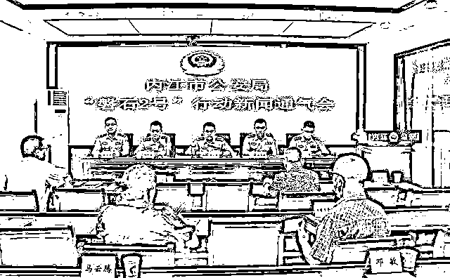**

****　　历时 8 个月****

****　　内江警方打掉一新型涉网犯罪团伙****

**内江市公安局网安支队有关负责人介绍，2021 年 9 月 30 日，依托净网专项行动，内江市公安局成功打掉一新型涉网犯罪团伙，斩断一条向境外赌博团伙输送资金的非法利益链条，该案共抓获嫌疑人 36 人。**

**2021 年 8 月，内江公安在整治深夜飙车、炸街扰民工作中，**发现一伙无业青年驾驶保时捷 911 等豪车，消费奢靡，昼伏夜出，形迹可疑。****

****随即，内江公安经研判决定，采取进一步侦查措施，经网安、治安联合深挖扩线发现：**该团伙疑似为境外赌博平台从事洗钱活动。******

******嫌疑人邹某某、陈某等人利用虚拟货币收取佣金，使用对公账户在四方支付平台为境外赌场洗钱，涉案金额高达数百亿元。******

******该犯罪团伙利用虚假身份注册各类企业收款码，分散收取赌客参赌资金，再隐蔽转入境外网络赌博团伙资金池，而后利用虚拟货币交易的隐蔽性按比例收取佣金，反侦察意识极强。******

******2021 年 9 月 30 日，在内江市公安局党委的统一指挥下，组织全市警力 140 余名，在四川多地展开集中收网，将该窝点一举捣毁，成功抓获涉案人员 36 人，**查封扣押保时捷 911 等各类涉案车辆 17 辆，涉案房产 17 套，扣押、冻结现金 1500 余万元**；查询到剩余虚拟货币 USDT(泰达币)100 万余枚，现市值估计 600 余万元；扣押劳力士等高档手表、奢侈品牌鞋、包等市值估计 100 余万元。******

****目前，案件还在进一步办理中。****

******豪车“炸街”牵出大案******

******蛇皮口袋装现金买车买房，挥金如土******

****深夜，改装的赛摩、豪车在城市街道上呼啸而过，留下阵阵轰鸣声，让人无法入睡，居民们苦不堪言……****

****2021 年 8 月，内江警方接到不少市民举报后，随即展开深夜飙车、**“炸街”扰民专项整治行动。**行动中，警方发现一群年轻人昼伏夜出，驾驶保时捷 911 及奔驰、宝马、奥迪等豪车，不仅在深夜飙车“炸街”，还频繁出入娱乐场所进行高消费。****

******“父母都在家务农，他们又没工作。”**内江市公安局治安管理支队相关负责人、专案组副组长向红星新闻记者介绍，警方调查清楚这伙无业青年的基本情况后，顿时警觉起来，“他们没有工作，名下却有价值几十万甚至百万元的豪车，钱从何而来？”****

****随着调查的深入，警方发现更多可疑之处。**“他们都来自同一个偏远乡镇，都是 90 后。”**办案民警和同事们调查后发现，除了开豪车和频繁出入娱乐场所高消费，这伙 90 后青年穿戴名牌服饰，使用最新款高端手机，支付宝、微信及银行卡交易流水更是超乎想象。****

****“保时捷 911 是一对夫妻的，两人在 3 个月内便花了 1200 多万元。”民警告诉红星新闻记者，除了保时捷 911,1993 年出生的邹某及妻子王某名下还有一辆宝马 7 系轿车，以及 4 套大面积的房产。**这些，都是夫妻俩在案发前近半年内用蛇皮口袋装着现金，到 4S 店和售楼部购买的。**其中，2 辆车购进价近 300 万元，4 套房产中有 1 套是价值约 200 万元的一楼带花园洋房。****

****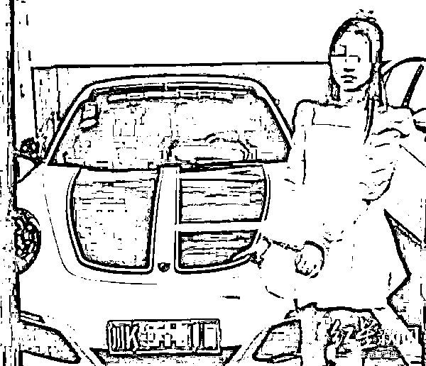****

****▲犯罪嫌疑人及其所购的保时捷 911.****

****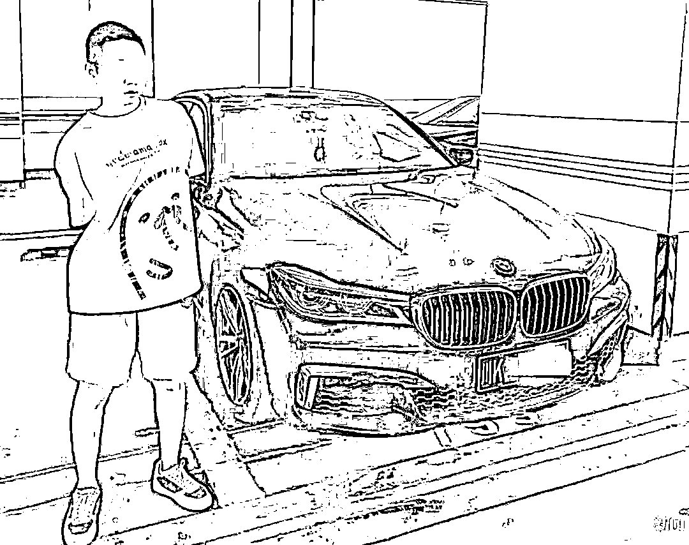****

****▲犯罪嫌疑人邹某及其所购的宝马 7 系轿车。****

******但购买这些房产和豪车的花费，并未出现在夫妻俩的交易流水中。**办案民警介绍，两人 3 个月花掉的 1200 多万元绝大部分被用于在成都 IFS、太古里等地购买路易威登、劳力士等奢侈品，以及出入内江、成都等地的娱乐场所进行高消费。**“买奢侈品，动辄几万至几十万元。在娱乐场所，每晚消费基本都在四五万元以上。”******

******“**更蹊跷的是，他们账户里的资金来源极不正常，****都是他们用花胶布袋子装着，拖到****银行在柜台存进去的。**”除了挥金如土的邹某夫妇，民警们还发现，**邹某身边跟着的一帮 90 后都是无业青年，不少人名下也有房产和奔驰、宝马、奥迪等豪车，且都是最近才用现金购买的。**不仅如此，他们同样频繁出入娱乐场所，一次消费便是数万元，一个月下来便花掉几十上百万元。******

****由此，警方更加怀疑，“这伙人很可能在从事违法犯罪活动。”办案民警说。****

******昼伏夜出藏身闹市网吧******

******操作数百家空壳公司分散收取赌资******

****“从我们开始关注这伙人，就发现他们长期进出内江某繁华商圈的一家网吧。中午进去，经常到次日凌晨三四点才出来。”办案民警介绍，民警潜入网吧调查了解到，在这伙年轻人口中，邹某是他们的“老板”。邹某除了在家，大部分时间都在网吧内。****

******在网吧一个角落，他们“包”下一二十台电脑，有两三个人跑来跑去，不停在电脑上操作。旁边，一般还有 10 多个人守着，穿戴着名牌，玩着最新款手机，面前摆放着高档香烟。**“这个位置在网吧里很隐蔽，他们也很警觉。”办案民警说，生人一旦靠近，这伙人就会发现，马上关掉电脑屏幕，让人难以发现他们操作的具体内容。****

****“他们经常聚在一起玩，每隔一段时间还会深夜到邹某家。”民警介绍，调查发现，在邹某家，这伙人待的时间都不长，一般只有 10 多分钟。离开时，各自都提着不同大小的袋子。“从里面装的东西形状上看，我们感觉都是现金。”****

****专案组副组长说，**警方调查还发现，案发前半年内，这伙年轻人在全国各地注册了数百家商贸、网络公司，但这些公司都是空壳公司。**“每个人至少有 20 家公司，他们公司都是小规模纳税人。”在民警看来，以这些人的消费流水看，很反常。****

****“与此同时，我们还发现邹某隔三差五去广州，与一名张姓男子联系甚密。”办案民警说，经调查，张某经营着一家从事充值、支付类业务的网络科技公司，且与境外有密切联系。“四方支付平台本身是非法的，通过他(张某)的四方支付平台，邹某这个团伙的大量资金流向境外赌博平台。”****

****至此，一个以邹某为首，利用企业收款码分散收取赌客参赌资金，再通过张某公司的“四方支付平台”隐蔽转入境外赌博平台资金池的“跑分”犯罪团伙浮出水面。“发现邹某这个团伙与境外赌博网站有密切联系后，内江市公安局高度重视，立即固定证据立案侦办。”专案组副组长介绍，2021 年 9 月 30 日，内江市公安局将该案立为帮助信息网络犯罪活动案，并成立专案组侦办。当天，内江市公安局网安支队、治安管理支队抽调全市 140 多名警力集中收网。****

****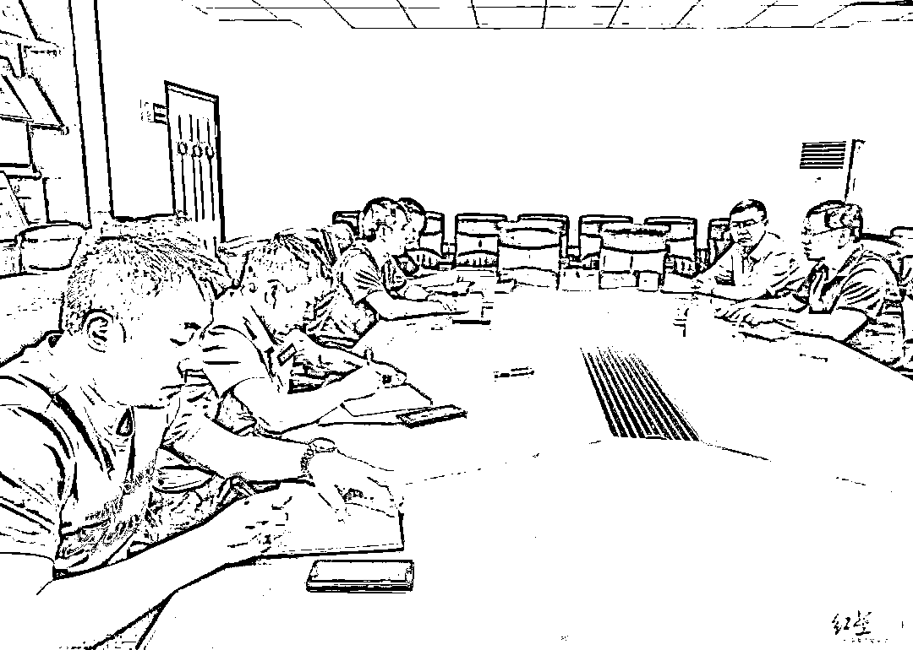****

****▲内江市公安局部署收网行动****

****“在网吧内将邹某等 23 人抓获。被抓时，还有一名犯罪嫌疑人的企业收款码收到数十万元未转出。”办案民警说，此后，警方在四川多地及广州又抓获 13 人。至此，36 名犯罪嫌疑人全部落网。****

****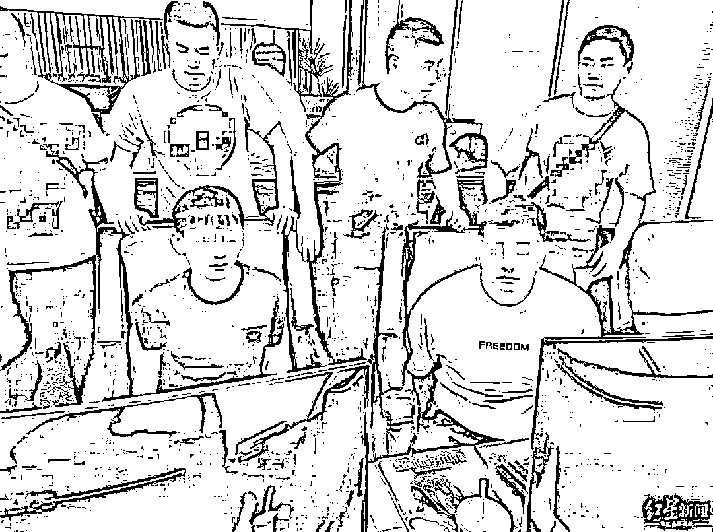****

****▲犯罪嫌疑人在网吧被抓获****

******来自同一个乡镇的“同学帮”******

******半年洗钱数百亿，非法获利数千万******

****“在抓获邹某等人时，我们在网吧电脑上提取了大量数据。”时隔大半年，办案民警仍清楚地记得搜查邹某家的场景。“**满屋都是路易威登包装袋，一个专门的鞋柜里全是 LV 等品牌鞋子，有的一双卖价就达七八万元，衣柜里也有大量奢侈品衣服。”******

******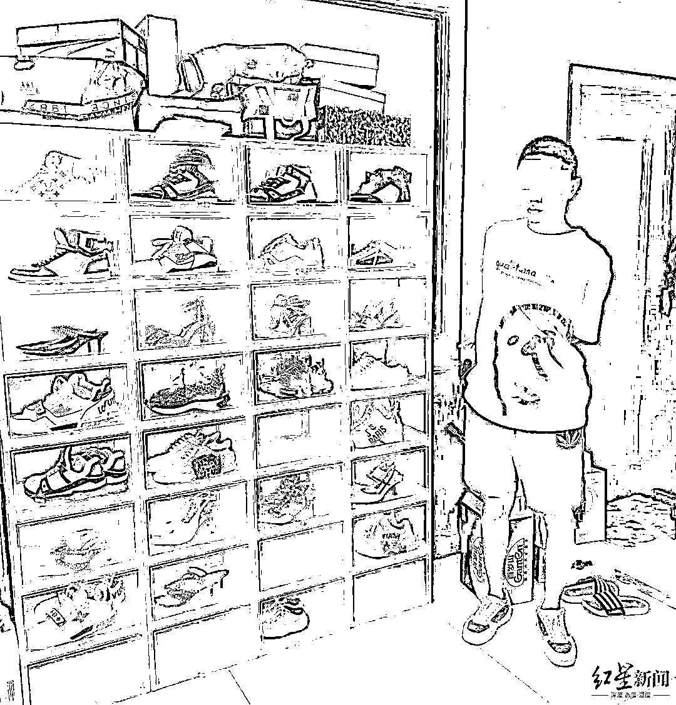******

******▲犯罪嫌疑人邹某及家中鞋柜里的奢侈品牌鞋子******

******不仅如此，在邹某家中保险柜内，还查获了 52 万元现金。民警说，此外，在其他犯罪嫌疑人家中也查获了几万元至数十万元不等的现金。“**有一个(犯罪嫌疑人)上午才提 120 万现金购买了一台保时捷卡宴，下午就被我们查获了。”********

******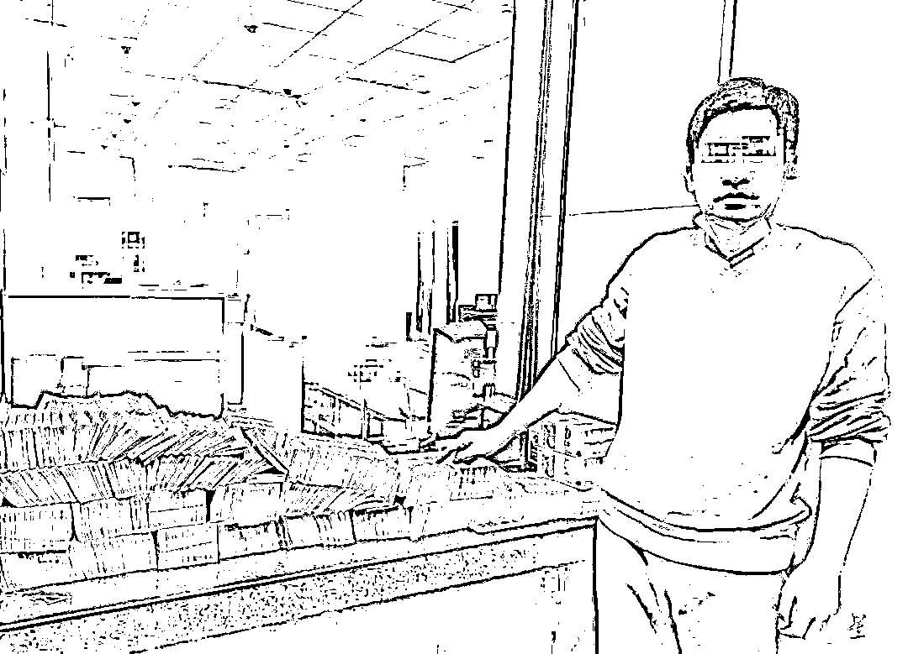******

******▲犯罪嫌疑人及警方查扣的部分现金******

******专案组副组长及办案民警介绍，36 名犯罪嫌疑人被抓获后，**警方查扣的涉案资产包括保时捷 911 及奔驰、宝马、奥迪等车辆 17 辆，房产 17 套，现金 1500 余万元，以及劳力士、卡地亚等高档手表 4 只，和一批奢侈品牌鞋、包。********

******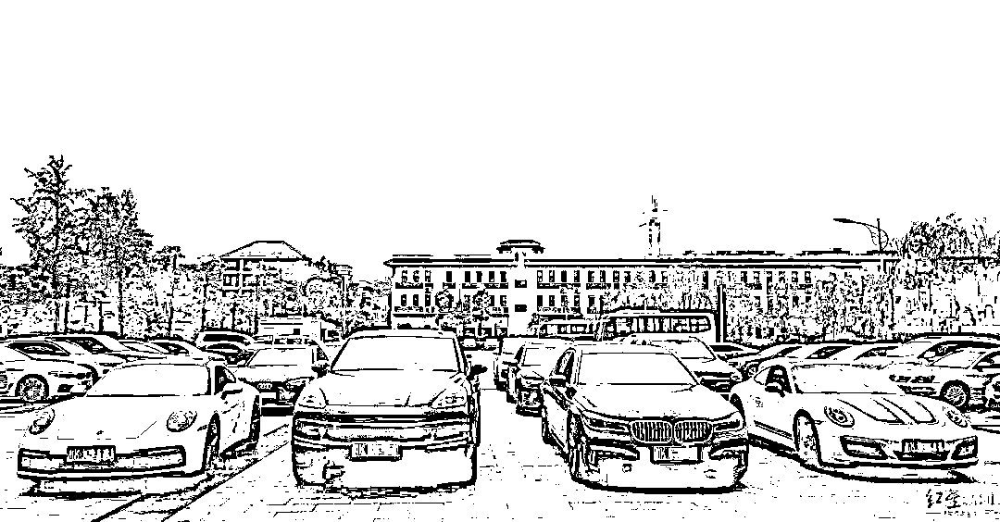******

******▲警方查扣的部分豪车******

******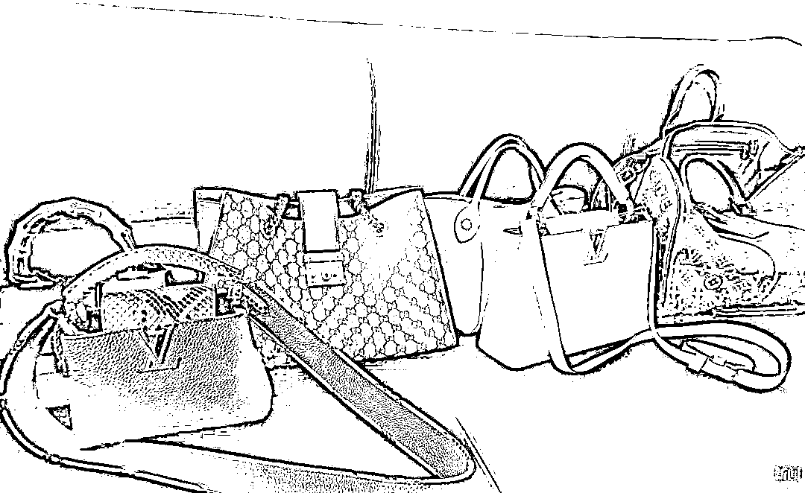******

******▲查扣的奢侈品牌包******

******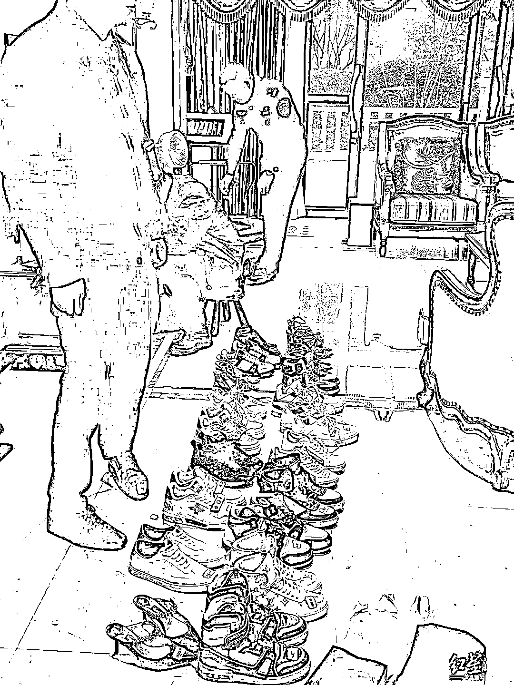******

******▲警方查扣的部分奢侈品牌鞋******

******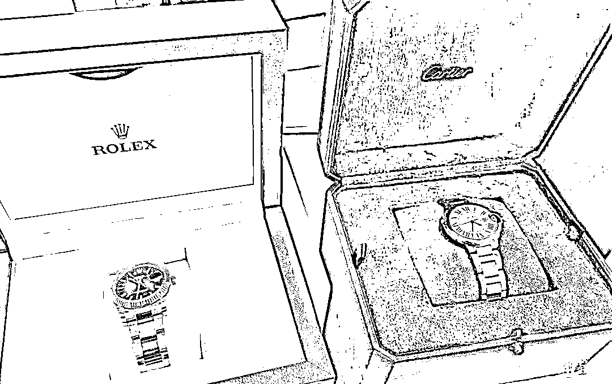******

******▲查扣的名表。******

******此外，经调查，2021 年 6 月 19 日至 9 月 30 日，**该团伙通过线下出售虚拟货币泰达币 700 余万枚，换现 4500 余万元。**至 36 人被抓获时，团伙名下还有 100 余万枚泰达币，市值 600 余万元。******

******在 1TB 电子证据、数千组钱包地址和数十万条交易记录及大量现金等铁证下，到案人员最终如实供述了自己的犯罪事实**，这个“跑分”犯罪团伙的脉络逐渐变得清晰起来。“36 人除了在广州的张某，其他人全是内江市东兴区某偏远乡镇的人，20 多岁，文化程度都不高，都是同学或同学的同学。”****

****民警介绍，据犯罪嫌疑人交代，2019 年 10 月，当时在广州打工的邹某无意间认识张某后，两人一拍即合，开始为境外赌博平台洗钱。此前，两人及身边人都是“小打小闹”，一直到 2021 年 4 月，张某研发了“四方支付平台”，邹某和张某商量后，开始召集身边人在全国各地注册空壳公司，申请企业收款码。****

****随后，“跑分”团伙通过企业收款码，分散收取世界各地赌客的赌资。邹某等人收到这些赌资后，再转入境外赌博平台指定的账户，随后通过境外地下钱庄流向境外赌博平台。****

****而“跑分”团伙非法获利，主要是通过非法虚拟货币交易的隐蔽方式收取佣金。“境外赌博平台按资金流水的一定比例支付。”民警说，在境外赌博平台使用虚拟货币支付佣金后，邹某团伙中专门有人不定期在各地换现，然后将现金带回内江，在邹某家中按比例分配。“其中，邹某提取的比例最高，剩下的由团伙多名骨干分配，其他人则领取工资和获取充当‘码商’的抽成。”****

****经查，在 2021 年 4 月至 9 月期间，这个“跑分”犯罪团伙在短短半年内便用此方式，为境外赌博平台洗钱数百亿元。经专业会计事务所审计，期间，团伙非法获利数千万元。****

******“调查中，邹某妻子告诉我们，邹某每隔几天就会提几十万现金回家，她是既高兴又害怕，不知道钱该怎么用。”**民警说，为此，邹某妻子便想着尽快把钱全部用完，团伙中其他人也是同样的心理。为此，他们用现金买房、买豪车、买奢侈品，频繁出入娱乐场所等进行高消费。****

******民警还在走访中发现，邹某父亲很早就去世了，母亲改嫁后，他随爷爷、奶奶一起生活，而爷爷、奶奶都在乡下务农，这些年邹某也一直没有固定工作。**团伙中除了张某，其他人也来自邹某同一个乡镇，父母都在家务农。****

****在专案组副组长及办案民警看来，**这伙年轻人从小在农村长大**，进城后因虚荣心作祟，想一夜暴富是他们走上犯罪道路的根源。****

****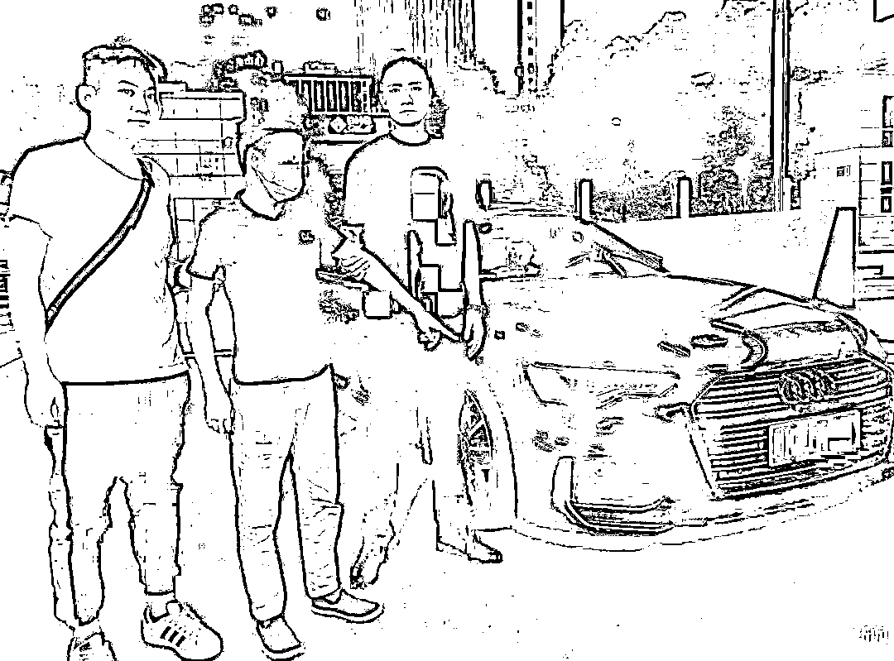****

****▲犯罪嫌疑人被抓获及其所购买的豪车****

****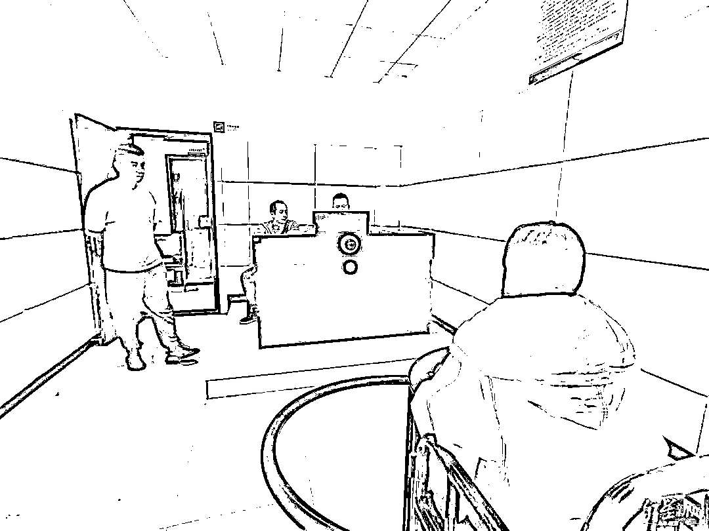****

****▲犯罪嫌疑人接受警方讯问****

****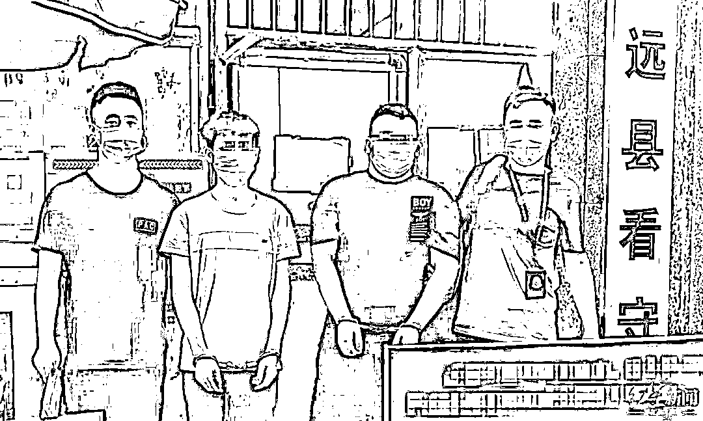****

****▲犯罪嫌疑人被羁押****

****目前，此案已移交检察机关审查起诉，正在进一步办理中，等待犯罪嫌疑人的将是法律的严惩。****

****来源：红星新闻****

************](https://mp.weixin.qq.com/s?__biz=Mzg5ODAwNzA5Ng==&mid=2247487973&idx=1&sn=1b62da6f2018402862a5c375e10c355e&chksm=c06878b2f71ff1a4fbe7df4dec626aa7e696154751693bf16f6c6a302ceaa4d1959040c70518&scene=21#wechat_redirect)****

****← 向右滑动与灰产圈互动交流 →****

********