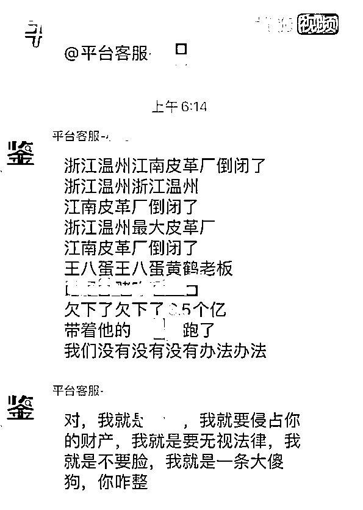
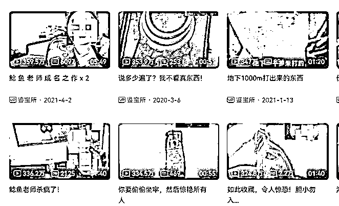
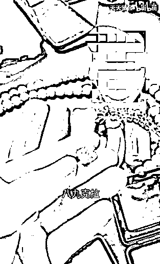
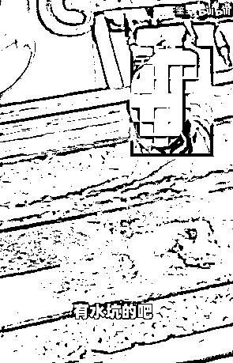
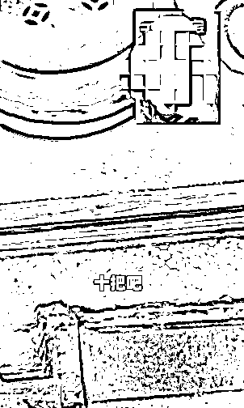
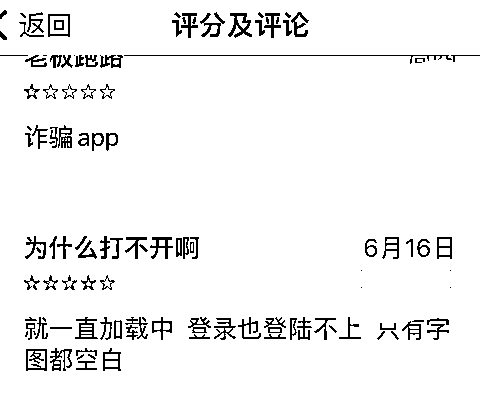
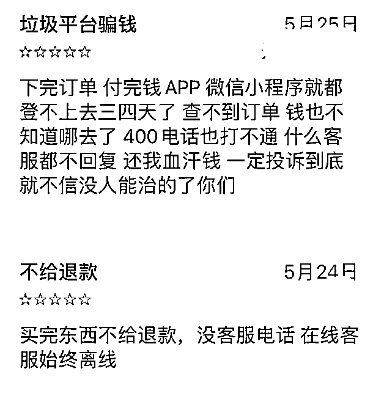
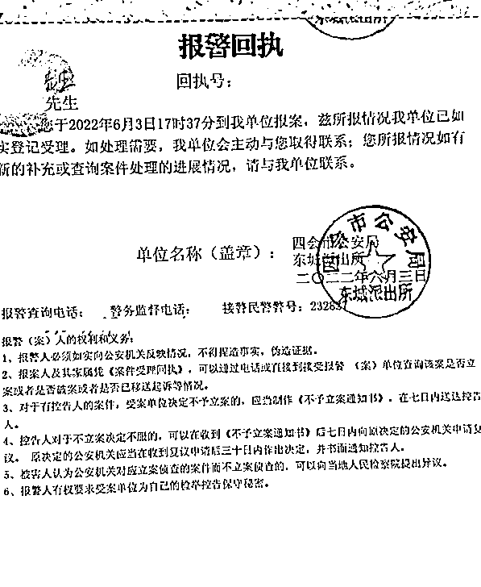

# 抖音爆火的“天天鉴宝”凉了！老板卷 3000 万跑路，平台暴雷？

> 原文：[`mp.weixin.qq.com/s?__biz=MzIyMDYwMTk0Mw==&mid=2247538485&idx=5&sn=c37440d84a7c13695da91b355fcb9a23&chksm=97cb9c0da0bc151b544ebf05e7cda55985c43d912388e0e74a4ee778cc0a2a7d382d066ba15b&scene=27#wechat_redirect`](http://mp.weixin.qq.com/s?__biz=MzIyMDYwMTk0Mw==&mid=2247538485&idx=5&sn=c37440d84a7c13695da91b355fcb9a23&chksm=97cb9c0da0bc151b544ebf05e7cda55985c43d912388e0e74a4ee778cc0a2a7d382d066ba15b&scene=27#wechat_redirect)

曾在 B 站、抖音爆红的“天天鉴宝”暴雷了……

据红星新闻报道：

> 2021 年 9 月至今，“天天鉴宝”拖欠上百户商家三千多万元，员工薪资也被拖欠金额上千万元。
> 
> 还有部分消费者在这一平台上购买价值数万的翡翠、和田玉也一直不发货。

图片来源：@搜狐视频 

鸭鸭先介绍一下“天天鉴宝”是什么？

天天鉴宝能帮你鉴定古董珠宝是不是真货，值多少钱，就跟之前央视的一档鉴宝节目差不多。

图片来源：哔哩哔哩视频截图

节目名字不熟悉的话，这几句话你应该都听过： 

**“我看刑”**

**“这日子越来越有判头了”**

这些话都是出自天天鉴宝，它最开始火的原因也不是鉴宝技术有多牛，而是主播的鉴宝过程、给出的鉴宝评价都太逗了！

有网友拿出“**玉蝉**”求估价，“玉蝉”这名字是不是听起来挺高级的？

鉴宝师边科普边吐槽：“这玉蝉过去叫玉口含，**是放在死人嘴里头**，这可不兴戴啊（不吉利的意思）。

好家伙，手上的玉蝉瞬间变得烫手，这得是从多少年前的古人嘴里掏出来的啊…… 

还有土豪跑来炫耀的，只想让网友开开眼！

土豪拿出了一颗八、九克拉的大粉钻，blingbling，鉴宝专家问几位数拿下来的？

图片来源：哔哩哔哩视频截图

****土豪说小九位数，那不就是过亿了吗？！****

**害，不就是粉钻吗？当年我不光有粉钻，还有红钻、黄钻、绿钻、黑钻、紫钻、彩钻，让我们谢谢“企鹅”！**

**这些都还属于正常古物珠宝鉴定，但有些人拿着非法文物也跑来鉴定了，**

**有网友拿着几把青铜剑来鉴定，本来以为是玩具，没成想是真“青铜剑”，属于三级国家文物。**

****

**图片来源：哔哩哔哩视频截图**

****主播问剑从什么坑出来的？****

****网友立马答“水坑”！****

****

**图片来源：哔哩哔哩视频截图**

**水坑？？？这不就是非法盗墓吗，咋还自爆了！**

**接着主播又问有几把剑？**

**网友回答有十把剑，还有几把在箱子里没拿出来**，网友问这剑没问题吧？****

****

**图片来源：哔哩哔哩视频截图**

**主播表示：“**剑没问题，但人要有问题了**。一把剑判个十年，十把剑也就 100 年吧……”**

**评论区有人放了后续，**晒剑的人疑似被判刑坐牢去了！****

**但这还不是天天鉴宝里最牛的青铜剑，有个网友拿了一把剑柄镶有螭龙纹的商周王级青铜剑。**

****

**图片来源：哔哩哔哩视频截图**

**鉴宝专家一看，就认为比越王勾践剑的级别还要高，于是直接说出“这得判死刑”……（该平台专家鉴定结果不具有完全准确性）**

**有网友总结这些人古董的来源都是以下这几种：**

**朋友宋（送）的，唐（堂）兄给的，秦（亲）戚借的，清明的时候晋（进）的，工地捡的，姥姥传的，商（上）周买的，元（院）里隋（随）手捡的，两大汉丢夏（下）的。**

**鉴宝师一边听着扯古物来源，一边说：“**刑啊，宝友，日子越来越有判头了**！”**

**还有人拿着刚出土的“**战国奥特曼**”来鉴宝……**

**这就是传说中的“**观音迪迦**”吗？**

****

**图片来源：哔哩哔哩视频截图**

**天天鉴宝的直播火了后，后续又开启电商业务。**

**毕竟“网红主播”的尽头最后还是带货，天天鉴宝开设电商平台，让粉丝能走平台购买古玩，也从商家拿货放在平台上售卖。** 

**然而“天天鉴宝”的电商平台在爆雷后，出现拖欠商家货款及保证金，拖欠员工工资，对部分购买者不发货不退款等现象。**

****

**图片来源：@搜狐新闻**

**天天鉴宝 App 及微信小程序无法正常使用，它们的短视频账号也都改了名字。**

****

****

**图片来源：AppStore 截图**

**据一点资讯报道，多位商家称天天鉴宝拖欠货款。其中广东肇庆的商户朱先生表示平台突然无法结算货款，并拒绝退回平台保证金共 92 万元。**

**2022 年 5 月，连平台后台所有订单信息也已经查不到了，并且联系不到相关工作人员，目前有多人举报该平台无法结算货款。**

****

**图片来源：@搜狐新闻**

****这告诉我们什么？****

****作为普通网友，看博主视频图一乐就好，真想为他花钱、或者想靠这个一夜暴富的，还是得三思而后行啊！****

**部分资料图片来源：新浪微博、搜狐新闻、哔哩哔哩弹幕网** 

# **蓝鲸财经记者工作平台：头部文玩电商平台“天天鉴宝”暴雷:数百人讨债，创始人失联**

**红星新闻：网红文玩电商平台“天天鉴宝”暴雷，被指拖欠商户货款 3000 余万元**

**来源：躺倒鸭**

******](https://mp.weixin.qq.com/s?__biz=Mzg5ODAwNzA5Ng==&mid=2247487973&idx=1&sn=1b62da6f2018402862a5c375e10c355e&chksm=c06878b2f71ff1a4fbe7df4dec626aa7e696154751693bf16f6c6a302ceaa4d1959040c70518&scene=21#wechat_redirect)**

**← 向右滑动与灰产圈互动交流 →**

****