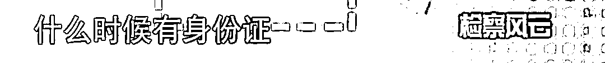

# 一步错步步错！自称 60 年代大学生的上海老太，晚年竟面临铁窗泪……

> 原文：[`mp.weixin.qq.com/s?__biz=MzIyMDYwMTk0Mw==&mid=2247538485&idx=6&sn=2329e3ae6f0cf8951662d7fd5c2beb2a&chksm=97cb9c0da0bc151b8f453b6bde0bf06a70f54f4014a5954af6327cdd699e54b5bbdc3066d7c9&scene=27#wechat_redirect`](http://mp.weixin.qq.com/s?__biz=MzIyMDYwMTk0Mw==&mid=2247538485&idx=6&sn=2329e3ae6f0cf8951662d7fd5c2beb2a&chksm=97cb9c0da0bc151b8f453b6bde0bf06a70f54f4014a5954af6327cdd699e54b5bbdc3066d7c9&scene=27#wechat_redirect)

这周的案件聚焦大家看了吗？

讲一个**自称****60 年代读过大学的上海老太**，没想到命运峰回路转，糊里糊涂走过大半生，晚年竟面临铁窗泪，还蛮唏嘘的。 

让人不由想到了那句老话：**一失足成千古恨，再回头已百年身。**

这位 70 多岁的老人正是本期案件聚焦的嫌疑人，名叫陆晓梅，1947 年出生在上海市中心的一户人家。

**她自称 60 年代考进了华东纺织学院**，也就是今天的东华大学。

而如今的陆晓梅则因为一起诈骗案锒铛入狱。

负责这起案件的检察官说，**陆晓梅几乎骗了她身边的所有人，房东、邻居、的哥、老伴的病友，涉案金额 160 万元。**

而随着案情一层层剥开的，还有她曲折又可怜可恨的一生。 

节目组来到陆晓梅案发前的租住地，浦东王家宅。

在村里人眼里，陆晓梅是一位上海老妈妈，不仅有文化，还是个热心肠，大家对她印象都很好。 

陆晓梅对受害人之一的房东梁阿姨保证的话，听起来非常真诚。 

“我肯定会还给你的。”

“你放心我是本地人。”

“人在做天在看，我不会做坏事的。”’

于是，大家都相信她是有文化、不缺钱的知识分子，所以在她表示自己遇到困难的时候，纷纷借钱给她。

这是以前陆晓梅在房东家吃饭时的视频，看得出能邀请吃饭，跟房东关系确实很好的。

甚至陆晓梅被抓了之后，还在说，欠了房东的 91 万，她出来后肯定要还的。

这个时候还念叨着“对啊这个人要有良心”的陆晓梅，为什么会选择骗那么多人的钱呢。

按她继子的话来看，陆晓梅人也蛮好的，照顾他的病父 30 年如一日。 

话再说回陆晓梅骗钱的事，比较奇怪的是，在陆晓梅写给几个受害人的借条上，很多写着继子的名字和身份证，**陆晓梅的身份证从来没有出现过。**

陆晓梅没有身份证，在继子眼里这不是什么秘密，因为 2022 年有一次陆晓梅晕倒，受害人们送她去医院时，继子表示她没有医保卡和身份证。

事实上，继母的身世对他来说也一直是个谜。 

案发后，警方把陆晓梅带回派出所调查，才发现，她没有身份证，手上连户口簿都没有，自然也不会有电话卡，银行卡。

她用的手机是老伴的手机，她借的 160 万元都是现金支付。

一个出生在上海，自称大学生的人，怎么会没有身份证、户口簿呢？

事情还要从 60 年代说起。

据陆晓梅自述，1968 年大学毕业的她，本可以选择在上海等待分配工作，然而她却自己选择了上山下乡。

按照陆晓梅的说法，**她是为了能马上拿到工资，自愿去东北下乡的。**

那个年代，近 40 块钱的工资算蛮多的了，不过虽然来得及时，下地干活的苦也超乎想象。 

正在这时，农场领导给她介绍了对象，这个男人虽然长得不好看，但却是农场领导的小舅子。

用陆晓梅的话说“跟他我是不愿意的”。 

在可以不下乡的情况下，陆晓梅自愿选择了下乡，第一次改变了自己人生轨迹……

在可以咬牙挺过去的下乡生活中，她又选择和领导的小舅子谈恋爱，以此获取特殊关照，活得轻松点，第二次改变了自己的人生轨迹……

**人生就是连续不断的选择题。**

其实陆晓梅自己也知道，每一次做出选择就代表着改变自己的人生，所以第三次她选择不跟那个男人结婚。

但是几年后，陆晓梅怀孕了，在那个年代，未婚先孕要承受巨大的社会压力，怎么办呢？

70 年代初，怀孕后的陆晓梅带着她的东北男友，也就是那个领导的小舅子回到了上海，和外公外婆住在一起。

在上海先后生下两个女儿后，陆晓梅的东北男友回了老家。

两个女儿对这个父亲都没什么印象。

据大女儿陈月回忆，80 年代，母亲曾经在上海做生意做得风生水起，带回家的钱都是一桶一桶的。

做什么生意这么赚钱呢？

检察官在卷宗里，意外发现了静安区人民法院在 1985 年出具的两页判决书—— 

这里面不仅记录了陆晓梅的犯罪事实，还记载着她的真实姓名。

 “被告人陆某某勾结戴某某，以‘代买摩托车’的谎言诈骗 1600 元，以‘代买自行车’为名，诈骗 1880 元，以‘帮助解决住房困难为名’诈骗 1220 元。”

陆晓梅由此入狱服刑。 

90 年代，服刑出来后的陆晓梅发现，自己 80 年代初知青大返城时，没有领过结婚证的自己明明可以选择把户口迁回上海，**但她因为又做了一次错误的决定而无法迁回上海——虽没结婚但有事实婚姻。**

女儿的父亲说什么都不肯放手，所以陆晓梅出狱后，随迁的户口又打回了东北。 

陆晓梅发现，自己手上既没有户口簿，也没有身份证，几乎寸步难行。

这三十多年里，她跟着一个男人在浦东的乡村生活，虽然也没有跟对方领证结婚，日子倒也过得安稳，需要的时候，用老伴的身份证、手机、银行卡出门办事，一过就是几十年。

在这次的诈骗案中，陆晓梅许给受害人远高于银行的利息，不断地拆东墙补西墙，用下一个受害者的钱还上一个受害者的利息本金，而表面还要维持一个不缺钱的形象，生活开销自然不小。

直至案发，陆晓梅已经再借不到钱，再补不上那些窟窿了。

而她给出的理由是，钱主要都给小女儿吸毒用了，而她又无法提供小女儿的任何联系方式。 

这个解释连大女儿都觉得荒谬。

她们姐妹从小在舅舅家长大，母亲多年没有出现过。

而如今，妹妹在哪里连姐姐也不清楚，更不可能跟母亲联系，妹妹联系母亲不如联系大姐。 

纵观陆晓梅这一生，她是那个年代罕见的大学生，本来能过上踏实、稳定的生活，却因为贪图一时便利、想走捷径，将一手好牌打成了烂牌，最终害人害己。 

陆晓梅自己的反省总结，说得其实蛮深刻的，**她也知道自己人生偏航了，这辈子过得很悲哀。**

网友唏嘘不已：下乡是为了早点拿到工资，嫁人是为了特殊关照。是不是大学生也是她自己说的，大女儿说的 10 句话里 9 句半是谎言，哪半句是真的呢？

第一粒扣子扣错了，剩余的扣子都会扣错，“第一粒扣子”并非人生第一次的抉择。

而是，做人。

▼视频 20 分 43 秒

[`mp.weixin.qq.com/mp/readtemplate?t=pages/video_player_tmpl&action=mpvideo&auto=0&vid=wxv_2455752985688309764`](https://mp.weixin.qq.com/mp/readtemplate?t=pages/video_player_tmpl&action=mpvideo&auto=0&vid=wxv_2455752985688309764)

来源：案件聚焦，脊梁 in 上海 SH

](https://mp.weixin.qq.com/s?__biz=Mzg5ODAwNzA5Ng==&mid=2247487973&idx=1&sn=1b62da6f2018402862a5c375e10c355e&chksm=c06878b2f71ff1a4fbe7df4dec626aa7e696154751693bf16f6c6a302ceaa4d1959040c70518&scene=21#wechat_redirect)

← 向右滑动与灰产圈互动交流 →

