# 现在上海，很多人忍住不住偷吃，是真偷吃，不是那个偷吃

> 原文：[`mp.weixin.qq.com/s?__biz=MzIyMDYwMTk0Mw==&mid=2247538571&idx=1&sn=80074a0592d5ccb5571768d2c977d9ee&chksm=97cb9cb3a0bc15a52665c589786cc5574774f3441683b01a27c5e91f37f5e90279e054cf918d&scene=27#wechat_redirect`](http://mp.weixin.qq.com/s?__biz=MzIyMDYwMTk0Mw==&mid=2247538571&idx=1&sn=80074a0592d5ccb5571768d2c977d9ee&chksm=97cb9cb3a0bc15a52665c589786cc5574774f3441683b01a27c5e91f37f5e90279e054cf918d&scene=27#wechat_redirect)

上海 6 月 1 日后已经逐步复工复产，但部分地区餐饮店的堂食还是迟迟未恢复。

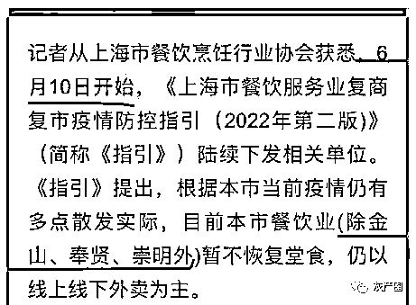

上海现在每天到饭点就像个大酒吧，不能堂食，路人就买了吃的围在路边的电动车座上、电箱、邮箱盖上，围站着吃东西，像极了酒吧的散台，画面又心酸又好笑。

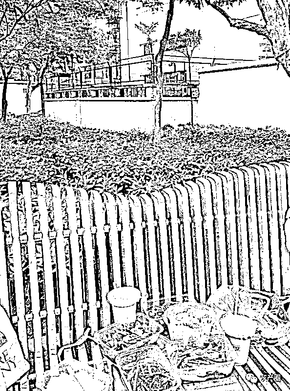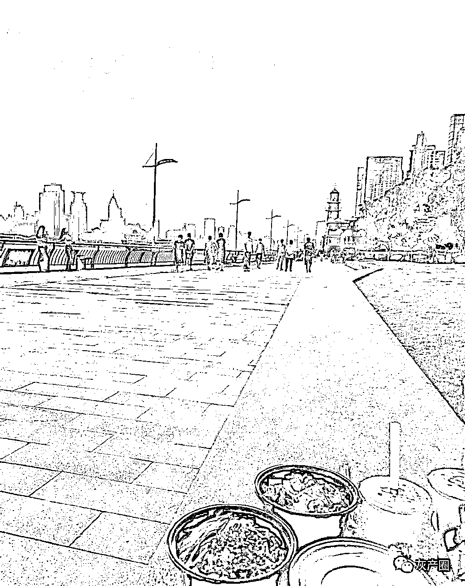

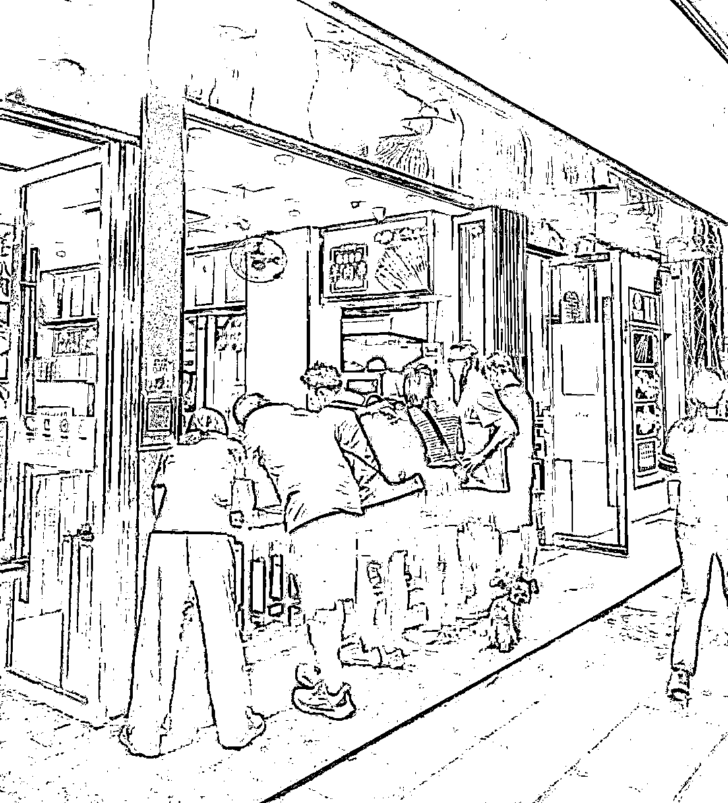

约人吃饭聊天，只能带块野餐垫出去跟人见面～

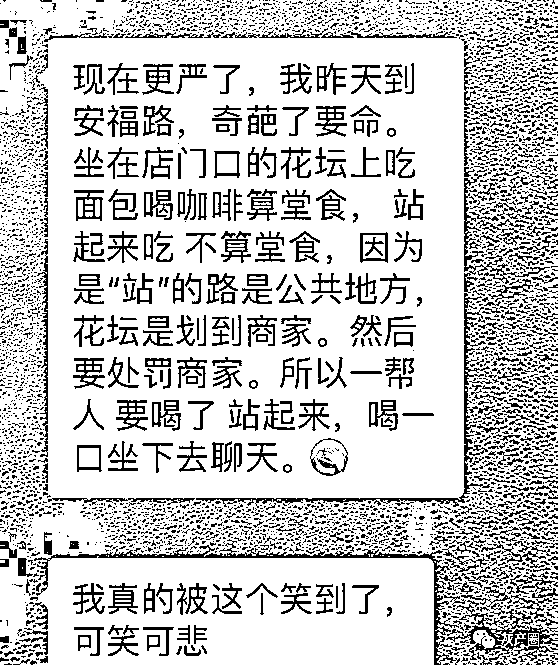

但是上海这么大，总有些忍不住的，于是就出现了各种奇葩现场

氛围感拉满

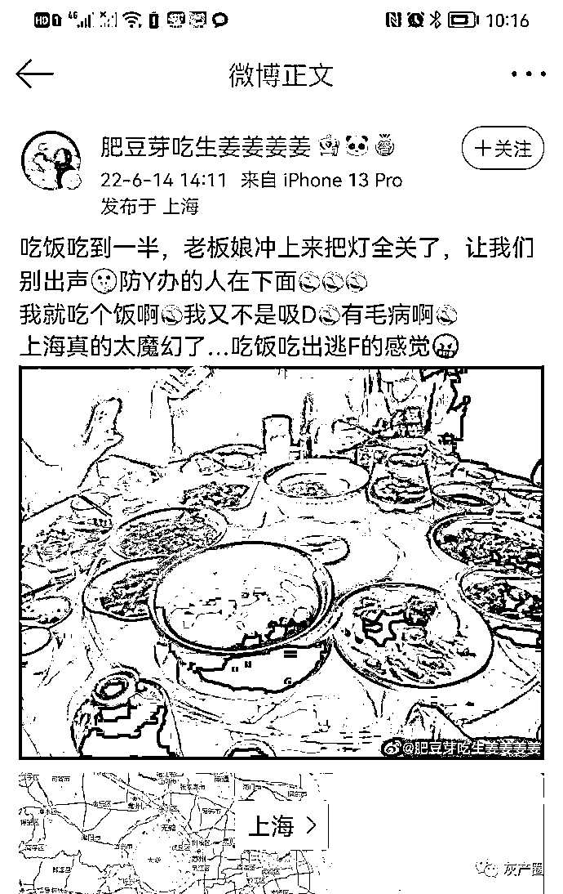

（还有一张不让放：https://weibo.com/2619414624/LyWLhv09y?pagetype=hot）

商家为了不让被外面看出营业状态，直接封死

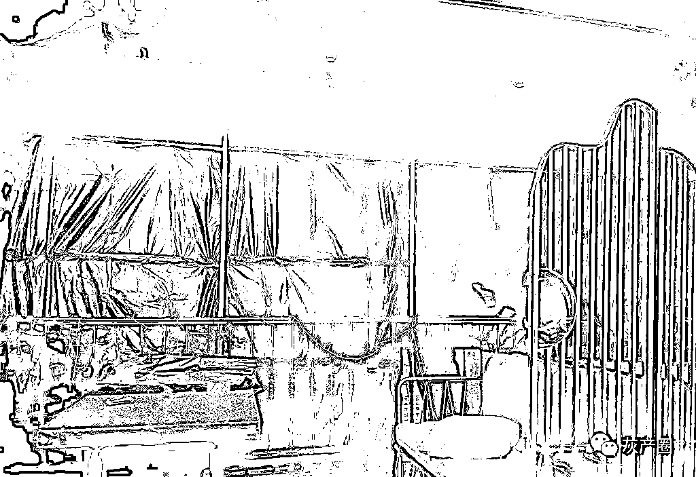

进门对暗号，只接待熟人，生人恕不接待！

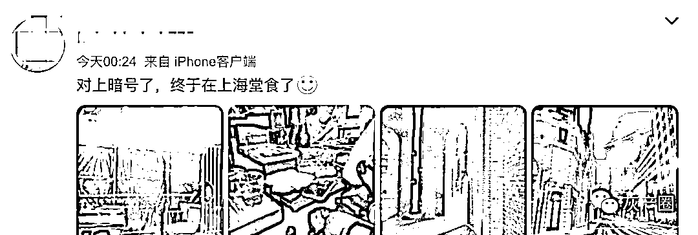

就餐期间，也要极尽低调，唠嗑滴不要，悄悄滴进食

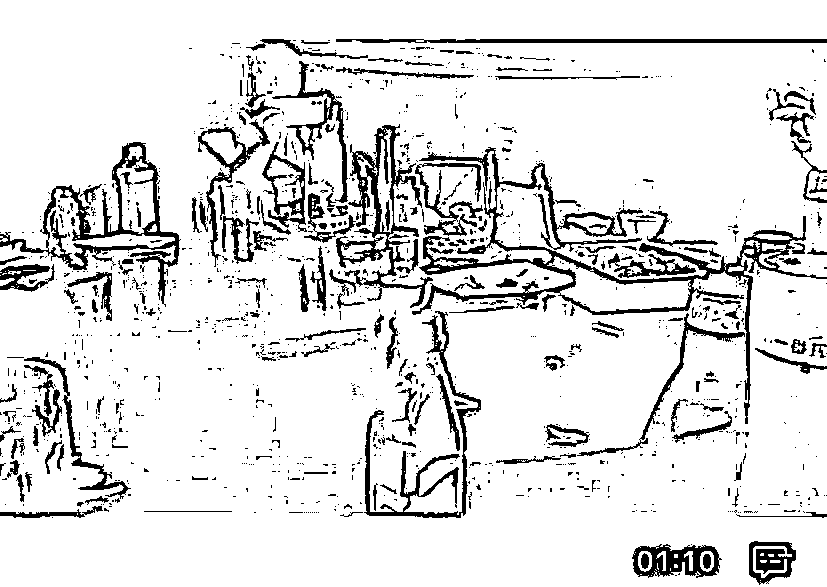

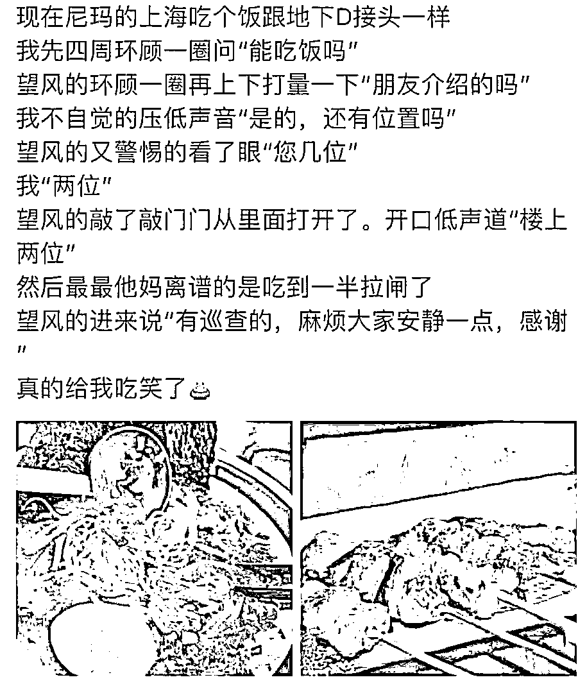

甚至一些能堂食的饭店，也喜欢上了这种“偷吃”的感觉 

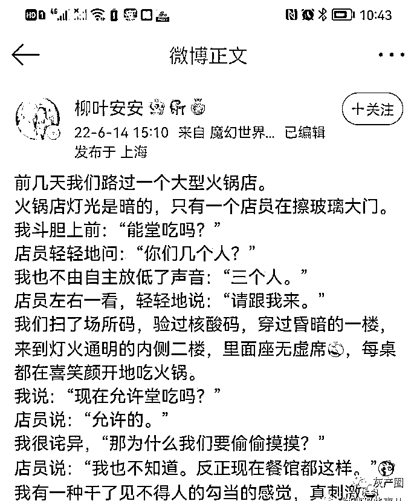

想合法地堂食也不是没有办法：服务员是可以堂食的，进去办个入职，走的时候，办个离职！ 

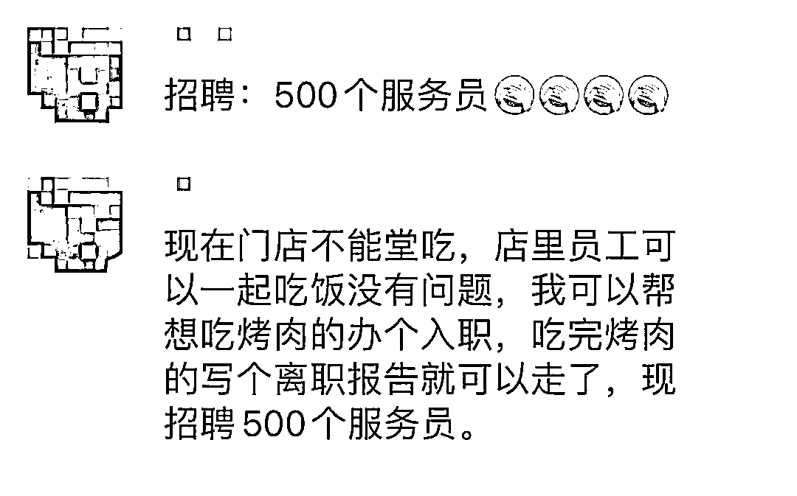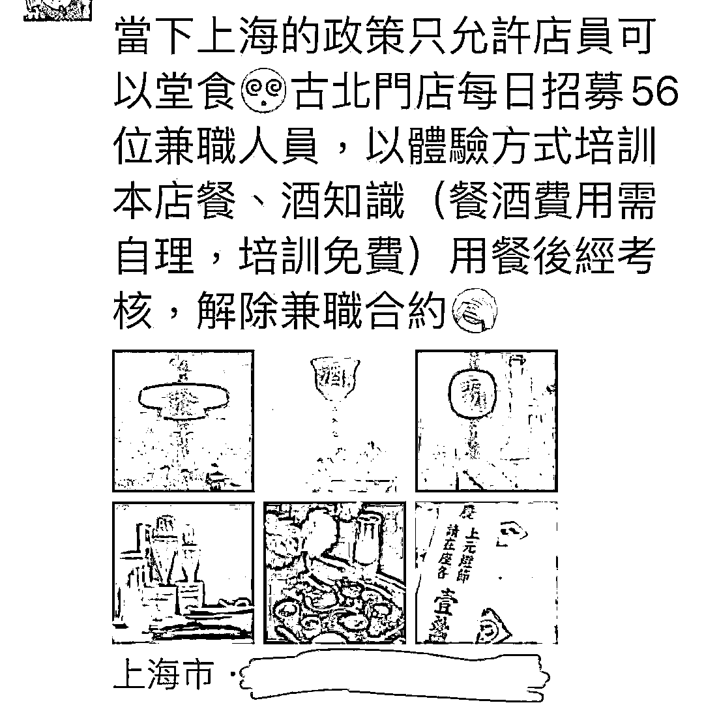

有钱的可以考虑这种 

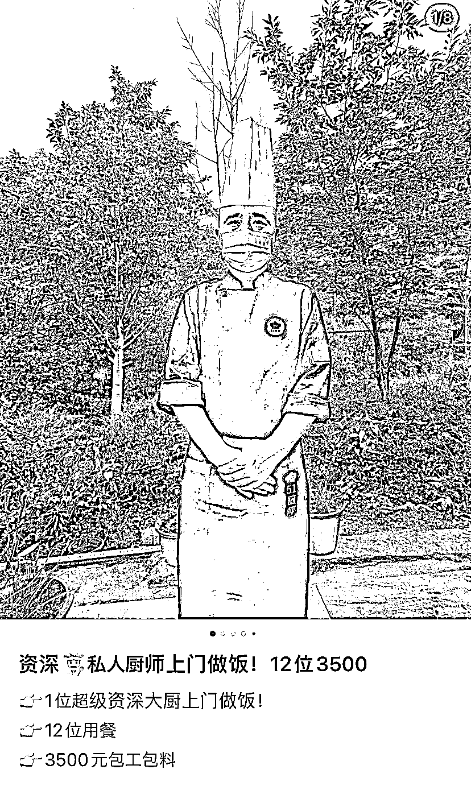

目前，上海已经加强了这方面的监管，上海市商务委要求各区成立由商务主管、行业监管等多部门组成的疫情防控督察组，采取专项督查、飞行检查、暗访等方式开展常态化检查重点对员工每日核酸检测要求执行不到位，企业(餐饮、沐浴、酒吧、咖啡)私自开放堂食，不安排专人督促扫“场所码”、验“场所码”，不科学佩戴口罩，环境消杀不规范，应急处置流程不熟悉等问题加强检查督查，做到第一时间发现风险漏洞，第一时间督促整改，织密防控网，筑牢防护墙，巩固来之不易的疫情防控成果。

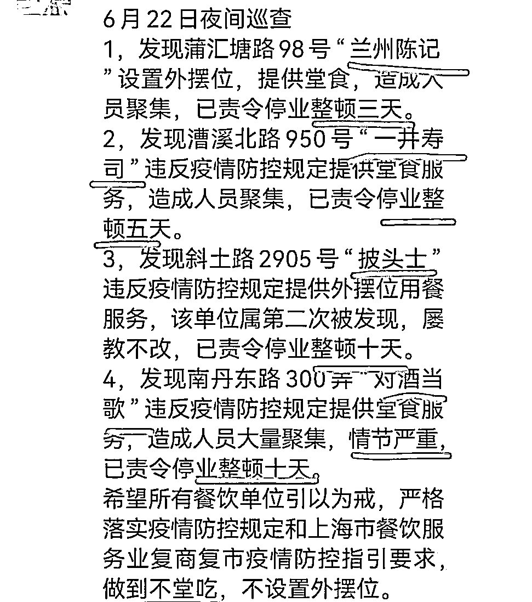

来源：微博那些事儿

](https://mp.weixin.qq.com/s?__biz=Mzg5ODAwNzA5Ng==&mid=2247487973&idx=1&sn=1b62da6f2018402862a5c375e10c355e&chksm=c06878b2f71ff1a4fbe7df4dec626aa7e696154751693bf16f6c6a302ceaa4d1959040c70518&scene=21#wechat_redirect)

← 向右滑动与灰产圈互动交流 →

