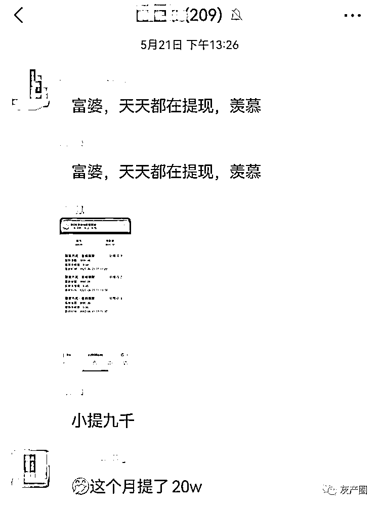

# 对话集资诈骗“职业玩家”：多次被骗后，“肥羊”终成“恶龙”

> 原文：[`mp.weixin.qq.com/s?__biz=MzIyMDYwMTk0Mw==&mid=2247538571&idx=3&sn=cb05dfadfc1354509851772b8c20abb5&chksm=97cb9cb3a0bc15a517b0c2232cfd0e24b9e692c370402719c25bcf13b710bcd441a7f259f6c5&scene=27#wechat_redirect`](http://mp.weixin.qq.com/s?__biz=MzIyMDYwMTk0Mw==&mid=2247538571&idx=3&sn=cb05dfadfc1354509851772b8c20abb5&chksm=97cb9cb3a0bc15a517b0c2232cfd0e24b9e692c370402719c25bcf13b710bcd441a7f259f6c5&scene=27#wechat_redirect)

和张静见面那天，她穿了白体恤牛仔裤，外面套了件墨绿色薄款针织外套，戴着近视眼镜，头发散乱，一副看起来老实巴交的“好大姐”打扮。和朋友圈里那个戴着墨镜、烫着大卷发、开了满级美颜大声唱歌的张静相去甚远。

在朋友圈里，她是生活恣意潇洒的宝妈，儿子聪明帅气，作为家庭主妇的她每天都能“动动手指”就轻松赚到几百、几千，甚至上万，令人艳羡。

5 月 17 日，作为非法集资诈骗案件中的“职业玩家”，49 岁的家庭主妇张静，被检察机关以“组织、领导传销活动罪”提起公诉，一审被判处有期徒刑 3 年，5 月底开始执行。

5 月 13 日，一审宣判前的倒数第 4 天，上游新闻记者与张静独家对话。

2 个小时的时间里，张静说了很多。

**非法集资诈骗案件中的“职业玩家”**

在重庆南岸区公安分局经侦支队民警王哲撰写的论文《互联网非法集资案件中“职业玩家”现象研究》中，将长期混迹于各类非法集资平台，拥有大量会员资源及宣传经验，在平台上线时积极投资和推广，平台崩盘或跑路前能够及时撤出，从中获利并对非法集资平台发展产生了重要影响的一群人，称之为“职业玩家”。

近日，就有这样一个以“商城”投资为主要手段的互联网非法集资平台被南岸区公安分局打掉，数名“职业玩家”被抓。张静正是其中一名。

“不想再过精打细算的日子。”这是张静给出的“入伙”理由：“一切都是因为迫切的想要赚钱”。正是在这种“迫切”下，在不到两年时间里，她从屡次上当受骗的“肥羊”，成为了拥有 15000 余名下线的“恶龙”。

**卖袜子认识的客户，带她一起“轻松赚钱”**

一开始的时候，没有工作经验，又需要在家照顾孩子，张静在朋友的推荐下做起了“微商”，销售一款防臭袜子。为了卖袜子，她尝试过加群宣传，不过效果甚微，在小区附近摆地摊，也是无人问津，进货几千元的袜子最后半卖半送之下勉强保本。

2017 年的某一天，刘丽加了张静的微信购买了四双袜子，聊天时张静发现，刘丽也是一名全职家庭主妇，在言谈之中，觉得对方家境很好，生活优渥，不禁生出羡慕。

在与刘丽倾诉自己生活不如意的时候，刘丽告诉她，可以下载一个名叫“优莱商城”的 APP，在上面买东西付款后，不但东西会给你寄到家里，而且买东西用掉的钱也会在 7 天后退还回来，还会有“多的钱”，平时签到打卡还可以免费领鸡蛋大米。

▲优莱商城的微博

第一次，张静尝试购买了几袋大米，在等待了一个多星期后，发现买大米用掉的几百元确实退回了账户上，而且还多出了“利息”，让她又惊又喜。不过，退回到平台账户上面的钱不能马上提现，每天只能按比例领取一小部分。

张静在平台上购买了各种生活用品，还给自己买了个华为手机。市场价 1 千多元的手机平台卖价 5 千，不过想到可以原价退款还“有得赚”，也是“情有可原”。正当她觉得自己捡了大便宜的时候，平台关闭，账户里 15000 元再也无法提现。

“当时没有报警，觉得自己多少还是得了东西的，自认倒霉。”张静说，当时她认为平台经营不善倒闭，没有想到其它。

**数次被骗经历，却让她“更想找钱”**

在“优莱商城”的微信群里，张静认识了苏华和彭冬冬，苏华是重庆人，有三个孩子，经常和张静在微信上聊些家长里短，聊到孩子，也聊到赚钱。而彭冬冬是商城里面卖鸡蛋的，和苏华“很熟悉”。

在“优莱商城”关闭之后，彭冬冬在群里说，他去湖南找到了“优莱商城”老板，向大家众筹每人 2 千元一起把商城“盘活”。因为都想“继续赚钱”，群内很多人响应，张静也交了钱，但是彭冬冬收了钱之后就没了音讯。后来大家找到彭冬冬并威胁要去告他，这才拿回了众筹的钱。

在那半年后，苏华告诉张静，彭冬冬自己也开了一个商城，赚到了钱。这个组织宣扬说会员们投资的钱将会拿来开设实体店，实体店经营所得将反馈给会员，剩余的钱拿去做慈善。

“善心会”的组织者每天在群里向会员们分享视频，今天在某某山村给留守儿童和独居老人送去食物和现金，帮助残障人士过上更好的日子，去湖南湘西救助贫困人群……苏华告诉张静，有她认识的人投资了半年，在“善心会”里赚了钱。

于是，在看过“善心会”一间卖特产的实体店后，张静悄悄刷了父亲卡里的钱，投入 3 万元，一个月后，便收到了 31500 元。

“当时觉得又能做好事，又能赚钱，每天都很正能量。”张静说，不久之后，“善心会”却不再转款回来，群主也消失不见，她总计亏掉了 35000 元左右。

正在刚刚被骗钱的“低谷期”，彭冬冬又向张静推销一个自己开的叫做“喜乐善”的商城，套路相似，买 100 元的商品一个月后可以得到 120 元。并带她去观音桥朗琴广场的“办公室”参观。办公室摆了几个旧电脑，几张破桌子，彭冬冬拿着个马克杯给她介绍：“这个杯子 5 块钱进价能卖 20 元。”

“肯定是个皮包公司。”回到家张静和老公这样说，并且删掉了彭冬冬的微信。

那段时间，有网友向她推荐销售“电话卡”找钱，她找哥哥借了 2000 元结果买了一堆假电话卡回来。报警后警察劝她“少搞些歪门邪道，容易被骗”。

**刚刚“赚了大钱”，转眼“一切成空”**

屡次被骗，但朋友圈里加来的“好友”越来越多，看着别人晒“足不出户日入万金”的鸡汤，张静越陷越深，一心想要赚大钱。

在此后的一段时间里，张静和苏华依然保持联系。张静很佩服苏华，觉得她资源多信息广，脾气又好，很有魄力，但有点贪心，把钱看得很重，“做项目”的时候可以贷款投入几十万。

2020 年 5 月，苏华跟她提到了“新零售”，说是一个重庆朋友做的“商城”叫“奢品惠众”，6 月份开业。张静跟着苏华去到现场，看到了漂亮的办公室，财务、会计工作人员一应俱全。她顿时觉得“这是个正规公司”。

“是不是彭冬冬开的？”张静问到，得到了苏华的否认。被拉进群后，张静观察了一个月时间，看到群里大家买东西买得火热，并且都能够收到“返利”，于是她也开始买东西：吸尘器、杯子、枕头......把家里能用的买了个遍。

▲在某“投资群”内，会员们每天晒单

在这个“商城”里，投入 18400 元一个星期后，不但能拿回 20000，还能拿到购买的商品，返回来的钱再度投入进去，天上掉馅饼的感觉令她着迷。

这个时候，张静已经是久经“摸爬滚打”的老手，她知道平台上线初期才能投钱，在一段时间后要及时撤出；她在微信群里、朋友圈里发送商城二维码，拉了 100 人左右加入，而这 100 人向下扩散，逐渐达到 15000 人；她发展下线来提升自己的会员等级以获取更高收益，在平台“跑路”前，达到了满级 VIP5；她甚至在网络上购买虚拟号码注册会员来提升自己的“层级”......看着平台账户里和自己银行卡上不停增加的数字，张静心里觉得自己终于“翻身了”。

▲“奢品惠众”新能源汽车上线发布会隆重而华丽

同年 11 月 24 日，“奢品惠众”新能源汽车上线发布会办得隆重而华丽，坐在现场的张静心情激动，拍下视频发在了朋友圈。12 月 1 日，她和朋友凑了 1 万 8 千元投资了一辆新能源汽车。

2022 年春节期间，正当她憧憬着“跟着公司赚大钱”的时候，“奢品惠众”平台关闭，全国各地会员报警，主要嫌疑人彭冬冬等人被抓，苏华因与彭冬冬有利益往来一审被判为共犯。

“后悔得很，再也不想碰了。”张静嘴里说着很后悔，“退赃、罚金……搞去搞来一场空，还要坐牢。”可是在她手机微信里，“快三”“新零售”等多个“线上投资群”还在活跃，冒出了诱人的红色小圆标。

来源：上游新闻，巴蜀反诈

](https://mp.weixin.qq.com/s?__biz=Mzg5ODAwNzA5Ng==&mid=2247487973&idx=1&sn=1b62da6f2018402862a5c375e10c355e&chksm=c06878b2f71ff1a4fbe7df4dec626aa7e696154751693bf16f6c6a302ceaa4d1959040c70518&scene=21#wechat_redirect)

← 向右滑动与灰产圈互动交流 →

