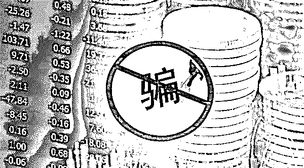
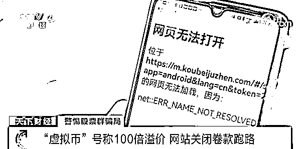
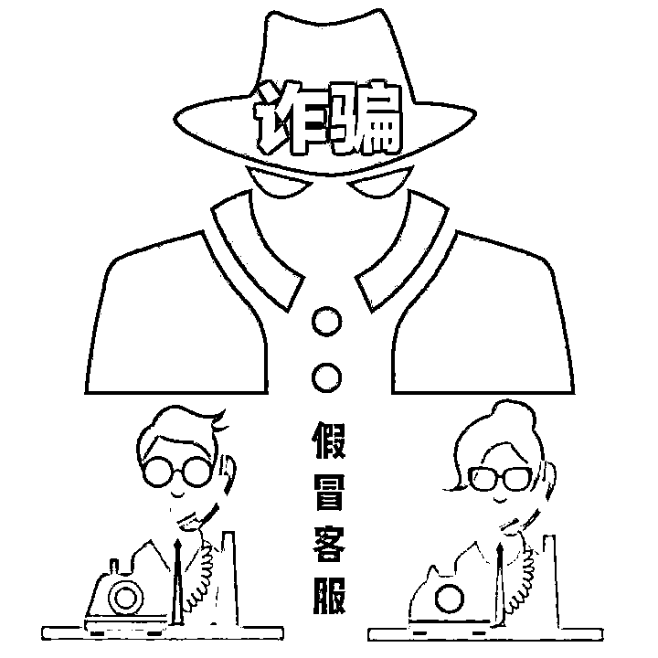

# 央行发布虚拟货币骗局案例，提醒投资者防范虚拟货币投资诈骗

> 原文：[`mp.weixin.qq.com/s?__biz=MzIyMDYwMTk0Mw==&mid=2247538571&idx=5&sn=9e3bbea761505aa14f16643883b44cc2&chksm=97cb9cb3a0bc15a53e258fe4813109198b181833b45ba8195a2883a8a35a38ff87538391310d&scene=27#wechat_redirect`](http://mp.weixin.qq.com/s?__biz=MzIyMDYwMTk0Mw==&mid=2247538571&idx=5&sn=9e3bbea761505aa14f16643883b44cc2&chksm=97cb9cb3a0bc15a53e258fe4813109198b181833b45ba8195a2883a8a35a38ff87538391310d&scene=27#wechat_redirect)

**“我们这里有村民投资虚拟货币被骗了，需要技术协助”**

昨日，我们接到某地公安民警的技术协助需求，说当地一个村的民众因投资虚拟货币被骗，希望我们协助做一下资金追踪。 

近几年，随着区块链、虚拟货币的火热，与之相关的犯罪活动也愈演愈烈，已成为**涉众型经济犯罪的“重灾区”**。

6 月 23 日，中国人民银行官方微信公众号文章中发布了三则典型的虚拟货币骗局案例，包括“虚假跑路平台”、“平台控制涨跌”、“套取账号密码盗取虚拟货币”等，希望引起大家对虚拟货币投资的警惕。

”**央行发布典型虚拟货币被骗案例**

BE CAREHUL

**0****1**

****100 倍溢价，一夜暴富****

****荐股群投资虚拟货币被骗****

****关键词****

*****荐股群、荐股老师、平台币、100 倍溢价、大型金融平台背书、暴富故事刷屏、平台一夜关闭*****

*****案例详情*****

***刘女士经人介绍加入某“专家荐股群”，群里“老师”不断推荐某平台自行发行的虚拟货币，并且声称该平台即将上线，正在发行的平台币预计未来有 10 到 20 倍，甚至 100 倍的溢价，而且冒充一些大型的正规金融平台为自己背书。在群里不断刷屏的一夜暴富故事引诱下，刘女士买入大量“虚拟币”。不久后，该虚拟货币交易平台一夜之间关闭，股票群被解散，刘女士所有资金都无法提取。经调查该平台实际并不存在，所谓“虚拟货币”也并不真实，完全是诈骗平台自导自演的数字假象。***

******

*****骗局拆解*****

***又是荐股群，荐股群真是个危险的地方，不少投资虚拟货币被骗都是受荐股群所谓的“荐股老师”的诱导。***

***这类骗局，通常会利用民众追求“高利润、高回报”的投机心理，设下投资陷阱。采用“专家”带单操作、投资获利故事刷屏、前期小盈利、高额回报等手段，引诱用户不断投入，最后平台收割跑路。***

*****0****2*****

*******投资虚拟货币先缴入门费*******

*******想要获利，得要发展下线*******

*******关键词*******

********入门费、发展下线、直推奖励、团队奖励、平台控制币价、传销********

*******案例详情*******

*****王先生在缴纳入门费后，加入一家声称对外提供虚拟货币投资增值服务的交易平台，并在平台不断宣传洗脑下积极发展下线。通过推荐新用户，从平台获得直推奖励，随着会员等级的提升，还可以享受 10%至 100%不等的团队管理奖励。其实，该平台并没有任何真实业务，所谓的虚假货币也无任何市场价值，货币价值多由平台进行控制，随着货币价值的下降，用户在提现时会出现亏损，这就迫使用户需不断发展下线，以获取更多的平台收益，实质就是传销。*****

**********

*******骗局拆解*******

*****“缴纳入门费用，发展下线获利”这种模式极大可能就是传销。*****

*****这类骗局一般以高回报引诱用户，所谓的投资项目都是虚假的宣传，所谓的币价涨跌，都是平台操控，用后面进入用户的钱支付前面人的收益，造成虚假繁荣的假象。*****

*****更为严重的是，用户如果发展下线达到一定量级，一旦被抓获，可能会被定罪判刑。*****

*******0****3*******

*********冒充平台客服*********

*********获取用户交易账号信息，盗走资产*********

*********关键词*********

**********平台客服、违规操作、洗钱风险、账户存在安全风险、升级海外账户、解冻账户**********

*********案例详情*********

*******黄先生曾在某平台进行虚拟货币投资，某日接到一个境外电话自称是平台客服并准确说出黄先生真实姓名、交易账号等。骗子以“将虚拟货币平台资金转移到指定软件以备资金查验”为由，套取黄先生交易账号密码，转走虚拟货币，还以“账户异常，需要资金进行流水对冲”的理由，骗走黄先生两万元。*******

**************

*********骗局拆解*********

*********这是最常见的“冒充客服诈骗”，类似的还有“冒充公检法诈骗”**。骗子惯用的伎俩就是：一上来准确说出你的身份信息，获取信任；然后告知你的账户可能存在某种风险，引导你按照他的步骤操作；最终获取你的账号信息，盗走财产。******* 

*********常用的借口有：**升级海外账户、提币到安全账户、账户有封号风险、账户操作异常有被盗币风险、账户涉嫌洗钱需要解冻账户等；******* 

*********常见的诱导操作有**：诱导你点击钓鱼链接，填写账号和个人信息；诱导开启屏幕共享献，窃取你的账号信息；诱导下载指定钓鱼 APP，窃取你的账号信息；诱导你转账、提币到指定地址，拿走你的资产；诱导你提供验证码等信息，窃取你的账号等。*******

**************

*********在我国，****虚拟货币相关业务活动，包括兑换、作为中央对手方买卖虚拟货币等都涉嫌非法金融活动，一律严格禁止。境外虚拟货币交易所通过互联网向我国境内居民提供服务同样属于非法金融活动。*********

*********虚拟货币无真实价值支撑，价格极容易被操纵，相关投机交易活动存在虚假资产风险，经营失败风险、投资炒作风险等。从我国现有司法实践看，虚拟货币投资不受法律保护，相应的风险和损失自担。*********

*********广大民众应增强风险意识，梳理正确的投资观念，避免陷入虚拟货币投资骗局。防范虚拟货币投资骗局一定要注意：********* 

*********①**对“虚拟货币”等新型投资项目保持高度警惕。在我国，投资虚拟货币不受法律保护。*******

*********②**不要相信某些所谓的虚拟货币投资平台。虚拟货币投资交易在我国属于非法金融活动，这些所谓平台其实是后台可以由犯罪分子自由操控的假平台。*******

*********③**对“高收益、高回报”等字眼保持清醒的认知和判断。保持理性投资观念，选择合法投资渠道，对任何宣称超高收益的投资理财项目一定要保持戒备心，牢记天上不会掉馅饼。*******

*******来源：七星实验室 作者：七星锤*******

*********************](https://mp.weixin.qq.com/s?__biz=Mzg5ODAwNzA5Ng==&mid=2247487973&idx=1&sn=1b62da6f2018402862a5c375e10c355e&chksm=c06878b2f71ff1a4fbe7df4dec626aa7e696154751693bf16f6c6a302ceaa4d1959040c70518&scene=21#wechat_redirect)*******

*******← 向右滑动与灰产圈互动交流 →*******

**************