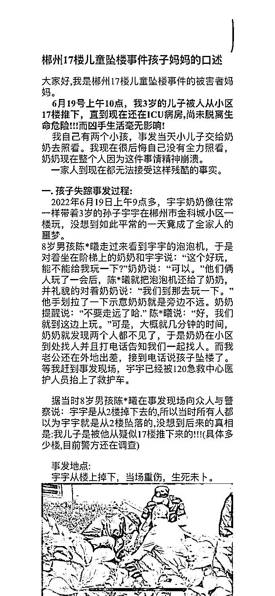
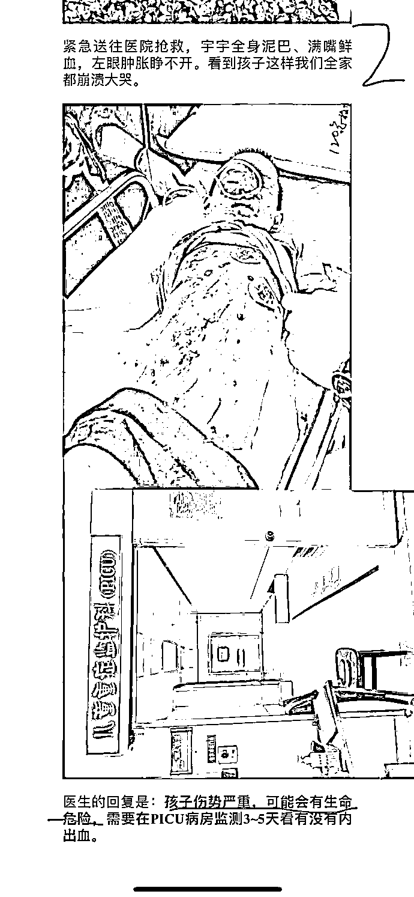
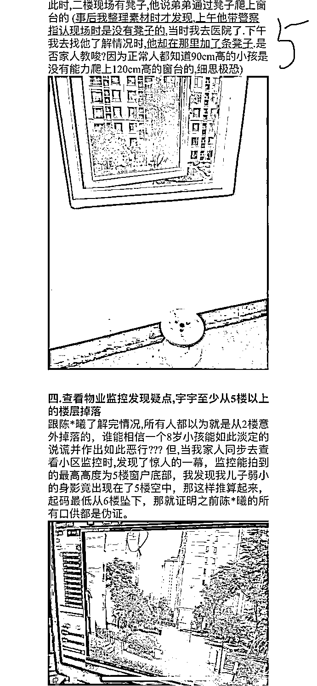
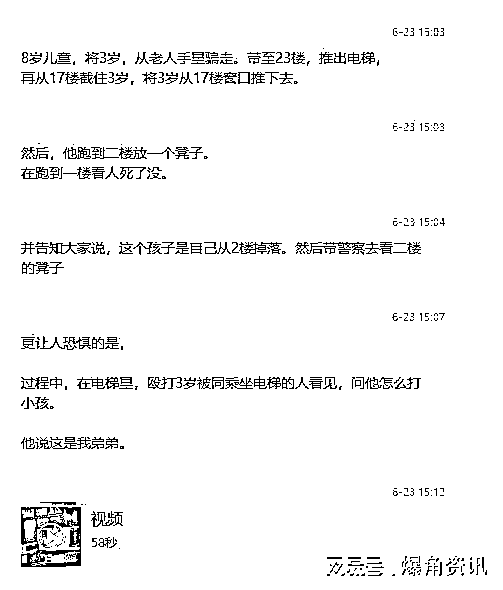
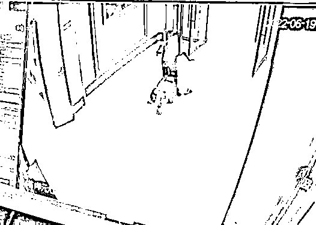
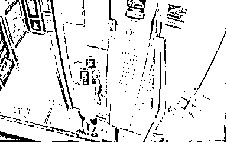

# 8 岁小恶魔踢打 3 岁坠楼幼童监控曝光 这么小就会伪造案现场了？

> 原文：[`mp.weixin.qq.com/s?__biz=MzIyMDYwMTk0Mw==&mid=2247538615&idx=1&sn=ec223511886e5903f5e3d6b1edd87000&chksm=97cb9c8fa0bc15993255a3f049fb0383a67ac99291cabda315642fec1f9abe5deda5a527c5e3&scene=27#wechat_redirect`](http://mp.weixin.qq.com/s?__biz=MzIyMDYwMTk0Mw==&mid=2247538615&idx=1&sn=ec223511886e5903f5e3d6b1edd87000&chksm=97cb9c8fa0bc15993255a3f049fb0383a67ac99291cabda315642fec1f9abe5deda5a527c5e3&scene=27#wechat_redirect)

8 岁儿童，将 3 岁小孩从老人手里骗走。带至 23 楼，推出电梯，再从 17 楼截住 3 岁，将 3 岁从 17 楼窗口推下去。

然后，跑到二楼放一个凳子。再跑到一楼看人死了没。并告诉大家说，这个孩子是自己从 2 楼掉落。然后带警察去看二楼的凳子。

更让人恐惧的是，过程中，在电梯里，殴打 3 岁被同乘坐电梯的人看见，问他怎么打小孩。他说这是我弟弟。

6 月 19 日上午，湖南郴州苏仙区金科城小区一儿童从 17 楼坠落，据该小区物业工作人员介绍，目前家长情绪较为崩溃，孩子也在 ICU 病房内抢救。

[`mp.weixin.qq.com/mp/readtemplate?t=pages/video_player_tmpl&action=mpvideo&auto=0&vid=wxv_2457166993494605825`](https://mp.weixin.qq.com/mp/readtemplate?t=pages/video_player_tmpl&action=mpvideo&auto=0&vid=wxv_2457166993494605825)

当地警方也在事发后不久介入了调查，并随后给出了初步结论：坠楼男孩系与同小区孩子玩耍时，自己爬窗不慎导致坠落。但孩子家长似乎对这一结果并不认可。

网上流传的一份“郴州 17 楼儿童坠楼事件孩子妈妈的口述”文档显示，坠楼男童的母亲坚信自己的孩子是被人从 17 楼推下，而凶手就是坠楼前与儿子一同玩耍的同小区 8 岁男孩陈某曦。

坠楼儿童的妈妈说，6 月 19 日上午 9 点多，3 岁幼童宇宇的奶奶像往常一样带着三岁的孙子在小区一楼玩，8 岁男孩陈某曦走过来看到宇宇的泡泡机，于是对着坐在台阶上的奶奶和宇宇说，“这个好玩，能不能给我玩一下？”奶奶说，“可以。”

二人玩了一会儿后，陈某曦把泡泡机还给了奶奶，并礼貌地对着奶奶说：“我们到那边去玩一下。”他用手划拉一下示意奶奶就是旁边不远。

奶奶提醒说：“不要走远了哈”。陈某曦说：“好，我们就在这边上玩。”

可是，短短几分钟时间，奶奶就发现两个小孩都不见了，于是在小区里到处找人并打电话告知一家人一起找人。

宇宇妈妈说：而我老公还在外地出差，接到电话说孩子坠楼了。 

宇宇妈妈说，等我赶到事发现场，郁郁已经被 120 急救中心医护人员抬上了救护车。 

据当时 8 岁男孩陈某曦在事发现场向众人和警察说，宇宇是从二楼掉下去的，所以当时所有人都以为宇宇是从二楼坠落的，没想到后来的真相是：我儿子是被他疑似从 17 喽推下来的。——宇宇妈妈简直要崩溃了。

下面截图是宇宇妈妈口述的详细内容。 

另据网友爆料，陈某曦在将孩子推下之前，还曾对其进行了殴打，并对试图阻拦的路人解释说“这是我弟弟”。

[`mp.weixin.qq.com/mp/readtemplate?t=pages/video_player_tmpl&action=mpvideo&auto=0&vid=wxv_2457171948477579265`](https://mp.weixin.qq.com/mp/readtemplate?t=pages/video_player_tmpl&action=mpvideo&auto=0&vid=wxv_2457171948477579265)

值得注意的是，有人发现警方发布的第一份通报已被删除。有媒体联系当地派出所，其表示有专人在负责此事，市局方面十分重视。

来源：宾曰语云，爆角资讯，网友供稿等

](https://mp.weixin.qq.com/s?__biz=Mzg5ODAwNzA5Ng==&mid=2247487973&idx=1&sn=1b62da6f2018402862a5c375e10c355e&chksm=c06878b2f71ff1a4fbe7df4dec626aa7e696154751693bf16f6c6a302ceaa4d1959040c70518&scene=21#wechat_redirect)

← 向右滑动与灰产圈互动交流 →

