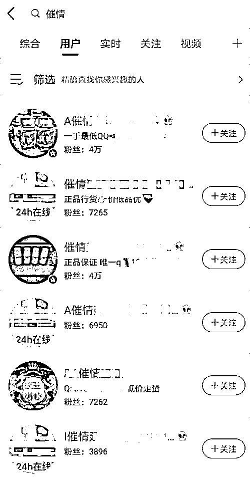
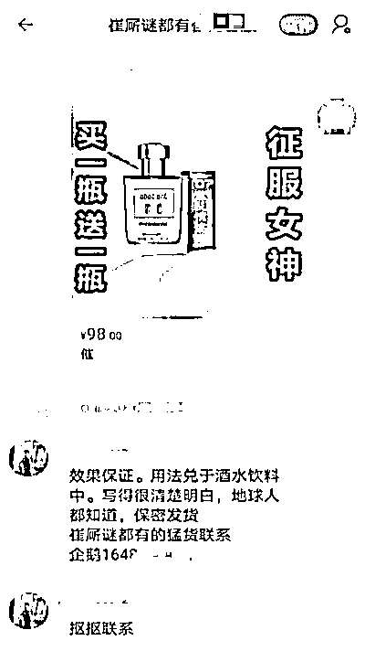
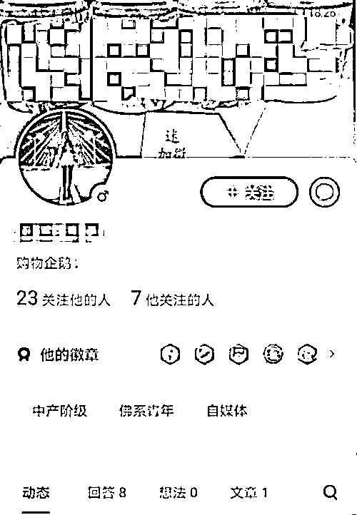
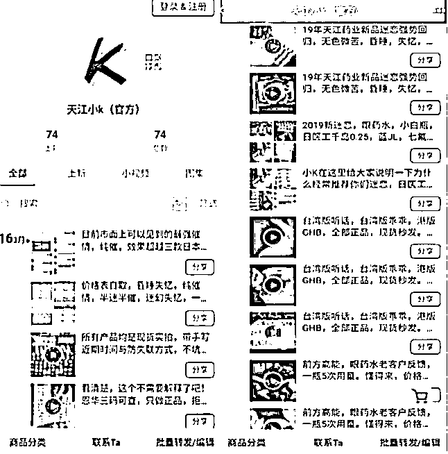
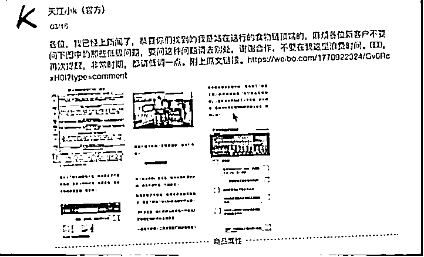
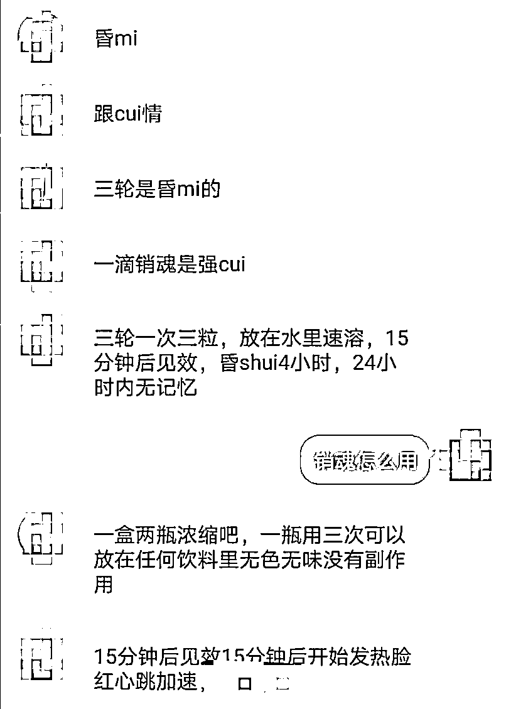
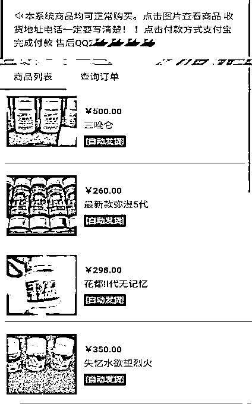
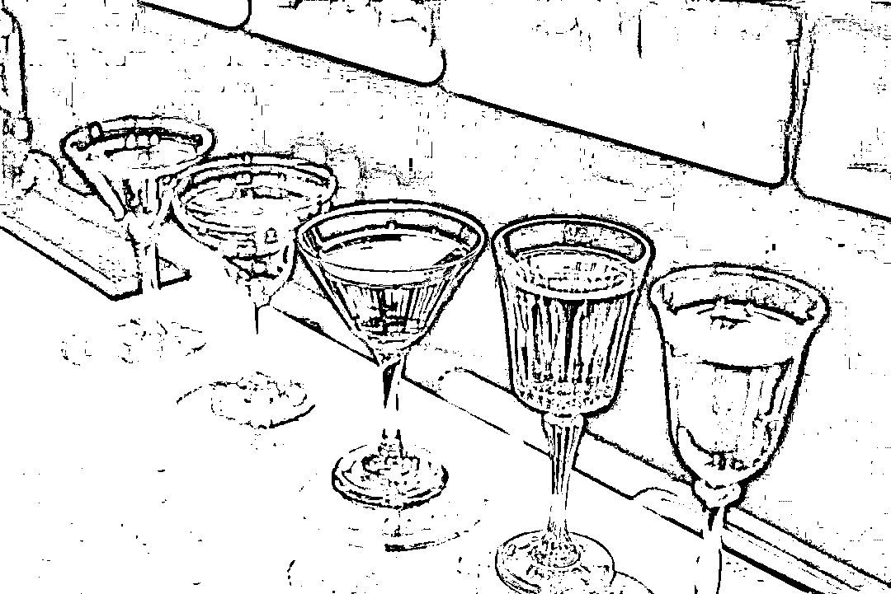
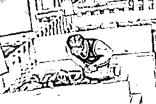

# “迷幻剂”多平台有卖？迷奸犯罪背后是毒品！

> 原文：[`mp.weixin.qq.com/s?__biz=MzIyMDYwMTk0Mw==&mid=2247538615&idx=2&sn=d8991c4fb2e90a6de448e00addae0e00&chksm=97cb9c8fa0bc15998a7e3137621872b346dc02e5e21547e8fe47417e7ea1b5cb4ff3104badd1&scene=27#wechat_redirect`](http://mp.weixin.qq.com/s?__biz=MzIyMDYwMTk0Mw==&mid=2247538615&idx=2&sn=d8991c4fb2e90a6de448e00addae0e00&chksm=97cb9c8fa0bc15998a7e3137621872b346dc02e5e21547e8fe47417e7ea1b5cb4ff3104badd1&scene=27#wechat_redirect)

喝了大半杯橙汁

吃了一块鸡块

一分钟犯困

五分钟左右完全丧失了意识

这不是电影桥段

是刑事判决书里的真实案情

据中国裁判文书网的披露，一名作案者通过在饮品中注射“迷幻剂”迷奸多名女性。

迷奸药从哪来？ 

谁在给罪犯递刀？

人民网记者在多家电商、社交 App 检索发现

有用户以“催情”“迷幻”名义兜售相关产品

**1**

****“催、听、迷”的暗语****

**“催”代表催情，“听”代表听话，“迷”代表昏迷……为规避监管，这些接头暗语以谐音等形式不断变换。**

**4 月 7 日至 14 日，在 7 家下载量较高的电商、社交 App，人民网记者以“催情药”“迷奸药”为关键词检索，未搜到相关商品或用户。**

**以“催情”为关键词二次检索时，在微博、知乎找到相关用户，再换成**“谜”、“崔谜”**等字词检索时，在某宝发现相关商品。**

**在微博，人民网记者检索到多个相关用户，其简介或头像上显示有微信或 QQ 号码；在知乎，有用户主页展示“弥漫之夜”，个人简介为 QQ 号码。**

****

**△微博搜索结果截图**

**在某宝，人民网记者发现相关商品图片多显示为香水，图上标注有各种暗示和诱惑文案。**

**人民网记者发送商品链接给客服后，对方迅速回应“崔厛谜猛货都有”，并提示添加微信或 QQ 联系。**

****

**△与某宝店铺客服聊天记录**

**人民网记者在微博、知乎、某宝等平台添加了数个相关用户、卖家的微信或 QQ 账号，以购药者身份进行咨询。**

****

**△知乎用户主页背景展示迷药产品**

**有卖家设立专门网页用来卖药。**

**根据一位微博用户提供的 QQ 号码，人民网记者添加了一个叫“药王小 k”的卖家，对方发来一个网址，网址中有多种迷奸药介绍，还有**“客户反馈”视频**。**

**网页上的聊天截图显示，“药王小 k”多次向客户表示若拍摄反馈视频，下次买药时价格可以优惠。**

****

**△“药王小 k”提供的官方商城，展示大量反馈视频**

**“药王小 k”在网页自称曾于 2018 年 8 月被媒体曝光，并晒出了曝光文章的链接。**

**人民网记者联系曝光文章的作者本人，对方非常惊讶，他没想到被曝光一年半后，“药王小 k”的生意照旧，相关文章还被拿来作宣传。**

****

**△展示曝光文章，宣称其处于“行业食物链顶端”**

****2****

******“催、听、迷”的药效******

****“催情、迷睡、乖乖听话、失忆……”人民网记者在知乎添加的卖家，卖家通过 QQ 介绍产品种类。****

****“让人昏睡的，有吗？”卖家随后发来一张标注为**“GHB”**的药品图片。****

************关于“GHB”************

****“GHB”即 y-羟丁酸，为合成毒品，是三大“迷奸药”之一，与此有关的性犯罪时有发生，是我国规定管制的**第一类精神药品**。****

****如果摄入过量，有可能发生昏迷、肝衰竭等，中毒者还可能因呕吐使呼吸道梗阻窒息而死。****

****一个某宝商家通过 QQ 向人民网记者介绍，卖得最火的昏迷药是“三轮”（指三唑仑），还有一种名为“一滴销魂”的催情类产品售卖火爆，成分为“性激素”。****

********

****△卖家与人民网记者的聊天截图****

****点开微博上一个卖家提供的网址，人民网记者看到 19 种商品在售。****

****点击商品图片后，可查看价格、功效、用法等详情，网页顶端提示“本系统商品均可正常购买”，并提供售后 QQ。****

********

****△网页有多款药物在售****

****网售迷奸药宣称的成分，多为三唑仑、y-羟丁酸、氟硝西泮或其他精神类、麻醉类药品。****

****在国家精神药品目录中，三唑仑、y-羟丁酸均属于**第一类精神药品**，氟硝西泮为**第二类精神药品**。****

****中国科学院院士、北京大学第六医院院长陆林指出，上述药品可产生麻醉或致幻效果，使人昏迷或意识分离出现幻觉，**降低服用者警觉性**，从而诱使、助力犯罪的发生。****

************陆林****

****长期使用会造成肝脏、心脏、肾脏损害，引起一系列不可逆的后遗症，**甚至致死**。****

****从卖家宣称的药物成分看，其中的镇静嗜睡类药物有**很强的成瘾性**，其中的致幻类药物则被禁止在人体上使用，由于没有经过严格临床试验，副作用更大。****

******3******

********如何避免“迷药”陷阱呢？********

****酒吧、KTV、会所等复杂场所容易沾染毒品**** 

****应该如何避免落入“迷药”陷阱呢？****

****下面****

****正义小伙伴就给大家支几招****

****1********不接受任何人给你的饮料****

****到陌生的场合或不熟的人家做客，不要喝别人倒好的饮料。选择还没开封、自己亲手打开的饮料饮用，不要因为不好意思而选择接受。****

****2********一定要自己打开饮料****

****绝对不要接受陌生人请你、拿给你或帮你开的饮料，如果是向吧台买饮料，也需要看着工作人员为你打开，倒入杯中，并且亲自递到你手中。****

********

 ****3 尽可能点有盖密封的饮料

用广口玻璃杯装的调酒是最好下手的饮料，如果被下药也最不容易被发现，因此有盖子的瓶装矿泉水是最好的选择，汽水和果汁其次，最好不要点含酒精的饮料。

4 对熟人也不能掉以轻心

利用迷药得逞的强暴案，最常发生在认识的人之间，因为熟悉的人容易使你放松戒心，而许多犯罪正是在被害人放松戒备的时候得逞。

△一名男子在女子看手机时向饮料下药

5 不要叫你的朋友帮你看饮料

你的朋友可能会分心，会被转移注意力，会忘记，或者他根本不像你想象中那么值得信任。不要让饮料离开你的视线，离开之后再回来，最好更换新的饮料。

其实我猜，这篇文章发出来之后，肯定会有人指责我：

你把文章写出来，那有心之人不就会去这些途径购买吗？

我想过要不要发。

**但思虑再三，我还是觉得每一个女性都需要一篇这样的文章。**

**不要觉得这条产业链离自己很远，而要时刻警惕自己不要成为这条产业链上的受害者。**

1、不要喝陌生人递来的任何饮品，哪怕是同性，哪怕是同一个局上认识的人。

2、在酒吧、ktv 等娱乐场所，不要让自己的杯子离开视线，如果离开过，务必换一个干净的杯子。

3、不要乘坐黑车或搭乘陌生人车辆，不要向陌生人透露独自旅行的计划或行程，更不要独自前往一些完全密闭的私人空间赴约。

4、最后一条，也是我希望任何女孩都不会用到的一条：如果你不幸被侵犯，得在保证自身安全的情况下，及时固定证据（不要洗澡）并报警，迷奸药类药品可以通过尿检检验出来。

**很无奈。**

**到了今天，最行之有效的方法，还是劝诫女性保护自己。**

**但我也坚信，女性不再需要活得小心翼翼的那天，不远了。**

点亮**【在看】**，为你的母亲、妻子、女儿、朋友，以及你自己。

来源：大 R 科普，中国禁毒，中国反诈骗联盟**** ************](https://mp.weixin.qq.com/s?__biz=Mzg5ODAwNzA5Ng==&mid=2247487973&idx=1&sn=1b62da6f2018402862a5c375e10c355e&chksm=c06878b2f71ff1a4fbe7df4dec626aa7e696154751693bf16f6c6a302ceaa4d1959040c70518&scene=21#wechat_redirect)****

****← 向右滑动与灰产圈互动交流 →****

********