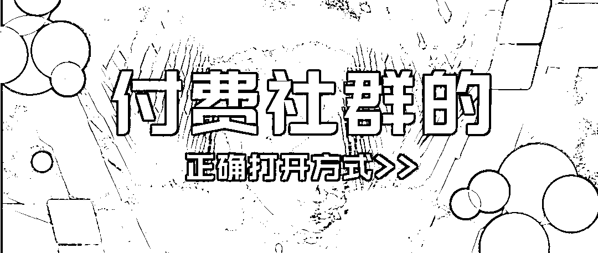
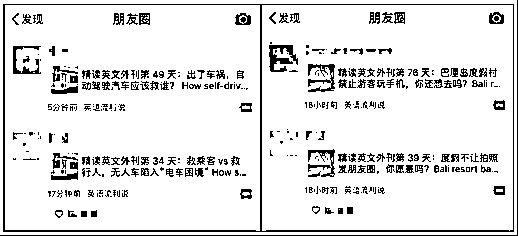

# 付费社群的正确打开方式！

> 原文：[`mp.weixin.qq.com/s?__biz=MzIyMDYwMTk0Mw==&mid=2247538615&idx=3&sn=246584ea32172dbf5946bf15f61fbb21&chksm=97cb9c8fa0bc15990105dad9767a542d7a6efbd03f8ca9477fabe479a75ec01c01bc0ad289e4&scene=27#wechat_redirect`](http://mp.weixin.qq.com/s?__biz=MzIyMDYwMTk0Mw==&mid=2247538615&idx=3&sn=246584ea32172dbf5946bf15f61fbb21&chksm=97cb9c8fa0bc15990105dad9767a542d7a6efbd03f8ca9477fabe479a75ec01c01bc0ad289e4&scene=27#wechat_redirect)

社群的概念已经出现很多年，到今天，微信社群已经成为群体和个体之间互通有无传递资讯非常重要的工具之一。

当然，任何事物的出现壮大都是基于需求而存在的，付费社群也是同理。

那么付费社群出现的需求是什么？

01 社群出现的需求

**1、****变现或者裂变的需要**

现在是互联网时代，依托互联网而存在的自媒体、社交电商以及知识付费等，都是对用户数量和粘性以及转化等有非常高需求的行业，这也给企业和从业者提出了更高的要求。

电视渠道投放、互联网平台投放等获客方式，对于资金的要求高，并且获客性价比不高，企业和从业者为了利益最大化会探索更多可能性。

当微信朋友圈裂变越发艰难的时段，要么发现新的增长方式，要么提高用户的转化率。

于是，私域流量的概念开始悄然兴起。

**2、****大佬进行知识分享**

很多大佬积累了一定的经验以后，在圈子里有了名气，会有人想要产生链接，有些大佬为了避免精力过度分散，所以建群进行统一分享。

行业群为了交换资源，比如广告群进行广告对接、广告主和广告商之间的对接。

所以说付费社群的出现是必然的结果。

02 关于付费社群的认知

很多用户在加入社群后，总有一种后悔甚至是被割韭菜的感觉。

那付费社群存不存在割韭菜的情况？答案是肯定有。

但是割韭菜也分以下两种情况。

**1、第一种就是****为了割韭菜而生的付费社群**

主要特点就是牛皮吹得震天响，但实际言之无物，没有可实践的价值。

比如一周培训让你月入一万，加入社群就能副业大几千等等。

类似的社群肯定还有很多，收费 980、1499 的也比比皆是，但绝大多数都是一次性买卖。

这种社群没有长远的经营目标，就是薅流量，能割一把是一把。

最好在加入一个社群之前，自己先多了解。

比如多看看社会评价如何，问一问往期学员评价，在网络搜索一下有无学员复盘，复盘评价如何，大家感受如何。

**这就是社群质量铁证。**

要是这个社群，你在网络上找不出一点东西。嗯， 你懂吧？

**2、****第二种是感觉自己被割了韭菜**

很多付费社群，发起者在很好的运营下，也有很多支持者。

但仍有一部分人感觉自己被割了韭菜。

排除社群本身质量差以外，先从自己身上找一些原因，看看你是不是也有这样的问题。

（1）**从不看内容**

付费社群不是单向的个人输出，很多社群每天都有发送相关行业的干货和报告。

但根据统计，很多社群的整体阅读率都在 30%左右。

这就意味着，还有近 70%的人是从来不看社群分享的任何内容的。

你想象一下，每天都把内容送到你面前了，你都不看，那能怎么办。

**（****2****）****拒绝发言分享**

社群里最有效的学习，就是主动参与社群内话题的讨论。

有些人加入了一些资源型社群，但是进群之后从来不发言、不发红包、不参与线下活动。

这种情况之下，怎么可能会有业务的对接?

不管你是流量主还是广告主，都建议秉着越分享才越有价值的理念，只有在社群内保持稳定的分享，输出价值，才能获得更多粉丝，甚至获得更多业务机会和发展机会。

而那些在社群里默默「潜水」的，则浪费了宝贵的练习经验，可以说是相当「可惜」了。

**（3）****自我****认知****不清晰**

在基础知识薄弱的时候，别人专业探讨时你插不上话，聊八卦时好不容易才插上一嘴。不去思考自己的问题到底在哪里，然后反复死磕。

而是去社群里，打着「链接」的旗号，各种抱大腿，求带飞。

 你说吧，你和人家大咖压根就不在一个段位上，你有什么资源给人家，又谈何链接？

那么，社群就完全没有价值了吗？

当然不是，在能力够了以后，你完全可以在学到知识的同时，链接到真正有价值的资源，然后变现。

03 参加了很多付费社群，收获感却很低？

在知识付费兴起后，在朋友圈里经常能见到这类人：流窜于各大微信学习圈和培训会场的学习爱好者。

他们时不时地，就会晒出自己参加了某个社群后的打卡记录、转发各种免费听课的推送，或是晒出自己出席各类培训会场，与大咖合影的照片……

也许，从表面上看，这是一个年轻有为，求学上进的大好青年。

**但是，这不过是一个想要走捷径，快速复制别人成功经验，吸取他人思考的结果的「学习粉」罢了。**

对这样的人来说，付费社群参加得越多，往往会越焦虑。

**因为，他们其实并不知道，怎么才是有效的学习，和真正的链接。之所以收获感低，以下 3 点将值得深思：**

1、**加入的社群太多了**

要记住，不可能你加入的每个社群都非常适合你，都能给你带来价值。

加入太多，各个社群消息轮番轰炸，其中既包括经验交流，也有打趣闲聊，信息过多却又来不及消化。好不容易潜下心来混混群，“爬楼”又成了筛选信息的时间成本，最终就完全不看了。

所以完全没有把社群应有的价值给利用好，你想想，你加入的社群再怎么少也有 100 号人。

如果是足够垂直的话，这些人不可能对你没有任何帮助的。

还有，如果遇到感兴趣、符合自身定位的社群，只要门票费不足以影响你消费水平的话，该出手就要出手。

虽然不是每一个社群都能给你带来价值，但是只要其中有一个产生了价值，那价值必然巨大。

不仅能够赢回门票钱，很多时候还能改变你的人生走向。

坚持链接不同的人，打开向外看的视野，相信向上提升的概率会越来越大，生活也能越来越好。

**2、没有执行力**

有很多很不错的社群，是真的有些赚钱干货在里面的，包括项目分享也有很多。

但不是每个项目人人都能参与，也不是人人都能坚持到最后，且赚到钱的。

很多人永远停留在看完别人分享的生财案例，心里默念牛逼，然后就止步于此了，甚至还有很多人会抱着质疑的态度。

而真正有执行力的人，早就开始去摸索尝试了。

**3****、****想要不劳而获**

很多人把付费社群理解为救命稻草，以为像买药一样，吃完就药到病除了。

如果没有去学习，而只是单纯的依赖这个群来提高自己某方面的能力，那无疑是天方夜谭。

人是一颗会思考的芦苇，但在社群界，不会思考的人无疑会沦为被割的韭菜。

学习是一个不断丰富大脑认知结构的过程，想要成长、获得资源甚至是赚钱，不是别人一下子给予你的，还是要靠你自己去学习实践的。

如果你是一个懒得思考，只想着如何复制别人的步骤去成功的人，那么抱歉，知识付费无法帮助你学成发财。

“我们总是花很多时间在社交网络上，把认为有用的东西另存为，直到你的硬盘存满了资料，你还是没有看过。我们忙碌，可我们却没有真的去了解那些自己精挑细选留下的内容。我们花时间收集，却忘了最重要的其实是花时间去消化。” 

——李尚龙《你只是看起来很努力》

**最后，**值此灰产圈社群成立 5 周年之际，我们推荐粉丝们关注一下我们的 5 周年活动：

