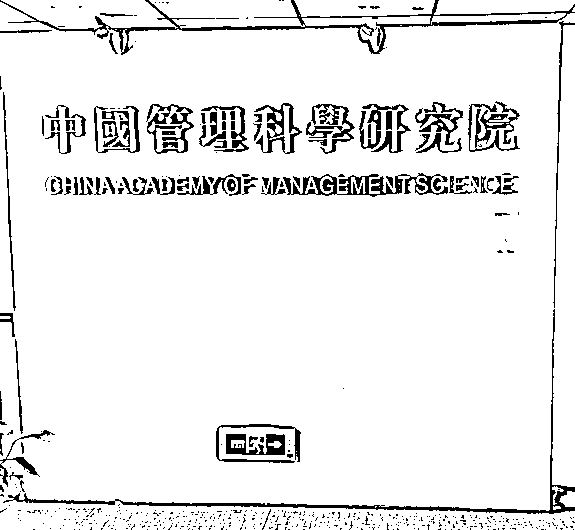

# “高考志愿规划师”起底：证书交钱就能拿，有机构假冒“中字头”发证

> 原文：[`mp.weixin.qq.com/s?__biz=MzIyMDYwMTk0Mw==&mid=2247538615&idx=5&sn=e41889ee0efce5e1cf442e83f52d55e8&chksm=97cb9c8fa0bc159943e0c616e3fd9fb1f7a214a73befc04fc28b3457c46b77e59481be3e3c0d&scene=27#wechat_redirect`](http://mp.weixin.qq.com/s?__biz=MzIyMDYwMTk0Mw==&mid=2247538615&idx=5&sn=e41889ee0efce5e1cf442e83f52d55e8&chksm=97cb9c8fa0bc159943e0c616e3fd9fb1f7a214a73befc04fc28b3457c46b77e59481be3e3c0d&scene=27#wechat_redirect)

教育部提醒，有关部门从未发放过“高考志愿规划师”这类职业资格证书。有培训机构假冒“中字头”机构发证；中国管理科学研究院的工作人员表示：现在凡是以我们的名义发放证书的机构都涉及诈骗。

**一年一度的高考刚刚结束，“如何填报志愿”成了摆在考生和家长面前的又一道选择题。**

**6 月 23 日，教育部发布预警：郑重提醒广大考生和家长，社会上有机构或个人向考生和家长开展的“高价”志愿填报咨询活动，存在政策解读不精准、信息提供不准确、费用收取不规范甚至诈骗等问题。**

**教育部还强调，有关部门从未发放过“高考志愿规划师”这类职业资格证书。该机构一些所谓“志愿规划师”都是临时招募的社会人员，按照总部提供的“台词”给考生和家长辅导。家长购买这些机构的服务不仅花了冤枉钱，而且可能报错志愿。**

**新京报贝壳财经记者调查也发现，高考志愿填报服务这一新兴行业，机构鱼龙混杂真假难辨，每单收费数千到上万元，一些接受过志愿填报服务的过来人也直呼不值。而新兴职业“高考志愿规划师”也充斥着各种乱象，从业资格证交钱培训就能拿，有的证书真实性难以查验，为其背书的机构也存疑。**

****━━━━━****

****高考志愿填报服务收费不菲，每单收费数千到上万元****

****近期，各地将陆续发布 2022 年高考成绩，并启动开展高考志愿填报工作。而一些所谓的高考志愿填报服务机构以及“高考志愿规划师”也嗅到了金钱的气息。除所谓的教育辅导行业的线下机构外，连一些互联网大厂也纷纷入局高考志愿填报服务赛道。****

****新京报贝壳财经记者走访发现，目前对于高考志愿规划师并无明确的行业规范和资质要求。“高考志愿规划师”普遍从业门槛较低，但收费却不菲。****

****天津的一家提供高考志愿填报服务的机构向新京报贝壳财经记者表示，“大专学历、0 工作经验就可以上我们的高考志愿规划师线上培训课程，课程结业后就可以在我们平台接单，包分配生源。”****

****多家机构对记者表示，每单的收费在数千元到上万元。****

****一位自称有 11 年志愿填报服务经验的张老师告诉新京报贝壳财经记者：“一对一全程填报服务为 7000 元，单次在两个小时内回答有关高考志愿填报所有疑虑费用是 2000 元。”****

****有业内人士对新京报贝壳财经记者称：“一般一对一志愿填报服务，一线城市的家长经济实力强，收费就高一点，二三四线城市家长购买力会小一点，收费也相应低一些。但也会出现个别四线城市收费比一线城市贵的情况，个中原因很复杂。”****

****另一位高考志愿规划师的报价也验证了这位业内人士的观点，其报价在 6800-12800 元之间，价格浮动和考生所在省份有关。当得知记者是北京地区的考生时，该高考志愿规划师报价为 12800 元。****

****费用昂贵的“高考志愿填报服务”能否妥善解决考生和家长的需求？****

****新京报贝壳财经记者发现，一些高考志愿填报服务机构只是给出志愿填报服务建议，最终并不对录取结果负责，甚至有可能误导考生。****

****来自上海的金同学则告诉新京报贝壳财经记者，自己当初花重金聘请的高考志愿规划师，提供的咨询服务充满了规划师的个人偏见，鼓吹一所大学的同时贬损另一所实力差不多的大学，在志愿填报上误导了他。****

****来自甘肃的刘同学 2018 年 6 月花费 6000 元购买了一家机构提供的一对一定制高考志愿填报服务。他对新京报贝壳财经记者表示，这种一对一定制服务完全不值。“他们会根据我的需求提供参考方案，做职业测评。虽然从分数出来到填报结束，一直可以在那家机构咨询，但我觉得我的志愿并没有填得很完美。因为他们只是根据往年的分数线等数据给我划定可选学校的范围和专业推荐，最终的志愿是我自己定的，我买一个几百块钱的志愿填报卡效果也是一样的。当初我放弃了偏远地区 985 大学选择了一线城市双非大学，结果保研结果不甚理想，如果他们当初建议我去 985 大学，我的未来可能会不一样。”****

******━━━━━******

******高考志愿规划师培训乱象：证书系山寨，有培训机构假冒“中字头”机构发证******

******不少提供高考志愿填报服务的机构同时也在从事高考志愿规划师的培训业务，如蓝鲸国际教育，向阳生涯等机构。******

******而提供“高考志愿规划师”培训的机构也同样鱼龙混杂，真假难辨。******

******天津一家从事高考志愿规划师培训的机构工作人员告诉新京报贝壳财经记者，“大专学历，0 工作经验可以报该课程，只要课程结业达到考核要求就可以拿到由‘中国管理科学研究院高级管理人才培训中心’监制的‘高考志愿规划师（高级）证书’，并且可以和平台签约成为兼职‘高考志愿规划师’。”******

******这家机构培训费报价为 4980 元。数日后，当该培训机构工作人员发觉记者没有付款买培训课的意向后，又主动降价到 3980 元，敦促记者趁优惠活动下单购买。******

******当记者询问该证书是否受到国家认可时，该工作人员对记者表示，“国家和行业都认可我们的证书。”******

******事实上，有关部门从未发放过“高考志愿规划师”这类职业资格证书。******

******该工作人员向新京报贝壳财经记者提供了一张印着由“中国管理科学研究院高级管理人才培训中心”于 2022 年 3 月监制的专业人才职业技能培训证书，职业名称为：高考志愿规划师。其还向新京报贝壳财经记者提供了该证书的查询网址———即一个名为“中管院高级管理人才培训中心”的网站。******

************

******▲某高考志愿规划师培训机构提供的一张印着由“中国管理科学研究院高级管理人才培训中心”于 2022 年 3 月监制的专业人才职业技能培训证书，职业名称为：高考志愿规划师。  受访者供图******

******该网站并未公布“中管院高级管理人才培训中心”电话或邮箱之类的联系方式，仅在网站尾页公布了其地址“北京市海淀区万寿路 12 号”。这个地址没有门牌号。******

******记者前往该地址，发现“北京市海淀区万寿路 12 号”所在地是一处名为“万寿路 12 号院”的居民住宅小区。功夫不负有心人，经实地走访、多处询问，记者终于在北京市海淀区万寿路甲 12 号万寿宾馆 D 座 6 层找到了所谓的“中国管理科学研究院（字体为繁体）”。******

******新京报贝壳财经记者以咨询者身份采访了该机构在场的工作人员，工作人员承认所谓的“中国管理科学研究院”确实存在名为“高级管理人才培训中心”的二级分支机构，“就在 606 办公室。”当记者询问该证书是否由“高级管理人才培训中心”监制，在场工作人员告诉记者：“这个问题我不清楚，只有高级管理人才培训中心的人才了解。但我不建议你贸然去问他们。”记者前往该工作人员提到的中管院高级管理人才培训中心所在的 606 办公室，敲门没有得到回应。******

************

******▲记者看到的位于北京市海淀区万寿路甲 12 号万寿宾馆 D 座 6 层的冒牌“中国管理科学研究院”。 新京报贝壳财经记者罗东骏 摄******

******事实上，位于北京市海淀区万寿路甲 12 号万寿宾馆 D 座 6 层的“中国管理科学研究院”是一家冒牌机构。新京报贝壳财经记者调查得知，真正的中国管理科学研究院并不存在所谓的“高级管理人才培训中心”的二级分支机构，在万寿宾馆 D 座也未设置任何办公地点。******

******新京报贝壳财经记者在机关赋码和事业单位登记管理网上查询到，中国管理科学研究院如今是由中国旅游文化资源开发促进会举办的事业单位，登记住所在北京市丰台区小屯路 8 号紫金园写字楼 A 座 4 层。******

******中国旅游文化资源开发促进会的接线人员告诉新京报贝壳财经记者，“冒充中国管理科学研究院的机构太多了，你（找的话）就去中管院的法定地址（指机关赋码和事业单位登记管理网上显示的地址）。”******

******6 月 24 日，记者来到位于北京市丰台区小屯路 8 号紫金园写字楼 A 座 4 层的中国管理科学研究院。在场工作人员对新京报贝壳财经记者表示，中国管理科学研究院并不存在名为“高级管理人才培训中心”的二级分支机构，同时，他还表示，中国管理科学研究院现在不被允许发证，“只有一个中国管理科学研究院，在北京市海淀区万寿路甲 12 号万寿宾馆 D 座 6 层的所谓‘中国管理科学研究院’是假的。”当被问及位于天津这家提供培训高考志愿规划师服务的机构和中国管理科学研究院有无联系时，该工作人员表示：“没有联系，现在凡是以我们的名义发放证书的机构都涉及诈骗。”******

************

******▲位于北京市丰台区小屯路 8 号紫金园写字楼 A 座 4 层的真正的中国管理科学研究院。新京报贝壳财经记者罗东骏 摄******

******根据《刑法》第 280 条第 2 款的规定，伪造公司、企业、事业单位、人民团体印章的，应当立案。******

********━━━━━********

********消费者如何躲坑避雷********

********就高考志愿填报服务行业的种种乱象，中国人民大学商法研究所所长、中国人民大学法学院教授刘俊海在接受新京报贝壳财经记者采访时表示，消费者在购买高考志愿填报服务时，要做到“明明白白看广告。认认真真签合同。淡定从容存证据，依法理性去维权。也尽量不要购买‘高考志愿规划师’的相关培训服务。一单数千元甚至上万，培训机构为什么不自己赚这笔费用？所以一定要看好钱袋子，冲动是魔鬼。天上不会掉馅饼，地上却会有陷阱，所以消费者一定学会躲坑避雷。”********

********刘俊海还认为，国家应当出台相关法律法规，规范鱼龙混杂的高考志愿填报服务市场。目前这个行业存在一定的监管盲区和真空地带。尽管市场会失灵，监管者不该失灵。在市场失灵的时候，监管部门应当挺身而出，用好、用够、用足法律赋予的权限，保护消费者合法权益。旗帜鲜明打击和制裁侵害消费者权益的不法的高考志愿填报服务。消费者协会也应做好相关消费警示工作，对于已经出现的纠纷，要做好民间调解工作。********

********来源：新京报贝壳财经记者 任娇 罗东骏 编辑 岳彩周 校对 卢茜 张彦君值班编辑 李加减********************************](https://mp.weixin.qq.com/s?__biz=Mzg5ODAwNzA5Ng==&mid=2247487973&idx=1&sn=1b62da6f2018402862a5c375e10c355e&chksm=c06878b2f71ff1a4fbe7df4dec626aa7e696154751693bf16f6c6a302ceaa4d1959040c70518&scene=21#wechat_redirect)********

********← 向右滑动与灰产圈互动交流 →********

****************