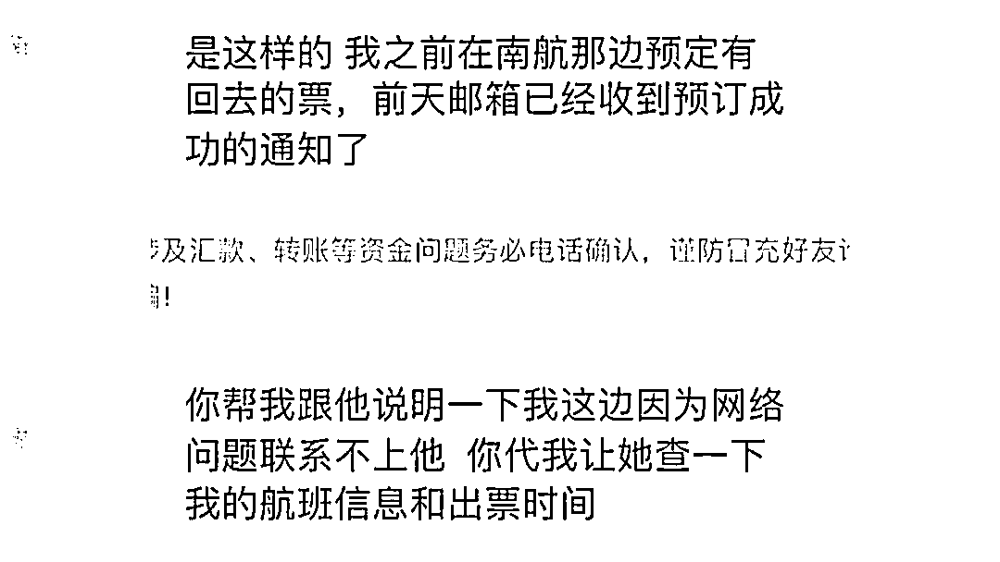
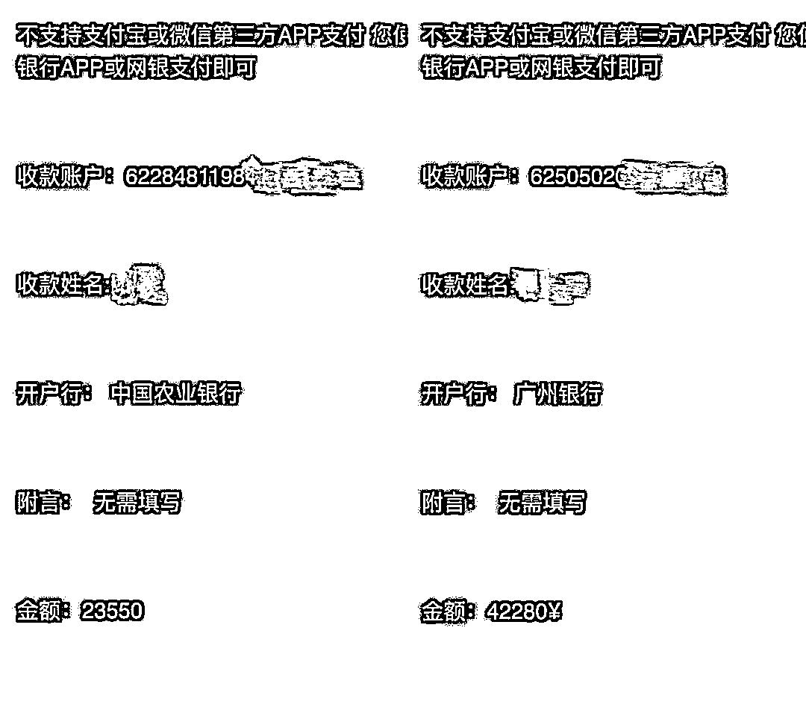
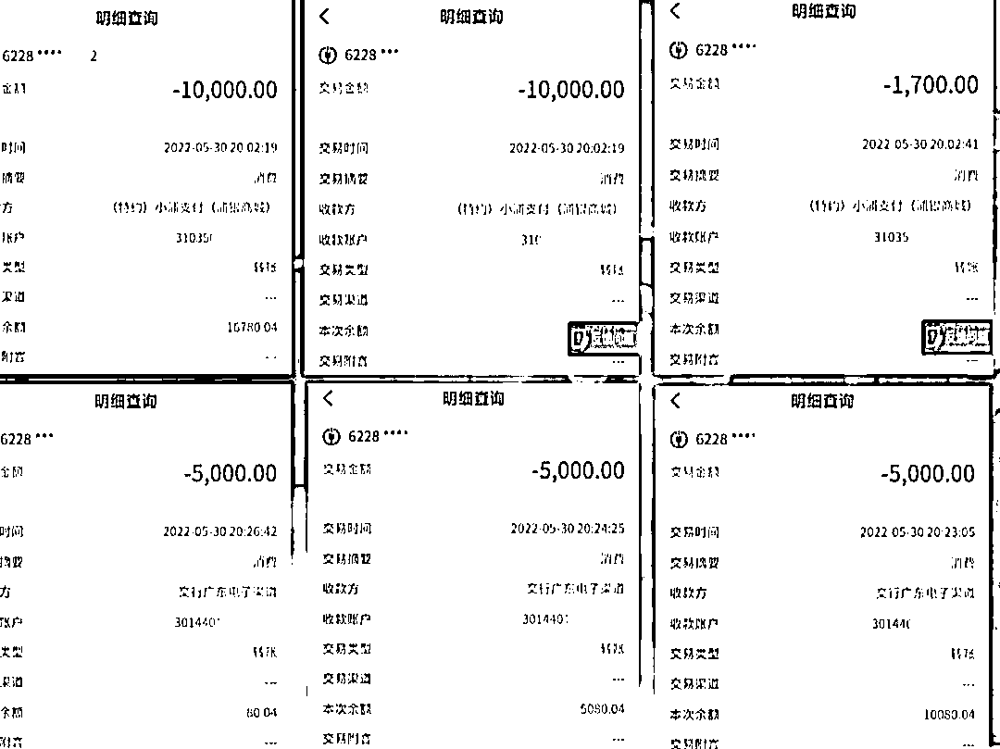

# 接一个电话损失 20 多万！珠海有人被骗！套路却很简单

> 原文：[`mp.weixin.qq.com/s?__biz=MzIyMDYwMTk0Mw==&mid=2247538615&idx=6&sn=c198cc358fc5d34b0874a7d65b0b2ecd&chksm=97cb9c8fa0bc15990ed9a646062d4de3887235e31bc19685eb447b88ca1a7693a54b768120d4&scene=27#wechat_redirect`](http://mp.weixin.qq.com/s?__biz=MzIyMDYwMTk0Mw==&mid=2247538615&idx=6&sn=c198cc358fc5d34b0874a7d65b0b2ecd&chksm=97cb9c8fa0bc15990ed9a646062d4de3887235e31bc19685eb447b88ca1a7693a54b768120d4&scene=27#wechat_redirect)

电信诈骗案件层出不穷，

犯罪分子利用电话、短信和网络等手段

实施电信诈骗犯罪，

作案手法日趋多样化，

令市民们防不胜防，

造成重大损失。

近日，

我市某高校学生小丽

就被一位在国外留学的“好友”

骗走了 6 万余元。

小丽回忆说，今年 5 月 17 号，

她突然收到一位

在国外留学好友的微博私信，

对方说，由于网络受限，

无法购买机票，想要小丽帮忙，

为了让“好友”能尽快回国，

热心的小丽便帮忙垫付尾款，

然而事情却并没有这么简单 

[`mp.weixin.qq.com/mp/readtemplate?t=pages/video_player_tmpl&action=mpvideo&auto=0&vid=wxv_2457594770609913857`](https://mp.weixin.qq.com/mp/readtemplate?t=pages/video_player_tmpl&action=mpvideo&auto=0&vid=wxv_2457594770609913857)

出于对朋友的信任，

小丽一次又一次点击付款信息，

前前后后共花费了 6.5 万元

帮助“好友”购买了机票。

然而直到小丽微信联系好友时，

才发现自己被骗了。

除了冒充“好友”进行诈骗，

还有不法分子竟冒充某中心工作人员

实施电信诈骗。

近日，

家住唐家某小区的王女士

就接到一个

自称是珠海某中心工作人员的

诈骗电话，

并被对方骗取资金 20 多万。

直到接到高新公安反诈中心的电话时，

她才意识到自己被骗了。

[`mp.weixin.qq.com/mp/readtemplate?t=pages/video_player_tmpl&action=mpvideo&auto=0&vid=wxv_2457595689665806338`](https://mp.weixin.qq.com/mp/readtemplate?t=pages/video_player_tmpl&action=mpvideo&auto=0&vid=wxv_2457595689665806338)

[`mp.weixin.qq.com/mp/readtemplate?t=pages/video_player_tmpl&action=mpvideo&auto=0&vid=wxv_2457595689665806338`](https://mp.weixin.qq.com/mp/readtemplate?t=pages/video_player_tmpl&action=mpvideo&auto=0&vid=wxv_2457595689665806338)

来源：珠海刑侦

](https://mp.weixin.qq.com/s?__biz=Mzg5ODAwNzA5Ng==&mid=2247487973&idx=1&sn=1b62da6f2018402862a5c375e10c355e&chksm=c06878b2f71ff1a4fbe7df4dec626aa7e696154751693bf16f6c6a302ceaa4d1959040c70518&scene=21#wechat_redirect)

← 向右滑动与灰产圈互动交流 →

