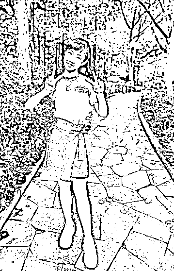

# 童星遭校园欺凌跳楼？上海闵行区教育局回应

> 原文：[`mp.weixin.qq.com/s?__biz=MzIyMDYwMTk0Mw==&mid=2247538660&idx=1&sn=8c29e2c208be440437684cb5cc0735c1&chksm=97cb9cdca0bc15cae4fe12aae529c41bd4f1bfb65846499d3a6ea46740693a19e56427a625bf&scene=27#wechat_redirect`](http://mp.weixin.qq.com/s?__biz=MzIyMDYwMTk0Mw==&mid=2247538660&idx=1&sn=8c29e2c208be440437684cb5cc0735c1&chksm=97cb9cdca0bc15cae4fe12aae529c41bd4f1bfb65846499d3a6ea46740693a19e56427a625bf&scene=27#wechat_redirect)

6 月 17 日起，**童星邵一卜**的妈妈尤永梅在女儿的社交账号上多次发文，称邵一卜**受同学嫉妒，被恶意诽谤，在精神上遭受校园欺凌。邵一卜**2021 年 11 月 7 日**跳楼轻生**，幸得医生全力救治才脱离生命危险。 

邵一卜受伤后住院治疗

来源：红星新闻

邵一卜今年 15 岁，在上海市闵行区某学校读 9 年级，曾出演过《追梦少年》《筑梦情缘》《银河补习班》等多部影视作品。

[`mp.weixin.qq.com/mp/readtemplate?t=pages/video_player_tmpl&action=mpvideo&auto=0&vid=wxv_2460183437140426752`](https://mp.weixin.qq.com/mp/readtemplate?t=pages/video_player_tmpl&action=mpvideo&auto=0&vid=wxv_2460183437140426752)

今天（6 月 26 日）下午，**上海闵行区教育局**发布通报称，6 月 15 日接到尤女士信访（举报）其女邵同学被欺凌一事，已成立工作组，督促指导学校“校园欺凌治理委员会”依法依规**开展调查**。

目前，邵同学已返校复学准备中考。

**童星邵一卜疑遭校园欺凌跳楼**

**2021 年 5 月 9 日，尤永梅接到班主任老师的电话。**

**老师提到，班上的同学都不想和邵一卜玩，因为邵一卜经常出言不逊，说一个男同学是“娘炮”，还说他人穿假名牌、成绩差等。**

**当尤永梅跟女儿说起这件事时，邵一卜崩溃大哭。**她说，传言中的所有事、所有话都不是她做过的、说过的，而是有同学造谣诽谤她，言语攻击她。****

**“我一开始问过她们为什么要针对我，造我的谣，**她们亲口承认，就是因为我经常被老师表扬而嫉妒我，这令她们十分不满意**。”邵一卜向母亲诉说。**

**随后，尤永梅联系了班主任，希望老师把事情调查清楚、严肃处理。**

****

**邵一卜受伤前的照片**

****尤永梅称，邵一卜一般会利用假期拍戏，但是功课从不落下，成绩也一直排在班级的前五名之内。****

**尤永梅表示，**经过调查，最初伤害邵一卜的是班上的 3 名同学。**“她们散布谣言毁坏我女儿的名声，很快越来越多的同学在她们的影响下加入。”**

**邵一卜告诉记者，她是从 2021 年 3 月开始察觉到了异样。新学期开学，她一进教室就发现很多同学对她指指点点。**

****后来，邵一卜了解到，有同学在网络上发布了诋毁她的言论。****

**与邵一卜同校的一名学生说，邵一卜的一位同班同学写了一篇小说，对方给他看过。**

**小说提到，邵一卜是个“绿茶姐”“优秀姐”；邵一卜替老师管班时态度“嚣张跋扈、惹人讨厌”。**但这个同学印象中邵一卜性格不像如此。****

**还有很多细节，都让邵一卜感到自己被孤立。**邵一卜回忆，同学会当着她的面说“她爸爸不是已经死了吗？”****

**有同学发试卷、作业本时会跳过她，不小心碰到她的东西就会故作恶心状，老师让同学们给成绩优秀的同学鼓掌，轮到给邵一卜鼓掌时掌声就戛然而止……**

****也曾有个别同学去安慰邵一卜，但很快就会被骂她的同学提醒，不敢再跟她来往。****

**因为这些事情，邵一卜经常晚上关灯后难以入眠。她害怕妈妈担心，也没有告诉她自己的遭遇。**

****接受道歉后仍被孤立****

****尤永梅非常气愤，**要求无理伤害邵一卜的几个同学写下道歉信和保证书**。她向记者出示了几名学生写的道歉信和检讨信等材料，落款时间为 2021 年 5 月。****

****“对不起啊萝卜（邵一卜的小名），之前的事情是我太过分了。”“向您和邵一卜同学表示深深的歉意。” “保证不再造谣、无中生有。”“马上删除在网络上发布的有关邵一卜的内容。”****

******伤害邵一卜的同学写的材料显示，不喜欢邵一卜的原因大都是小事。******

****一名同学在信中写道，有一次邵一卜帮她借字典，中途两人碰见老师，在老师的询问下，邵一卜如实告诉老师是帮同学借字典，结果同学因此被罚写检讨，也顺带把气撒在了邵一卜身上。****

****随后，这名同学在网络上发布了关于邵一卜的不实信息。****

******这几份道歉信中，不约而同地用到一个词：“误会”。**“我应该在这些误会发生的时候，就去找邵一卜解释清楚，而不应该使用冷暴力的手段。”****

****有一篇道歉信这样写道，“因为我在那段时间经常听见有同学称邵一卜说我坏话，并且上次期末考试考完当天，我又一次听到同学聊起，所以我对她的印象不好，即使没有经过验证。”****

********

****邵一卜同学家长发来的道歉短信****

****然而，似乎并非所有家长都认可尤永梅的做法。邵一卜告诉记者，有一名同学父母得知自己的孩子写过检讨信后，当晚就上门找到独自在家的邵一卜，问为什么要让写检讨信。****

****当时，邵一卜选择原谅这些同学。她说，她只想这一切早些结束，能和同学愉快相处，**没想到情况只好了几天，她此后仍旧被孤立。******

******坠楼导致身体器官多处受伤******

******2021 年暑假结束后的新学期，邵一卜还是被同学孤立、恶言相向，老师也没有再就此事询问关心她。******

******邵一卜说，她当时一直把这些不开心的事情憋在心里，不跟任何人说，**甚至把自己封闭起来，放弃反抗。********

******尤永梅表示，经历上一次的事情后，她担心女儿还会被同学排挤，曾多次联系班主任，但班主任回复说，邵一卜和同学相处很愉快。******

******2021 年 11 月 7 日，星期天，早晨，尤永梅听到邵一卜说，“妈妈，我出去跑步。” ******

******尤永梅以为女儿像平时一样去锻炼了。**然而女儿出了家门并未沿着楼梯往下走，而是爬上了 6 楼的窗台纵身一跃。********

****************

********邵一卜受伤前的照片********

********“**他们对我的伤害很大，通过跳楼结束生命的想法已经存在很久了。**晚上关灯也睡不着觉，我不止一次爬到自家窗台上。那一次，我真的不想活了。这才刚刚 9 年级，接下来的一年要怎么跟他们相处，完全不知道自己该怎么办。”邵一卜哭着对记者说。********

********11 月 7 日那天，邵一卜想到，这个双休日过完后又要回到学校，“不知道该怎么面对同学，不知道他们还要怎么对我？”她选择从 6 楼跳下去。********

********邵一卜坠楼后，被电缆线短暂地接住，随后摔在地上，邻居发现后，立刻将她送往医院救治。********

********经历了 3 个半月的艰难医治，邵一卜总算保住了性命，但**身体器官多处受伤、骨折，其中创伤性胰腺断裂是永久受损的**，目前已经动了两次手术。********

**********多次与校方协商追责事宜无果**********

********尤永梅提到，2 月 24 日，邵一卜出院后第二天，她就联系了班主任老师**，明确提出邵一卜的事故由校园欺凌导致，她们要追究涉事同学的法律责任。但是，多次与校方协商追责事宜皆未果。**********

********6 月中旬，尤永梅通过邵一卜的微博账号发布举报信，表示要实名举报班上对邵一卜欺凌过的学生及其家长，还有未尽到管理责任的班级老师以及学校的相关管理人员，希望追究他们的法律责任，同时呼吁大家关注校园欺凌。********

****************

********邵一卜受伤前的照片********

********关于这次实名举报，邵一卜说，经过妈妈的开导，“我也想尝试去勇敢地面对。虽然我伤得这么重，但依然活了下来。”********

 ********[`v.qq.com/iframe/preview.html?width=500&height=375&auto=0&vid=q3344hmj24a`](https://v.qq.com/iframe/preview.html?width=500&height=375&auto=0&vid=q3344hmj24a)******** **************当地教育局回应************** 

******针对此事，记者多次联系校方及邵一卜的班主任，均未获得回应。******

******记者尝试联系其中一名同学的家长，对方一听到“邵一卜”后就挂断电话，不再接听电话或回短信。******

******6 月 24 日上午，记者致电上海市闵行区教育局，相关工作人员表示该局已有工作人员根据相关管理条例督促学校处理此事，此事正在进一步协调处理中。**关于邵一卜母亲网上所发言论是否全部属实，其表示涉及校园欺凌认定一事，得由学校欺凌治理委员会按照相关法律法规进行认定。********

********出现校园欺凌现象该如何处理？********

********虽然此事是否系校园欺凌尚需调查认定，但相关专家就校园欺凌的现象发表了看法。******** 

********中国政法大学教授、青少年犯罪与少年司法研究中心主任皮艺军，以及北京市青少年法律与心理咨询服务中心主任、中国青少年自护教育发起人宗春山均指出，**如果出现了校园欺凌的现象，需要学校、家长、孩子还有社会共同面对、处理。**********

**********学校**********

********宗春山认为，**老师处理欺凌现象，需遵循立即性原则，消灭在萌芽状态**。有时候，有欺凌行为的学生看起来人数众多，但事实上，真正带头欺凌的，只是少数几个人。其他同学出于“友情”，或害怕等原因，也加入欺凌。对此，老师要区别处理。********

********皮艺军分析，日常生活中，老师可能没有做到“一碗水端平”。********

********关于欺凌有一个至关重要的原因就是自尊的问题。有的孩子比较出色，可能那个孩子本身没有做错什么，**其他孩子为了表达自己的存在感，就会产生嫉妒心理，孤立他人以发泄不满。**********

**********皮艺军呼吁，学校应该共同商定制定一个关于预防校园欺凌的校园公约，各个学校可以根据学校的实际情况来做，形成抵制校园欺凌的校园氛围。**********

************家长************

**********宗春山建议，**家长不要以暴制暴，要和学校沟通，表达诉求，争取通过学校来解决，如未解决可以继续向上反映。************

**********通过公开发声的方式，固然可以扩大影响力，但需要考虑到的是，舆论也有可能是一把双刃剑，要**避免泄露当事未成年人的个人隐私**。**********

**********皮艺军表示，“所谓零容忍，就是一丁点也不行，发生就应受到非常严格的处理。”**********

**********他提到，在学校，**就算发生欺凌的小事，欺凌他人的学生也需要当着全班去反思，让家长向被害、被骂的学生当众道歉，消除大范围的影响。************

**********宗春山分析，欺凌他人的孩子，或也有被欺凌的经历，他们内心是非常弱小的，用功利的方式获得的虚假的“友谊”。**********

**********如果家长发现自己的孩子有欺凌别人的行为，那么首先必须明确表达这是不对的，告诉孩子要理解别人的感受，同时反思自己的教育。**********

************孩子************

************一些事，就孩子而言可能是天大的事情。************

**********例如，一名同学过生日邀请全班同学参加派对，唯独不邀请某一位同学，这就是欺凌。通过贬损、伤害他人的方式获得快乐，就是欺凌。********** 

**********对于遭受欺凌、受到伤害的孩子，需要及时处理好自己的伤口，不要对他人的某些“评价”看得太重，别都积压在自己身上。**若遇到难以解决的问题，可以向老师、家长诉说，或向外界求助。************

********另外，皮艺军认为，现有法律对校园欺凌没有形成一个比较规范的明确定义，对这方面缺乏操作性。有时难以做到有法可依，只能按照成人的法律来进行判断、处理。********

********他还呼吁，应出台预防校园欺凌相关的单行法律法规，这能细化校园霸凌的情况，更具针对性。********

********来源：央视网综合红星新闻、闵行教育、北京青年报、新华社********

************************](https://mp.weixin.qq.com/s?__biz=Mzg5ODAwNzA5Ng==&mid=2247487973&idx=1&sn=1b62da6f2018402862a5c375e10c355e&chksm=c06878b2f71ff1a4fbe7df4dec626aa7e696154751693bf16f6c6a302ceaa4d1959040c70518&scene=21#wechat_redirect)********

********← 向右滑动与灰产圈互动交流 →********

****************