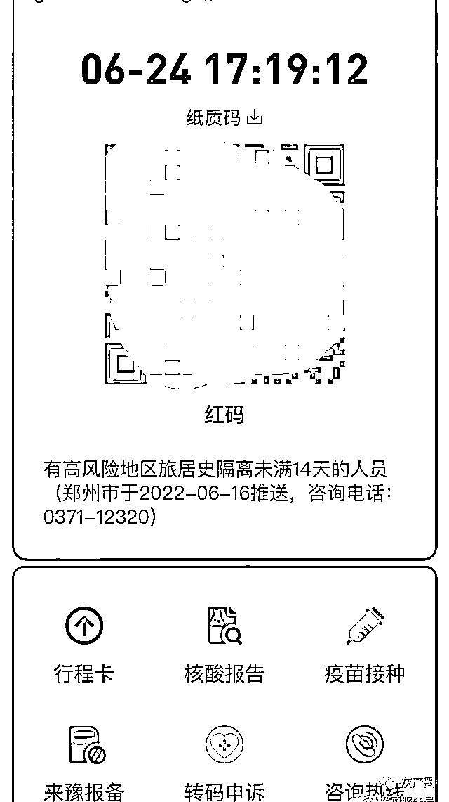

# 整顿调查之后，河南部分储户至今红码，有人红了十几天

> 原文：[`mp.weixin.qq.com/s?__biz=MzIyMDYwMTk0Mw==&mid=2247538660&idx=2&sn=bbd0245cd81914c1f4f625ea2d88c33b&chksm=97cb9cdca0bc15cab7a7a9f9a4bed1c63325f4e40482adc65c3c8caf2bf16555cc2744d635c2&scene=27#wechat_redirect`](http://mp.weixin.qq.com/s?__biz=MzIyMDYwMTk0Mw==&mid=2247538660&idx=2&sn=bbd0245cd81914c1f4f625ea2d88c33b&chksm=97cb9cdca0bc15cab7a7a9f9a4bed1c63325f4e40482adc65c3c8caf2bf16555cc2744d635c2&scene=27#wechat_redirect)

“我以为经过这次整顿调查之后，不会再有红码了。”6 月 24 日，广东珠海储户杨海做完核酸检测后，飞抵郑州。出机场扫码时，他的健康码变红了。工作人员称，他需要隔离。

杨海说的“整顿”是，6 月 22 日，针对此前闹得沸沸扬扬的“储户红码事件”，郑州政府发布《关于部分村镇银行储户被赋红码问题调查问责情况的通报》，称郑州市 5 名官员违反《河南省新冠肺炎疫情防控健康码管理办法》及健康码赋码转码规则，擅自对不符合赋码条件的人员赋红码，分别受到撤职、降级、记过等处分。

《通报》还说，共有 1317 名村镇银行储户被赋红码，其中 446 人系入郑扫场所码被赋红码，871 人系未在郑但通过扫他人发送的郑州场所码被赋红码。

6 月 22 日，“清风郑州”公布对“储户红码”事件的调查与处理结果。

6 月 24 日下午，国务院联防联控机制召开新闻发布会，国家卫生健康委疾控局副局长雷正龙要求，明确健康码的使用管理、运行保障和信息安全等各项规定，各地应根据不同疫情风险等级对相关人员精准赋码，不得“一刀切”“码上加码”，并明确要求严格健康码功能定位，“不得擅自扩大应用范围，绝不允许因疫情防控之外的因素对群众进行健康码赋码变码。”

但记者调查发现，自 6 月 14 日以来，河南村镇银行的储户中，仍有不少人被赋红码。其中，一名青岛女子的“山东健康码”甚至也一度变红；亦有储户试图通过健康宝申诉功能转码时，发现弹窗显示“当前无风险，无需进行转码申请”——自己被赋予红码，系统又说“无风险”，那到底是不是疫情受管控人员呢？

**外地储户被赋红码十余天**

**武汉储户袁茂在河南禹州新民生村镇银行存入了 700 多万。今年 4 月无法取现后，他的公司受到了很大影响。**

**此次村镇银行储户被强制赋红码的事件，集中发生在 6 月 11 日至 14 日之间。14 日，由于“储户红码”事件登上热搜，受到广泛关注，河南方面提出调查此事。抵达郑州或在外省未到郑州而被赋红码的两类储户，纷纷于当日上午发现红码转绿。**

**忙于生意的袁茂正是在 14 日下午，出于“好奇”，在一个“难友群”里扫了群友发送的一张“郑州东站高铁站售票处”场所二维码。扫完后，他的健康码变红了。**

**健康码显示，赋码来源为“郑州市”，赋码时间为“2022-6-14 16:39:49”，赋码原因为“有高风险地区旅居史隔离未满 14 天的人员”。**

**对比其他储户的遭遇，袁茂因此判断，河南健康码大数据系统对储户赋红码的时间，是储户第一次扫河南当地二维码的时间。**

****

**武汉袁先生，从 6 月 14 日以来，一直是红码。**

**5 月 23 日，袁茂看到一段储户们发到群里的现场视频——河南银保监局副局长杨华军向储户保证：只要储户合法存入的存款都会得到保障。他特别解释“合法”存入，即包括通过线上和第三方平台存入，只要储户“不知情”、未参与违法过程，存款也能得到保障。**

**袁茂认可了这一保证。事发两个多月来，袁茂看到了许多关于村镇银行涉嫌犯罪的说法，但他始终保持冷静，“我只相信官方的说法。”**

**更何况，袁茂当时是从一款第三方金融 APP 转入银行的官方小程序存款的，没有通过中介，也不存在高额贴息的情况。因此，虽然存款数额较高，但利率为 4.1%，属于正常水准。袁茂因此很自信，认为自己不存在任何“参与违法犯罪”的金融行为。“我觉得要理性看待，国家需要调查清楚之后，需要筹款，才能放开取款。这个问题最终还是能解决的，无非是要等。”**

**因此，4 月、5 月到 6 月的几次储户集体赴河南维权中，袁茂均未参与。因为公司生意忙，他一直留在武汉，至今没去过河南。好在袁茂的湖北健康码并未因此受到波及。**

****受河南红码影响，山东健康码也红了****

****山东青岛的储户孙梅则遭遇了一次“红码乌龙”。****

****孙梅在河南禹州新民生村镇银行、柘城黄淮村镇银行共存入 40 万元。5 月 23 日，她曾到河南，向银行和有关部门反映情况，随后返回山东。6 月 11 日下午，她有一个来自河南的未接电话。接着，她扫了群里一个郑州火车站的二维码后，发现自己的健康码变红了。****

****过了一会儿，河南的电话又打了过来，询问她，“报备地址具体在哪家哪户？”孙梅这才搞清楚——6 月 6 日前后，她打算参与去河南的维权申诉，但因为没有确定是否去，她在“豫事办”里填写的报备地址不够精确。****

****和其他储户一样，孙梅的健康码在 6 月 14 日一度转绿。****

****到了 6 月 19 日 18:05，因为孩子身体不舒服，赵梅出门买药。药店要求查看 48 小时核酸记录，孙梅打开山东健康码“康山东”，发现又变红了。赋红码的原因，写着“异常信息由河南推送，来自高风险地区未满 14 天，或未检测到第 14 天后核酸阴性结果”。****

********

****山东青岛孙女士，6 月 19 日的山东健康码也变为红码。****

****孙梅一下慌了。一旦自己红码，自己没法上班不说，孩子也不能上学，也不能参加几天后的考试，“学校查得挺严的，我在考虑要不要跟老师说。”****

****她很疑惑。虽然自己 5 月 23 日是去了一趟河南，但早已过了 14 天，而且她 48 小时以内做的核酸结果还是阴性，怎么会变成红码呢？****

****“我真是吓坏了。”孙梅说，6 月 11 日的红码，只是河南的健康码，但这一次，她的河南、山东两地的健康码都变红了。“一旦本地红码的话，我就干啥都不行了。”****

****孙梅打了青岛当地的 110，110 让她打青岛市 12345 反映情况，但孙梅打了多次打不进去。随后半小时，她一边走在路上，一边忙着接派出所、街道办、疫情防控指挥部的电话。各个单位都是一副紧张的口气，询问她家的具体地址，准备对她和家人实施管控。****

****“他们一听说是因为河南推送的——那几天这事都上了新闻热搜嘛，问我是不是那个什么银行的事儿，就知道怎么回事儿了，也不害怕，也不着急了。”孙梅说，其中一个部门的人告诉她，这个红码是河南通过大数据推送给了国务院，然后又推送到山东，“所以你还是要去找河南转码。”****

****19 日晚上，可能是得到了山东有关部门的帮助，孙梅还没给河南那边打电话，她的健康码就转绿了。****

******被赋红码，却又提示“无风险”******

******但山东的张立峰、北京的刘薇、上海的韩悦就没这么幸运了。他们的健康码从 6 月中旬至今，都是红码状态。******

******张立峰在河南柘城黄淮村镇银行存了不到 17 万，钱不多，却是他打算用来结婚的“准备金”。6 月 12 日，他在群里扫郑州高铁站的场所码时，发现健康码变红。赋码来源为“郑州市”，赋码原因为“有高风险地区旅居史隔离未满 14 天人员”。******

******6 月 14 日，大部分被强制赋红码的储户纷纷变为绿码，张立峰的健康码却始终没有变绿。******

******最近十多天来，他打了许多电话。037112345（郑州市市长热线）、12388（郑州市纪监委）、12320（郑州市卫健委），三方互“踢皮球”；有时候无法接通，只能听到电话里的语音自动反复提示：“红码人员，请配合隔离管控”；他也求助过滨州当地的警方，对方让他找河南，“我们没有那么大的权限”。******

******其间，郑州 12388 建议他通过健康宝申诉功能转码。但张立峰填写申诉信息后，弹窗显示“当前无风险，无需进行转码申请”。******

************

******滨州张先生、北京刘女士在申诉转绿码时，弹窗显示“当前无风险，无需进行转码申请”。******

******张立峰不解。自己被赋予红码，系统又说“无风险”，那他到底是不是疫情受管控人员呢？“最近这个事，老是压在我心里，让我没法安心工作。”他希望健康码尽快转绿，能去河南向银行索要一份存款证明，作为将来兑付的凭证。******

******截至 6 月 24 日晚上，张立峰的河南健康码依然是红码。当天傍晚，他再次拨打郑州 12345，“我一打过去，他就能听出是我，直接说帮我督促落实。”张立峰问对方，是否有他的备案信息，对方回答有。******

******上海的韩悦在开封新东方村镇银行线下存入了数百万，因此持有的是一类卡。“4·18”事件以来，张悦没去过河南。******

******因为上海疫情，她无法出市，也没有太多精力关注村镇银行的事情。6 月的“储户红码”过后，韩悦以为“事情结束了”。6 月 16 日，她扫了河南的场所码后，发现健康码变红了。******

******韩悦以为是系统失误，没太在意。谁知道，6 月 24 日她再查验河南健康码，发现还是红码，并显示：“有高风险地区旅居史隔离未满 14 天的人员（郑州市于 2022-06-16 推送）”，还留下了郑州市卫健委的咨询电话。******

************

******上海韩女士的豫康码，6 月 24 日仍为红码。******

******但是，韩悦一打过去，电话直接识别出手机号的归属地上海，语音提示：“上海来河南人员，实行 14+7+3 的隔离政策。”因此，她至今没有打通电话。******

******即将到来的 7 月，张悦要继续还房贷，“我是很着急，但我也没办法，我也去不了。”******

********“哪怕是废话，我依然有知情权”********

********受疫情影响，北京人刘薇同样没有去过河南。但在 6 月 12 日的扫码中，她发现自己的河南健康码变红了。且直到今天，依然是红码。她不知道为什么，在 24 日的大批储户“红码转绿”中，她被“遗漏”了。********

********从国外留学回来后，刘薇就和父母、爷爷奶奶一起生活。********

********长辈都信任刘薇，把养老金都交给她管理。2020 年，刘薇把全家人的“所有家当”都存入了河南禹州新民生、柘城黄淮两家村镇银行。4 月 18 日至今，她没有一次打通过河南、郑州相关部门的电话。时间过去得越久，她越焦心。********

********在北京，刘薇已打过三针疫苗，每天或每隔一天都做一次核酸检测。********

****************

********北京刘女士，已打过三针疫苗，几乎每天做核酸，至今仍被赋红码。********

********发现河南健康码变红后，她曾多次扫河南各个场所的二维码，期待变绿。但后来担心河南的红码波及北京健康码，她没再敢多扫。和张立峰一样，刘薇曾在健康码系统中申诉转码，结果也是弹窗提示“当前无风险，无需进行转码申请”。********

********刘薇的父亲有高血压，妈妈最近也因为心脏病犯了而住院。“家里老人的养老金都在里面，一旦要用钱，可怎么办啊？”刘薇接连几天睡不着。凌晨一两点，群里其他储户@她，她也会立即回复。刘薇说，她的眼睛熬肿了，“已经熬得双眼皮都看不见了。”********

********父母知道了女儿在村镇银行的遭遇，甚至连爷爷奶奶也察觉到了迹象，多次询问“出了什么事”。为了不给刘薇增加压力，四位老人都不再多说。但刘薇能感觉到，老人的心理压力也很大，“整个家里现在就是一团乱麻，没有一个人是开开心心的。”********

********许多储户至少去过一次河南，听到过当地领导的当面答复。但刘薇一直在北京，她越发觉得心里“空落落”的。2 个多月过去，她得不到任何确定的信息，“我就想去许昌，当面问问他们，我这种情况该怎么办。”********

********她认为，哪怕听到的还是以前“风险可控”的老话，听听领导的分析，也能安心一些。“哪怕是废话，我依然有知情权。”刘薇说，“但现在，我是红码，也去不了。”********

**********飞机落地郑州后健康码变红**********

**********“我以为经过这次整顿调查之后，不会再有红码了。”6 月 24 日，杨海从广东飞抵郑州后，发现健康码还是变红了。情急之下，他打开了支付宝“豫事办”的健康码，显示是绿码，他出示给工作人员后出了机场。但没过多久，他发现，支付宝上的健康码也变红了。这意味着，他无法在郑州自由行动。**********

********************

**********广东珠海杨先生，“粤康码”为绿码，6 月 24 日到郑州新郑机场后却被赋红码。**********

**********此前，杨海通过第三方平台和银行小程序，先后在禹州新民生、柘城黄淮两家村镇银行存款。从 4 月至 6 月，他一直没有去河南。**********

**********6 月 20 日，禹州新民生等 4 家河南村镇银行官网均发布公告称，按照金融管理部门要求，该行从即日起开展线上客户资金信息登记工作，凡该行线上交易系统关闭后不能正常办理业务的客户均需登记，并填写完整、真实、准确的相关信息。**********

**********在银行提供的信息登记表中，除了个人基础信息外，还应填写相关“产品信息”，包括交易时间、交易金额、产品名称、产品期限、产品年利率、交易渠道、已获取收益、获取收益方式、获取产品方式，以及是否存在通过其他渠道获取收益。**********

**********但杨海登录禹州新民生村镇银行的系统时，手机却无法接收验证码。麻烦的是，过去存款、取款次数很多，他根本无法记住那些交易、收益记录信息。6 月中旬“红码事件”过后，他决定亲自到郑州，去河南银保监会咨询登记表格的问题。**********

**********因为健康码变红，24 日晚上，杨海只得住在郑州当地一个朋友的家里。同一天，他在“难友群”里还发现了其他几位和他一样，到达郑州后发现被赋红码的储户。**********

**********杨海计划着，6 月 25 日，要先去郑州街头做一次核酸检测，“保证我的 48 小时核酸结果有效期。”他决定，向河南银保监部门咨询完后，就返回广东。（文中人物均为化名）**********

**********来源：凤凰 Times  作者：陈龙**********

******************************](https://mp.weixin.qq.com/s?__biz=Mzg5ODAwNzA5Ng==&mid=2247487973&idx=1&sn=1b62da6f2018402862a5c375e10c355e&chksm=c06878b2f71ff1a4fbe7df4dec626aa7e696154751693bf16f6c6a302ceaa4d1959040c70518&scene=21#wechat_redirect)**********

**********← 向右滑动与灰产圈互动交流 →**********

********************