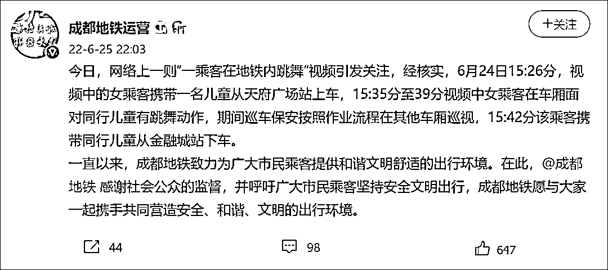
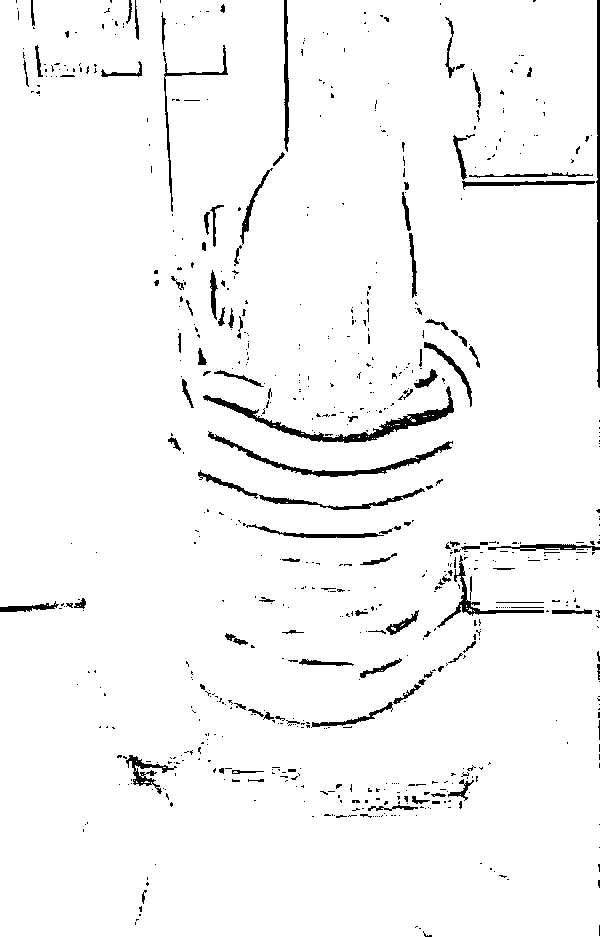

# 成都地铁回应女子对小孩跳不雅热舞

> 原文：[`mp.weixin.qq.com/s?__biz=MzIyMDYwMTk0Mw==&mid=2247538660&idx=4&sn=c7e4adfbb303a1c5e47ce0e52e5930b7&chksm=97cb9cdca0bc15ca7534f4391661d92a402f69732514e46471909acf8a09eebe888378aeb9b0&scene=27#wechat_redirect`](http://mp.weixin.qq.com/s?__biz=MzIyMDYwMTk0Mw==&mid=2247538660&idx=4&sn=c7e4adfbb303a1c5e47ce0e52e5930b7&chksm=97cb9cdca0bc15ca7534f4391661d92a402f69732514e46471909acf8a09eebe888378aeb9b0&scene=27#wechat_redirect)

6 月 25 日，@成都地铁运营 回应“一乘客在地铁内跳舞”事件：

[`v.qq.com/iframe/preview.html?width=500&height=375&auto=0&vid=b33443dm3ov`](https://v.qq.com/iframe/preview.html?width=500&height=375&auto=0&vid=b33443dm3ov)

今日，网络上一则“一乘客在地铁内跳舞”视频引发关注，经核实，6 月 24 日 15:26 分，视频中的女乘客携带一名儿童从天府广场站上车，15:35 分至 39 分视频中女乘客在车厢面对同行儿童有跳舞动作，期间巡车保安按照作业流程在其他车厢巡视，15:42 分该乘客携带同行儿童从金融城站下车。

一直以来，成都地铁致力为广大市民乘客提供和谐文明舒适的出行环境。在此，@成都地铁 感谢社会公众的监督，并呼吁广大市民乘客坚持安全文明出行，成都地铁愿与大家一起携手共同营造安全、和谐、文明的出行环境。

**此前报道：**

据封面新闻 6 月 25 日消息，近日，有网友曝料称一女子在成都地铁内当着对面座位上小孩的面大跳热舞，动作暴露，十分不雅。

视频显示，女子站在地铁车厢过道内，对着一小男孩跳舞，旁若无人地做着提臀、扭屁股等动作，之后还撩起上衣，露出内衣，并时不时将脸凑到小男孩面前，一旁尴尬的男性乘客选择走开，小男孩则不知所措地坐在位置上。

视频截图

不少网友指出，发生地点为成都地铁一号线，视频中也能听到地铁广播所播报的为成都桐梓林地铁站。

25 日，成都地铁官方客服表示，地铁公司已接到投诉，已经反馈给相关工作人员进行调查处理。

记者看到，在视频评论下方，有网友怀疑当事女子嗑药或存在精神疾病，也有网友认为，当事人是为了拍视频博取关注度。

对此，记者联系上成都市轨道公交公安分局民警，对方表示：目前正在开展调查。

来源：观察者网综合

](https://mp.weixin.qq.com/s?__biz=Mzg5ODAwNzA5Ng==&mid=2247487973&idx=1&sn=1b62da6f2018402862a5c375e10c355e&chksm=c06878b2f71ff1a4fbe7df4dec626aa7e696154751693bf16f6c6a302ceaa4d1959040c70518&scene=21#wechat_redirect)

← 向右滑动与灰产圈互动交流 →

