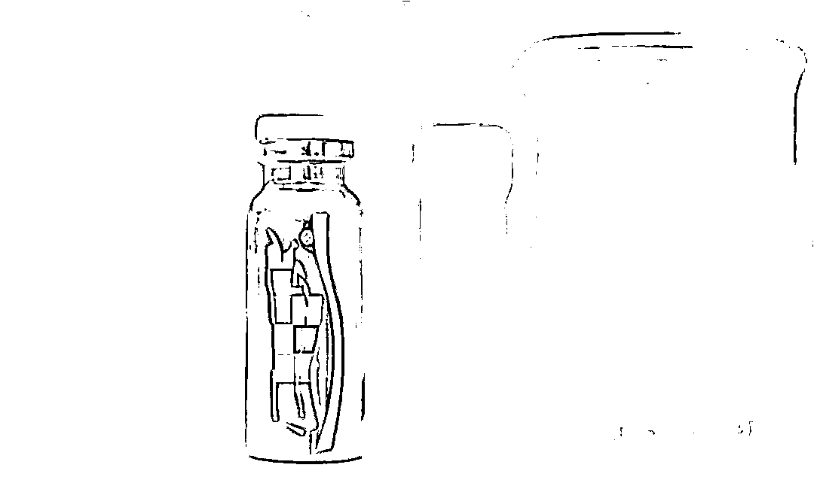
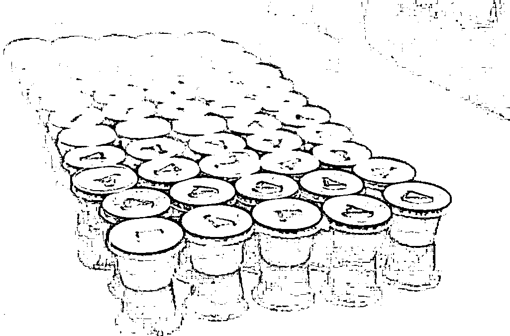
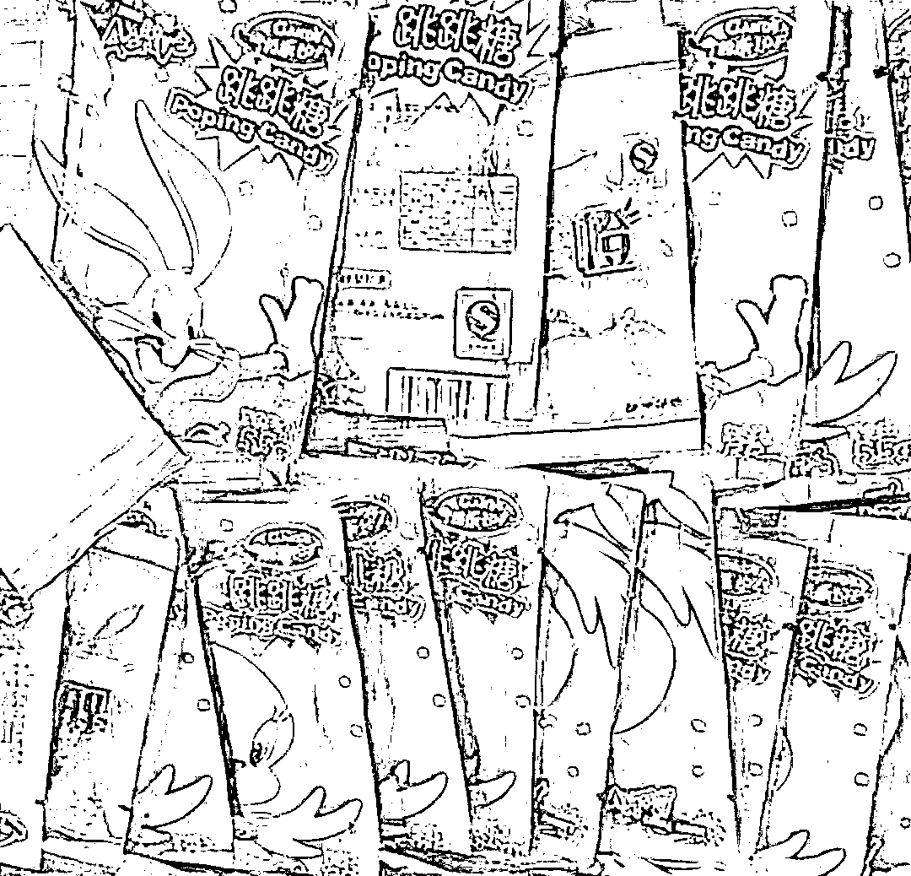
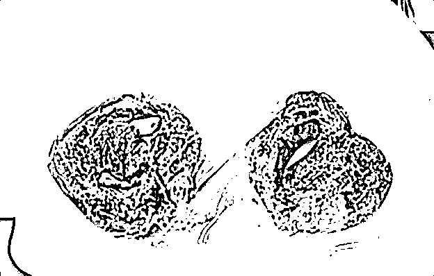
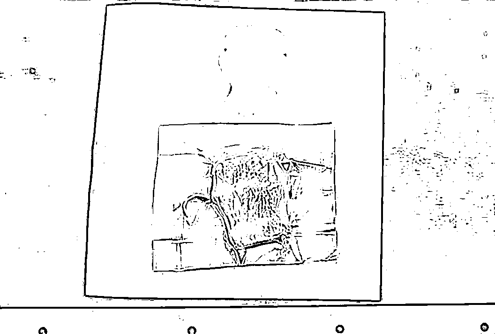
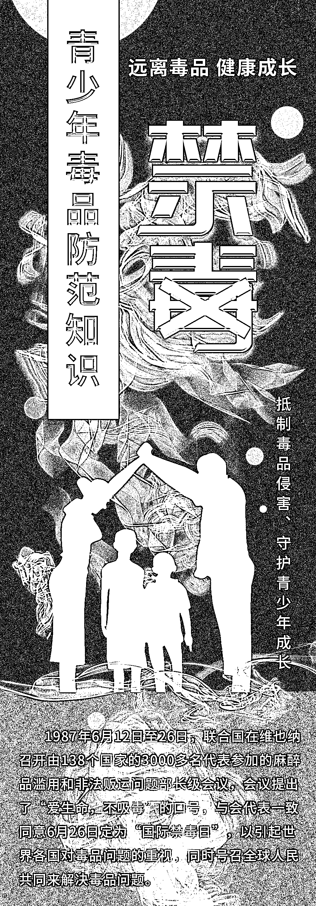
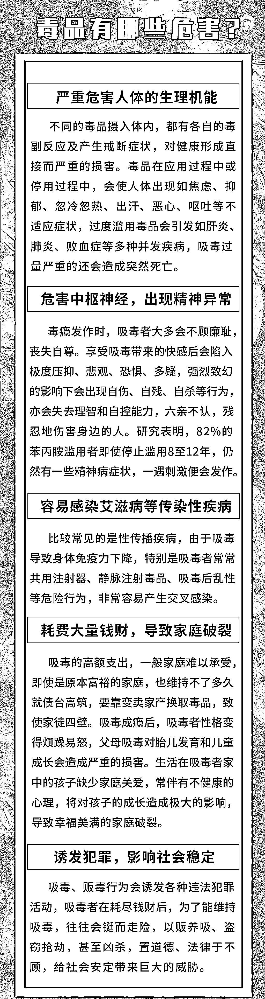
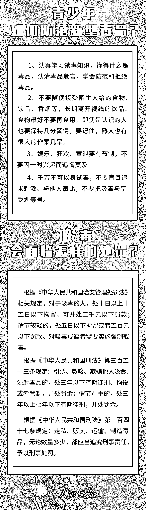

# 记住 6 月 26 日，让自己远离情有“毒”终

> 原文：[`mp.weixin.qq.com/s?__biz=MzIyMDYwMTk0Mw==&mid=2247538660&idx=5&sn=9d44cfeb8f01d634418ac1af17f7e2c0&chksm=97cb9cdca0bc15ca0dfb0af95bba54bd15c4f6fedd12acd5a42fd64b8dc5b1c13b566d699be9&scene=27#wechat_redirect`](http://mp.weixin.qq.com/s?__biz=MzIyMDYwMTk0Mw==&mid=2247538660&idx=5&sn=9d44cfeb8f01d634418ac1af17f7e2c0&chksm=97cb9cdca0bc15ca0dfb0af95bba54bd15c4f6fedd12acd5a42fd64b8dc5b1c13b566d699be9&scene=27#wechat_redirect)

暑期就要到来了

很多高考、中考考生

会与好友、师长、亲人各种欢聚

但有些 party 是不能去的

进入娱乐场所欢聚时

一定要小心所谓“朋友”

背后暗藏的“魔爪”

觥筹交错间

请先确定你的杯里有没有**特殊“加料”**

那些号称“飘飘欲仙”

花花绿绿的小包神秘物体

更是千万别碰！

切勿因好奇

一时兴起而追悔莫及

面对千变万化

令人防不胜防的**伪装毒品**

你认识几个？

**“可 乐” **

**伪装指数：★★★★★**

伪装成“可乐”的新型毒品是一种由**冰毒、摇头丸、氯胺酮**等毒品混合而成的新型毒品。其外包装跟普通可乐很像，喝完会产生幻觉，全身高热发狂。它比冰毒的危害更大，而且因吸食方法不同，对人体危害也更大。

** “果冻” **

**伪装指数：★★★★★**

这些果冻状毒品和市面上的食用果冻高度相似，其外包装上的三角形标记是用来区分口味和成分的，**有的含有大麻，有的含有冰毒。**

**“跳跳糖” **

**伪装指数：★★★★★**

这种“跳跳糖”遇水即溶、即冲即饮，口味与各种饮品混合后都不会发生变化，甚至香味都相似，且后劲很强，喝一次大脑连续两天都会处在兴奋当中。

**“巧克力”**

**伪装指数：★★★★★**

伪装成“巧克力”的新型毒品可不是普通的巧克力，而是犯罪分子用大麻油掺制成的巧克力。其包装粗糙简陋，而且没有标明任何品牌。

这种新型毒品含有四氢大麻酚成分，吸食大麻过量会损伤身体，引起手脚颤抖、心跳加快、头脑昏沉、反应迟钝、短期失忆等不良反应。如果长期吸食，后果更加严重。

**“饼干”**

**伪装指数：★★★★★**

一些犯罪分子将毒品混在烘焙原料中，制成了可爱的曲奇饼干模样，以躲避公安机关的盘查，方便运输、售卖，让人防不胜防。

看到这里，相信不少人都会感到背后一凉，毒品离我们如此之近，可能警惕心稍微低点就吃喝下去了。面对这些已经渗透到我们生活里的毒品，也有人不以为然，实际上毒品的危害远远比我们想象得要大。

不少吸毒者往往都是抱着“试试看，我肯定不会上瘾”“压力好大，听说吸毒能减压”等想法，从此踏上了不归路……

**面对毒品，勇敢说不！**

一日吸毒，终身想毒，毒品之害猛如虎，说吸毒等于慢性自杀毫不夸张，那么吸毒究竟有哪些危害呢？如果遇到了来自同伴的毒品压力，青少年应当如何防范新型毒品？吸毒会面临怎样的处罚？掌握以下几点很重要。

**吸毒一口，掉入虎口**

**日常生活中要有警觉戒备意识**

**别为了一时的“快乐”**

**毁了自己的身心健康**

**珍爱生命，远离毒品！**

来源：人民公安报

](https://mp.weixin.qq.com/s?__biz=Mzg5ODAwNzA5Ng==&mid=2247487973&idx=1&sn=1b62da6f2018402862a5c375e10c355e&chksm=c06878b2f71ff1a4fbe7df4dec626aa7e696154751693bf16f6c6a302ceaa4d1959040c70518&scene=21#wechat_redirect)

← 向右滑动与灰产圈互动交流 →

