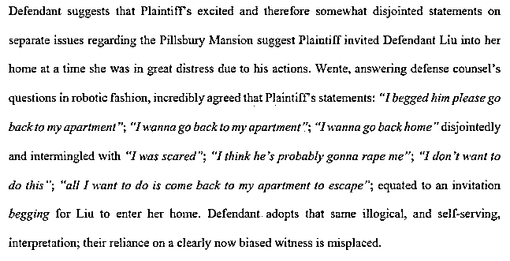

# 刘强东案听证会举行！大量视频+证词曝光！女方出庭要求赔偿！

> 原文：[`mp.weixin.qq.com/s?__biz=MzIyMDYwMTk0Mw==&mid=2247538722&idx=1&sn=3508ef939729e1982633636f1eea6d73&chksm=97cb931aa0bc1a0cf1741d4bd2dfd00ffef3d89d661fdc08530d39fad403e08bceb4785a58e1&scene=27#wechat_redirect`](http://mp.weixin.qq.com/s?__biz=MzIyMDYwMTk0Mw==&mid=2247538722&idx=1&sn=3508ef939729e1982633636f1eea6d73&chksm=97cb931aa0bc1a0cf1741d4bd2dfd00ffef3d89d661fdc08530d39fad403e08bceb4785a58e1&scene=27#wechat_redirect)

已经拉锯了四年多的**中国留学生 Jingyao （以下简称 J）诉刘强东性侵民事诉讼案**，美国时间在 6 月 24 日迎来了新进展。 

当地时间下午一点，该案件在明尼苏达州首付明尼阿波利斯进行听证会(motion hearing)，整个过程持续了四小时。

**核心争议焦点是 Jingyao 提出增加针对刘强东和京东的惩罚性赔偿（punitive damages）动议，以及刘强东一方提出取消对京东的指控。**

Jingyao 本人全程出席了庭审。

**庭审现场直击**

此次听证会并没有允许对外直播，youtube 的记者发布了一段 15 分钟左右的视频还原了部分庭审内容。

据悉在这次长达 4 个小时的听证会上，**J 律师提供了大量视频证据，包括第一手视频材料。**

案发当晚的豪车司机、刘强东的助理 Alice、和晚宴的女服务员均有出庭作证。

刘强东方没有提供视频证词，**但提供了书面证词，**其中证词中提到，J 从来没有对他进行性行为表示过口头同意，他只是觉得她非常的友好。

在听证会前，J 方和刘强东方均提供了很多书面证据，我们下面整理了一些重点供大家查看。

**刘强东方提交材料称原告在多处关键事实陈述前后矛盾**

6 月 10 日，被告刘强东方提交了一些针对性材料进行说明。

图片截自法庭文件

其中提到，原告有很多说法都有矛盾之处。

比如原告称自己被强奸，但原告在向警方报告时又否认说没有： 

图片截自法庭文件

[`mp.weixin.qq.com/mp/readtemplate?t=pages/video_player_tmpl&action=mpvideo&auto=0&vid=wxv_2460615864799412225`](https://mp.weixin.qq.com/mp/readtemplate?t=pages/video_player_tmpl&action=mpvideo&auto=0&vid=wxv_2460615864799412225)

原告证词中确认，“在授权她的律师提交起诉前，没有阅读或审查（起诉书）”，而只是让她的律师自己起草。同时，J 在提交起诉后才看过这份起诉书，并“谎称起诉中的所有指控都是真实的”。

图片截自法庭文件

原告称在车上被告开始抚摸并强迫她，而在她后来的证词中，她承认这个话是错的。

图片截自法庭文件

原告知道她有义务保存，但她仍然消除了证据。

图片截自法庭文件

原告曾称自己喝醉了，但在看到监控后，她承认自己说了谎等等。

图片截自法庭文件

针对核心争议点，文件指出，**原告多次告诉警方她没有被强奸。** 

而在近期，原告又改变了她的说法，称她在刘强东暴力强奸她之前与他进行了**激烈的搏斗（fiercely “battled” against）**，然而之后警察和医院工作人员都对原告进行了检查，并没有看到搏斗的痕迹。

文件中还指出，原告曾威胁被告如果不付钱，她会去找媒体；策划了对被告的网络攻击；意图将这一切都归咎于警方，并在此后进行了许多媒体采访。

此外，文件指出，原告被邀请参加晚宴，在当晚原告给父母发的微信中说被告“要单独带我去吃饭。” 

原告称被迫饮酒，但有视频显示，整个三个小时的晚餐时间里，原告在没有其他人劝酒的情况下反复喝酒。

原告还曾称没有邀请被告去她的公寓，但她曾在她的诉状中，原告表示她允许刘先生进入她公寓，因为她“**希望保持礼貌和尊重。**”

**原告方提供证据，并解释为何证词前后矛盾**

6 月 16 日，原告方 Jingyao 提交了文书，其中对案件有关情况进行了回应：

图片截自法庭文件

首先，原告指出，**明尼苏达大学 DBA 项目院长 Tony Cui 和 DBA 亿万富翁 Li Wa 暗中代表被告及其法律团队加害该校学生。**

崔院长作为明尼苏达大学的院长和教授，在案件发声后，在她极度焦虑和动荡的时候，与 Li Wa 合作，为刘谋利，令她很不安。

Tony Cui 的部分口供：

图片截自法庭文件

此外，就陈述过的证词问题，文件中也做了细节解释。

与被告声称的时间线相反，**原告告诉了警方在他一出现在公寓里以后，她就被强奸了。**

据原告表述，2018 年 8 月，J 以志愿者身份参与明尼苏达大学工商管理博士 DBA 项目的活动，在活动结束后的饭局喝醉，被带上刘强东所乘的豪车，当晚在自己租住的公寓内被刘强东强奸。 

2018 年 8 月 31 日凌晨，警方摄像头清楚地显示了时间线，与被告声称的完全不同。

警方接到电话，接到了“正在进行的强奸”的报案后前往原告的公寓大楼，遇到了报警人，一位 20 岁左右的中国男性。

男性表示，**受害者不想让警方介入，因为害怕她的家人会被嫌犯伤害，但是他还是打电话报警了。**

警方询问他，是否还记得受害人给他发的信息，**其中说”他强奸我了。“？** 

报警人表示：**是的。**

图片截自法庭文件

进入 J  的公寓后，警方直接问了她报警电话的事，当时她立即证实了“强奸”。原话为：”**他有，但不是那种意义上的。**“

注：Jingyao 后来有解释她的意思是不是说他拿刀威胁她。

**”在他强奸你的时候，你有没有在这个过程中说过不要？“”说过。“**

图片截自法庭文件

摄像头显示，被告在被带走时从原告身边经过时，他怒气冲冲地瞪着 J ，并用中文嘟囔着什么。

J 害怕自己和她在中国的家人受到伤害，导致她随后修改了她对回应警察的原始陈述，即她被强奸了。

图片截自法庭文件

文件中还对一处”说谎指控“做出了澄清。原告把刘强东单独邀请自己去晚餐的信息发给了父母，她认为对方律师误解了中文”单独“的意思。 

”Alone——这个“单独”——普通话里的“单独”不仅仅意味着单独，还可意味着发起。所以信息的意思是刘强东先生提议只邀请我去吃饭。”

图片截自法庭文件

关于晚宴上的喝酒问题，文件表明，J  是被强迫的。

**另外，原告没有邀请被告进入她的公寓，她也没有在这个问题上说谎。** 

图片截自法庭文件

刘强东曾经亲口表示，他们当晚进房间，洗完澡后，就相互亲吻和抚摸，后面就发生了关系。单从电梯间的视频看，监控画面这个女的挽着大强子胳膊，大强子双手插兜，这是主动还是被强迫呢？

[`mp.weixin.qq.com/mp/readtemplate?t=pages/video_player_tmpl&action=mpvideo&auto=0&vid=wxv_2460760600264785920`](https://mp.weixin.qq.com/mp/readtemplate?t=pages/video_player_tmpl&action=mpvideo&auto=0&vid=wxv_2460760600264785920)

**案件回顾**

2018 年 8 月底，京东创始人刘强东在美国明尼苏达州涉嫌强奸被警方拘留。

2018 年 12 月 21 日，当地检方在刑事指控中对刘强东做出了不起诉的决定。

2019 年 4 月，原告方 Jingyao 于向刘强东及京东提出民事诉讼，索赔 5 万美元起上不封顶。

2020 年 4 月 6 日，刘强东正式出庭应诉并递交答辩状。4 月 27 日，法官发布判决拒绝京东撇清雇主替代性责任（vicarious liability）。法官认定，原告指控京东公司对涉嫌性侵行为负替代责任是合理的。

2020 年 4 月，原告律师提出动议称，在刘强东向法院提交的初步声明中，有一段称 Jingyao 为钱诬告刘强东、刑事案不成立才发起民事诉讼，这段内容与案件无关，涉嫌诬陷，法院应删除。

2020 年 10 月，法院驳回了该动议。

截至目前，该案已举行过多次听证会，在 6 月 24 日的听证会结束后，**正式的陪审团审判将在 2022 年 9 月 26 日或者 10 月 3 日开庭，为期将在 1 个月左右。**

来源：北美省钱快报（ID：dealmoon），微博那些事儿

](https://mp.weixin.qq.com/s?__biz=Mzg5ODAwNzA5Ng==&mid=2247487973&idx=1&sn=1b62da6f2018402862a5c375e10c355e&chksm=c06878b2f71ff1a4fbe7df4dec626aa7e696154751693bf16f6c6a302ceaa4d1959040c70518&scene=21#wechat_redirect)

← 向右滑动与灰产圈互动交流 →

