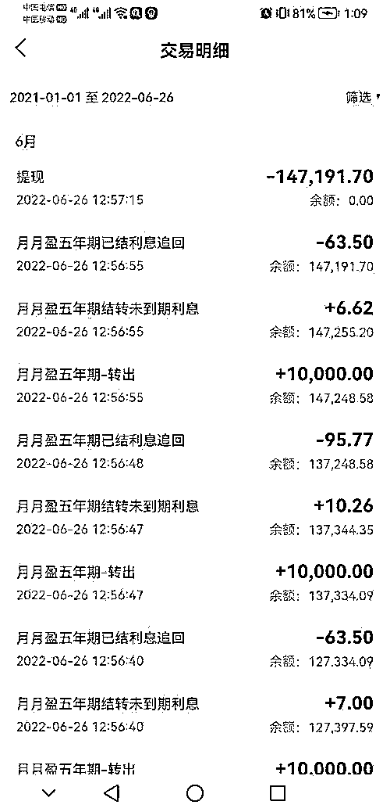
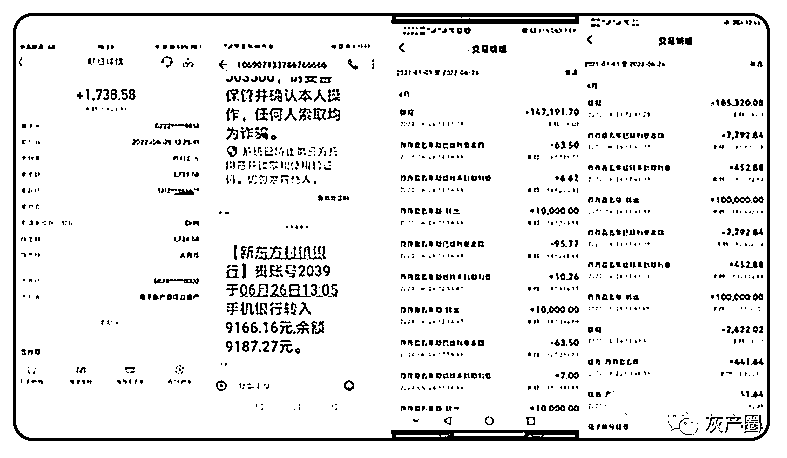
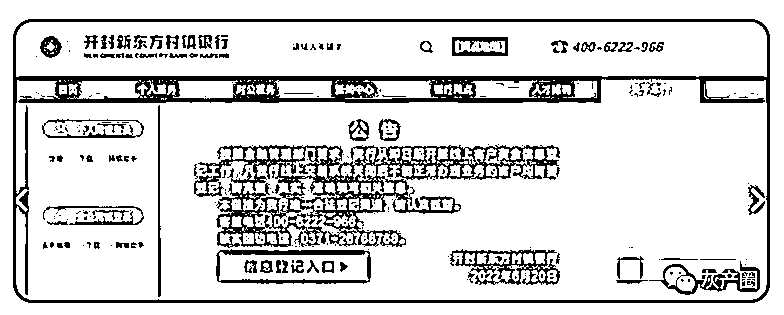

# 诡异！让关系户先走？河南一村镇银行能取钱了，限时 15 分钟！

> 原文：[`mp.weixin.qq.com/s?__biz=MzIyMDYwMTk0Mw==&mid=2247538722&idx=2&sn=63e58c845d59e183ccd03386bb005098&chksm=97cb931aa0bc1a0c4708d8bcf22001c497ae1971d19a900cf46f32ceff78e352d65c18021a35&scene=27#wechat_redirect`](http://mp.weixin.qq.com/s?__biz=MzIyMDYwMTk0Mw==&mid=2247538722&idx=2&sn=63e58c845d59e183ccd03386bb005098&chksm=97cb931aa0bc1a0c4708d8bcf22001c497ae1971d19a900cf46f32ceff78e352d65c18021a35&scene=27#wechat_redirect)

6 月 26 日，“河南村镇银行取款难”事件有了新变化，在多家涉事银行公告关闭线上交易系统的同时，开封新东方村镇银行突然开通线上交易系统。有储户统计，整个线上系统短暂开通约 15 分钟。

这次异动相当诡异，因为按照这件事的影响，以及这些所谓“取款难”银行理应被省市监管的严密程度，通常不应该发生“手机银行个别操作权限异常”的情况。两个月前，在河南数家村镇银行存了 400 亿元的 40 万储户收到通知，“线上交易系统关闭”，这系统忽然关闭、忽然开放的真实原因，人们很想知道。

储户交易记录

到目前为止，河南村镇银行的“取款难”问题始终云里雾里，储户和外界无法确切地知道事情原委。此前，许昌市公安局发过蓝底白字公告，查明吕奕“利用村镇银行实施系列严重犯罪”，因为案件尚未侦结，犯罪具体情节也不甚了了。河南省银保监局此前通知受害者登记资料，也没释放有用信息。

一边是个人及家庭生活陷入困顿、甚至不得不为重病母亲拔管不治的无助储户，另一边却是惜字如金、乃至于对事件定性含含糊糊的处置部门，这让整个事件显得相当怪异，像是故意要模糊受害者身份的样子。正在全民声讨，储户无处发泄愤怒与不安时，又出现了系统短暂开放的蹊跷事。

开封新东方村镇银行相关负责人回应此事

根据媒体报道，趁本次系统异动，确实有储户取出了少量利息。而有网友传言说，系统异常是为了“放关系户出逃”——这样的揣测没办法被证实，可以理解为一种调侃，也可以理解为“弱者的武器”，即通过恶猜银行的动机，倒逼银行及其主管部门调查真相、通报真相，提高整件事的透明度。

新东方村镇银行说要调查异常账户，取走的钱也要配合调查，问题是怎么“调查”？又要人家如何“配合”呢？“调查”是要列出并公开所有在这 15 分钟内取到钱的人吗？还是说，储户取到的钱全都要还回去，才算“配合”？一波未平一波又起，村镇银行搞出的幺蛾子，实在让人费解。

现在网友都在讨论在系统异常的 15 分钟牵扯了发生，又发生了什么。人们也在热议，趁系统“出错”取出的钱属于要被追缴的“赃款”，还是储户可以继续保有的合法存款？所有这些争议，都需要再查清异动的事实基础上去伪存真。毕竟来说，储户跟储户真的是完全平等的吗？存不存在有的储户可能比其他储户享有更多权利？

延伸阅读：河南一“取款难”村镇银行短暂开放提现，有人成功取钱，银行回应：取走钱的要配合调查

据天目新闻、海报新闻等报道，6 月 26 日，“河南村镇银行取款难”事件有了新的变化，在多家涉事银行公告关闭线上交易系统的同时，开封新东方村镇银行突然开通线上交易系统。一部分储户取钱成功，但是一部分储户欲提现的款项，已在当日晚间被该银行追回，取款并没有成功。

图据受访者

6 月 26 日，下午一点左右，李倩（化名）突然在群里看到有人说，开封新东方村镇银行的手机银行 App 可以进行转账了，她就把里面的利息转了出来。李倩告诉天目新闻记者，“但还没来得及转出余额，线上系统就被关闭了。”

同样把部分钱转出来的还有王颖（化名），她在接受天目新闻记者采访时表示，“我知道后，第一时间登录了 App，取了放在活期里的利息，果然可以。然后我又迅速转出了余下的 5 年期月付产品到活期，并从新东方二类卡活期转到了绑定的工行。不久，工行收到了新东方 App 里转出的钱。由于本金与利息是分开的，本金只转出了一部分，仍然还有 3 万多元的钱在里面没有全部提出来。”

天目新闻记者观察到，凡是半个小时左右到账的，基本都提现成功。而没有在短时间内及时到账的，多数都提示 " 交易冲正 "，款项被开封新东方村镇银行系统追回。

有储户统计，整个线上系统开通的时间大概在 26 日的 12：41 至 12：56 之间，持续大约 15 分钟。与此同时，开封新东方村镇银行官网仍挂着线上交易系统关闭的公告。

天目新闻记者致电开封新东方村镇银行，客服工作人员称，他们也是在储户致电银行之后才知道的这种情况，具体内情暂不清楚。银行系统是由技术部门来进行维护的，其他部门并不了解。若线上系统正式开通，会在第一时间于公众号或官网进行通知。

6 月 26 日下午，开封新东方村镇银行相关负责人回应此事时称，该情况系手机银行个别操作权限出现异常。发现异常之后，银行马上和相关科技公司取得联系，异常已经恢复，异常时间很短，在一个小时以内。对于在该时间内进行相关账户操作的部分储户，银行已经将异常账户罗列出来，会逐一进行审查，取走钱的也要配合调查。

图据开封新东方村镇银行官网

在此之前，6 月 20 日，多家涉事银行发布公告称即日起开展线上客户资金信息登记。包括禹州新民生村镇银行、上蔡惠民村镇银行、柘城黄淮村镇银行、开封新东方村镇银行。银行公告内容大致相同，即称，按照金融管理部门要求，该行从即日起开展线上客户资金信息登记工作，凡该行线上交易系统关闭后不能正常办理业务的客户均需登记，请完整、真实、准确填写相关信息。

6 月 23 日，银保监会副主席肖远企在“中国这十年”系列主题新闻发布会上回应河南个别村镇银行相关问题时表示，近期河南地方公安机关、地方金融监管部门已经就相关问题进行了通报，目前公安机关正在侦办，也抓获了一批犯罪嫌疑人，查封了一批涉案资产，银保监会继续配合地方党委政府做好相关工作，已经责成河南银保监局履行属地监管职责，依法保护广大人民群众合法权益。

“储户应随时关注涉事银行动态，及时核实自己账户资金状态，做好必要的配合工作。” 王德悦说道。

来源：每日经济新闻综合自天目新闻、海报新闻

](https://mp.weixin.qq.com/s?__biz=Mzg5ODAwNzA5Ng==&mid=2247487973&idx=1&sn=1b62da6f2018402862a5c375e10c355e&chksm=c06878b2f71ff1a4fbe7df4dec626aa7e696154751693bf16f6c6a302ceaa4d1959040c70518&scene=21#wechat_redirect)

← 向右滑动与灰产圈互动交流 →

