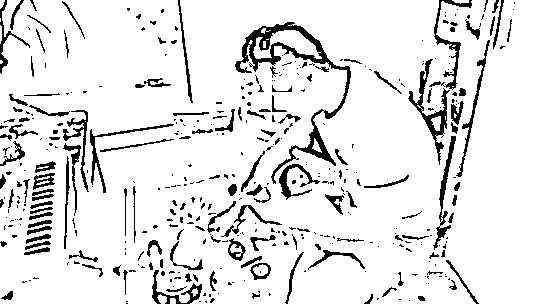
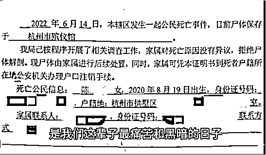
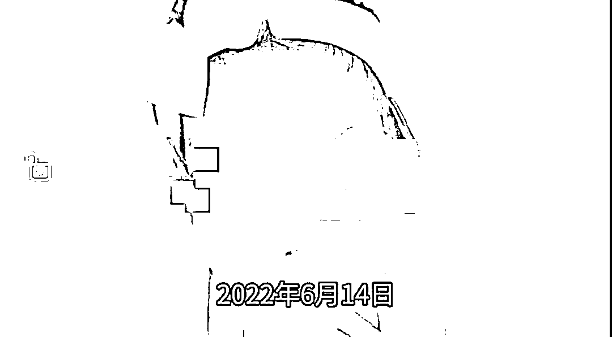

# 两岁女童被保姆遗留电梯后从八楼坠亡，监控拍下揪心一幕

> 原文：[`mp.weixin.qq.com/s?__biz=MzIyMDYwMTk0Mw==&mid=2247538722&idx=4&sn=f62106c1fcfa227d0859796d81bd565d&chksm=97cb931aa0bc1a0c5301eb60dbcf5807fd643d810a27d65261dbb17fe4b1a8cd0072d9a0aa8a&scene=27#wechat_redirect`](http://mp.weixin.qq.com/s?__biz=MzIyMDYwMTk0Mw==&mid=2247538722&idx=4&sn=f62106c1fcfa227d0859796d81bd565d&chksm=97cb931aa0bc1a0c5301eb60dbcf5807fd643d810a27d65261dbb17fe4b1a8cd0072d9a0aa8a&scene=27#wechat_redirect)

6 月 14 日，在浙江省杭州市，一保姆因粗心大意将女童遗留在电梯轿厢内，随后女童独自随电梯升到 8 楼后，从楼道窗户坠楼身亡。 

[`mp.weixin.qq.com/mp/readtemplate?t=pages/video_player_tmpl&action=mpvideo&auto=0&vid=wxv_2460180450359771137`](https://mp.weixin.qq.com/mp/readtemplate?t=pages/video_player_tmpl&action=mpvideo&auto=0&vid=wxv_2460180450359771137)

6 月 25 日，孩子父亲陈先生接受极目新闻采访时表示，这几天已经给孩子选好墓地。**陈先生说，没有过多的诉求，只是希望天下的家长、保姆都能关注到这个事情，引以为戒，不要再犯这种错误。** 

渉事保姆吴女士称，自己不是故意伤害孩子，这几天她也陷入了深深的自责当中，她会承担自己该承担的责任。

陈先生抱着女儿的玩具

**孩子消失半小时**

**在二楼平台被发现**

陈先生介绍，他家和孩子外婆家位于杭州市同一小区的同一栋楼，分属两个单元。

意外发生在 6 月 14 日晚。当时，陈先生在 3 楼的家里，还不满两岁的女儿则由保姆带着，从隔壁单元 15 楼的外婆家准备回家。

当天晚上 8 时许，陈先生接到了保姆的电话，说女儿找不到了。

陈先生挂了电话，马上赶到隔壁单元找孩子。听保姆说孩子自己可能到过这个单元的 8 楼，陈先生就跑到 8 楼去找。没有找到，陈先生再次询问保姆孩子可能在哪里，保姆又说在 1 楼。前后说法不一，陈先生不再信任保姆，他开始在整栋楼两个单元一层一层地找。

“我开始推测是保姆的同伙把孩子给抱走了，因为她到我家才 7 天。”担心“人贩子”一直躲在楼顶，陈先生冲到楼顶平台，但什么也没发现。

回到 8 楼后，陈先生一户户地敲门询问。其中一户的老人告诉他，确实听到小孩子哭得很大声，还说“刚才有个女的也上来找了”。

此时，陈先生有不祥的预感，便跑到一楼的草丛里找孩子。

草丛里没有，陈先生看到了二楼楼道窗户处往外伸出的窗台。他赶忙到二楼平台，将窗户推开，发现孩子躺在平台上。

此时，离孩子坠楼的时间已经过去了半个小时，人已经没了。

**孩子被遗留电梯后哭喊不止**

**监控记录揪心一幕**

6 月 25 日中午，陈先生在社交平台上发布了一段视频，该视频由装在电梯轿厢角落的监控摄像头拍摄，还原了事发经过。

这段监控视频显示，6 月 14 日 20 时 04 分，无人的电梯停在 15 楼。电梯门打开后，保姆提着一个滑板车，带着孩子进入电梯。

随后保姆摁下 1 楼按键，电梯下行，期间保姆一直在电梯内看手机。电梯来到一楼后，孩子似乎想去摸电梯按键。

电梯门打开，保姆说：“摸那么多干嘛呢，会有危险的。”20 时 05 分 13 秒，保姆便带着滑板车走出了电梯。电梯门即将关闭时，保姆回头看了一眼，发现孩子并未跟出来，她尝试用滑板车挡住电梯门，但已经来不及。

就这样，孩子一个人被关在了电梯里，她随后嚎啕大哭，一直哭喊着。20 时 05 分 50 秒，电梯开始上行，到 8 楼后，电梯停止。20 时 06 分 07 秒，电梯门打开，孩子从电梯跑出，进入楼道，最后消失在镜头里。从孩子被关电梯，到上到 8 楼从电梯离开，整个过程约 1 分钟。

陈先生介绍，当时女儿为了找保姆，爬上了 8 楼楼道边 45 厘米高台阶的窗户，之后坠落在二楼平台。

**保姆称很自责，****会接受惩罚**

**6 月 25 日下午，面对网络铺天盖地的谩骂，保姆吴女士告诉极目新闻记者，确实是她大意了造成了不可挽回的后果，但她不是故意想要伤害孩子。**

**吴女士说，出电梯时，孩子摸了下按键面板，也分散了一下她的注意力。**

**吴女士告诉极目新闻记者，电梯门关了之后，她心里很慌，马上按了电梯键，上下两个键都摁了，但是开门的却是另外一个电梯轿厢。她没有想到其它办法，只是在原地等待，看孩子在的这个电梯会上到几楼。**

**发现电梯停靠 8 楼后，吴女士随后也上了 8 楼，但没有找到孩子，就给孩子爸爸打了电话，说孩子不见了。**

**吴女士称，她从 10 多年来断断续续做过保姆，6 月 6 日，她通过了孩子父母的面试，8 日开始去照顾孩子。**

**“我这几天几乎崩溃了，我要是用什么能够换回孩子的命，我都愿意。”吴女士说，她不想再辩解什么，公安机关对她也已经做了笔录，她会接受“惩罚”，等待法律的制裁。**

****

**孩子的信息**

****律师：保姆涉嫌过失致人死亡罪****

**在社交平台，这几天，陈先生发了多段怀念女儿的短视频。**

**女儿天真烂漫的笑脸，陈先生和女儿做游戏的合影，太多的记忆涌入陈先生和妻子的心头。悲伤过后，众多网友也在评论区安慰陈先生：“就当女儿去了天堂，没有伤痛，那个每天都开心的天堂。”**

**在视频中，陈先生还提出，楼道窗户的台阶只有 45 厘米高，孩子可以轻松地爬上去；对开的推拉窗户缝隙过大，孩子一个翻滚就能翻出窗外。女儿就是从这个窗户掉下去的。**

**6 月 25 日下午，陈先生告诉极目新闻记者，这几天，已经给女儿找好了墓地。之后，他会追究相关方面的责任。现在，他只想让更多的人知道、了解这个事情，让无论是家长还是保姆都能关注到这个隐患，不再让这种悲痛的事情发生。**

****

**女童生前照片**

**江苏法德东恒律师事务所合伙人蓝天彬律师认为，该保姆涉嫌过失致人死亡罪，她应当预见自己的行为可能造成他人死亡的结果，由于疏忽大意而没有预见，以致造成他人死亡。根据《刑法》规定，过失致人死亡的，处三年以上七年以下有期徒刑；情节较轻的，处三年以下有期徒刑。** 

**本案是否起诉，是否判缓刑或实刑，有待于司法机关综合事实和证据而定，也要看女童父母是否谅解。另外，湖北易圣律师事务所合伙人律师袁三慧认为，保姆带孩子时，是孩子的看护人，因粗心大意导致孩子坠楼，保姆没有尽到看护照顾的义务，保姆或其所属的家政公司应该承担赔偿责任。**

**来源：极目新闻 中国青年网微信（ID：youthzqw）责编：曾繁华 审核：张玘云  复核：王海**

******](https://mp.weixin.qq.com/s?__biz=Mzg5ODAwNzA5Ng==&mid=2247487973&idx=1&sn=1b62da6f2018402862a5c375e10c355e&chksm=c06878b2f71ff1a4fbe7df4dec626aa7e696154751693bf16f6c6a302ceaa4d1959040c70518&scene=21#wechat_redirect)**

**← 向右滑动与灰产圈互动交流 →**

****