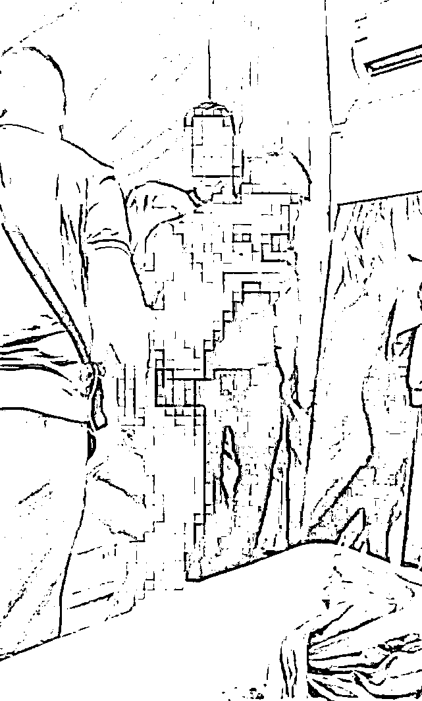
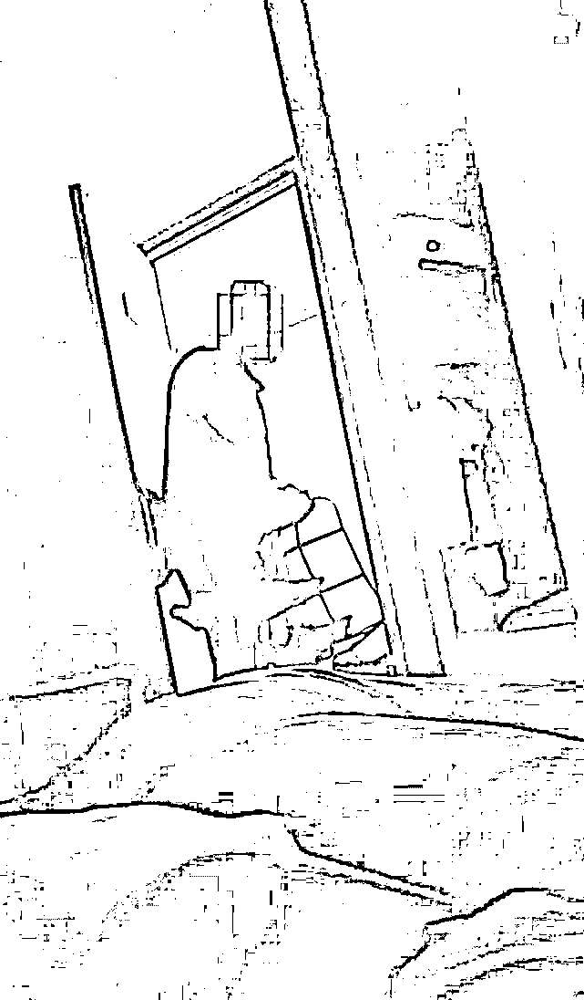
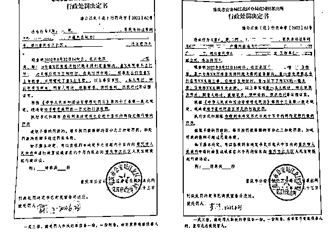
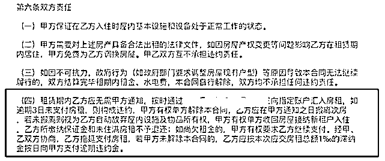
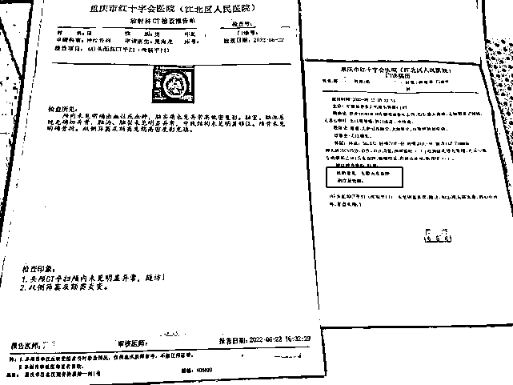

# 情侣出租屋内遭中介掀被子催租 中介称对方违约在先

> 原文：[`mp.weixin.qq.com/s?__biz=MzIyMDYwMTk0Mw==&mid=2247538722&idx=5&sn=abba172d2da484c55e870d4c71542914&chksm=97cb931aa0bc1a0c2e456671ad481792c8e1f9e18154d941a3dc5c59801ebd8d07de8ee93532&scene=27#wechat_redirect`](http://mp.weixin.qq.com/s?__biz=MzIyMDYwMTk0Mw==&mid=2247538722&idx=5&sn=abba172d2da484c55e870d4c71542914&chksm=97cb931aa0bc1a0c2e456671ad481792c8e1f9e18154d941a3dc5c59801ebd8d07de8ee93532&scene=27#wechat_redirect)

6 月 22 日，正与女友在出租屋内睡觉的重庆市民陈先生，遭遇了惊魂一幕。 

[`mp.weixin.qq.com/mp/readtemplate?t=pages/video_player_tmpl&action=mpvideo&auto=0&vid=wxv_2461508240304635904`](https://mp.weixin.qq.com/mp/readtemplate?t=pages/video_player_tmpl&action=mpvideo&auto=0&vid=wxv_2461508240304635904)

陈先生称，当天中介人员在未得到允许的情况下，擅自闯入卧室，掀开自己及女友的被子，要求他们搬离房间。其间，中介人员还殴打了自己，最后导致双方互殴。

租客陈先生与中介发生冲突

据悉，双方因房屋退租问题未得到妥善解决，从而引发矛盾。

**6 月 23 日，警方根据治安管理处罚法相关规定，对陈先生和董某分别给予罚款 100 元和 500 元的行政处罚。**

租客称出租屋内遭中介掀被殴打

6 月 22 日下午 2 时许，租住在重庆市江北区一小区的陈先生与女友正在家中睡觉，突然间，有 4 名中介人员以催缴房租为由进入其卧室内。陈先生称，其中 1 人还在其女友没穿衣服的情况下，强行掀被子，还殴打自己。

从陈先生提供的视频中可以看到，事发时出租屋外传来一阵急促的敲门声，随后房门被打开。一名戴眼镜的男子朝屋内看了看，询问陈先生当天交不交房租，并称当天交不了房租，房子肯定住不了。陈先生以房租未到期为由予以反驳，并称自己不续租了。

在听到陈先生不续租的回答后，那名戴眼镜的男子开始将陈先生房间内的鞋架扔到屋外，并上前暴力拉扯陈先生所盖的被子，这时，视频中传来一名女子的叫声，陈先生起身反抗却被戴眼镜的男子打倒后按倒在床上，随后视频画面一片漆黑，传来双方争执的声音。

中介人员董某扔陈先生物品

陈先生女友拍摄的另一段现场视频显示，穿着内裤的陈先生与戴眼镜的男子抱打在一起，随后陈先生被推倒在床上，期间，戴眼镜的男子让陈先生的女友把手机收起来。记者注意到，视频中，还有其他三名男子进入到房间内，但当时并未动手。

事后，陈先生报警处理此事。记者从警方出具的两份行政处罚决定书中了解到，陈先生与戴眼镜的男子董某因房屋退租问题未得到妥善解决。**6 月 23 日，警方根据治安管理处罚法相关规定，对陈先生和董某分别给予罚款 100 元和 500 元的行政处罚。**

警方出具的行政处罚决定书

双方冲突因房屋退租矛盾所致

6 月 26 日，当事人陈先生向记者讲述了发生此次冲突的原委。

“我是今年 4 月 18 日和中介签的一年的租房合同，交了 3 个月的房租和 1 个月的押金，按理说应该是到 7 月 18 日，这一个季度的房租才算到期。可在本季度房租到期前一个月的 6 月 19 日，房屋管家就提出要缴纳下个季度的房费。”陈先生说，如果 6 月份不交下个季度的房租，中介方就要求自己提前一个月搬走，对此他不能接受。

**6 月 20 日，双方因此事协商未果报警处理，但警方让私下解决。之后两天，就发生了中介闯入卧室的事情。**

记者从陈先生与中介签订的租房合同中看到，双方约定的租赁起止时间为 2022 年 4 月 18 日至 2023 年 4 月 21 日，租金付款方式为押一付三，陈先生应根据每期固定 18 号收租（每期提前一个月）的支付方式，分别于 2022 年 4 月 18 日，2022 年 6 月 18 日，2022 年 9 月 18 日，2022 年 12 月 18 日，2023 年 3 月 18 日支付该房屋租金及每月周期费用。

租房合同细则

此外，**合同中约定，租赁期内租客应无需甲方通知，按时向指定账户汇入房租，如逾期 3 日未支付房租，则构成违约，甲方有权单方解除本合同，租客应在甲方通知之日搬离此房，若未搬离则视为租客自动放弃屋内设施及物品所有权，甲方有权单方收回房屋接纳新租户入住，租客所缴纳保证金和未住满房租不予退还。**

对于上述合同规定，陈先生称，当时租房时比较匆忙，没有细看具体条款。但他认为，对方制定的合同属于不利于租客条款，合同的合理性存疑。此外，对方冲进房屋扔东西的行为不合法，这种暴力行径不能接受。

中介人员称被租客“套路”

26 日上午，记者联系到了中介公司的员工董某。

“22 号下午，我在房间门口敲门等待 5 分钟，他隔着屋门，对我进行了各种人格侮辱和言语辱骂，故意激怒我。”董某说，当他准备开门进屋时，发现门并没有上锁，门打开后，他并没有直接进屋，而是站在门口和陈先生理论，“他趁着屋内光线黑暗，故意挑逗，引诱我做出了过激行为，并偷偷地录像。”

对于董某所称的辱骂行为，陈先生则表示，对方每次敲门，自己都有作出回应，并未对其辱骂，也没有允许对方进入房间。

董某称，因为屋内黑暗，他去摸门口灯的开关，没有找到，“我去拽被子时候，才发现床上还躺着一个女孩，而不是我知道床上有一个女孩才去拽被子的，这个时间前后顺序很重要。”董某说，陈先生看到他拽被子后，就立马扑过来，随后双方扭打在一起。

租客陈先生医院检查报告

“在警察的协调下，我已答应退还陈先生的押金和房租，但遭到了陈先生的拒绝。他以录有视频、要对我和公司进行网暴为由，张口就索要 5 万元封口费。”董某称。

对此，陈先生表示，当时他是曾提过 5 万元的赔偿，不过目前还要看伤情的鉴定，觉得 5 万块钱太便宜他们了。

“我已经认识到了错误，冲动是魔鬼，打架解决不了任何问题。但这件事情不能断章取义。”董某表示，此事警察已经处理完毕，陈先生如有异议，完全可以通过法院解决，另外他也会保留自己的诉讼权利。

律师：中介应采取合理方式清退

陈先生向记者表示，他要求对方向自己当面赔礼道歉，赔偿医药费、误工费以及他和女友的精神损失费等费用，具体金额还没有确定。

26 日，记者也就此事联系了处理此事的辖区派出所，但未获回应。

对此，北京大成（武汉）律师事务所柴欣律师向记者表示，依据陈先生和中介签署的房屋租赁合同的规定，陈先生有按时提前预付房租的义务，如陈先生逾期支付房租超过 3 日的，构成违约，出租方有权单方解除合同，承租方应在接到出租方的通知当日搬离房屋。**因而，在陈先生逾期支付房租超过 3 天的情况下，中介方的确有单方解除合同并追究陈先生违约责任的权利。**

柴律师解释，陈先生违约不想续租后，中介按照合同约定，提前一个月清退，加上一个月的押金，便达到了两个月租金作为违约金的目的。**但清退需要通过单方通****知的方式单方解除租赁合同，在中介没有进行必要的单方通知解除之前，即便陈先生违约，中介方也无权强行闯入房间对陈先生进行驱赶，只有在中介方尽到单方通知解除义务后，双方的租赁合同才正式解除，中介方才享有将陈先生“驱离”的权利，即便如此，中介在对陈先生进行“驱离”的时候，仍有义务保护当事人隐私，采取必要合理的方式，不可采取暴力手段，也必须要给陈先生预留合理必要的时间。**

对于中介在收房前是否下达过解除租赁合同的通知，当事双方各执一词，陈先生称并未收到正式的通知，而中介方则表示曾让相关工作人员下达过通知。但截至记者发稿，双方暂未提供支持各自观点的证据。

柴律师还提到，针对房屋租赁合同约定，陈先生违约需要赔付两个月租金作为违约金，此项约定为租赁合同常见条款，属于有效约定，但法律规定约定的违约金必须以实际损失为准，一般约定的违约金不能超过实际损失的 30%，否则一方当事人可以申请法院下调违约金。

来源：极目新闻

](https://mp.weixin.qq.com/s?__biz=Mzg5ODAwNzA5Ng==&mid=2247487973&idx=1&sn=1b62da6f2018402862a5c375e10c355e&chksm=c06878b2f71ff1a4fbe7df4dec626aa7e696154751693bf16f6c6a302ceaa4d1959040c70518&scene=21#wechat_redirect)

← 向右滑动与灰产圈互动交流 →

