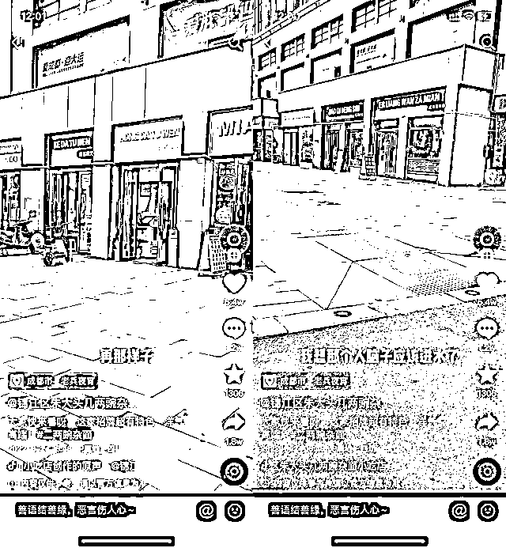
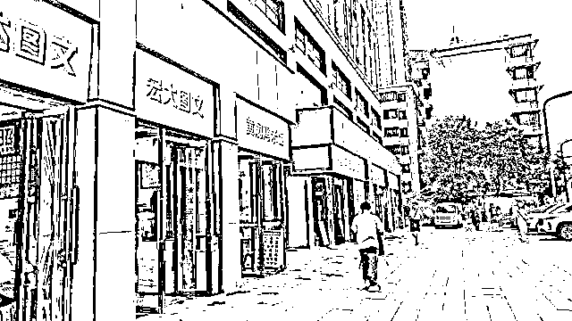
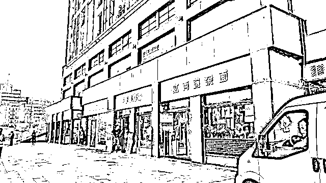

# 成都多家门店招牌被改拼音，又连夜改回

> 原文：[`mp.weixin.qq.com/s?__biz=MzIyMDYwMTk0Mw==&mid=2247538722&idx=7&sn=674133fe3a1a709c733ae072cf96ea7f&chksm=97cb931aa0bc1a0ccccacd381331922bd96bf0a9f09eb66270d5bd3c3988fea1518a45b8e83b&scene=27#wechat_redirect`](http://mp.weixin.qq.com/s?__biz=MzIyMDYwMTk0Mw==&mid=2247538722&idx=7&sn=674133fe3a1a709c733ae072cf96ea7f&chksm=97cb931aa0bc1a0ccccacd381331922bd96bf0a9f09eb66270d5bd3c3988fea1518a45b8e83b&scene=27#wechat_redirect)

6 月 27 日上午，针对受到舆论关注的成都锦江区牛王庙路口东恒灯具城**多家商铺店招“被更改”为拼音店招一事**，海报新闻记者从当地知情人士获悉，**涉事的面店、酒店等七家商铺已经更改为临时的纯汉字店招**，下一步有关部门将委托制作固定的店招。针对“拼音店招”是否为涉事商家所称是当地街道办统一更换，属地的牛市口街道办相关工作人员没有作出明确回应。

<mpvideosnap class="js_uneditable custom_select_card channels_iframe videosnap_video_iframe" data-pluginname="videosnap" data-id="export/UzFfAgtgekIEAQAAAAAA_FYjY2jVhAAAAAstQy6ubaLX4KHWvLEZgBPElKMEBhQjY4yDzNPgMIvrfnpyGWokLxLnuELka5ae" data-url="https://findermp.video.qq.com/251/20304/stodownload?encfilekey=rjD5jyTuFrIpZ2ibE8T7YmwgiahniaXswqzDAiaRS7pDbhDBxibN8HeiboX4icP5PolR1L7E1cibGJnuZ7sDAueNJUSicnvGf6RuX2icSrS4DMSRzhVCpsRBnyhibpEew&amp;adaptivelytrans=0&amp;bizid=1023&amp;dotrans=0&amp;hy=SH&amp;idx=1&amp;m=&amp;scene=0&amp;token=AxricY7RBHdWSnepRoG3DFOcIAoTW3mzavjO1mCgmmgC3OVZwcasbBFT6fuEDHLEiaXYJ7DKLLDj0" data-headimgurl="http://wx.qlogo.cn/finderhead/ibq4aVwOt6HNqrr8OD3sCviaytF3B8TqCwHicxsuIanAJo/0" data-username="v2_060000231003b20faec8c6e48a1acbd3ce04ef33b077a1e41d0d3794ed88ea537878dbe65910@finder" data-nickname="灰产圈+" data-desc="【#成都被改拼音招牌连夜换回汉字# 官方：事发原因仍在调查中】 #街道办回应沿街门店招牌被改成拼音版#近日，有网友爆料四川成都锦江区牛王庙多家临街商铺招牌从去年开始“被更改”为统一的拼音字母，引发热议。6 月 27 日，涉事的面店、酒店等 7 家商铺均已连夜更改为临时的纯汉字店铺招牌。有店主解释 26 日事件发酵后，当地街道办已主动协商，下一步有关部门将委托制作固定的店招。此前当地街道办城管工作人员曾明确称，是因为“整个一环路市井生活圈打造”而更改。但成都市锦江区有关部门表示，目前对于事发原因仍在进一步调查，暂未有明确回应@灰产圈+ " data-nonceid="3016306023832661785" data-type="video" data-width="1920" data-height="1080"></mpvideosnap>

6 月 26 日上午，某社交平台上开始流传一段自称商户的网友拍摄的视频，称自己经营的面店店招一年前被强行从汉字店招更改为了拼音店招，而自己经营的商铺是售卖豌杂面的，根本不需要使用拼音店招，但她仍然被要求配合使用拼音店招。该店主发布的视频显示，其店招为“贰两豌杂面”的拼音版本“erliangwanzamian”，其附近店家也有多家店面的店招变成拼音版本。

前述店主口述店招被改拼音的视频经过网络传播后，引发了网友热议。海报新闻记者了解到，更换店招的店铺共有七家，经营地址位于成都市锦江区一环路牛王庙路口的东恒灯具城，相关商铺均有较长的经营时间。有当地媒体曾报道，当地曾在 2020 年底开始进行“一环路风貌整治工程”，对涉事店铺门前的道路进行包括立面环境、商业风貌等方面的统一改造。

6 月 27 日上午，海报新闻记者从当地知情人士处了解到，店招改名拼音被上传致网络引发舆情后，**被店主拍摄视频吐槽的拼音店招已经被临时替换为纯汉字店招。**贰两豌杂面店店主在短视频平台发布视频称，26 日发布视频以后，街道办已经主动同涉事店主进行了协商，提出了更换原拼音店招为纯汉字临时招牌的方案，**并已经在当天凌晨连夜整改完毕**，“中文字比以前显眼得多。”该店主表示。

值得注意的是，对于更改店招的原因，上游新闻曾报道，属地街道办的城管工作人员曾出面明确称是因为“整个一环路市井生活圈打造”而更改，但具体原因其并不清楚。海报新闻记者则从锦江区相关部门工作人员处了解到，**牛王庙相关 7 家商铺店招被更改为了拼音店招确有其事，**当地的确在 2021 年初开始进行了风貌整治，但目前还不确定市井生活圈整治与店招改名拼音是否有关系，目前仍在进一步核实中。

来源：海报新闻 记者：邓波

](https://mp.weixin.qq.com/s?__biz=Mzg5ODAwNzA5Ng==&mid=2247487973&idx=1&sn=1b62da6f2018402862a5c375e10c355e&chksm=c06878b2f71ff1a4fbe7df4dec626aa7e696154751693bf16f6c6a302ceaa4d1959040c70518&scene=21#wechat_redirect)

← 向右滑动与灰产圈互动交流 →

