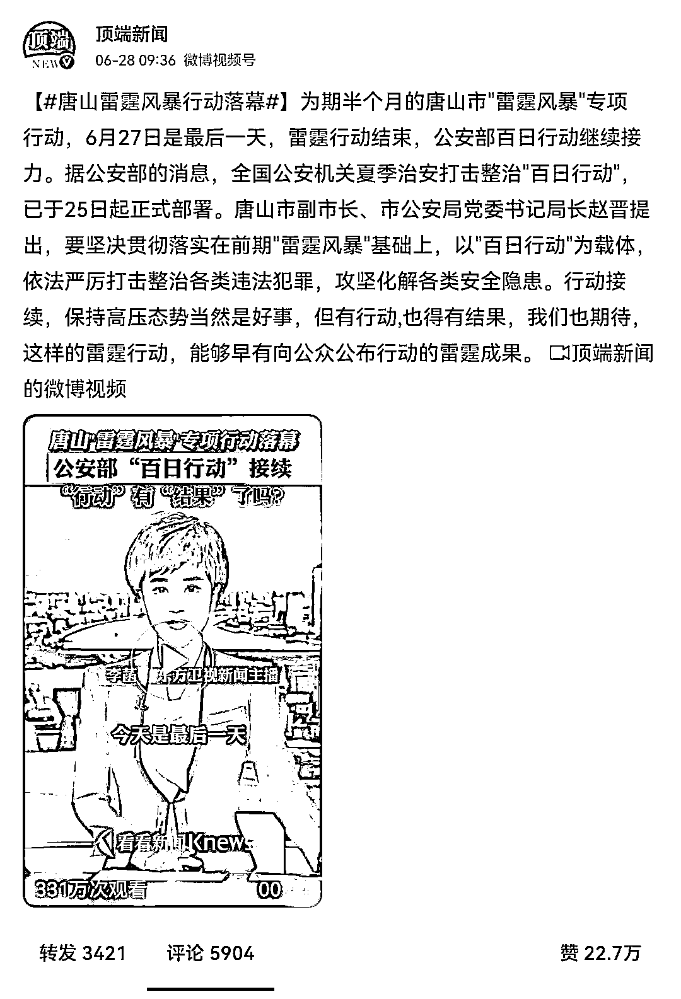
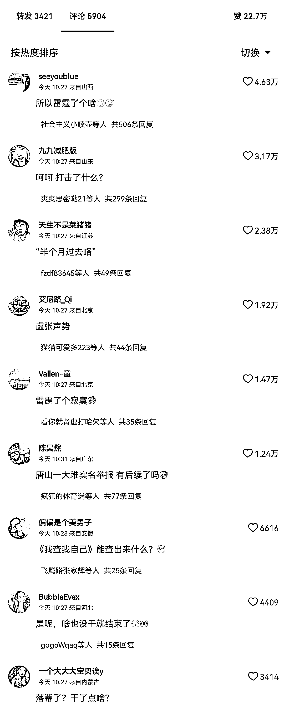

# 唐山雷霆风暴行动落幕，结果如何？

> 原文：[`mp.weixin.qq.com/s?__biz=MzIyMDYwMTk0Mw==&mid=2247538787&idx=2&sn=3665d448b9d678c1d664aee0723b2f6b&chksm=97cb935ba0bc1a4d834a415083da86503a28d441b2481f3cbb662362da13416c3a1a48aa38a2&scene=27#wechat_redirect`](http://mp.weixin.qq.com/s?__biz=MzIyMDYwMTk0Mw==&mid=2247538787&idx=2&sn=3665d448b9d678c1d664aee0723b2f6b&chksm=97cb935ba0bc1a4d834a415083da86503a28d441b2481f3cbb662362da13416c3a1a48aa38a2&scene=27#wechat_redirect)

据媒体报道，为期半个月的唐山“雷霆风暴”专项行动，已于昨日正式结束。 

公安部百日行动将继续接力。

于我而言，虽然我愿意相信为期半个月的专项行动，已经取得了相当的收获。

但粗略扫了眼相关词条，目之所及的情绪几乎都是不满与抱怨。

为什么会这样呢？

<mpvideosnap class="js_uneditable custom_select_card channels_iframe videosnap_video_iframe" data-pluginname="videosnap" data-id="export/UzFfAgtgekIEAQAAAAAAl_823moQcQAAAAstQy6ubaLX4KHWvLEZgBPEl6N8b0JkfI-DzNPgMIsv7BV9V54_kFcZGegJcioi" data-url="https://findermp.video.qq.com/251/20350/stodownload?encfilekey=Cvvj5Ix3eexKX1zo1IZZBrQomawdVfSQH1uu2U31EqESEY9MJ1ibZfCgboay7C9HVBI4oHQSXz1n7hUBRw55NybBj6JiawqAqKicYqicp27oe2BSgUQvSLqNFBhHpyhq5aCo17hNUYzESdVTXHOmLz6qIDnQlw6Dib91pItibOdeWTqfg&amp;adaptivelytrans=0&amp;bizid=1023&amp;dotrans=0&amp;hy=SH&amp;idx=1&amp;m=57d0c74f38367593581e512449163c35&amp;token=AxricY7RBHdUdiaP9V5jTibMdwXOHknxRrKKYLCvjjkHzD9cR1NhaVfXj3EC9ntgL8ia1OjLLfX1DUc" data-headimgurl="http://wx.qlogo.cn/finderhead/Q3auHgzwzM6mnBNfbibG9BSVYIqMibib3Buf74TGoO6DTtUuTRHTMKDYw/0" data-username="v2_060000231003b20faec8c6e58111c4ddc901ed37b077b583e2afaf2669f6c4edb9a669e9383e@finder" data-nickname="拆台 CT" data-desc="#唐山雷霆风暴行动落幕 ，官方应及时披露进展及成果" data-nonceid="16703186771976534958" data-type="video" data-width="1920" data-height="1080"></mpvideosnap>

**         拆台 CT****该视频号动态不可引用******         拆台 CT********该视频号动态不可引用****

****我们都知道，主导舆论场的首先是情绪，其次才是真相。****

****这也就是说，公众情绪这道关，无论如何都必须守好。****

****试问，在唐山打人事件上，最重要的公众情绪是什么？****

****毫无疑问是有黑必除、有恶必扫。****

****翻阅过往报道，有关唐山雷霆风暴的直接及间接热搜，其实上了许多，尤其是举报电话打不通和信访大厅门口排长队这两件事情，更是给足了大众期待。****

****换言之，大众迫切希望看到相关结果。****

****然而，现在的情况又是怎样的呢？****

****除了紧随其后的蛋糕店事件和酒吧事件，唐山雷霆风暴事件在舆论场上便再无成果。****

****给出了相当高的预期，却没有匹配相应的成果，大众心里的失落自然是难免的。****

****在《舆论引导三问》里，我曾直言不讳道，**“舆论引导不仅仅是引导，靠说更要靠做”，“没有说只有做，做了等于白做；没有做只有说，越说民愤越大”。******

****虽然，我是说虽然，专项行动持续半月之久，不可能半分成果没有，但官方保持缄默，即便成果斐然，也是徒劳无功。****

****说起来，早在丰县铁链女事件的最终处理结果公布前，我就曾给出过提醒。****

****我当时说，丰县铁链女事件发酵至今，大众的期盼已经远远超脱丰县，而朝着更高层面进发。****

****我当时的建议是，江苏必须部署开展专项行动，全面排查整治类似问题，不能光发个通知告诉大众就完事了，更重要的是得把自己做的事情说出来。****

****说到底，只有做了并且说出来，让大众切实认识到江苏确实在行动，才有可能挽救岌岌可危的口碑。****

****否则的话，大众的印象只能停留在这份通报，而这份通报解决的问题相当有限。****

****以此观之，唐山打人事件的经验教训亦是如此。****

****总而言之，我还是那句话：情绪必须在事实之前。****

****尤其是诸如唐山打人事件之等超级舆情，官方务必要隔三岔五放出些无关机密的进展，以证实自己还在办案。****

****千万千万不要只埋头做事。****

****且不说能否一击翻盘，就算可以，由于事件热度的逐步下降，最终结果的覆盖程度大概率也不如最开始。****

****归根结底，舆论解构的关键在于当初如何建构，怎么建构就怎么解构。****

****既然当初的热度是一个一个词条堆上去的，那么，后续的处理也该由一个一个词条堆砌。****

****不要害怕上热搜。****

****后续关于严惩的热搜越多，对地方形象的修复就越有利。****

****六月二十八日。****

****来源：拆台****

************](https://mp.weixin.qq.com/s?__biz=Mzg5ODAwNzA5Ng==&mid=2247487973&idx=1&sn=1b62da6f2018402862a5c375e10c355e&chksm=c06878b2f71ff1a4fbe7df4dec626aa7e696154751693bf16f6c6a302ceaa4d1959040c70518&scene=21#wechat_redirect)****

****← 向右滑动与灰产圈互动交流 →****

********