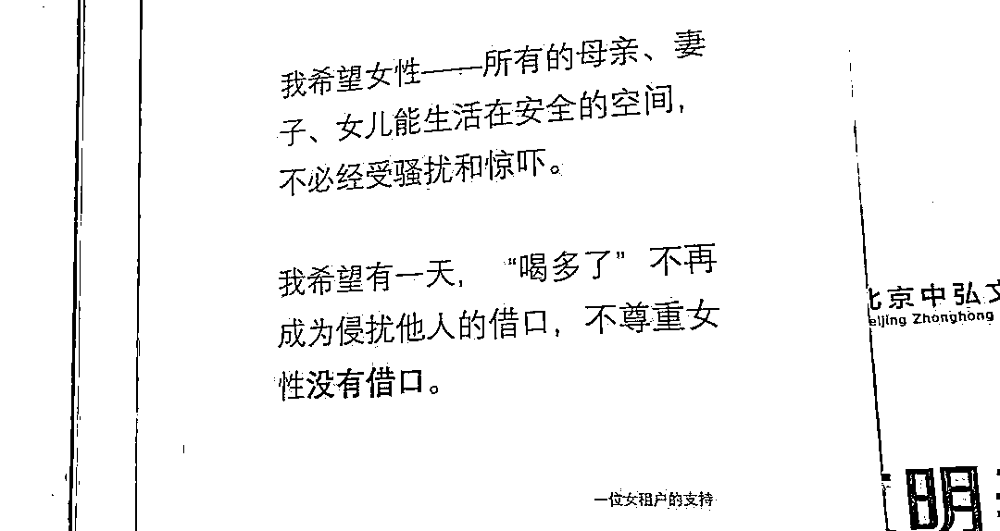
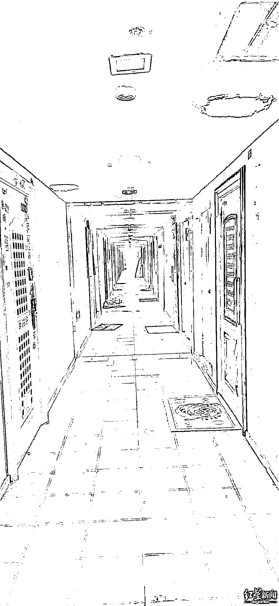
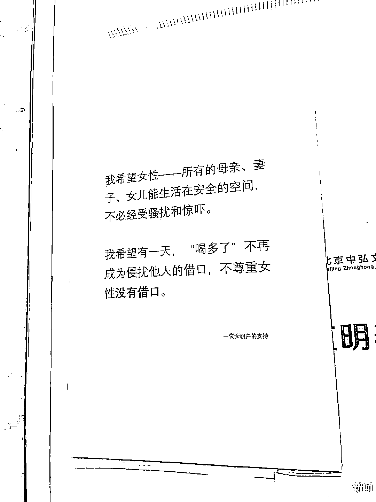

# 陈霄华被刑拘，友人称多次看到他醉酒后脱衣

> 原文：[`mp.weixin.qq.com/s?__biz=MzIyMDYwMTk0Mw==&mid=2247538787&idx=3&sn=23343ffe7be919fe5689730cc9b6f7d4&chksm=97cb935ba0bc1a4dce8578ae9dcbeb91e2ff240576ded489d314d951eacbef8ac6b9e05e95d7&scene=27#wechat_redirect`](http://mp.weixin.qq.com/s?__biz=MzIyMDYwMTk0Mw==&mid=2247538787&idx=3&sn=23343ffe7be919fe5689730cc9b6f7d4&chksm=97cb935ba0bc1a4dce8578ae9dcbeb91e2ff240576ded489d314d951eacbef8ac6b9e05e95d7&scene=27#wechat_redirect)

本文转载自红星新闻

6 月 27 日晚，据平安北京朝阳通报，德云社原艺人陈霄华被刑拘。

据此前报道：6 月 26 日晚，网传德云社艺人陈霄华凌晨闯入他人卧室，涉嫌猥亵一女住户未遂，被警方带走。27 日上午，德云社微博就此事发文称，接到警方协助调查电话，可基本确定陈某（艺名“陈霄华”）涉嫌擅闯他人住宅，已辞退陈霄华，并向受害人诚恳致歉。

**事发小区大堂电梯等多处监控停用**

**受害女生：希望此事能推动小区设置监控**

根据网传女事主的文章描述，陈霄华在一楼电梯口脱光衣服后又乘电梯上五楼。警方通报证实了这点。不少网友质疑，在这五层楼的时间里，为什么电梯监控没有发现，物业又去哪儿了？

事实上，红星新闻记者走访事发小区时发现，小区大堂、电梯、走廊的监控均处于停用的状态，更没有物业工作人员专门盯监控。物业值班工作人员告诉红星新闻记者，由于缺乏公共维修资金，近期内只能承诺先恢复大堂监控，以现有资金维护电梯、楼道监控和门禁，并不现实。

受害女生所居住的小区 5 层楼道

就此，受害女生告诉红星新闻记者，像素小区的综合治理中心并不是专业的物业团队，而是居民自发成立的委员会，解决问题不如专业物业周全。在报案后，有警察向该名受害女生表示，警方已向乡政府提出完善像素小区的监控设施并申请费用。“如果因为我这个事情的推动，今年的监控完善能得到回应，这是一个好事儿。”

对于受害者的说法，红星新闻记者也在走访过程中了解到，小区内多名住户、商户都因此积累了很多不满。一位业主告诉红星新闻记者，物业没有资金，所以不能好好工作。业主们因为物业无所作为，不愿意交物业费。因此，二者陷入了恶性循环，而这个恶性循环需要被打破。

6 月 27 日下午，一名与受害女事主住在同一楼栋的居民向红星新闻记者发来一张楼栋电梯内新张贴的图片。图片中写道：“我希望有一天，‘喝多了’不再成为侵扰他人的借口，不尊重女性没有借口。”

小区居民发来的 10 号楼电梯间照片

**陈霄华友人：**

**曾多次看到其醉酒后脱衣**

该事件经过舆论发酵后，迅速引发社会关注。6 月 27 日晚间，一位自称是陈霄华朋友的张先生在接受红星新闻记者独家采访时表示，事发前夕（6 月 24 日晚），张先生和陈霄华同在事发 10 号楼 14 层聚餐饮酒，当时一起的还包括赵女士和李先生。

张先生称，陈霄华经常喝酒后就像变了一个人，喝醉酒以后，会陷入“无意识的一种状态”。他表示自己曾多次看到陈霄华酒后脱光衣服，甚至出现过酒后在德云社的宿舍衣柜里排泄。

张先生、李先生以及赵女士共同介绍说，当天一行朋友在聚餐中喝掉了 30 多罐 500ml 的啤酒，另还有四瓶半洋酒。散场后，住在 10 号楼的朋友一起将住在该楼栋外的朋友们送至一楼。但当朋友试图送陈霄华回三楼家中时，陈已经处于酒后精神异常状态，拒绝友人送其回家，并出言辱骂说“滚”。因此，朋友们也对陈酒后的异常状态十分不满，因此在一楼放任陈霄华自己回家。

“他明知道自己酒品差，却又一直在喝酒，我们都知道他早晚要为此付出代价。”李先生说。

自称是陈霄华朋友的赵女士告诉红星新闻记者，在她看来，受害女生自述中提到的“真不错啊”“在这儿等着我呢”两句话是陈霄华的口头禅，且是相声中的行话，但“这两句话拼凑在一起产生了其他意味”。

红星新闻记者检索陈霄华发布过的 599 条微博发现，在过去一年内，陈霄华曾发过三条内容有关“真不错啊”的微博，分别是“萨勒芬妮真不错啊”“新箱子真不错啊”和“真不错啊”，以及一条“我丢~你生日等着我的~”与德云社其他艺人微博互动。

张先生等人表示，他们一直到第二天知道有警察过来以后，才知道出事了，“他明知道自己喝醉酒会有这样的状态，但自己还是会去喝酒、会去喝多。这种行为就是他的错”。

（应受访者要求，文中张先生、李先生、赵女士为化名）

来源：红星新闻    编辑：向由 排版：文月

](https://mp.weixin.qq.com/s?__biz=Mzg5ODAwNzA5Ng==&mid=2247487973&idx=1&sn=1b62da6f2018402862a5c375e10c355e&chksm=c06878b2f71ff1a4fbe7df4dec626aa7e696154751693bf16f6c6a302ceaa4d1959040c70518&scene=21#wechat_redirect)

← 向右滑动与灰产圈互动交流 →

