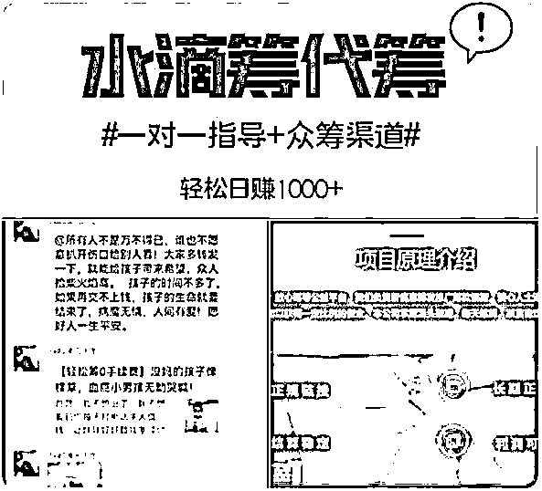

# “职业筹款人”抽走 7 成救命捐款，这还算哪门子慈善？

> 原文：[`mp.weixin.qq.com/s?__biz=MzIyMDYwMTk0Mw==&mid=2247538787&idx=4&sn=6c1934c0114a01b22e5c087d0f63a49e&chksm=97cb935ba0bc1a4da1e3128286eaa08ab621615d62d8207ee74e991a828953bec341d223b496&scene=27#wechat_redirect`](http://mp.weixin.qq.com/s?__biz=MzIyMDYwMTk0Mw==&mid=2247538787&idx=4&sn=6c1934c0114a01b22e5c087d0f63a49e&chksm=97cb935ba0bc1a4da1e3128286eaa08ab621615d62d8207ee74e991a828953bec341d223b496&scene=27#wechat_redirect)

> 求助者的救命钱，大部分流向了私人的口袋，这无疑有违大病众筹的初衷。

有过大病筹款经历的殷先生告诉《中国慈善家》，他发起的筹款链接中，病历单上有联系方式，所以就接到过很多专业推广人员打来的电话，表示可以帮助他进行推广。对方还说，能保证每天 1 千元以上的筹款效果，筹款成功后，要将一半的钱作为“服务费”分给推广人。

针对大病筹款，这两天不少媒体报道显示，目前已经形成了一条由“职业筹款推广人”领衔的灰色链条。记者调查发现，在一些购物平台和社交平台上，都有大病众筹“职业推广人”的存在，他们抽成低则 50%，最高达到了 70%，有些“筹款推广人”甚至要求，在筹款链接中填写其提供的收款账户。

↑6 月 22 日，某购物平台卖家发布的水滴筹代筹业务兼职。

先要明确一点，“职业筹款推广人”的存在，是公益众筹面向市场的一个自然产物。这个特殊群体的存在，确实帮助部分亟待救助的患者和家属筹到了一些救急款。因为，那些患者和家属本身能调动的社会资源就少，遇到大病才有救助的需求，而“职业筹款推广人”帮助进行推广，让筹款链接被更多人看到，提升了筹款效果，在一定程度上解决了他们的燃眉之急。从这个角度看，市场化的手段，确实达到了公益的效果。

但这里面至少存在着两个问题。

首先，如果是纯粹的市场交易，大可以实现“买卖自由”，但实际上，很多求助者本身处在一种亟待求助的“弱势”状态，他们其实并没有太多的选择空间，推广人和求助者并不对等。所以，我们可以看到，媒体报道的这些“职业筹款推广人”，不管是通过什么渠道推广，都有着很高的费用，筹款的 60%甚至 70%都要被推广人拿走，求助者只能拿到一小部分。

这种畸形的“分成”结构，其实就是双方不对等之下，推广人话语权过于强大的结果。而求助者的救命钱，大部分流向了私人的口袋，这无疑有违大病众筹的初衷。

再者，推广的手段是否合规，信息是否透明，同样是一个大问题。如报道中提到，有的“职业筹款推广人”混迹在各种社群，比如假冒成求助者的亲友，向其他人呼吁求助，以达到筹款的目的。

虽然客观上帮助求助者筹到了更多钱，但这种推广行为，获利动机明显，更多是利用了信息的不对称，利用了人们的善心，破坏了公益众筹的真实性原则。试想下，如果所谓众筹，都是各种冒充亲友在推广，以公益的名义赚钱，谁还会敢轻易捐款？

真实，是慈善公益最重要的底线。一旦大病众筹里充满了虚假的欺骗，信任受损对捐赠意愿的影响，会真正伤害到那些亟需求助的病人。导致的结果可能是，“职业筹款推广人”赚得盆满钵满，而大病众筹则陷入信任危机中。

值得一提的是，水滴筹、轻松筹两个公益平台日前发表声明，表示对恶意刷单、先捐后返等操作将严厉打击。出现问题，及时处理、完善漏洞，是必须有的操作的，但从此前的“扫楼式筹款”，到这次的“职业筹款推广”，连续上演的一些争议乱象，说明这些大病众筹类平台，更得深入思考其商业模式和规则，为何总是会给一些灰色产业留下钻营的空间。

不管怎么说，做慈善公益不等于必须反对市场化的行为，“职业筹款推广人”也不是不能通过大病众筹来赚钱，但所有的这些获利行为，不能扭曲公益的初心和本质。否则，六七成的筹款被当成服务费或佣金拿走，这还算哪门子慈善？

来源：红星新闻

](https://mp.weixin.qq.com/s?__biz=Mzg5ODAwNzA5Ng==&mid=2247487973&idx=1&sn=1b62da6f2018402862a5c375e10c355e&chksm=c06878b2f71ff1a4fbe7df4dec626aa7e696154751693bf16f6c6a302ceaa4d1959040c70518&scene=21#wechat_redirect)

← 向右滑动与灰产圈互动交流 →

