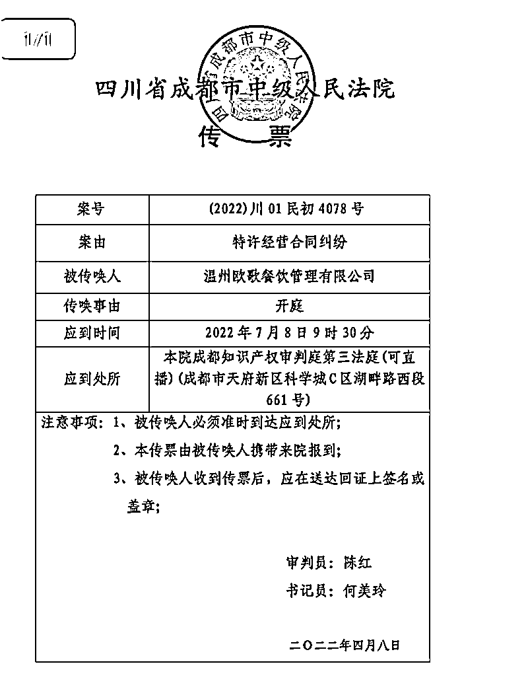
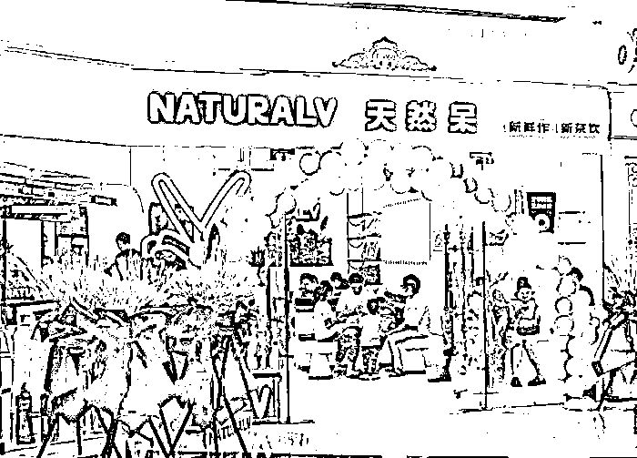
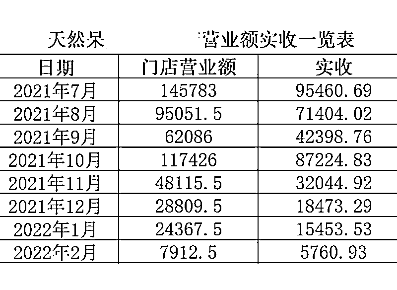
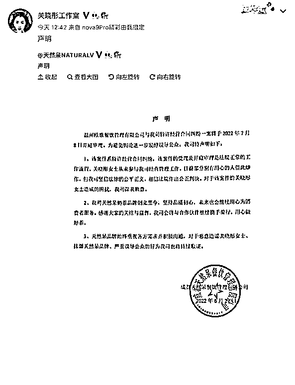
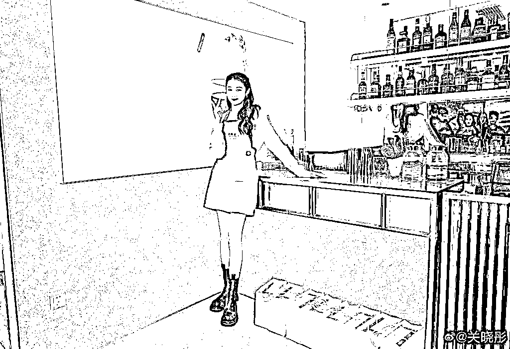
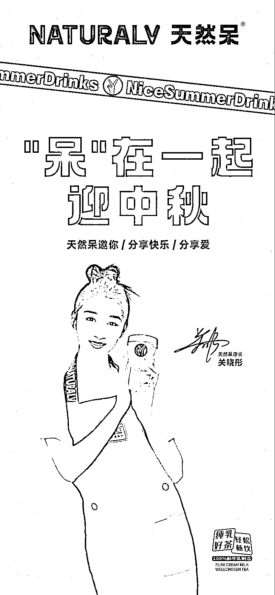

# 加盟商称半年亏 300 万，关晓彤可曾“天然呆”？

> 原文：[`mp.weixin.qq.com/s?__biz=MzIyMDYwMTk0Mw==&mid=2247538787&idx=5&sn=6a7de2ba5815f1467d5ecd7ffa7b8a0f&chksm=97cb935ba0bc1a4d331be2918e8f056a4ebd8d339633c612a3170e356f7269fe26bec0b19130&scene=27#wechat_redirect`](http://mp.weixin.qq.com/s?__biz=MzIyMDYwMTk0Mw==&mid=2247538787&idx=5&sn=6a7de2ba5815f1467d5ecd7ffa7b8a0f&chksm=97cb935ba0bc1a4d331be2918e8f056a4ebd8d339633c612a3170e356f7269fe26bec0b19130&scene=27#wechat_redirect)

## 6 月 27 日，“关晓彤 奶茶店”冲上微博热搜榜前列。

## 有网友爆料称，关晓彤曾担任店长的奶茶品牌“天然呆”被加盟商告上法庭，案件将于 7 月 8 日在成都市中级人民法院开庭审理。

## “天然呆”被诉案件开庭通知

随后，南都湾财社记者联系了起诉方温州欧歌餐饮管理有限公司（下称“温州欧歌”），确认这一情况属实。

6 月 27 日午间，天然呆总部发布声明称，“该案件系特许经营合同纠纷，该案件的受理及开庭审理是法院正常的工作流程。关晓彤女士从未参与我司经营管理工作，目前部分別有用心的人借此炒作，但我司坚信法律的公平正义，相信法院作出公正判决。对于该案件给关晓彤女士造成的困扰，我司深表歉意。”

****开业后人气暴跌，****

****有加盟商称半年亏了 300 万****

**被明星餐饮的排队热潮吸引，2020 年 12 月 31 日，温州欧歌法定代表人包善荣和其他几个股东花费了 168 万元，包括 158 万元的代理费用和 10 万元保证金，跟天然呆奶茶总部签了五年的市级代理合同。**

**2020 年 4 月，包善荣在温州的首家天然呆加盟店开业。刚开业前那会，在 “1 元购奶茶”、“9.9 元买三杯奶茶” 等多重优惠活动带动下，店里聚集了较高的客流量，不过，仅仅开业半个月后，店内人气急转直下。**

**** 

**图源：视觉中国**

**包善荣告诉南都湾财社记者，“天然呆总部经常让我们做促销活动，比如 9.9 元买两杯奶茶，但是我们做奶茶的原材料要从总部进货，成本较高，一杯成本价大概 10 块钱，根本赚不到钱。”**

**包善荣进一步指出，“开业几个月后，我们店里每月的营业额只有 3 万多元，我光房租就要 3.6 万元，加上人工成本，还有从总部进货的材料成本，每个月是亏损的。”**

**仅仅开业 6 个月，因为亏损过大，包善荣无奈将门店关闭。从加盟到关店，包善荣总共投资了约 300 万元，现在却是血本无归。**

**这种情况不止出现在包善荣的店里。今年 3 月，天然呆奶茶曾遭遇加盟商集体维权。**

**江苏淮安天然呆代理商吴滨（化名）代理天然呆奶茶的时间要比包善荣晚 4 个月，他的市级代理费用便宜了不少，为 28 万元，保证金 5 万元，如果仅仅只做加盟，费用则只需 12.8 万元，保证金为 2 万元。**

**为了开这家店，吴滨前前后后投资了 120 万元，但是从开业第一个月开始，天然呆奶茶就一直亏损。**

**吴滨给南都湾财社记者算了一笔账，“我的店第一个月营业额 14.5 万元，减去优惠活动的折扣，实际收入 9.5 万元，物料成本 8.7 万元，实际上，毛利只有 0.8 万元，但是人工、水电、房租一个月就要 4.7 万元，实际上，第一个月就亏了 3.9 万元。”**

****

**吴滨代理天然呆奶茶后，加盟店开业以来的经营情况**

**不仅如此，吴滨的店开业之后不久，营业额同样出现断崖式下跌，直到 2022 年 2 月关店，当月营业额已经不到 8000 元了。**

**吴滨直言，“亏损的主要原因是公司的运营模式不成熟，说好的关晓彤会做宣传推广也没有，另外再加上疫情使整个大环境也不好。”**

**值得注意的是，此前天然呆奶茶曾公开宣传，加盟天然呆可“轻松开店，无忧管理。技术门槛低，培训时间短。区域经营，区域保护。回本迅速，复制快速。”因涉嫌违反《广告法》，2021 年 3 月，天然呆奶茶被市场监管局罚款 5 万元。**

****身为“店长”却翻车，****

****关晓彤是否需要承担责任？****

**今年 3 月，因特许经营合同纠纷，包善荣把天然呆所属公司、负责签约的代理公司以及明星关晓彤告上法庭。此外，吴滨和多个加盟商同样选择通过司法手段维护自己的权益。**

**今年 4 月，“关晓彤及关联奶茶公司被起诉”冲上微博热搜。随后，天然呆奶茶发布声明称，“关晓彤女士并非合同主体，亦未参与公司经营管理工作。”**

**6 月 27 日，“关晓彤 奶茶店”再次冲上热搜，天然呆奶茶再次发布声明称，“关晓彤女士从未参与我司经营管理工作，目前部分别有用心的人借此炒作。”**

**** 

**关晓彤工作室转发“天然呆”总部发布的声明** 

**南都湾财社记者了解到，关晓彤与天然呆奶茶确实并无直接的股权关系，但是关晓彤父亲关少曾控股的公司是天然呆奶茶的第二大股东。**

**天眼查信息显示，天然呆奶茶品牌归属于成都天然呆餐饮管理有限公司（下称“成都天然呆”），成都添好运企业管理有限公司为第一大股东，持股 65%，关晓彤父亲关少曾控股的彤梦心缘（成都）文化传媒有限公司，为第二大股东，持股 35%。**

**在天然呆奶茶开店前期，关晓彤曾多次以“店长”身份为天然呆奶茶宣传、站台。目前在天然呆官网上，仍有关晓彤相关的宣传照片。**

****

**关晓彤身着天然呆奶茶店员服装。图源：关晓彤微博**

**吴滨表示，天然呆奶茶早期宣传的是关晓彤携手创办的奶茶，“我就以为是关晓彤创办的，（看了声明）感觉我被关晓彤骗了，现在直接把关系撇得一干二净。”**

**此前，广东至信忠诚律师事务所律师董亚民接受南都湾财社记者采访时表示，明星作为餐饮品牌的创始人、“店长”，也不意味着明星必须为加盟商的亏损承担责任。“明星并没有参与到加盟合同法律关系中，也没有以自己的名义签订合同，因此从法律上来说，加盟商不能找明星承担责任。”**

**尽管如此，温州欧歌仍将关晓彤列为共同被告，他在起诉书中指出，关晓彤以其明星影响力帮助成都天然呆实施相关违法特许经营活动，亦损害了其合法权益。**

**** 

****“天然呆”是否具备特许经营资质****

**除了关晓彤是否要承担法律责任外，多位加盟商质疑天然呆不具备特许经营资质，涉嫌违规开放加盟。**

**根据《商业特许经营管理条例》，企业从事特许经营活动应当拥有至少 2 个直营店，并且经营时间超过 1 年，而且，在首次订立特许经营合同之日起 15 日内，应向商务主管部门进行备案。**

**多位加盟商质疑，天然呆公司于 2020 年 8 月才成立，天然呆奶茶开展特许经营活动、与多个代理商、加盟商签约时，成立尚未满一年，缺乏特许经营的资质。**

**** 

**“天然呆店长”关晓彤，图源：关晓彤微博**

**此前，“成都天然呆”曾因特许经营未按时备案收到了行政处罚书。根据天眼查信息，5 月 8 日，天然呆奶茶 2021 年 2 月 7 日首次对外订立商业特许经营合同后，未按照《商业特许经营管理条例》第八条之规定在 15 日内向商务主管部门备案，被成都市商务局罚款 3 万元。**

**早前，曾有另一个明星餐饮品牌同样被质疑缺乏特许经营资质，它就是陈赫创办的卤味火锅品牌——贤合庄。**

**值得注意的是，贤合庄和天然呆奶茶背后有相同的操盘手——四川至膳品牌管理有限公司（下称“四川至膳”）。四川至膳手中握有多个餐饮品牌，包括连锁火锅品牌谭鸭血、陈赫的贤合庄卤味火锅、黄晓明的烧江南烤肉、孙艺洲的灶门坎卤味烧烤等多个餐饮品牌。不过，目前四川至膳已经在官网删去了明星餐饮品牌的介绍。**

**四川至膳品牌合伙人李锐此前接受南都湾财社记者采访时表示，贤合庄是具备特许经营备案条件的，“但是我们之前不重视。今年 4 月，我们已经拿到特许经营的备案了。”**

**针对加盟商质疑天然呆奶茶缺乏特许经营资质，6 月 27 日，南都湾财社记者致电天然呆总部，天然呆方面回复称，天然呆已经于今年 2 月取得了相关的特许经营备案。**

**来源：南都·湾财社 记者  詹丹晴  编辑：甄芹**

******](https://mp.weixin.qq.com/s?__biz=Mzg5ODAwNzA5Ng==&mid=2247487973&idx=1&sn=1b62da6f2018402862a5c375e10c355e&chksm=c06878b2f71ff1a4fbe7df4dec626aa7e696154751693bf16f6c6a302ceaa4d1959040c70518&scene=21#wechat_redirect)**

**← 向右滑动与灰产圈互动交流 →**

****