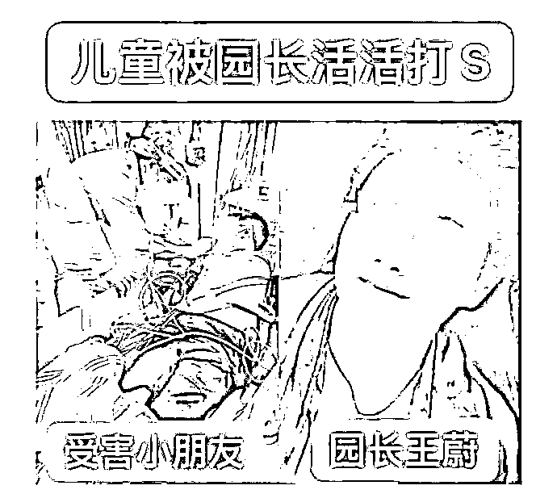
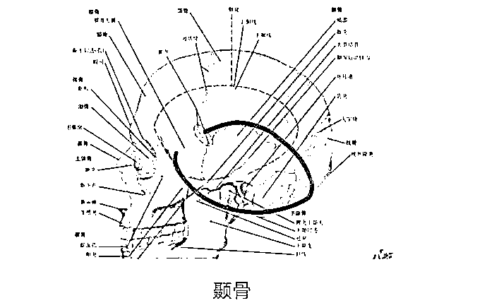
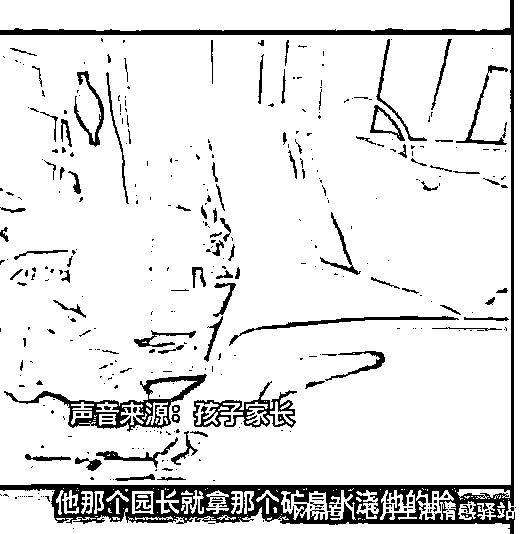
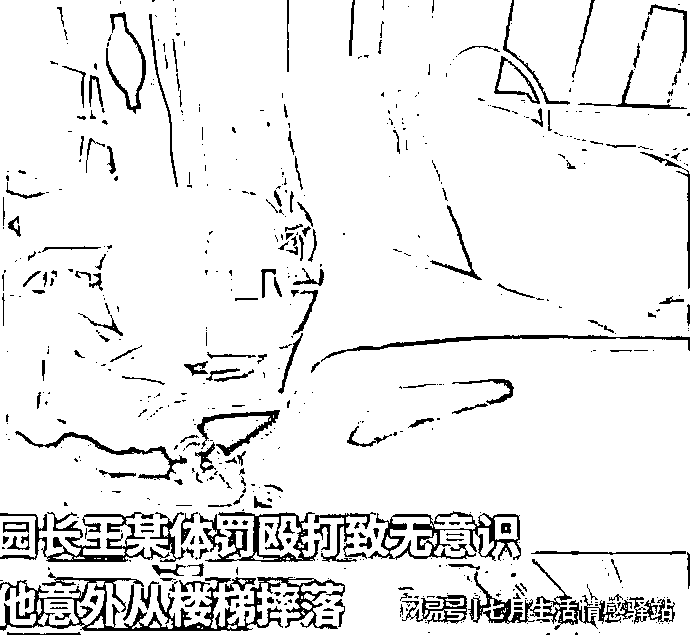
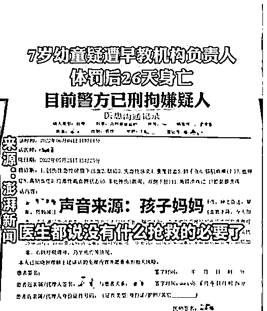
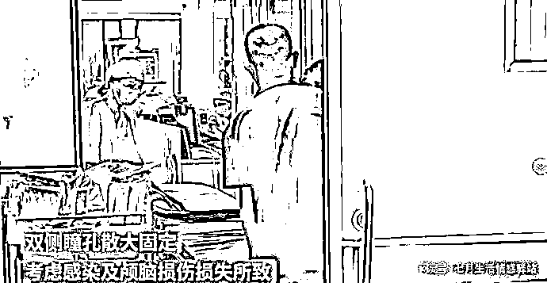
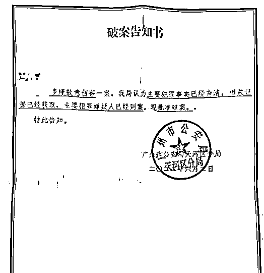
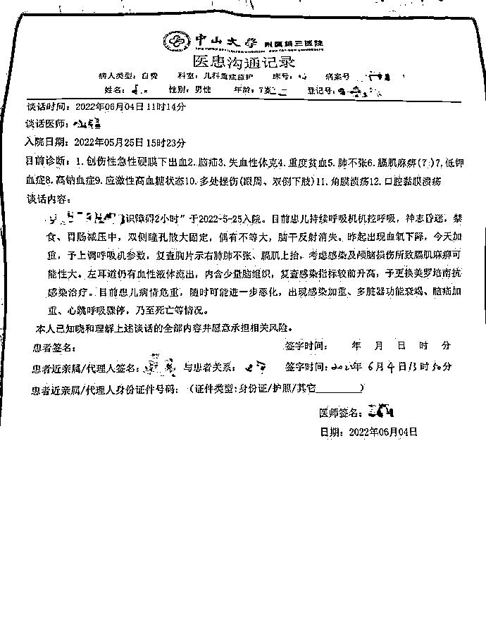
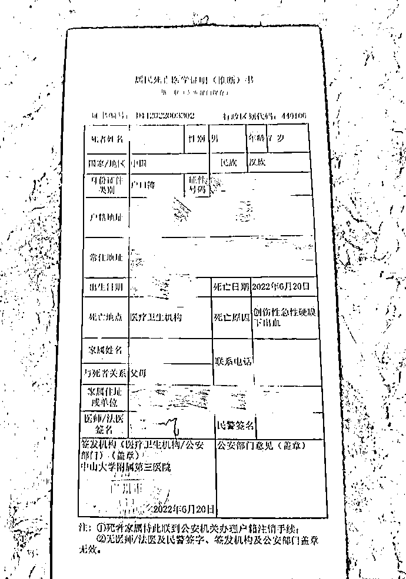
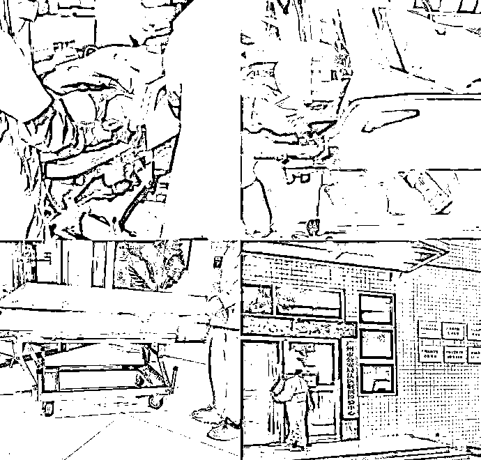

# 一儿童被早教园长活活打死，家长声明：不接受任何调解只求严惩

> 原文：[`mp.weixin.qq.com/s?__biz=MzIyMDYwMTk0Mw==&mid=2247538787&idx=6&sn=f7ce03cb971168435390223b2978371b&chksm=97cb935ba0bc1a4dc5520c6e0459e3e9f28f177a1756c132dbc72dd711af22a35ced9cc9f10f&scene=27#wechat_redirect`](http://mp.weixin.qq.com/s?__biz=MzIyMDYwMTk0Mw==&mid=2247538787&idx=6&sn=f7ce03cb971168435390223b2978371b&chksm=97cb935ba0bc1a4dc5520c6e0459e3e9f28f177a1756c132dbc72dd711af22a35ced9cc9f10f&scene=27#wechat_redirect)

实在恶劣！人神共愤！广州天河区一家全优畅想早教园的园长竟然把一名儿童体罚殴打致死！

如此歹毒的女人竟然还能当早教机构的园长?既然连基本的职业操守都没有你还从事这个行业干嘛？这恐怕不是职业操守的问题了，是这人的本性恶毒如此吧？

**受害者父母态度坚决：不接受任何调解，也不会以任何形式谅解对方，他们唯一的要求就是依法严惩，以慰孩子在天之灵。**

**案件经过：**

事发 5 月 25 日午休时间，广州天河优畅想家早教机构，张女士的孩子也安排在这里，就是为今年九月份读小学做学前准备，但万万没想到却遭遇了横祸。

案发当天孩子玩得比较凶(但这都是小孩呀，谁不是这样过来的呢？)，张女士的儿子跑出教室去玩耍，这时的园长王某怒气冲冲的把孩子从外面抓了回来。

作为一名教育工作者，既然能当这个园长，应该有的职业素质，个人品德都应该有才对吧？但万万没想到的是这个园长竟然因为孩子的调皮捣蛋而怒不可遏，对一个孩子大打出手，其殴打的力度难以想象!

但见她一巴掌就扇到了孩子的颞骨上，当时也不知道伤到了哪里，孩子的鼻血就立马流了出来。

以下内容来自于办案民警反馈的口供记录：

王某一巴掌扇到孩子颞骨，打到孩子流鼻血，王蔚仍继续施暴拳打脚踢直至孩子昏迷。

但是这位园长还没有完，看到了血还不解气似的，竟然暴力升级，对孩子开始拳打脚踢，一个小小的孩子怎么能承受一个成年人的暴力攻击呢？

没一会孩子就被殴打得直接昏迷了过去。

**让人难以置信和愤怒的是，这时竟然还有四名老师在围观，没有一名出来阻拦，仅仅是因为打人者是园长，怕丢了工作吗？**

看到孩子晕迷了，这位园长才意识到出问题了，但她竟然不是第一时间赶紧拨打 120 急救电话，而是拿来矿泉水淋到孩子的头上，想把他浇醒，甚至肆意摆动摇晃孩子，想把他弄醒!

但孩子这时伤情已经很重，根本就醒不过来，**她们还是不拨打 120 急救电话，担心事情暴露吧，竟然私底下叫了其他的老师打“滴滴”送到了医院。**

同时这位园长找来那围观的四名老师，要她们统一口径，就对外声称孩子是自己自己摔跤滚下来摔伤的。

然后她还回去把自己身上弄湿的衣服换了下来，换了套干净的衣服才赶到了医院。

医生快速地对孩子进行了伤情检查，发现病情紧急，必须要进行手术，当问及孩子是怎么受伤的，王蔚一口咬定是摔伤的。

她还没意识到问题的严重性，这个关节眼上想逃避责任而向医生传递错误的信息，进一步延误治疗，医生要求赶紧联系家属过来签字进行手术，这位园长还想把事情给按住，但这是人命关天的事情，在医生强烈要求之下，她才不得不拨打了孩子的母亲张女士的电话，在电话里依然是说孩子摔伤了。

张女士急忙赶来了医院把字给签了，孩子推进了手术室，但是情况不容乐观，医院抢救的医生发现孩子伤情的严重性，绝非普通的摔倒能导致的伤害，医生都意识到这里面肯定有隐情，于是建议张女士即报警处理。

在这个时候了，园长王某还坚称孩子是从摔倒滚下楼道导致受伤的，张女士只听从医生的建议，立马选择了报警处理。

随后警方按制了园长王某和那四名围观的老师。

**没想到大家最熟悉的一幕又出现了，早教机构的监控系统又选择性地出现了故障，调取不了当天的录像记录了。**

警方介入刑事立案调查后，这起男童被体罚殴打真相大白，警方对那四名老师进行了单独的询问，一开始四名老老都不敢说实话，但当警方告知如隐瞒事实当按包庇罪论处，一样要判刑，四个人才纷纷说了实话，原来是园长在事发当时就找到她们统一口径，对外宣称孩子就是从楼道摔下来摔伤的，坚决不能承认存在暴力体罚孩子的情况。

最终四名老师口供一致，描述了王某的殴打孩子的整个过程（其手段之恶劣实在无法描述），园长王某看已经无法再隐瞒真相，只好如实供述了其对受害者进行实施暴力殴打的行为事实。

最终警方于 6 月 2 日出具《破案告知书》，告知书上显示：王某涉嫌故意伤害一案，我局认为主要犯罪事实已经查清，相关证据已经获取，主要犯罪嫌疑人已经到案，现批准破案。

但是最终这突遭不法侵害的可怜孩子经过了中山三院的 26 天抢救，还是没有能醒过来，于 6 月 20 日离世。

孩子的死亡原因是创伤性急性硬膜下出血。目前，家长已经安排公安局法医解剖检验中心对男童进行尸检。

真是畜生不如！作为教育工作者，作为一名园长，本应保护孩子的安危于己任，却没想到如此蛇蝎心肠，对 7 岁男童进行体罚殴打致死，手段残忍，性质恶劣，影响恶劣，这可是故意伤害，导致了致人死亡的严重后果。

不严惩真的难以平民愤，对于，悲愤交加的孩子家属表示，他们坚决不接受任何形式的调解，也不会以任何形式去谅解对方，坚决不会给凶手获得量刑从宽的机会，他们只有一个要求：严惩凶手，还孩子一个公道！

现在案件正处于调查当中，最终王某会如何判刑只有等待最后的通报，那么我们可以分析一下王某最终将会如何判刑呢？

在这里会有人认为，这不是在杀人吗？王某就当应按故意杀人罪论处。

很显然，本案中王某犯的是故意伤害罪，而不是故意杀人罪，我们来看看故意杀人罪与故意伤害罪的本质区别。

**故意伤害罪：**行为人在主观上存在故意伤害他们身体健康，并最终导致受害人身体受到伤害的行为。

**故意杀人罪：**行为人在主观上存在故意夺取他们生命，并最终导致死亡结果的发生（或杀人未遂）。

从两者的定义来看，都存在一个共同点，就是主观上是存在“故意”的意思表示，但不同点在于其最终所希望达到的目的不同，故意伤害罪仅仅只是对受害人进行一定的身体伤害，但并不希望其伤害会伤及性命。而故意杀人罪却是在主观上就希望死亡结果的发生。

**案件实情：**就本案而言，就王某的主观意图而言，其是由于儿童在午间休息时跑出教室而对其进行殴打，但其并不希望自己的行为会夺取孩子的性命，其主观上并非故意杀人；从客观上来说，王某在伤害了孩子后而进行了救治，随后安排人把孩子送到了医院，这就说明了她并不希望孩子有生命危险，因此王某最终是被定性为故意伤害罪，而不是故意杀人罪。

**最终王某将会按故意伤害（致人死亡）罪进行刑事处罚。**

**量刑标准：**

《中华人民共和国刑法》的相关规定，犯前款罪，致人重伤的，处三年以上十年以下有期徒刑；**致人死亡**或者以特别残忍手段致人重伤造成严重残疾的，处十年以上有期徒刑、无期徒刑或者死刑。本法另有规定的，依照规定。

**加重情节：**王某手段残忍，主观恶性极大，同时在案发后，强迫其同事隐瞒事实真相延误救治，最终导致孩子死亡，同时也应该争取不到受害者家属的谅解，将会从重处罚。

最终王某将面临 10 年以上的期徒刑、无期徒刑或者死刑（从本案而言， 死刑是不太可能的）

除此之外，由于这是一起早教机构园长殴打他人导致的悲剧，其实除了刑事责任之外，在民事层面，早教机构也是难逃责任的。

**《民法典》第一千一百九十九条规定：**

无民事行为能力人在幼儿园、学校或者其他教育机构学习、生活期间受到人身损害的，幼儿园、学校或者其他教育机构应当承担侵权责任。

因此作为涉事的早教机构，也是要承担侵权责任的。

正所谓做一行爱一行，你干不了就别干，免得害人害己，这等暴力的方式教育现就是在不法侵害他人的权益，尤其还是作为一名园长，此等职业素质是怎么能与这个职业相称？因此，这家早教机构的资质是不是得查一查？它到底具不具备相应的资质？应当严肃查一查了！

来源：澎湃新闻

](https://mp.weixin.qq.com/s?__biz=Mzg5ODAwNzA5Ng==&mid=2247487973&idx=1&sn=1b62da6f2018402862a5c375e10c355e&chksm=c06878b2f71ff1a4fbe7df4dec626aa7e696154751693bf16f6c6a302ceaa4d1959040c70518&scene=21#wechat_redirect)

← 向右滑动与灰产圈互动交流 →

