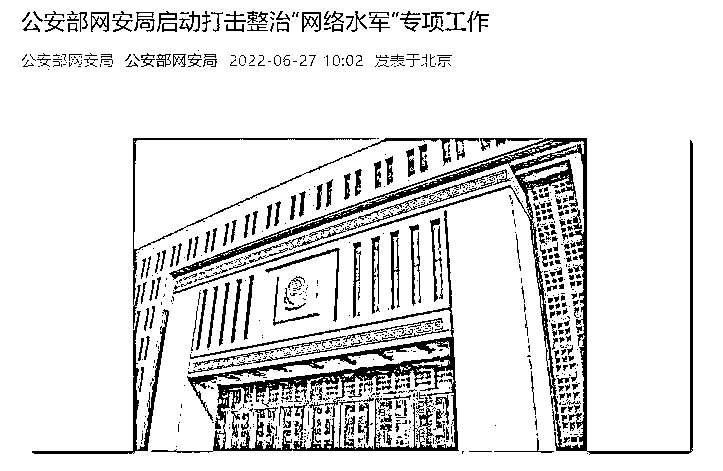

# 整治“网络水军”！公安部启动为期 6 个月专项工作，“水军”是怎么控评的？

> 原文：[`mp.weixin.qq.com/s?__biz=MzIyMDYwMTk0Mw==&mid=2247538787&idx=7&sn=2b66c7c848b697cdee6593fa9305b71b&chksm=97cb935ba0bc1a4d1e63758b8ad7c0606ecae3785e67548886875d8980330a954fab64af9977&scene=27#wechat_redirect`](http://mp.weixin.qq.com/s?__biz=MzIyMDYwMTk0Mw==&mid=2247538787&idx=7&sn=2b66c7c848b697cdee6593fa9305b71b&chksm=97cb935ba0bc1a4d1e63758b8ad7c0606ecae3785e67548886875d8980330a954fab64af9977&scene=27#wechat_redirect)

6 月 27 日，据“公安部网安局”微信号消息，为回应社会关切，进一步遏制“网络水军”及相关黑灰产业的滋生蔓延趋势，即日起，公安部网安局在全国范围内启动为期 6 个月的依法打击整治“网络水军”专项工作。网络水军违法线索举报网址 ，如实提供“网络水军”违法犯罪线索，共同维护网络空间秩序。

值得注意的是，4 月底，豆瓣在微博平台宣布已上线防“水军”控评功能。功能开启后，短评区将采用特定的点赞策略与排序算法，随机展示部分短评，使得“水军”无法通过集中点赞的方式引导短评区舆论。 

**公安部启动网络水军整治，为期 6 个月**

**据“公安部网安局”消息，近年来，公安机关网安部门依托“净网” 系列专项行动，持续对“网络水军”相关违法犯罪依法开展侦查打击，近 3 年侦办相关案件 600 余起 ，抓获嫌疑人 4000 余名 ，取得了初步成效。

然而，受“流量经济”“粉丝经济”等因素影响，“网络水军”相关违法犯罪活动仍屡打不绝、屡禁不止。有的“网络水军”为养号谋利，通过发布违法有害信息“造热点”“蹭热点”，意图操控或扰乱网上舆论秩序；有的利用炒作负面信息实施敲诈勒索，侵害群众合法权益；有的非法提供有偿删帖和刷量控评炒作服务，破坏市场经济和社会管理秩序。社会各界对此反映强烈，群众报案举报、新闻媒体报道、“两会”建议提案等不断聚焦关注相关突出问题。** 

****

**截图来源：“公安部网安局”** 

**为回应社会关切，进一步遏制“网络水军”及相关黑灰产业的滋生蔓延趋势，切实维护网络生态、市场经济秩序和广大人民群众合法权益，即日起，公安部网安局在全国范围内启动为期 6 个月的依法打击整治“网络水军”专项工作 。 公安网安部门将按照“以打开路、以打促治”的思路，在依法打击相关违法犯罪活动的同时，主动对接有关主管部门，加强协作配合，共同压实网络平台主体责任，携手加强网络生态综合治理。

同时，也欢迎广大网民向公安部《网络违法犯罪举报网站》如实提供“网络水军”违法犯罪线索，共同维护网络空间秩序。**

****“网络水军”的升级与反制****

 **值得注意的是，“网络水军”这一存在让相关社交平台也很头疼。4 月底，豆瓣在微博平台宣布已上线防“水军”控评功能。功能开启后，短评区将采用特定的点赞策略与排序算法，随机展示部分短评，使得“水军”无法通过集中点赞的方式引导短评区舆论。

据工人日报报道，网络世界里有一个首因效应，也叫优先效应或第一印象效应，指通过最先输入的信息对客体认知施加影响。“网络水军”敏锐地捕捉到这一点，他们通过在一个帖子下大量灌水，通过“好评”或“差评”来影响网友的判断。 “网络水军”也有一个不断进化的过程。在网络评论的初级阶段，可能是一些志同道合的人因持相同观点而集聚；随后是一些目的性极强的粉丝抱团“灌水”，以一些流量明星的粉丝为甚；再后来，有资本看到评论的力量，会组织专门的“水军”发评跟帖。

“网络水军”不断升级，花样手段不断更新。这让普通网友或消费者想看到真实的网络民意，就变得越来越难。其实不光是豆瓣，微博等网络媒体随时可能沦陷入“网络水军”的包围中。 豆瓣的做法给社交媒体提供了一个可以借鉴的方式——其实很多的网络异动都可以通过技术手段监测到，一旦有“网络水军”涌入，相关平台可以立即启动应急机制，对“网络水军”进行反制。

**“魔高一尺，道高一丈”**

实际上，2021 年底，微博进行过整治网络水军的行动。@微博管理员 11 月 24 日发布公告称，针对兼职水军的排查和处理，站方继续深入推进反垃圾专项行动。对充当兼职水军，通过刷好评、泼污水、写推广软文等方式获得非法盈利的真人网络营销行为予以坚决打击。

处置情况如下：（1）共处理兼职水军类内容 10434 条；（2）对@雅艺观影视 @希望幸运鸭 @温暖的太阳呀呀丫呀 等 2866 个账号予以阶段性禁言处置。 站方将继续加强内容管控，通过机器与人工双排查的方式，持续加大对违法违规行为的打击力度。同时，也欢迎广大网友积极提供举报线索。 

图片来源：摄图网 500999782

此外，今年 3 月起，微博、知乎、小红书等平台先后发布公告称，在用户个人资料页面及评论区展示发帖所在地 IP 属地。平台表示，近期热点事件频发，在加强违规信息排查处置的同时，发现存在个别冒充当地网友发布和传播不实信息的行为，上线 IP 属地显示功能可以更好维护传播秩序。

来源：每日经济新闻综合“公安部网安局”、工人日报、@微博管理员，利箭在行动** ******](https://mp.weixin.qq.com/s?__biz=Mzg5ODAwNzA5Ng==&mid=2247487973&idx=1&sn=1b62da6f2018402862a5c375e10c355e&chksm=c06878b2f71ff1a4fbe7df4dec626aa7e696154751693bf16f6c6a302ceaa4d1959040c70518&scene=21#wechat_redirect)**

**← 向右滑动与灰产圈互动交流 →**

****