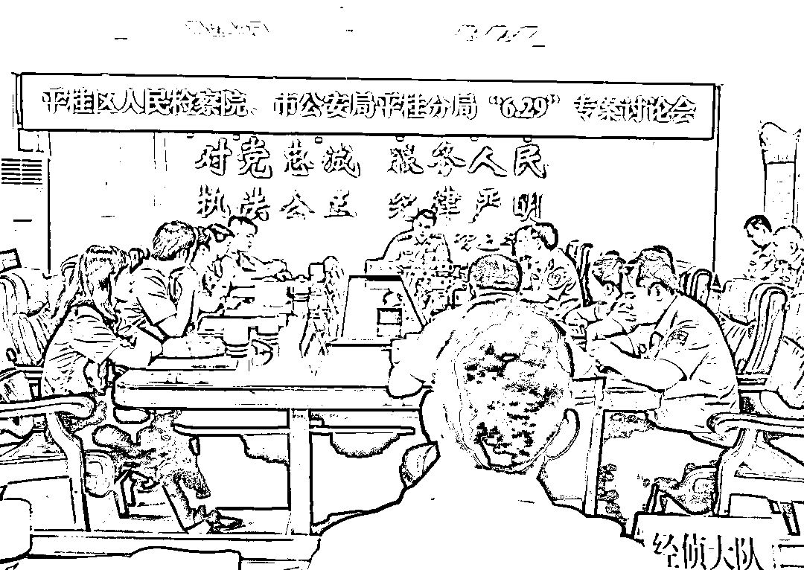
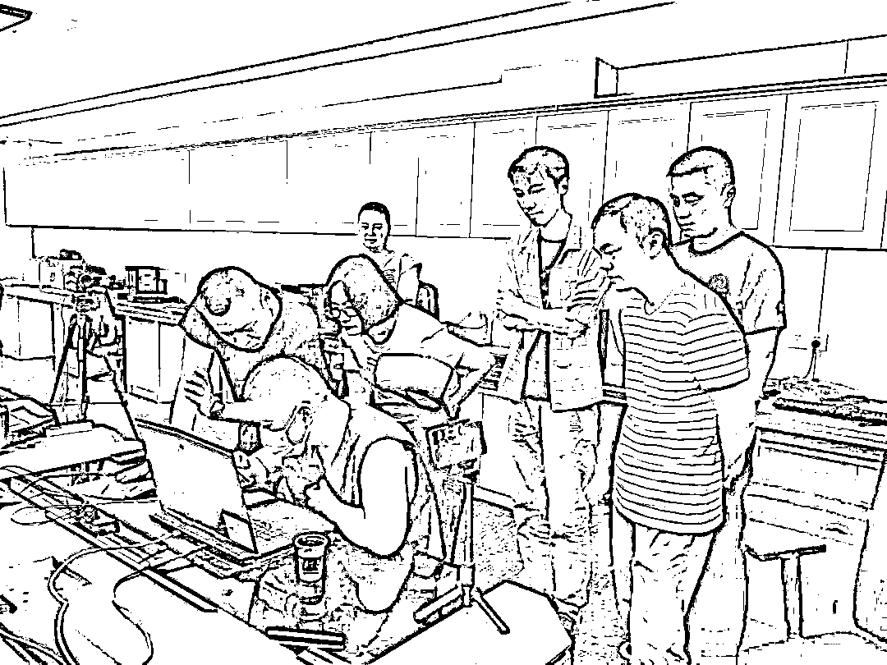

# 网上“黑社会”万盛集团覆灭！裸聊敲诈、强奸、非法拘禁无恶不作

> 原文：[`mp.weixin.qq.com/s?__biz=MzIyMDYwMTk0Mw==&mid=2247538787&idx=8&sn=553c893f11f16b6c4a97ea16298f686e&chksm=97cb935ba0bc1a4d8472abe16d57368771d228246faa8b13c621068230db9b49a00f2d2ed034&scene=27#wechat_redirect`](http://mp.weixin.qq.com/s?__biz=MzIyMDYwMTk0Mw==&mid=2247538787&idx=8&sn=553c893f11f16b6c4a97ea16298f686e&chksm=97cb935ba0bc1a4d8472abe16d57368771d228246faa8b13c621068230db9b49a00f2d2ed034&scene=27#wechat_redirect)

**导语**

**长安君（ID:changan-j）：**

**偷渡、网络裸聊、敲诈、洗钱、非法拘禁、强奸、武装巡逻、内讧、暗杀、带队叛逃……这些堪比电影桥段的案情发生在广西壮族自治区贺州市平桂区检察院办理的陈某忠等人涉黑案中。**

**日前，随着该涉黑团伙中的陈某滢、李某桓等 4 名漏犯被判处有期徒刑七年八个月至十个月不等刑期，这个涉黑团伙也彻底覆灭。**

**该团伙中的主犯陈某忠因数罪并罚，被法院执行有期徒刑二十五年，其余 11 名罪犯也分别被判处有期徒刑十二年至一年六个月不等刑期。**据此前公安部新闻发布会介绍，该案是全国首例以****黑社会性质组织犯罪定性判决的网络裸聊敲诈案件。****

****裸聊诱惑****

****一次“艳遇”被敲诈 12 万****

****2019 年 12 月 18 日晚，贺州平桂的小伙小罗下班后，无聊寂寞想找点刺激。像往常一样，他躺在职工宿舍的沙发上刷着各种交友软件。刷着刷着，**某交友软件自动为小罗匹配上一个昵称为“小幸运”的聊天对象，对方向他发来一些美女图片和一些诱惑性、挑逗性的语言。禁不住诱惑的小罗开始在网上与对方热聊，后来发展到裸聊。******

********在小罗在裸聊时露出脸部五官后，对方迅速挂断了视频，同时发了一个名为“邻家小妹”的软件链接给他，说是邀请他进入直播间观看直播。此后，小罗的噩梦开始了。按照对方要求下载安装软件后，小罗输入了对方给的邀请码。几分钟后，小罗没等来惊喜，却收到了对方发来的一段视频和手机通讯录名单。打开视频后，小罗瞬间觉得五雷轰顶：正是自己刚才裸聊的视频，而通讯录名单也是自己的手机通讯录。********

********就在这时，小罗的电话响了，**对方声称他们已将小罗的裸聊视频截屏，还录制了视频，也掌握了他手机通讯录名单，要求小罗付 1000 元才会删除视频。**如果小罗不转钱，他们就将图片、视频发送给他的家人、领导和朋友。因为害怕不雅视频被曝光，小罗选择了妥协，通过对方发来的收款二维码支付了 1000 元。********

********本以为这件事情能就此结束，但是对方并未罢手，而是不停地对他进行恐吓，变着花样地让他继续转账。直到小罗花光了所有积蓄，还透支了信用卡，对方才罢休。最终，小罗分 9 次给涉案人员转了共计 12 万余元。********

********事后，回过味的小罗来到贺州市公安局平桂分局报案。随后，该局又陆续接到了小李、小刘的报案，二人也被他人以相同作案手法敲诈勒索。**辖区内连续发生三起犯罪手段如出一辙的案件，这引起了该局刑侦大队的高度关注。**********

********循线追击********

********一个对公账户牵出一个犯罪集团********

********警方将上述三起案件并案侦查后，很快发现了破案的关键点，即每起案件出现多个收款账户。收款码虽然不完全相同，**但三起案件都出现了一个相同的账户——福建省南安市某织造公司的对公账户。**********

**********通过分析研判，警方发现，近几个月内上述收款账户中有多达几百笔不同交易对象的资金单向转入。此后，这些资金被再次集中转出，流向几个账户，流向的账户中有境外控制的账户。这让办案民警基本确定三起案件是同一伙犯罪分子所为，而且极有可能是一伙涉及境外的分工明确、层级结构复杂的犯罪团伙。**********

**********很快，侦查机关锁定了某织造公司对公账户的实际控制人洪某要以及与他频繁联系的陈某城，而此时无法在国内找到陈某城的活动痕迹。直至 2020 年 5 月初，警方获悉陈某城等 10 余人因偷越国（边）境在云南省某口岸被行政处罚。经过布控后，**侦查机关于同年 5 月 18 日至 27 日将陈某城、洪某要、陈某玲、余某文等 11 名犯罪嫌疑人抓获归案。************

********经讯问，一个名为“万盛集团”的公司浮出了水面。11 名犯罪嫌疑人中，除国内的洪某要等 3 人外，其余人员是跟随陈某城从缅甸偷渡回国的，而此前他们都是从云南省偷渡到缅甸孟波，并供职于“万盛集团”。警方发现，**“万盛集团”主要通过网络赌博、网络裸聊实施诈骗、敲诈勒索等犯罪。**********

********由于案件涉及境外且案情重大、复杂，侦查机关邀请贺州市平桂区检察院提前介入该案引导侦查。********

**********检警协作**********

**********挖出裸聊背后的黑恶势力团伙**********

********************

**********检警两家召开联席会议讨论涉黑案件**********

**********提前介入该案后，承办检察官通过查阅证据材料、召开检警联席会等形式了解案情。在与侦查机关会商后，**检察官认为该案很可能系一起以网络裸聊为犯罪手段的跨境网络涉黑案件。************

**********通过分析，检察机关认为本案的突破点在于陈某城。陈某城为何突然离开“万盛集团”？余某文等 10 多人为何要跟陈某城回国？陈某城在该集团处于什么地位？这中间发生了什么？……承办检察官建议侦查机关围绕陈某城进行侦查取证。**********

**********通过法律政策宣讲、思想教育等工作，包括陈某城在内的犯罪嫌疑人表示愿意配合警方调查，主动供述了“万盛集团”设在缅甸孟波的“金牛湖”附近，**公司前期主要是通过网络赌博“杀猪盘”对国内人员实施诈骗，后转为网络裸聊敲诈。**陈某城在该公司主要负责网络裸聊的技术工作，以及联系国内外码商为该团伙洗钱走账。陈某城之所以离开公司，是因为在洗钱过程中，老板陈某忠怀疑陈某城与洪某要私吞钱款并将其软禁。其间陈某城从老乡褚某处获悉，陈某忠可能会杀害他，因此在公司熟人协助下，他带领愿意跟随自己的 20 余人逃离“万盛集团”偷渡回国。**********

************此时，一个通过网络裸聊实施敲诈犯罪的跨国犯罪集团的轮廓逐渐清晰。那么，它是不是涉黑恶势力犯罪团伙，成了案件侦查的关键。**此后，检警多次会商，检察机关先后提出 70 余条补充侦查意见，主要围绕该集团的组织结构、具体实施的犯罪行为、通过违法犯罪获取的经济利益，以及该集团的犯罪行为对社会、被害人生活和工作等造成的影响。**********

********************

**********专案组固定电子证据**********

**********在检察机关的引导下，侦查机关全面收集证据，逐步厘清了“万盛集团”的基本轮廓：2019 年 7 月以来，陈某忠与褚某、“阿龙”（身份信息不详）为实施诈骗、敲诈勒索等犯罪，在缅甸孟波建立窝点，并以高薪引诱、熟人介绍等方式从国内招募人员偷渡至缅甸，逐渐形成了以陈某忠等人为首，以陈某城等人为骨干成员，谢某、涂某红等人为积极参加者的团伙。该团伙成员最多时达上百人，且人员基本固定，分为老板、高级代理、代理（小组长）、业务员的层级机构，其中业务员又分为“吸粉组”“裸聊组”“技术组”“洗钱组”等层级，每个小组由小组长带领，小组长上面为高级代理，高级代理带领多个小组。**********

**********该团伙另有“安保组”，聘请缅甸当地的武装组织为该公司巡逻，一方面避免当地其他势力干扰；另一方面也是限制底层业务员自由出入。为攫取非法利益，该团伙在多个社交平台针对不特定人员，**长期通过线上实施裸聊敲诈、“杀猪盘”诈骗，线下采取电话滋扰被害人家属、亲友的方式向被害人索取钱款共计 500 余万元****，包括未成年人、大学生在内的被害人多达 717 人，分布在全国 27 个省、自治区、直辖市。************

**********同时，警方还查清了该集团组织他人偷越国（边）境的行为，获取被害人款项后的洗钱行为，对部分底层业务员电击、殴打、坐水牢等非法拘禁行为，部分老板、高级代理强奸集团内女性业务员的行为等。**********

**********至此，“万盛集团”的真面目终于被揭开，符合黑社会性质组织犯罪的相关规定，裸聊诱惑是其犯罪手段之一。**********

**********而警方的追捕工作也取得了进展，2020 年 7 月 24 日，老板陈某忠被抓获归案。陈某忠的归案弥补了老板层级未归案的不足，其亦供认案件的全部事实。**********

**********2020 年 8 月 31 日，**平桂区检察院以陈某忠、陈某城等 12 人犯组织、领导、参加黑社会性质组织罪，敲诈勒索罪，诈骗罪，非法拘禁罪，洗钱罪等 8 项罪名向法院提起公诉****。**经一审、二审开庭审理，法院采纳检察机关的指控，认定本案系黑社会性质组织犯罪，该团伙中的主犯陈某忠被法院数罪并罚，决定执行有期徒刑二十五年，其余 11 名被告人也分别被判处有期徒刑十二年至一年六个月不等刑期。此后，被追捕归案的漏犯亦被判处相应刑罚。**********

**********来源:检察日报,长安剑**********

******************************](https://mp.weixin.qq.com/s?__biz=Mzg5ODAwNzA5Ng==&mid=2247487973&idx=1&sn=1b62da6f2018402862a5c375e10c355e&chksm=c06878b2f71ff1a4fbe7df4dec626aa7e696154751693bf16f6c6a302ceaa4d1959040c70518&scene=21#wechat_redirect)**********

**********← 向右滑动与灰产圈互动交流 →**********

********************