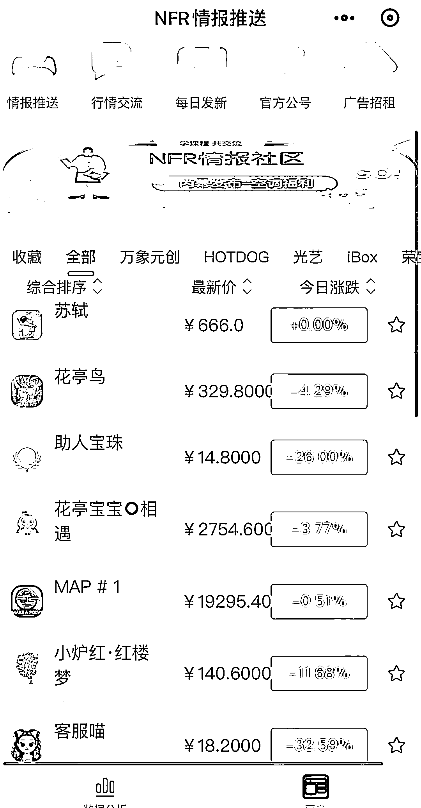
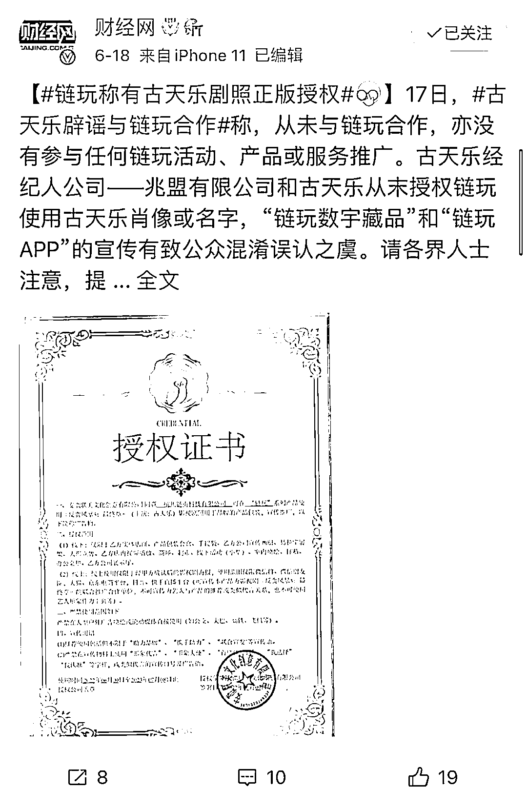
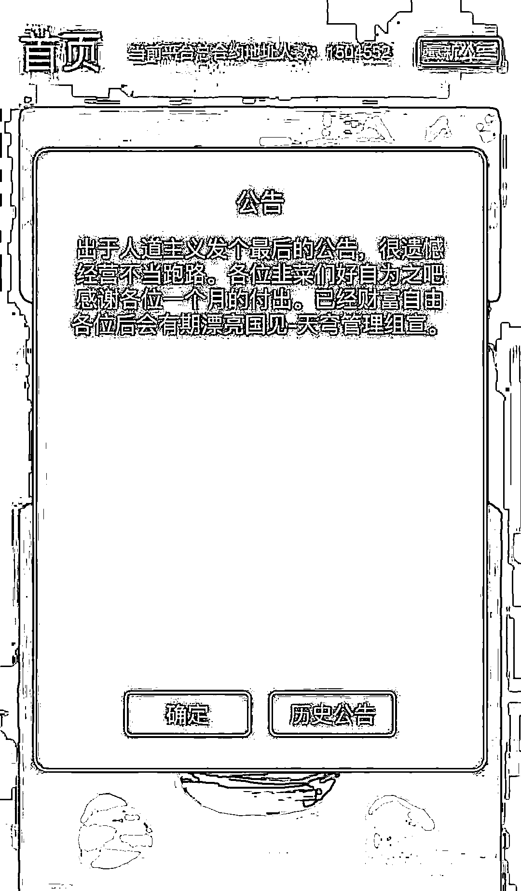
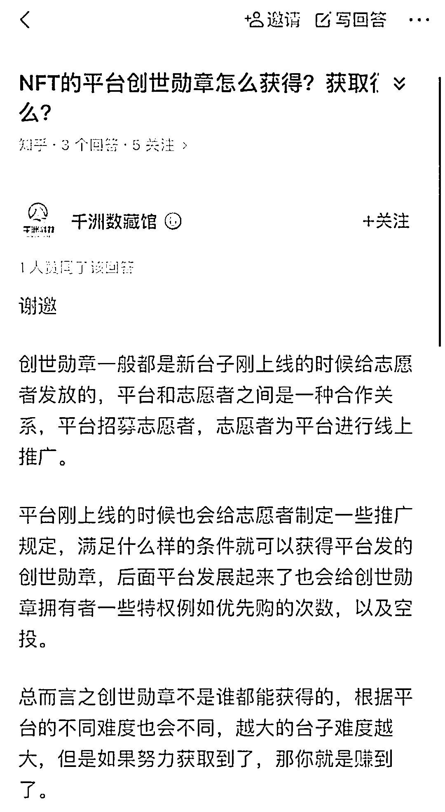
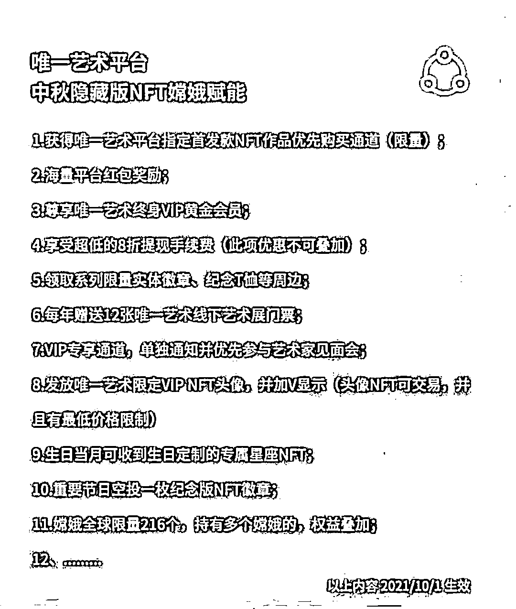
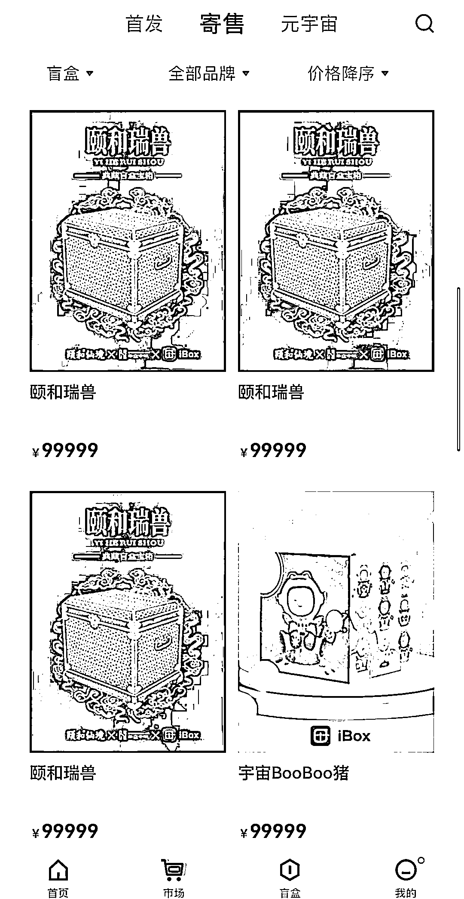
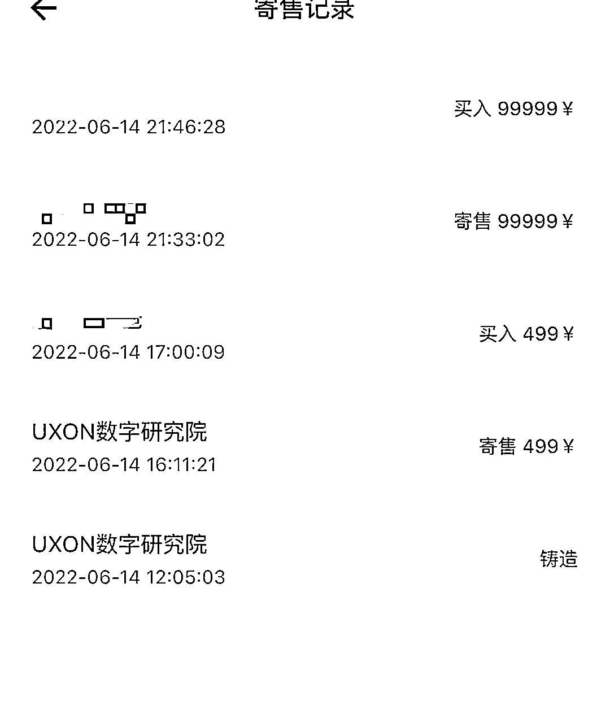
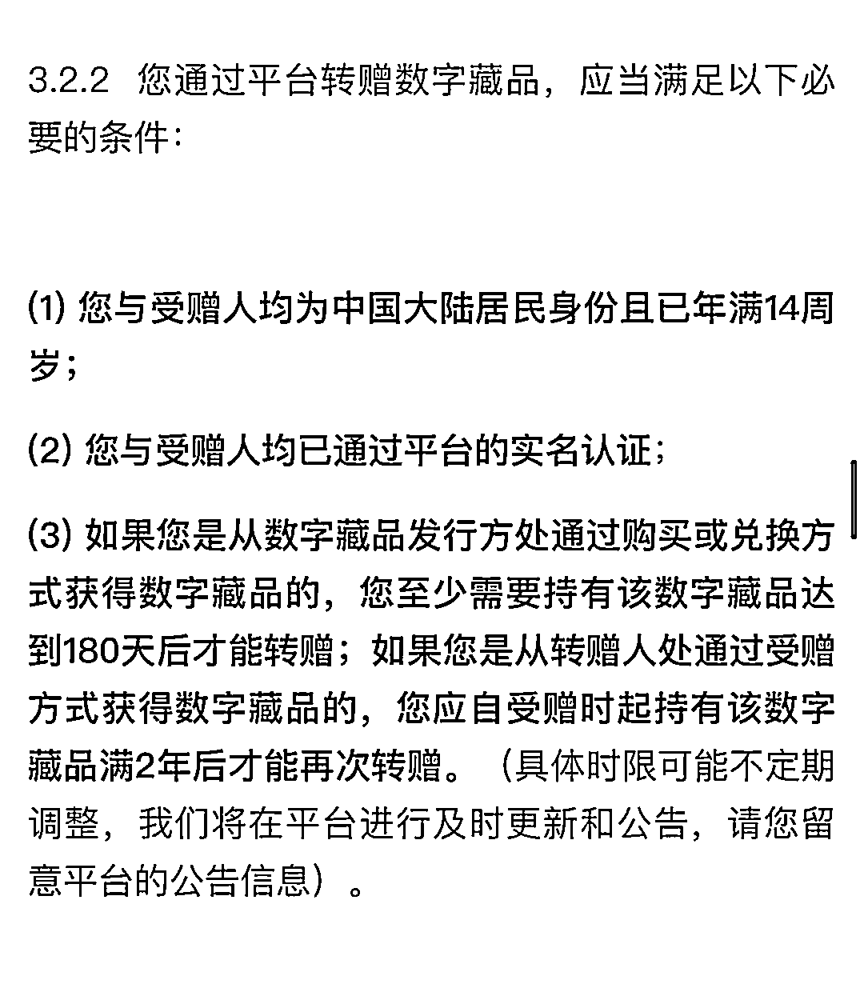

# 三位千万级玩家，揭秘数字藏品市场“三大套路”

> 原文：[`mp.weixin.qq.com/s?__biz=MzIyMDYwMTk0Mw==&mid=2247538838&idx=1&sn=c9c0b6173178edadd5073a6539aaf397&chksm=97cb93aea0bc1ab8d7401b61c822e1b50d28b27364780bafb63951863dddbd2c9d9cd20f9fe3&scene=27#wechat_redirect`](http://mp.weixin.qq.com/s?__biz=MzIyMDYwMTk0Mw==&mid=2247538838&idx=1&sn=c9c0b6173178edadd5073a6539aaf397&chksm=97cb93aea0bc1ab8d7401b61c822e1b50d28b27364780bafb63951863dddbd2c9d9cd20f9fe3&scene=27#wechat_redirect)

最近，有人做了一个类似股票交易小程序，每天实时监测几十个平台数字藏品的价格波动。这让野蛮生长的数字藏品行业，越来越像一个“金融市场”。

<shape type="#_x0000_t75" filled="f"><imagedata title="image1"></imagedata></shape>

在国内，数字藏品的二级市场是一个敏感话题，从监管趋势来看，数字藏品二级市场不被看好，互联网大厂背景的数藏平台绝对不会碰这个领域。但行业里数百个草根平台依旧跃跃欲试。

**“入局的平台，都是看中了这个市场的暴利，想趁着监管下来之前捞一笔。”**一位数字藏品从业人员表示。

**监管，也一天比一天严。**

继 3 月封了一批数字藏品平台后，最近《微信公众平台运营规范》又新增了对二级交易限制的条款，如果账号提供与数字藏品二级交易相关服务等，微信公众平台将对违规公众账号予以责令限期整改及限制账号部分功能直至永久封号的处理。

**与此同时，数字藏品二级市场行情持续走低，有的跌幅甚至达到 90%，数字藏品市场的泡沫初现，甚至有人认为数字藏品就是一场庞氏骗局。**

备受质疑的，是平台的各种玩法机制——创世勋章、盲盒、空投等玩法，让玩家们欲罢不能。在这些机制下，新玩家们因入场门槛太高进不来，没有新韭菜接盘，老玩家们捏在手里的藏品有价无市，难以脱手。

**剁椒 TMT（ID:ylwanjia）**对话了三位千万级数字藏品玩家，他们熟稔平台的种种明规则与潜规则，且真金白银的投入了几十万上百万在数藏领域，如今他们手头的藏品“市值”均已突破千万。

但在数藏交易受到日趋严格监管的当下，“市值千万的纸面财富”，最终价值几何，还是一个巨大的疑问。

**数字藏品“脱轨”**

最近演员古天乐发声明辟谣了自己与数字藏品平台“链玩”合作的消息，在此前链玩发布的海报中，写着“《反贪风暴 5》主演古天乐，携手链玩，乐藏其中”。

尽管链玩回应称自己已经取得了电影《反贪风暴 5》的授权，使用古天乐的影视剧照，但争议仍在持续。

版权问题一直以来都是数字藏品市场一大痛点，市面上的平台鱼龙混杂，对于版权并不重视，像敦煌、齐白石这些大 IP，因为几乎各个平台上都有，藏品创作方和发行方是否真的拿到授权，真假难辨。

不过在链玩的回应公告的评论区，版权并不是用户最关心的问题。用户讨论最多的，是对于链玩提现难和价格暴跌的质疑。

在数字藏品圈内流行这样一句话：“拉盘就是最好的营销手段”。

**但最近几个月，数字藏品的价格下跌让玩家心里发慌。**

95 后的王子健是国内知名的加密艺术家，尽管年纪不大，但已经有了多年 NFT 和数字藏品的收藏经验，此前他建立了自己的数字藏品社群，群里不乏百万、千万级玩家。在王子健看来，社群的活跃程度一定程度上可以反映行业的普遍情况。

如今，王子健也明显感觉到，自己建立的数字藏品社群活跃度不复从前了。

此前的几个月，数字藏品平台迎来了爆发式增长，从 3 月的两百多家增长到近千家，融资消息不断传出，唯一艺术、 SKNUPS、加密空间、元物之门等平台都完成了千万级融资。

但如今，市场下行，用户热情也开始逐渐消退，王子健认为，现在市场的暴富效应不明显，**“谁通过数字藏品几天赚到几百万这种例子越来越少，很难刺激到新用户加入了。”**

从平台到玩家，都抱着赚钱的心态，数字藏品的金融属性越来越强，市场逐渐走向脱轨。

围绕着数字藏品，炒作、割韭菜等质疑不断，**甚至已经有平台跑路的消息传出。**

今年 6 月初，数字藏品平台“**天穹数藏**”疑似失联跑路，一则跑路公告称，因为经营不善已经跑路，让韭菜们好自为之，但是随后，平台方称，图片系人为造假，没有跑路。此前该平台就曾因“黑客攻击”，平台内的藏品售价突然猛涨千倍，并秒售出去，还有多名用户反馈自己在平台上充值的钱被清零了。

作为一个开放二级交易的平台，短短一个月，就出现两次这样的事故，交易安全无法保障，不少藏家陷入恐慌。

**揭秘数字藏品平台“三大套路”**

关于市场下跌的更重要的原因，被认为是平台日益复杂，且赋予了老玩家“种种特权”的交易规则。

**“创世勋章、盲盒、空投是最普遍的玩法。”**风逝说。

风逝已经是数字藏品的资深玩家，2017 年他开始创业做区块链自媒体，之后从事相关领域的投资。NFT 刚在海外流行起来的时候，风逝就参与了，最初因为他并不看好国内的数字藏品，“毕竟市场大环境不一样”，但在经历了几个月的爆发期后，如今风逝已经成功“入坑”，在数字藏品上投入近百万，藏品市值达到两三千万。

这段时间里，风逝接触了各种大大小小的平台，几乎摸清了其中的套路，尤其是唯一艺术、iBox 等开放二级交易的平台。

据风逝介绍，在平台刚创建的时候，通常会先推出一个“**创世勋章**”。玩家拉到新用户，就可以获得创世勋章的权益，甚至还可以持续享受平台的后期分红。

创世勋章的附赠权益，最吸引用户是优先购，也就是在藏品发售时，拥有优先于其他用户购买的权益，有的平台会附带一些实物奖励，比如送印有数字藏品图案的 T 恤。

**空投活动**也是一种拉新手段，平台会拿出一部分数字藏品用于抽奖空投。当用户拉到新用户后，就会获得抽奖机会，拉到人数越多，抽奖机会也就越多。

进入留存阶段后，平台会推出更多方法来提高用户粘性，“**开盲盒**”是最普遍的一种类型。

用户购买或者收到空投的盲盒后，会开出不同属性的数字藏品，这些藏品除了本身的盲盒属性外，还可以合成另一个更稀有的藏品，就像支付宝的集五福，集齐 5 个可以合成一个福。合成新藏品后，其他藏品自动作废，所有的价值都集中于这个新藏品上。但想要集齐，没有那么容易。

例如，一个合成藏品需要 10 个图片，1 个 a+2 个 b+3 个 c+4 个 d，并且会设置一个截止时间。卖不出去或不够合成，藏品就很有可能砸在手里，因此在截止前会有很多藏家大量收集，也会有大批人抛售。由于每次市场的供需都不均衡，这段时间的市场价格波动会很大。

合成之后，凭借合成的这个藏品，用户同样可以享受优先购的权利，或者节假日收到平台空投的产品以及其他的奖励机制。

以唯一艺术平台的“中秋隐藏款嫦娥”为例，在合成嫦娥后，可以享受优先购、红包奖励、提现手续费折扣以及线下活动门票等等福利。

尽管优先购和空投盲盒是最受用户喜爱的权益，但是风逝刚在上面踩了个大坑，直接“亏”了 30 万。

最近 iBox 上发行了一款“颐和瑞兽”的盲盒，总计两万多份，在面向所有人发行之前，先对优先购的用户开放购买，风逝一口气原价买了 100 张。

盲盒的原价是 99 元，但是据风逝介绍，未开盲盒的市场价已经达到 5000 元。盲盒共分为四个等级，从稀有到常见依次为 UR、SSR、SR、N，市值分别为 20 万+、5 万、1 万、2500 元。“我 100 个里面只开到了四个 SR，剩下的都是 N，如果以市场价来计算，相当于‘亏’了三十多万”。

在这样的玩法机制下，就形成了一种循环：

**入场早的用户可以享受到各种权益，尤其是优先购，老用户随便买，新用户则是千军万马过独木桥**。

6 月 14 日，iBox 上发行了 5000 份 Nonoku 头像数字藏品。据 00 后藏家潘小佳介绍，在正式对外发售之前，有 2500 份是专门面向优先购用户的。在正式开售后，一份难求的 Nonoku 头像市场价暴涨，有的甚至涨到了平台的最高价 99999 元，当天就有用户空手套 9 万多元。

新入场的用户想要升级成老用户，获取优先购的权益也并非没有渠道。**“新用户可以高价买稀有的藏品直接升级，或者合成藏品，但想要集齐合成的藏品也需要高价收购，就像打怪升级一样，只不过数字藏品逐渐变成了有钱人的游戏。”**

在潘小佳看来，数字藏品具备很强的社交属性，就像所谓的游艇俱乐部、高尔夫俱乐部，想要拿到入场券，首先需要高价买会员才行。潘小佳接触数字藏品不到一年，已经投入数百万，“现在市值翻了 5 倍左右。”

**在这样的玩法机制下，最终形成了一个围城：**钱都被老用户赚了，新用户因为门槛高被劝退，新人越来越少，高价接盘老用户藏品的“韭菜”也变少了，因此价格开始下跌，暴富效应不明显后，对新人的吸引力更小了，市场开始整体下行。而老用户们经历了之前的高价，以如今的市场价格也不舍得出，逐渐形成了老人出不去，新人进不来的围城，隐约有些庞氏骗局的影子。

**数字藏品还能有第二春吗？**

尽管市场仍处于低谷期，但是王子健、风逝、潘小佳都没有把手上数字藏品出手的打算，他们坚信这是正常的市场发展规律，未来一定会回暖的，甚至会迎来大爆发。

**数字藏品的第二春需要靠什么？**

王子健把希望寄托在政府身上，“我对数字藏品的未来还是抱有谨慎乐观的态度，因为一个行业想发展到一定的规模，达到比较成熟的一个状态，肯定是需要政府出手和规划去运作的。假如政府把这一块的规划明确，会淘汰掉很多不好的平台，那么劣币驱逐良币的情况就比较少了，一些优质的平台它就会逐渐的显现出来，这样对用户来说体验更好，也更有保障。”

不过今年以来，官方平台对数字藏品二级市场的监管逐渐收紧，早在 2 月份，银保监会就发布了《关于防范以“元宇宙”名义进行非法集资的风险提示》，4 月份，中国互联网金融协会、中国银行业协会、中国证券业协会联合发布了“关于防范 NFT 相关金融风险的倡议”，倡议中要求，不为 NFT 交易提供集中交易、持续挂牌交易、标准化合约交易等服务，变相违规设立交易场所。

可见数字藏品的第二春不会是二级市场，并且大多数平台也在努力追求合规性。比如头部数字藏品二级交易平台唯一艺术，去年 9 月和今年 4 月的两轮融资中，都有国有资本的身影。

一位业内人士分析，唯一艺术平台的单日盈利就能达到千万，可见唯一艺术融资的目的并不在钱，而是在寻求一个“庇护”。此外，虚猕数藏、海豹数藏等平台的背后都有国有资本作靠山。

相对于这些平台，大厂们的玩法显然保守了许多，腾讯旗下的幻核、阿里旗下的鲸探等平台都没有开放二级交易。鲸探需要持有数字藏品满 180 天后才能通过平台转赠，幻核连转赠的功能都未开通。

尽管在合规上的风险降到最小，但是对于玩家来说，未免有些无趣。“刚开始对这些大平台比较信任，所以会买一些，后来发现这些藏品除了捏在手里就没啥用了，激不起大家持续玩下去的兴趣”，王子健说。“如果想要把藏品转让出去，只能走场外，但私下交易被骗的情况非常普遍，与其这样，还不如去玩有二级交易的平台，至少交易过程有官方背书。

一位资深从业人员认为，尽管行业内确实存在玩家们说的种种乱象，但数字藏品市场下行的根本原因在于，**大家不知道买了数字藏品后能干什么？**这个问题讲不清楚，数字藏品市场很难重获新生。

**“我觉得国内的市场还没有考虑清数字藏品的应用场景。提及最多的场景之一是‘炫耀’，但这个场景不恒久，行情好的时候，拥有某个高价藏品可以炫耀，但行情回落的时候还持有某个藏品，炫耀的因素就荡然无存了；还有就是炒作场景，这也是前一阶段市场火爆的原因，但资金热潮退了后，数藏市场很可能会无人问津。”**

如今的数字藏品市场还存在众多痛点亟待解决，IP 版权难确权、市场监管趋严、市场机制失灵，老玩家被二级市场套牢，新玩家进不来，数字藏品的二级市场，俨然走入了“死胡同”。

**话题互动**

****你更愿意在什么样的平台购买数字藏品？****

**作者:妙啊 ********](https://mp.weixin.qq.com/s?__biz=Mzg5ODAwNzA5Ng==&mid=2247487973&idx=1&sn=1b62da6f2018402862a5c375e10c355e&chksm=c06878b2f71ff1a4fbe7df4dec626aa7e696154751693bf16f6c6a302ceaa4d1959040c70518&scene=21#wechat_redirect)**

**← 向右滑动与灰产圈互动交流 →**

****