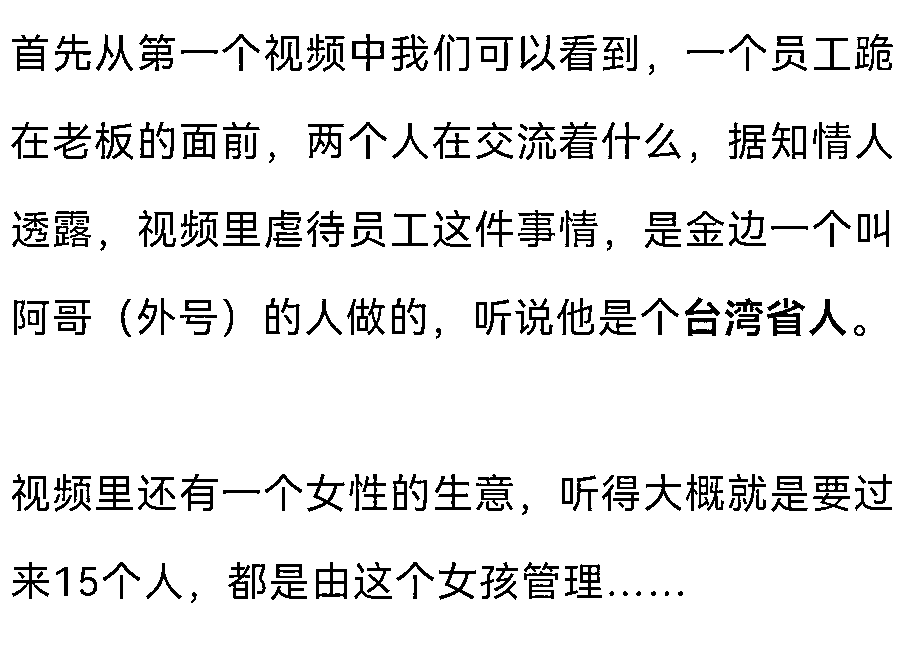
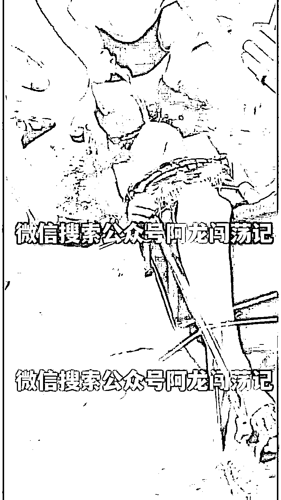
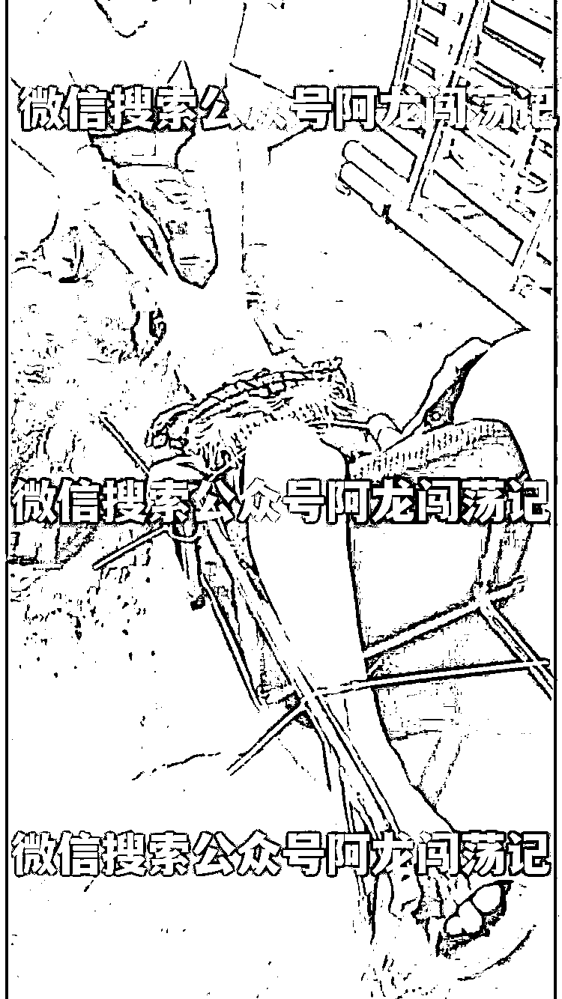
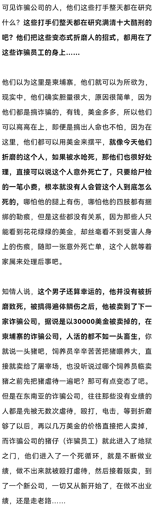
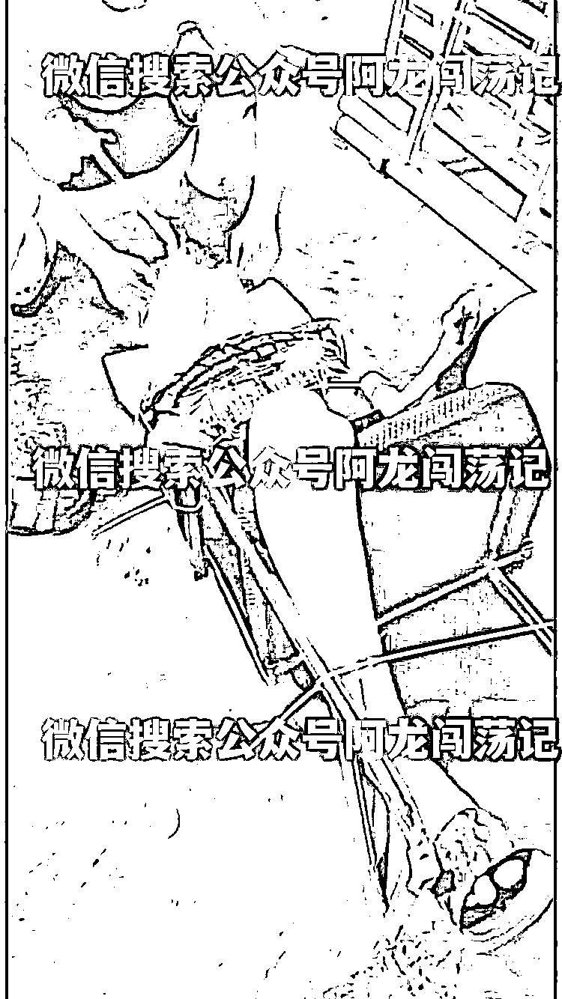
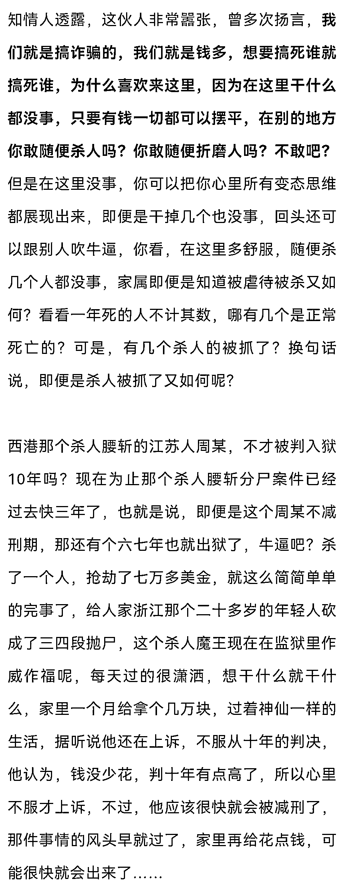
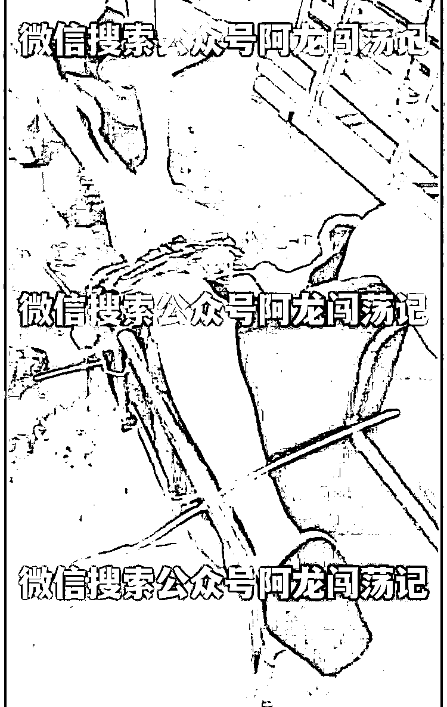
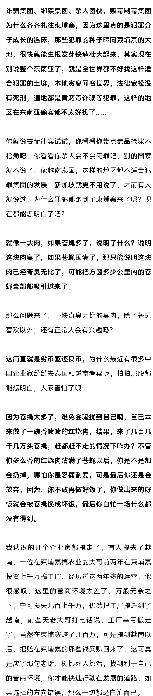

# 恐怖！柬埔寨网投园区诈骗公司再现残害同胞新酷刑（视频）

> 原文：[`mp.weixin.qq.com/s?__biz=MzIyMDYwMTk0Mw==&mid=2247538838&idx=4&sn=54c61b23401b414d225ffdd3f8e4099c&chksm=97cb93aea0bc1ab8d9be88f36fe777f7013c8b95d85c09c95e2a6d38264cba329278c1f521bb&scene=27#wechat_redirect`](http://mp.weixin.qq.com/s?__biz=MzIyMDYwMTk0Mw==&mid=2247538838&idx=4&sn=54c61b23401b414d225ffdd3f8e4099c&chksm=97cb93aea0bc1ab8d9be88f36fe777f7013c8b95d85c09c95e2a6d38264cba329278c1f521bb&scene=27#wechat_redirect)

今天一位粉丝发来几段视频给我，他说，这几段视频来自一个**柬埔寨微信群里**，是金边一家网投公司老板惩罚虐待员工，同时录下虐待视频传播出去，给自己公司的人看看，这就是不听公司要求，对完不成业绩的人惩罚。

[`mp.weixin.qq.com/mp/readtemplate?t=pages/video_player_tmpl&action=mpvideo&auto=0&vid=wxv_2460207546184499201`](https://mp.weixin.qq.com/mp/readtemplate?t=pages/video_player_tmpl&action=mpvideo&auto=0&vid=wxv_2460207546184499201)

本视频非作者拍摄（来源于柬埔寨微信群） 

[`mp.weixin.qq.com/mp/readtemplate?t=pages/video_player_tmpl&action=mpvideo&auto=0&vid=wxv_2460208836436295681`](https://mp.weixin.qq.com/mp/readtemplate?t=pages/video_player_tmpl&action=mpvideo&auto=0&vid=wxv_2460208836436295681)

本视频非作者拍摄（来源于柬埔寨微信群）

这个视频中我们能够看出来，受害人已经被转移了场地，而且他被人牢牢的捆绑在一张椅子上，这个时候我们能够看到受害人满脸的无助和落寞的神情，因为他不知道接下来他将要面对什么样的折磨，看着他达拉着脑袋，就显示出来无尽的痛苦，可是，他自己又无力改变，只能接受诈骗公司打手对他的折磨。

[`mp.weixin.qq.com/mp/readtemplate?t=pages/video_player_tmpl&action=mpvideo&auto=0&vid=wxv_2460208236181061634`](https://mp.weixin.qq.com/mp/readtemplate?t=pages/video_player_tmpl&action=mpvideo&auto=0&vid=wxv_2460208236181061634)

本视频非作者拍摄（来源于柬埔寨微信群）

大家通过照片都能看到吧？这名受害男子被牢牢的捆绑在椅子上，随后诈骗公司的打手们把椅子放倒，让他仰天躺着，随后有人给他的脸上铺了一条毛巾，然后，另一个人搬起一桶水，直接对着他的面部浇了上去……

当水浇下来侵透了毛巾以后，受害人不停的打嗝呕吐，但是，他四肢全部都被牢牢的捆绑上，只能抬头，而旁边的人则牢牢的按住他的头部，任凭水流铺到他的面部。

这个过程大家可以自行脑补一下，我记得我们大部分人是在电视剧中看到过这样的情节吧，应该是**旧社会监狱里折磨囚犯所使用的一种酷刑**，原本以为这种事情都是发生在影视剧中，可是，万万没想到，在现实中我们竟然真的看到了这种酷刑……

就像那些搞杀人绑架的，搞诈骗的，搞制毒工厂的，这些人怎么不敢跑越南去发展啊？因为不适合呗，越南是社会主义国家，至今还保留着死刑，做黑灰产业的人敢去吗？真要出事了，你拿多少美金也摆不平啊，所以，他们都会寻找适合他们生存和发展的场地……

而柬埔寨，对他们来说就是一块风水宝地，让他们的犯罪事业快速发展壮大，短短时间内就全部搞成了集团化，然后这些人就更改国籍，一些人手里甚至拿着四五本护照，都是为了以后躲避中国公安的追捕，但是……

正所谓人间正道是沧桑，正义可能会迟到，但是从来也不会缺席。

就像西港黑老大刘大卫一样，即便是自己买了台湾护照，又买了瓦努阿图护照，又骗去了柬埔寨国籍，又搞到了英国护照，可是，最后的结局如何呢？即便是他跑到了迪拜、格鲁吉亚躲避，可是依然被中国警方追缉，最后他在非洲乌干达准备过境刚果金的时候被抓捕归案，在一月初的时候由专机从非洲押解回国，等待他的注定是漫漫刑期……

那些残害同胞的人，请收手吧，**对于那些自愿偷渡到柬埔寨做诈骗的苍蝇，我们没有半点的怜悯之心，可是，对于那些被绑架，被欺骗，被贩卖到园区的人来说，他们是不是太冤枉了呢？人家明明不愿意做诈骗，却被诈骗公司打手强迫从事电信诈骗，继而导致怨声载道不断求救，这种情况就是有点反人类了，人家不愿意犯罪，偏偏绑架强迫人家违法犯罪，这样是不是太缺德了呢？**

小心点老天的报应吧，都说天道有轮回，你看苍天饶过谁？

对于那些在柬埔寨作恶残害同胞的人你们等着吧，自古以来善有善报恶有恶报，不是不报时日未到，等到报应来临的时候，你就知道作恶多端是没有好下场的。

当恶人横死街头之时，就是全柬埔寨中国同胞欢庆之日……

来源：阿龙闯荡记

](https://mp.weixin.qq.com/s?__biz=Mzg5ODAwNzA5Ng==&mid=2247487973&idx=1&sn=1b62da6f2018402862a5c375e10c355e&chksm=c06878b2f71ff1a4fbe7df4dec626aa7e696154751693bf16f6c6a302ceaa4d1959040c70518&scene=21#wechat_redirect)

← 向右滑动与灰产圈互动交流 →

