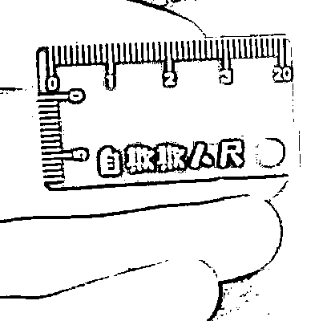

# 10 名“客服”被沈阳警方抓获，这是咋回事儿？

> 原文：[`mp.weixin.qq.com/s?__biz=MzIyMDYwMTk0Mw==&mid=2247538838&idx=7&sn=453439a902c87ef54cb0d734a1b3be99&chksm=97cb93aea0bc1ab8349be93b591d764c4d56ce19677065b2c1095a9ac146285d79b298443546&scene=27#wechat_redirect`](http://mp.weixin.qq.com/s?__biz=MzIyMDYwMTk0Mw==&mid=2247538838&idx=7&sn=453439a902c87ef54cb0d734a1b3be99&chksm=97cb93aea0bc1ab8349be93b591d764c4d56ce19677065b2c1095a9ac146285d79b298443546&scene=27#wechat_redirect)

同样是客服，有的为人民服务，有的专坑百姓，

近日，沈阳警方打掉一个为电信诈骗组织“吸粉引流”的犯罪团伙，

10 名“客服”人员被抓获。

01

**冒充信贷人员，诱骗让人加微信**

2022 年 5 月，沈阳市公安局苏家屯分局在工作中发现一条线索：一个犯罪团伙在苏家屯区某出租房内为电信诈骗组织“吸粉引流”。获得线索后，苏家屯分局立即抽调警力组成专案组，全力开展案件侦办工作。

经查，犯罪嫌疑人戴某（男，38 岁）、程某（男，33 岁）作为该团伙的组织者，雇佣多名“客服”冒充某银行金融信贷中心的工作人员，按照“上线”提供的电话号码和话术脚本，引诱有贷款需求的被害人添加诈骗组织提供的微信账号，每成功添加一人，戴某、程某二人便可从中获利。

在全面掌握戴某、程某及其团伙成员的犯罪证据后，6 月 1 日 6 时许，专案组展开收网行动，将该团伙 10 名犯罪嫌疑人抓捕归案。经审讯，戴某、程某等 10 名犯罪嫌疑人交代了冒充银行工作人员为“上线”诈骗组织进行“吸粉引流”的犯罪事实。据戴某等人供述，每成功添加一个微信账号，“上线”诈骗组织会给其 60 元“提成”。该犯罪团伙从事“吸粉引流”犯罪活动至今，已累计获利 10 万余元。

02

**添加一个微信获利 60 元**

犯罪嫌疑人之一的戴某供认，2021 年 9 月份左右，其在网上找赚钱的兼职工作，看到一个帖子说招聘网络吸粉客服。他就留言问待遇和操作方法，并按照对方的要求下载了一个 APP，对方在 APP 中教他如何购买非正常开卡的手机号用来频繁的拨打电话，并承诺打完电话，每成功加一个微信用户就提成 70 元人民币，扣除 10 元手续费后，可以赚 60 块钱。

戴某把整个的流程和操作方法弄明白之后，又找来他的朋友程某合伙一起做。二人又招聘了数人，做起了这种特殊的客服，戴某负责联系上家，程某负责培训新招来的客服和分配每日工作。

03

**为方便疯狂打电话，两人租了房子**

眼看“业务”规模越做越大，戴某和程某决定租个房子，他们在苏家屯区某小区租了一个日租房，戴某在网上花 700 元钱买了非正常开卡的 5 个手机号，又花了 1000 元左右在网上买了 5 个二手手机，用来拨打吸粉电话。程某对新招来的“客服”进行培训，并告诉他们，成功加一个微信就给他们 10 元的提成，这样戴某跟程某每单就能得到 50 元。

这个像模像样的“公司“就开起来了，每个员工一天能打 100 左右个电话，会有 15 个左右的用户加上线提供的微信号，招聘来的员工最多的时候 5 人、最少的时候 2 人。因为工作时间不固定，所以员工上班时间也不确定。今年 3 月份的时候因为房租到期，而且环境还不是很好，所以二人在苏家屯区某小区以每月 3000 元的价格租了一套别墅，为的是给“员工”打造一个舒适的工作**（骗人）**环境。

04

**为诈骗团伙吸粉引流 1000 多人**

就这样，戴某和程某两人一共为上线吸粉 1000 多人。两人向警方交代，他俩带着招聘来的客服，**平均打 10 个电话就能有一个人加微信**，从去年 9 月份至今一共能打了一万余次电话。每日工作结束后，上线陈某会告诉戴某微信群一共加了多少人，然后戴某和程某就让员工自己上报工作量，核实后按工作量给员工发放提成。

戴某还向警方交代，由于员工数量不固定，员工有时来有时不来的，而且这些员工都是程某招聘的，流动性很大。招来的客服也不签劳动合同，就是每日结算，干多少给多少钱。**“我们把工作场所尽量弄的像一个正规公司，因此很多招聘来的客服很努力，每个人每天能打 100 个左右的电话。”**

05

**非正常开卡手机号仍然是最大帮凶**

戴某和程某一共购买了 30 个左右的非正常开卡手机号，有一部分是上线陈某给他们提供的，陈某按照 700 元钱一张卡价格卖给戴某。还有一部分是经陈某介绍，戴某在网上花 7000 元钱购买 10 张卡。客服使用这些电话卡随机拨打电话，询问群众**是否想办理某某银行的信用卡？**如果得到对方的肯定回答，就让对方加微信号，这样就算完成一个吸粉任务。实际上他们并没有和任何一家银行合作过，这么说也都是因为这些都是上线陈某教的“话术”。

戴某和程某表示，招来这些客服，有些人是知道打这些电话是诈骗行为的，自称自己是银行的工作人员，都因为“话术”就是这么教的，这样说能赚提成。截止案发时，戴某、程某等 10 名犯罪嫌疑人从事“吸粉引流”犯罪活动，累计获利近 10 万余元。

06

**当客服，也可能成为诈骗犯！**

相关法律对这种从事吸粉引流犯罪活动有明确规定：**实施电信网络诈骗犯罪，犯罪嫌疑人、被告人实际骗得财物的，以诈骗罪（既遂）定罪处罚。****诈骗数额难以查证，但具有下列情形之一的，应当认定为诈骗罪规定的“其他严重情节”，以诈骗罪（未遂）定罪处罚：**

**发送诈骗信息 5000 条以上的，或者拨打诈骗电话 500 人次以上的；具有上述情形，数量达到相应标准十倍以上的，应当认定为诈骗罪规定的“其他特别严重情节”，以诈骗罪（未遂）定罪处罚。**

上述“拨打诈骗电话”，包括拨出诈骗电话和接听被害人回拨电话。反复拨打、接听同一电话号码，以及反复向同一被害人发送诈骗信息的，拨打、接听电话次数、发送信息条数累计计算。

很多人为了赚取不义之财选择铤而走险，以为被查获后，大不了就是个拘留完事。殊不知，**法律明确规定，诈骗罪既可以按既遂（骗成了）定罪，也可按未遂（不确定有没有骗成）定罪，诈骗未遂也有可能被判处 3 年以下的有期徒刑。**

目前，戴某、程某等 10 名犯罪嫌疑人因涉嫌诈骗犯罪已被警方依法采取刑事强制措施。

希望他们在未来的铁窗生涯中，能学会“以恶制恶”。

来源：沈阳公安反电信网络犯罪查控中心

](https://mp.weixin.qq.com/s?__biz=Mzg5ODAwNzA5Ng==&mid=2247487973&idx=1&sn=1b62da6f2018402862a5c375e10c355e&chksm=c06878b2f71ff1a4fbe7df4dec626aa7e696154751693bf16f6c6a302ceaa4d1959040c70518&scene=21#wechat_redirect)

← 向右滑动与灰产圈互动交流 →

