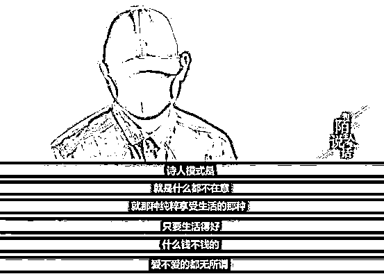

# “我不是处女！我有罪！” 揭秘“性邪教 PUA”背后的心理学

> 原文：[`mp.weixin.qq.com/s?__biz=MzIyMDYwMTk0Mw==&mid=2247538891&idx=2&sn=74a87dbf85cd4fecdd8cc2f3c3920111&chksm=97cb93f3a0bc1ae529ee8cdcbc6520608d88b5102b49652db0ffc0fd5d0f5b3949487c0bee53&scene=27#wechat_redirect`](http://mp.weixin.qq.com/s?__biz=MzIyMDYwMTk0Mw==&mid=2247538891&idx=2&sn=74a87dbf85cd4fecdd8cc2f3c3920111&chksm=97cb93f3a0bc1ae529ee8cdcbc6520608d88b5102b49652db0ffc0fd5d0f5b3949487c0bee53&scene=27#wechat_redirect)

** · 01 · ** 

**处女情结？不，情感操控！**

也许你还并不知道这个新闻。

2019 年双十二那天，当大家都在忙着购物和冲刺年终绩效。南方周末曝光了一件让人不寒而栗的事件。

事情的经过是这样的。

**北京大学法学院一位大三女生包丽，因为男朋友牟林翰的“处女情结”，被男友的精神折磨逼到服药自杀。**

女孩现在已经躺在医院的重症监护室 2 个月了。一个多月以前，医生对她父母宣布，女孩已经「脑死亡」。

女孩妈妈翻出了女孩事发之前和其男朋友的聊天记录，愤怒不已，认定了女孩轻生的真相： 

> 就是被他（男朋友）逼死的，他嫌弃我女儿不是处女，但又不想分手，而是以此折磨她。

记者、女孩的妈妈、包括不少网友，第一眼看到这个新闻，估计都以为这是一个仅仅有关“处女情结”的问题，但当女孩的朋友出来发文，把很多聊天记录完完整整曝了出来，**一些内容不免令人毛骨悚然······**

图为牟林翰和包丽的聊天截图，以及包丽生前发布的微博。据南方周末报道，包丽自杀前，**牟林翰曾向包丽提出过拍裸照、先怀孕再流产留下病历单、做绝育手等要求，并要求包丽叫他“主人”。**此外，牟还威胁包丽，如果她离开，就会把这些公布于众。

在这些聊天截图里，不难看到一个逐渐崩溃，逐渐被控制的女孩；

一个冷漠残忍，一步步把女孩引入深渊的恶魔；

**还有中间暗藏的被人称为性邪教 PUA 的影子......**

这确实是一个由处女情结引发的悲剧，但“处女情结”并不是重点。重点在于这男生是如何一步步把这女孩洗脑，最后引导到这一步的。

真相，远比我们知道的更可怕......

** · 02 · **

**小心 PUA 陷阱！**

PUA 这个组织，很多人可能觉得陌生。

**Pua 全称是 Pick-up Artist，叫搭讪艺术学：教一些跟异性有交往障碍的男士，让他们最终能成为幽默的社交达人。**

这本身没什么问题，搭讪，聊天嘛。

但后来，这个词，完全变了意思，完全变了性质。

今天，PUA 者最大的目的就是：**疯狂猎艳，使用套路，不择手段地骗人上床，并进行情感控制、榨取钱财和鼓励自杀。**

主要套路有以下几点（建议女孩们仔细阅读）：

说了这么多，其实他们就一个目的：将女生骗上床，从主动搭讪开始直到发生亲密关系。

**很多单纯女孩上当受骗，被抛弃后甚至自残！**

关于 PUA，网上有很多文章，随便翻一翻，就能把 PUA 扒的一丝不挂。

例如这种：

再比如这种：

网上还有一些受伤女孩的被骗经历：

看完这些文章，只有一个感受：

被骗的后果真惨！这些 PUA 真可怕！

** · 03 · **

**让无数女孩屡次受侵害的 PUA,**

****究竟有什么手段？****

****为什么 PUA 会屡屡得手？为什么女生难以逃出魔爪？****

****其实，**早期的 PUA 是一门严肃正经的心理学，就是为了帮男性更好的与异性沟通。******

****但是它熟谙女性心理，被一些人利用为情感欺骗和心理操控术，成为“不良 PUA”，变成了一种骗财、骗色、诱奸的手段。****

********

****不少人觉得，花巨额学费去学泡妞，并不会有男生上当。****

****但对于那些恋爱受阻，情场失利的男生来说，PUA 是他们能够获得异性青睐最直接的捷径了。****

****不良 PUA 的组织就以此为噱头，**直接承诺只要你报班学习，就能保证你一个月推倒多少女性。******

********

****PUA 的恐怖恶心之处从他们的课程中就能感受到：“极恶心态铸成术”、“疯狂榨取”、“宠物养成术”、“一夜连推”。****

****其中“禁术、自杀鼓励”等已经涉及到犯罪。****

********

******他们视感情为游戏，视女性为玩物。******

******甚至将女性为他们自杀作为功绩到处炫耀。******

********

****腾讯自制节目《和陌生人说话》里面 PUA 上瘾林晨讲述了自己的经历。****

****在学习 PUA 的三年里，他骗了 400 多个女孩。****

******“如果恋爱是场游戏，那我要玩到最强王。”******

********

****他已经失去了作为一个人应该有的良心和感知，他像疯了一样的追求越来越多的女性。****

****只不过是为了证明在他所谓的爱情游戏里，他是最强的。****

****女性的自残自杀对他来说就是游戏的奖励而已。****

******他们经常用五步陷阱法和三种人设来引诱女性。******

********

****在骗局开始前，他们都会先营造好人设，微信朋友圈，微博等。****

****每个人都轮流拍照，摆拍一些高大上的照片精选挑选，然后发到社交软件上。****

****看到这些图，有些女生就以为这人非富则贵，而且有情趣，有品味，简直是白马王子一样的存在。****

****于是好感就来了，防御感就少了。****

******一旦防御弱化，那么就会被不良 PUA 带入坑。******

********

****◆ 第一步：好奇陷阱****

****就是通过伪造一个虚拟的人设或各种小技巧引起女生的好奇。****

********

******常见的几种人设有：帝王模式、浪子模式、诗人模式。******

****● 帝王模式：演一个事业有成的成功人士，但是命运坎坷，曾因为物质条件不好，被女友抛弃。****

********

****一个不良 PUA 受害者说，她认识了一个高材生，对方谈吐优雅，细心幽默。****

****相处一段时间后自己怀孕了，他却消失了，后来一打听，才知道对方就是个无业游民。****

****每天专门泡夜店去酒吧咖啡厅，就是为了寻找合适的猎物。****

******当你享受真爱带来的心动时，对方的脑子里想的却是“还成，这套挺管用的”。******

****● 浪子模式：也给受过很多伤，不再相信感情，缺爱的花花公子。****

********

****他们会编撰一个听起来凄惨无比的故事，让善良的女生产生同情心。****

****女生会觉得他是可怜的无辜的，甚至也是“受害者”。****

****殊不知，自己才是受害者，正一步一步走向他的圈套。****

********

****● 诗人模式：才华横溢，但又什么都不在意，钱和爱都无所谓。****

********

****我喜欢玩乐，喜欢旅行拍照，享受人间的美好，在他的朋友圈里尽是岁月静好，人间值得。****

****他会唱歌弹吉他，也会画画论诗词。****

****跟这样的才子在一起，你只需要享受浪漫就好。****

********

****但诗人模式需要有极高的领悟力，要有扎实的文化功底，不然真遇到文化人，很容易露馅。****

****他们一旦确立了自己的人设，就会融入角色，改造外表形象，编造经历，或发假的朋友圈等。****

****都是为了完善自己的人设，从而让女生相信他是真的如他外表所展现的那样。****

****你是不是也想问，这不就是骗吗？****

******是的，这就是骗。******

********

********

****◆ 第二步：颠覆人设****

****有了刚开始建立的人设，接下来，他会颠覆那个人设。**** 

****你以为他是浪子，其实他是为情所伤；你以为他是成功人士，应有尽有，其实他一个人很孤独。****

********

****目的只有一个，让你不知所措，母爱泛滥，激起你的保护欲，圣母心。****

****你以为你是来拯救他的，是那个例外和真爱。****

******其实，你只是他聊天列表里的一个胜利的符号。******

****◆ 第三步：建立契约****

****不良 PUA 会利用你的心疼和拯救欲，马上诱导你表白，和你建立情感契约。****

********

> ****“你是不是喜欢我？”**** 
> 
> ****“你为什么对我这么好？”****
> 
> ****“我对你来说是不是不一样的？”****

********

********

****女孩都容易爱上自己的想象力。****

****在对方的不断暗示下，你的潜意识会被强化，就以为自己真的非常的爱他。****

****◆ 第四步：自尊摧毁****

********

****当女孩已经爱上他以后，全心全意地沉浸在爱情中，这时，不良 PUA 就会翻脸。****

******他会想方设法地找茬，让你有负罪感。******

****找到你一丁点的小错误，然后不断的放大，让你觉得你亲手摧毁了这份感情！****

********

****人是有损失厌恶的，就是说同样一个东西，失去它的影响是得到的两倍。****

****比如你有一个东西，哪怕是你不用，但它毕竟是你的，可如果是丢了，你就会觉得很难受，比得到它还难受。****

********

****PUA 会不断的暗示你，这份好好的感情被你毁了，这个时候你会委屈、自责甚至失去了理智。****

********

****你会疯狂地证明自己，希望可以挽回。****

****你才发现，自己竟然那么爱他，爱到无法自拔。****

****其实，这都是他给你施加的心理暗示，**事实上，你并没有想象中那么爱他，甚至你都未必喜欢他。******

****只是在一次次的打压—鼓励的循环中，你已经习惯了这样的模式，根本没有意识到问题所在。****

****◆ 第五步：情感虐待****

****这一步已经触及法律边缘，它涉及到了暴力、诱骗、鼓励自杀等行为。****

******在这些人心中，女性根本不是人，是物，是奴，是宠物。******

****光是得到身体还不够，他们还会用尽手段欺骗女生的钱财。****

********

****他们觉得，只要一个女人为你自杀过，她就死都不会离开你了。****

****因为一个女生开始自我牺牲时，她已经失去了自己真实的意识，变成了对方的牵线木偶。****

********

****或许，你根本想不到，你看中的这个“真命天子”，竟然是一个彻头彻尾的骗子。****

****对他而言，你不过是个宠物。****

****他的真心只有一个，那就是得到你的身体和钱财。****

******他们像是你生命中的黑洞，将你的能量，你的光都吸进去，让你生活在他的阴影之下。******

****等到榨干你全部的利益，就丢在一旁，任由你自生自灭。****

******你以为他是你的光，其实，他才是那堵挡住你生命之光的墙。******

********

******** 

****** · 04 · ******

******女孩如何避免遇上 PUA？******

****据不完全统计，目前在多家知名网站上，PUA 发展学院已达 182.3 万人。****

****难以想象：有多少女生被欺骗！****

****在这个 PUA 横行的时代，**作为女孩又该如何识别，如何避免被 PUA 渣男骗呢？******

******首先，不要从朋友圈里认识一个人，这是 PUA 骗局的支点。******

****那些看着高大上，晒着各种酒店、旅游街拍的照片的朋友圈，都是为了更好的达到他们的目的，营造的各种假象。****

****朋友圈里怎么识别 PUA，这是网友总结的套路。****

********

******其次，对任何一个男生，从认识到确定恋爱关系，至少要一个月，这是原则。******

****并且保证，从开始恋爱，到发生关系，至少三个月（时间可以自己设定）。****

****因为 PUA 们最大的特点就是：用最短时间，最少的成本，和你发生关系。****

****换句话说，这也是他们攀比炫耀的资本，如果费时太长，对他们来说还不如换下一个目标。****

********

******最后，女孩们一定要警惕这样一些人。******

****比如：一上来就给你讲自己故事的人，剧情炸裂、悲惨的童年，及悲惨的恋爱经历；为情所伤的“浪子”，寂寞空虚的“帝王”，文艺青年的“诗人”。****

****这么做的目的，只是为了提高他们撩妹的成功率罢了。****

****除此之外，还要警惕那些每天花太多时间在手机和网络社交上的人，除非他是靠互联网谋生；****

****无正经职业/工作很闲有大把精力且没有爱好。****

****姑娘们，记住，遇见心仪的男生的时候，不要着急。**慢慢的相处，慢慢的了解，**当他急于得到你的身体，或不时的打压你，请不要怀疑，赶紧走，或打车跑！****

****请记得，你值得被爱。****

****祝愿天下女孩都能谈一场坦荡荡的恋爱。****

****来源：大 R 说安全，中国反诈骗联盟，大 R 科普，大 R 警示，大 R 普法，网络等**** 

************](https://mp.weixin.qq.com/s?__biz=Mzg5ODAwNzA5Ng==&mid=2247487973&idx=1&sn=1b62da6f2018402862a5c375e10c355e&chksm=c06878b2f71ff1a4fbe7df4dec626aa7e696154751693bf16f6c6a302ceaa4d1959040c70518&scene=21#wechat_redirect)****

****← 向右滑动与灰产圈互动交流 →****

********