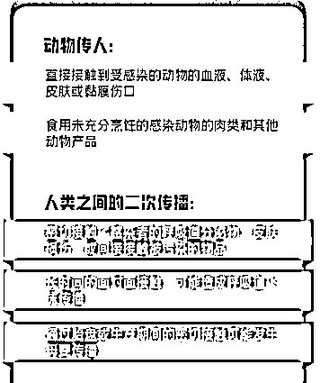
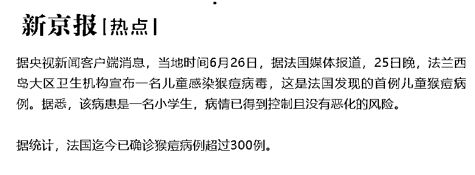

# 突发！中国惊现首例猴痘！密接 19 人！新冠、流感...最担心的事情正在发生

> 原文：[`mp.weixin.qq.com/s?__biz=MzIyMDYwMTk0Mw==&mid=2247538891&idx=4&sn=9c79e800b99d4cec70aa29a429aedb2a&chksm=97cb93f3a0bc1ae5e1c37098fad9471da09f67816a0dad4dfb85304c68d26ee9c2593deefb6e&scene=27#wechat_redirect`](http://mp.weixin.qq.com/s?__biz=MzIyMDYwMTk0Mw==&mid=2247538891&idx=4&sn=9c79e800b99d4cec70aa29a429aedb2a&chksm=97cb93f3a0bc1ae5e1c37098fad9471da09f67816a0dad4dfb85304c68d26ee9c2593deefb6e&scene=27#wechat_redirect)

**0****1**

**猴痘疫情警报正在全球拉响。**

**截至目前，全球已经有 48 个非猴痘流行国和地区报告了超过 3500 例猴痘病例，且有一人死亡。**

****

**最让人感到忧心的是，猴痘病例出现的位置，也离我们越来越近。**

****6 月 21 日，新加坡报告了首例猴痘病例。****

**新加坡方面称，该名猴痘患者是一名 42 岁的英国空乘，15-17 日在新加坡停留，19 日再度进入新加坡后，在 20 日确诊猴痘被收治，目前正在接受隔离观察。**

****6 月 22 日，韩国报告了首例猴痘病例。****

****

**韩国方面称，该名病例是 21 日从德国经仁川国际机场入境，在入境前就出现了感染猴痘的症状，因此被归为疑似病例，入境后就被送到医院治疗，没有造成韩国境内传播。**

****6 月 24 日，我国台湾地区也报告出现了首例猴痘病例。****

****

**台“疾病管制署”24 日公布台湾首例境外输入猴痘确诊病例，为台湾南部 25 岁的男性。**

> **该病例详情： **
> 
> **患者于 2022 年 1 月至 6 月至德国读书；6 月 16 日搭机返回台湾； **
> 
> **6 月 20 日出现发烧、喉咙痛、肌肉酸痛、红疹、鼠蹊部淋巴肿大等症状；**
> 
> **6 月 21 就医； **
> 
> **6 月 22 日医生评估、接受相关采检；**
> 
> **6 月 24 日被确认感染猴痘病毒，目前在隔离病房接受治疗。**

****

**目前，其密切接触者共 19 人，包含家人 2 人、医疗相关人员 10 人、司机 3 人及其他人员 4 人，预计健康监测至 7 月 13 日。**

**据了解，**猴痘是一种病毒性人畜共患病，**因为最先发现这种“痘症”传染病是在猴子身上，所以命名为“猴痘”。**

**除了猴子，老鼠、松鼠等啮齿动物也有可能携带、传播猴痘病毒。**

****

**但令人不安的是，这些病例中，很大一部分都没有去过非洲猴痘流行地区，病例之间也没有关联。** 

**也就是说，不知道他们从哪感染的，未来有可能发现更多病例。**

****

**其次，**猴痘在人际间传播很罕见。****

**以往猴痘都是动物传给人，人传人很罕见。**

**现在已知的是，人际间传播需要人和人亲密接触，除了性传播外，还有皮肤传播。**

**触碰到感染者破损的皮肤、粘膜、体液、呼吸道飞沫，甚至是被污染的物品、脓包掉落的疤，都会被感染。**

****

**总体而言，这轮猴痘疫情史无前例，需要我们密切关注。**

****0****2****

****猴痘疫情在全球暴发是不寻常，且令人担忧的。近日世卫组织的一场紧急会议，更是令全世界再度紧张起来……****

****当地时间 6 月 23 日，世卫组织在日内瓦多国猴痘疫情召开紧急会议，评估目前猴痘疫情是否构成“国际关注的突发公共卫生事件”。****

********

****要知道上一次 PHEIC 事件是 2020 年 1 月 30 日，世卫组织宣布新冠疫情构成国际关注的突发公共卫生事件。****

****6 月 25 日，世卫组织宣布：**现****阶段猴痘疫情不构成“国际关注的突发公共卫生事件”，**但需控制疫情以防其进一步蔓延，同时应密切监测疫情，委员会建议在几周后再次对猴痘疫情进行评估。****

********

****然而没想到的是，6 月 26 日，法国报告了一名小学生猴痘感染者……****

********

****在此之前，大家发现大多数病例都是发生在年轻男性身上，认为猴痘主要与性行为有关。****

****而小学生被感染，却证明了和猴痘患者有过密切身体接触的人群，不发生性行为，也很有可能会被传染。****

****谭德塞表示：****

> ******“人与人之间的传播正在进行，（严重程度）可能被低估了。”******

********

****最新科研成果更是令人担忧：**猴痘病毒正在急速突变，比他们预期的速度要快 12 倍。******

****6 月 24 日，《自然》杂志发布了一项关于猴痘的新研究。****

****来自葡萄牙里斯本国家卫生研究所的医学博士戈麦斯表示：****

> ******病毒急速突变，更加适应人类免疫系统。******

****一般来说，猴痘这种病是很容易发现的，也非常好控制。****

****然而这次疫情有所不同，世界各地迅速发现了大批病例。这可能预示着一种更具传染性的病毒变种正在酝酿之中。 ****

******0****3******

******一波未平一波又起，猴痘病毒来势汹汹，我国南方的流感感染人数也是骤增。******

******据国家流感中心发布的全国流感监测信息显示，2022 年 6 月以来，我国南方部分省份进入流感高发期，且流感样病例在门诊中的比例持续增加，流感病例数创近年同期新高。******

******福建、广东、海南、江西等地接连发出紧急预警。****** 

************ 

******据了解，流行性感冒，简称「流感」，是由流感病毒引起的一种传染性强、传播速度快的急性呼吸道传染病。******

******最常见的流感起病突然，畏寒、寒战，高热、体温可达 39 至 40 度，伴头痛、全身肌肉等关节酸痛、极度乏力、食欲减退等全身症状，常有咽喉痛、干咳，可有鼻塞、流涕等。******

************

******究其原因，有病毒学专家表示，是因为“新冠防控减少了公众与呼吸道病原体的接触，群体免疫减弱，加上我国低迷的流感疫苗接种率碰到新冠疫情“雪上加霜”。******

******新冠、猴痘、流感，不少网友表示，这可真是一个多事之秋啊。******

************

******甚至还有网友哀嚎：****** 

> ******“新冠-老人，肝炎-儿童，猴痘-年轻人。真是人类消减计划。”******

************

******可实际上，在历史的长河中，传染病一直都在，只是以前的人不知道而已。******

******所以，我们完全没必要灰心丧气，觉得这个世界不会好了。******

******随着科技的发展，专业人士能越来越早地监测到病毒的存在，并控制病毒的蔓延，采取有效措施对症下药。******

******而我们普通人能做的，就是**不要过分恐慌，也不掉以轻心。********

******来源：大 R 说安全，微博，百度，Daily Mail，澳洲之有问必答****** 

******************](https://mp.weixin.qq.com/s?__biz=Mzg5ODAwNzA5Ng==&mid=2247487973&idx=1&sn=1b62da6f2018402862a5c375e10c355e&chksm=c06878b2f71ff1a4fbe7df4dec626aa7e696154751693bf16f6c6a302ceaa4d1959040c70518&scene=21#wechat_redirect)******

******← 向右滑动与灰产圈互动交流 →******

************