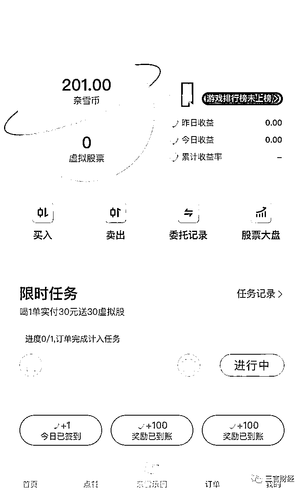

# 奈雪的茶推虚拟股票，网友称“我看刑”，律师称涉嫌违法

> 原文：[`mp.weixin.qq.com/s?__biz=MzIyMDYwMTk0Mw==&mid=2247538891&idx=5&sn=9c6b85428901bc5c49b72261d9d42d4c&chksm=97cb93f3a0bc1ae594b1a89d3e78af5f40d342d623bb4f0101330913aeb1471c5682b719fe6c&scene=27#wechat_redirect`](http://mp.weixin.qq.com/s?__biz=MzIyMDYwMTk0Mw==&mid=2247538891&idx=5&sn=9c6b85428901bc5c49b72261d9d42d4c&chksm=97cb93f3a0bc1ae594b1a89d3e78af5f40d342d623bb4f0101330913aeb1471c5682b719fe6c&scene=27#wechat_redirect)

三言财经消息，6 月 30 日，奈雪的茶上市一周年当天，宣布推出喝茶送虚拟股票活动，实付满 30 元可获赠 30 股虚拟股票。30 股约可在奈雪币商城兑换 3 元礼券。

#奈雪的茶向 5000 万会员推出虚拟股票#话题更是登上微博热搜榜首。

新浪科技还发起一项投票：奈雪的这个新玩法有吸引到你吗？

截至发稿，共有 6166 人参与投票，其中 1200 人表示有被吸引到，很感兴趣；4124 人表示没有被吸引；842 人表示需要再观望一下。

有网友认为，奈雪这是非法集资；有网友认为这是在打政策监管的擦边球，“我看刑，奈雪有判头”。

也有网友认为，所谓的虚拟股票其实就是积分。

那么，奈雪退出的虚拟股票到底怎么玩？是否真的违法呢？

### **虚拟股票与真实股价挂钩** 

### **最多可加 10 倍杠杆**

据介绍，自 6 月 30 日起，奈雪会员积分全新升级为奈雪币。每消费 1 元，得 1 个奈雪币。每周三会员日，消费可得双倍奈雪币。

在奈雪币商城，100 奈雪币可以兑换 3 元心意券；450 奈雪币可以兑换 5 元心意券；900 奈雪币可以兑换 10 元心意券；2700 奈雪币可以兑换 30 元心意券。

奈雪币足够多的话，还可以兑换一些实物。比如，20 万奈雪币可兑换一台 MacBook Air。

同时，奈雪币还是奈雪虚拟股票游戏的游戏币，可使用奈雪币买入/卖出虚拟股票。奈雪港股真实收盘价*港币兑换人民币汇率=虚拟股价。即，真实股票涨跌=虚拟股票涨跌。

买入股票就是将奈雪币兑换为虚拟股票；卖出股票则是将虚拟股票兑换为奈雪币。

交易规则如下：

1.委托买入/卖出成交的虚拟股价，按奈雪的茶港股交易日收盘价*港币兑人民币汇率(以中国人民银行官网公布的汇率为准)保留 2 位小数点，进行游戏成交;

2.港股交易日 16:00 前(不含 16:00)发起委托申请的，虚拟股价将参照奈雪的茶当日股票的收盘价为基准进行成交

3.港股交易日 16:00 后(含 16:00)或非交易日发起委托申请的，虚拟股价将参照发起委托申请日后的下一个港股交易日奈雪的茶股票收盘价为基准进行成交;

4.港股交易日 16:00-17:00 为预计结算时间，该期间不可进行委托买入/卖出，结算完成时间以实际页面显示为准。

笔者在“奈雪乐园”页面完成限时任务，获得了 201 奈雪币的奖励。

奈雪港股今日收盘价为 6.65 港币/股，按照今天的汇率计算，奈雪虚拟股价约为 5.65 奈雪币/股。若以此计算，笔者所获得的 201 奈雪币奖励，大约可以买入 35 股奈雪虚拟股票。

如果想大幅增加虚拟股票收益，可加入杠杆借币玩法，选择 x2 / x5 / x10 倍杠杆，即可借用奈雪币 N 倍买入虚拟股票。

这里奈雪给举了一个例子。

假设虚拟股价为 5 奈雪币/股时，会员以 100 奈雪币本金加 5 倍杠杆，即 500 奈雪币买入 100 股，则相当于会员向奈雪借用了 400 奈雪币。

若虚拟股价上升至 10 奈雪币/股时，回员将 100 股卖出可获得 1000 奈雪币。归还借用的 400 奈雪币后，除去原始资本 100 奈雪币，会员净赚 500 奈雪币。

若虚拟股价下跌至 3 奈雪币/股时，会员所持股票仅价值 300 奈雪币，不足以归还借用的 400 奈雪币，持有股票数将被强制卖出清 0，且仍借款 100 奈雪币。若会员再次参与游戏则需要先归还 100 奈雪币。

### 律师：存在金融风险

### 奈雪：可能一夜清零，奈雪币说没就没

有不少网友认为，奈雪虚拟股票是在打擦边球，可能违法。

据新浪港股消息，有分析人士对此表示，“不违法，只要没有交易功能和投机功能就不违法。”

不过，奈雪虚拟股票与真实股价挂钩，还可以选择加杠杆。因此，也有观点认为，奈雪推出虚拟股票的做法有引导消费者进行投机活动的嫌疑，操作或涉嫌违规。

另据凤凰网科技报道，万商天勤(上海)律师事务所合伙人朱永红律师表示，奈雪的茶使用虚拟股票目的可能是商家为了炒作。因对消费者使用虚拟股票即消费型股东涉及人数较多，不排除鼓励多消费，变相吸收社会资金，并使用虚拟币进行交易，有涉及非法集资等金融风险。

太琨律创始合伙人朱界平律师表示，奈雪的茶虚拟股票涉嫌违法，存在金融风险。根据《公司法》第一百二十八条的规定，股票采用纸面形式或者国务院证券监督管理机构规定的其他形式。可以看出，股票必须符合证券监督管理机构规定的形式，不得随意创制。此外，股票涉及到有关的交易也必须符合法律的规定。

去年 6 月 30 日，奈雪的茶上市首日即破发。至当日收盘，股价报 17.12 港元每股，较发行价 19.8 港元每股下跌 13.54%。按照今天 6.65 港元每股的收盘价计算，奈雪股价已下跌超 66%。

这一年来，奈雪的股价一直都表现不景气。

虽说奈雪虚拟股票并未涉及真实资金交易，不会直接对消费者造成资金损失，但毕竟与真实股价挂钩。

奈雪也提醒了会员：有可能一夜暴富，奈雪币大幅翻倍；也有可能一夜清零，奈雪币说没就没。

来源：三言财经

](https://mp.weixin.qq.com/s?__biz=Mzg5ODAwNzA5Ng==&mid=2247487973&idx=1&sn=1b62da6f2018402862a5c375e10c355e&chksm=c06878b2f71ff1a4fbe7df4dec626aa7e696154751693bf16f6c6a302ceaa4d1959040c70518&scene=21#wechat_redirect)

← 向右滑动与灰产圈互动交流 →

