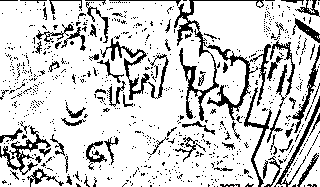

# “唐山打人案”7 男 2 女关系全曝光！疑似保护伞被揭…

> 原文：[`mp.weixin.qq.com/s?__biz=MzIyMDYwMTk0Mw==&mid=2247538978&idx=2&sn=f02d878261647114608687fa2f768682&chksm=97cb921aa0bc1b0c9e799dd69f37cf69e9dba361e1b83c956f8501a2f5b4c96d9b322c9a7033&scene=27#wechat_redirect`](http://mp.weixin.qq.com/s?__biz=MzIyMDYwMTk0Mw==&mid=2247538978&idx=2&sn=f02d878261647114608687fa2f768682&chksm=97cb921aa0bc1b0c9e799dd69f37cf69e9dba361e1b83c956f8501a2f5b4c96d9b322c9a7033&scene=27#wechat_redirect)

**唐山“全国文明城市”资格被停止** 

唐山打人事件的效应仍在放大！

近日，中央文明办停止了唐山“全国文明城市”资格。

此前曾有报道——

第六届全国文明城市，在复查确认保留荣誉称号的前五届全国文明城市 151 个全名单中，**唐山市、迁安市榜上有名**。

（防失联请复制加微信：**RC-0591 **注明读者）

“全国文明城”市唐山干了啥？

6 月 21 日，河北省公安厅发布《关于陈某志等涉嫌寻衅滋事、暴力殴打他人等案件侦办进展情况的通报》，说明了一切。

****

****公开说谎的的民警被查****

**6 月 21 日，河北省纪检监察机关对唐山打人案及其他相关案件涉及的公职人员涉嫌严重违纪违法问题，依纪依法开展审查调查。**

**马爱军**

****唐山市路北区政府党组成员、副区长，市公安局路北分局党委书记、局长马爱军，正接受审查调查。****

**被审查调查的还有：**

****唐山市公安局路北分局机场路派出所所长胡斌****

****长虹道警务站副站长韩志勇****

****机场路派出所民警陈志伟****

****光明里派出所原所长范立峰****

**被查的 5 名公职人员中，陈志伟曾接受总台记者采访。**

**6 月 12 日，中央广电总台中国之声发布《警方回应烧烤店打人案：接警后 5 分钟赶到，5 名嫌疑人有前科》一文。**

**其中，陈志伟介绍，受伤的四名女子其中两人伤情较重，在辖区某医院接受治疗，伤情稳定；另两名女子伤势较轻，未住院治疗。**

**陈志伟称，**“****6 月 10 日凌晨 02:41，我单位接到 110 指挥中心派警，接到报警后，我单位 02:46 左右赶到现场****，第一时间询问现场人员，了解案发经过。案发后，打人男子均逃离了现场。”****

**但根据河北省公安厅今天的通报中提到，唐山市公安局路北分局机场路派出所民警率辅警于 3 时 09 分赶到现场开展处置工作。**

**这与此案最初当地派出所对媒体表示的，在接警后仅 5 分钟就赶到的时间点 2:46，差了 23 分钟。**

**这个 23 分钟时间差，引起了公众的广泛关注。**

**唐山打人案出警时间公布：**接警后 28 分钟民警率辅警赶到现场**。**

**河北省公安厅提到，公安警务督察部门会同纪检监察机关及时介入，**对出警不及时、执法不规范及严重违纪违法问题开展深入调查**，目前已有警务人员接受纪律审查和监察调查，**唐山市公安局对路北分局副局长李某予以免职**。**

********

******原所长范立峰****涉陈继志非法拘禁案******

****另外，通报中提到，光明里派出所原所长范立峰正接受纪律审查和监察调查。****

****此人涉及陈继志的另一个案件。****

****河北省公安厅在通报中提到，2015 年 12 月 12 日，陈某志以追讨索要债务为由，指使刘某、高某、侯某亮、王某对商某凯实施殴打后非法拘禁，经伤情鉴定商某凯为轻伤。****

****据此前媒体报道，一个名为“路北巡控”的美篇账号曾在 2019 年 7 月 3 日发布名为“110 那些事——光明里派出所抓获一名涉嫌非法拘禁的网上逃犯”的文章。通过对比该篇文章内的案发时间、地点、涉案人员姓名等信息，可知与前述警方通报和裁判文书中的案件为同一起。****

****文章提到，陈某志等人在大院将商某凯殴打后，将其关在车的后备箱长达十个小时。****

******时任光明里派出所所长的范立峰，当时针对此案专门成立破案小组。******

********

******“九渣”身份被揭******

****唐山暴徒打人事件，发酵至今，包括陈继志在内的 7 男 2 女，他们的身份背景被一一被扒开。****

****这场聚会，本来就是一场不单纯的“预谋”。****

****让我们把时间拉回 6 月 10 日凌晨 2 点。也就是“打人事件”的当晚，9 人相聚在烧烤店，美其名曰“谈生意”。****

****谈的当然不是正经生意。而是地下赌场，世界杯期间的地下赌球。****

****代入这一点，再来看看几位主犯，几位“大哥”几位“马仔”一目了然。首先就是绿衣外套男，陈继志。他是唐山本地人，也是赌球的“老手”了。****

******** 

****有跟陈继志合作过的人，在媒体采访中爆料：“最近几年，陈继志在做赌球，自己坐庄组织当地人参与，上一届世界杯期间，赚了不少钱。”****

****今年 2022 年的世界杯，还有不到半年即将开幕。看来陈继志是想故技重施，再捞一笔。****

******** 

****他早就借着赌博坑过不少同乡人。2014 年，陈继志就带着两个唐海县的人到澳门赌博，这一趟两个人被坑了 80 万。****

****赌黑球，利润大，陈继志必然会拉上自己的小弟。也就是视频里打人最狠的，白衣胖子刘涛。这哥俩曾经一起追过债，把人打成过重伤，刘涛还在大院蹲了一年多。****

******** 

****刘涛出来之后，就直奔他曾经的大哥陈继志。****

****为了把“赌球”这一局做大，他们还从江苏约来了 4 位朋友。****

****这 4 个人分别是：陈晓亮，李鑫，沈小俊，马云齐。****

****最后被抓到的沈小俊，虽然口口声声说自己没参与打架，称自己冤枉，但他可真不冤。****

******** 

****开着迈巴赫 S480 的沈小俊，看配置就是江苏 4 人中的大哥。****

****这 4 个人中，3 人有前科。跑丢鞋的大哥沈小俊，聚众斗殴进去过，聚众赌博被判过刑。红衣服的陈晓亮，曾因开设赌场罪被捕，判了 3 年。黑衣 boy 马云齐，也因聚众斗殴犯过事。****

******** 

****然而改造之后，他们并没洗心革面。还是想着走非法途径，赌球坐庄吃黑钱。两边山头一碰面，这些人聚在一起，原本就是不单纯的地下赌场合作。****

************

********01.绿衣男——陈继志********

******陈继志就是视频中身穿绿衣服的男子，他是群殴事件的始作俑者及主要施暴者。******

******陈继志本人身份不简单，表面是唐山本地一家水产养殖场的老板，但实际上他是具有多项前科的劣迹人员。******

******2015 年，陈继志伙同刘涛等五名男子将唐山商先生打至粉碎性骨折后，又将他关进后备箱长达十个小时。******

************

******陈继志和刘涛等人，被判故意伤害罪，以及非法拘禁罪。这个刘涛正是烧烤店事件中的白衣男子。******

******裁判文书显示陈继志“刑拘在逃”，也就是说他犯事了，但一直潜逃在外，并且曾因为不当得利被列为失信人员。******

********这就是陈继志神奇的地方，作为“刑拘在逃”人员，在信息化的时代，在人人必备健康码、行程码的这两年里，在号称防疫“最硬核”的唐山，他竟然还能开水产养殖场。********

********02.白衣男——刘涛********

************

******刘涛比陈继志小一岁，从上文就知道，他与陈继志早在 2015 年就认识，并且还是一起犯过事的“交情”。******

********刘涛犯事后直到 2018 年才被捕，最终获刑两年零一个月，但 2020 年出狱后又和陈继志搞在一起。********

******这二人的关系非常铁，刘涛可以算是陈继志的铁杆小弟。******

********03.红衣男——陈晓亮********

************

******陈晓亮就是车牌尾号为 7777，奔驰迈巴赫的车主，这辆车据说价值近 200 万，可以说非常有钱。******

********此人在 2020 年时，就因为开设赌场罪被判刑三年，不过在服刑期间，却获得了减刑的机会。********

******有网友说陈晓亮参与了群殴，也有网友没看见他动手，具体情况有待警方调查清楚。******

********04.黑衣 BOY——马云齐********

************

******90 后马云齐，他身穿黑色短袖，上面印有大大的 BOY。他的这种穿着已经被网友列为现实中遇到要远离的人物之一。******

********马云齐打起人来和陈继志不分上下，下手都非常狠，也是他拽着白衣女子的头发将女孩就地拖行，性质非常恶劣。********

******如果说陈继志是主犯，那么马云齐就是主要的从犯。******

************

********05.黑衣男——沈小俊********

******沈小俊就是在江苏盐城最后被抓的那一个，他当时吓得翻越高速，惊慌失措之下连鞋子都跑丢了，最后还是难逃法网。******

********沈小俊是 80 后，小学一年级学历（约等于文盲），曾多次犯寻衅滋事罪、聚众斗殴罪，过往的履历可谓是劣迹斑斑。********

******沈小俊是跟着陈晓亮混的，两人关系非常亲密，他就是坐着陈晓亮的奔驰迈巴赫 7777 到达江苏盐城的。******

******由于劣迹斑斑，监狱常客，沈小俊的反侦察意识非常强，这也是为什么他是最后一个被抓住的人。******

********06.小红帽——李红瑞********

************

******李红瑞就是光头戴着一顶小红帽，背着黑色跨肩包的那位，他与陈继志是公司合作伙伴的关系。******

******李红瑞没有前科，在烧烤店事件他也是一直在劝说、拉架，但是陈继志以及马云齐根本就不鸟他。******

******不过有网友却说，**李红瑞在店门口时也给过女孩一个酒瓶**，关于这点众说纷纭。******

********07.白衣黑短裤男——李鑫********

************

******李鑫在烧烤店的表现堪称“一绝”，他就一直坐在椅子上一动不动，既没有参与群殴，也没有前去制止，就像个木头人一样呆呆地坐在椅子上。******

******即便都打到了他的跟前，他也没动。******

******直到后面李鑫才站了起来，不过他站起来之后也是双手交叉抱在胸前，依然是非常冷漠地看着眼前的一切。******

******但就是这个全程冷漠的人，最后却突然大声制止陈继志、马云齐的行为：“别打了，走了，走了……别搞了。”******

********李鑫可能是被陈继志等人推了一下，也有可能是自己没站稳，不小心跌倒就刚好扑在了躺在地上的白衣女子身边，大声喊道：“打我吧！”********

************

******这是李鑫在整件事情中唯一的动作。******

********08.绿衣女********

************

******至于九人团伙中的两位女士姓名不详，据说其中有一位女士名叫“李鑫瑞”。******

********绿衣女虽然全程都没有参与，不过在刘涛打完人后她却上前去关心他，可以看得出来她和刘涛的关系非常亲密，有传闻说“他们两个是相好”。********

******另外，从绿衣女对刘涛的关心来看，她对于这种场面估计早已见怪不怪，对被打女孩非常冷漠，没有丝毫的恻隐之心！******

********09.白衬衣女********

************

********白衬衣女虽然也没有参与群殴，但她可没有绿衣女那么安静，就是她将凳子递给马云齐，马云齐用她递来的凳子开砸。********

******白衬衣女可以说是间接参与了，据说她是陈继志的相好，不过貌似中途，还被陈继志不小心打了一巴掌。******

******陈继志当时明显认错人了，打了一巴掌发现打错了人，还给白衬衣女一个拥抱。******

# ********打人者中二人是江苏一老人的女婿********

******这七男二女：******

********陈继志、刘涛、李红瑞、绿衣女、白衬衣女，是互相有关系的；********

********陈晓亮，沈小俊、马云齐、李鑫，这四位都是相熟的江苏同乡！********

********而沈小俊和陈晓亮，竟然都是江苏一位张姓老人的“女婿”。********

******这位张姓老人的大女儿曾嫁给案犯当中的陈晓亮为妻，后来离了婚。******

******而张姓老人的二女儿，跟案犯当中的沈小俊是一对，还没拿结婚证，却是事实的“夫妻”关系。******

******令人啼笑皆非的是，老人家前不久刷手机视频时，无意中看到沈小俊的身影，才知道唐山打人案。******

************

******陈晓亮在离开烧烤店后，带着沈小俊、马云齐、李鑫住进了酒店，醒来时发现自己上了热搜，连忙带着这三个江苏同乡驾驶奔驰迈巴赫赶往江苏盐城。最终还是落入法网！******

********“九渣”中，7 个男的多有前科，实在是太可怕。********

******“小鬼”好抓，但背后的“阎王”不容忽视。几个敢搞地下赌场又罪行累累的流氓，背后一定有“伞”。******

******有“伞”撑着，他们才如此胆大包天，触碰红线，屡教不改。******

******而谁又是地下赌场真正的保护伞？******

******而最令人头皮发麻的，是他们背后，掌握着公权力的保护伞……******

******来源：大 R 说安全，城见局，中国反诈骗联盟******

************************

******← 向右滑动与灰产圈互动交流 →******

************