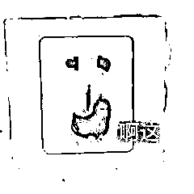

# 女网红“衣着暴露”卖柠檬茶？

> 原文：[`mp.weixin.qq.com/s?__biz=MzIyMDYwMTk0Mw==&mid=2247538978&idx=4&sn=00ed382bf0f2df5f5635eeeb754beae8&chksm=97cb921aa0bc1b0cadd97d3b01f4cd64a1cadf664bcd016cbf3ce80c1f9a34af33650ac7ee32&scene=27#wechat_redirect`](http://mp.weixin.qq.com/s?__biz=MzIyMDYwMTk0Mw==&mid=2247538978&idx=4&sn=00ed382bf0f2df5f5635eeeb754beae8&chksm=97cb921aa0bc1b0cadd97d3b01f4cd64a1cadf664bcd016cbf3ce80c1f9a34af33650ac7ee32&scene=27#wechat_redirect)

随着手打柠檬茶销量火爆，

很多个人商户也开始加入生意大军。

So，为了提高销量多挣点钱，

一些女摊主另辟蹊径想出了称得上“香艳”的招数。

今天故事的发生地，

就位于广西南宁的

网红夜市——楞塘村夜市

不得不说，

这个夜市灯火通明人来人往

是真的很热闹。 

想在这么多商户里做出名堂不容易，

但最近一个卖手打柠檬茶的小摊却异常火爆。

小摊前总是围着一批男顾客，

不走就算了，

他们还时不时

爆出意味深长的阵阵惊呼。

好家伙，

难道是哪位商家研制出了

好喝到爆的手打柠檬茶配方？？？

然鹅深扒一波后发现，

事情可没这么简单，

小摊爆火的原因原来在于摊主。

摊主不是咱们印象里

身强力壮的小伙子（毕竟捶柠檬费力气），

反而是个大美女。

而女摊主打扮挺特别，

身材本来就很“魔鬼”，

还穿着十分清凉，

很难让人不注意。

但这还不是她的杀手锏，

柠檬茶的“手打”环节，

才是这摊位让人挪不动腿的原因。

女摊主动作行云流水很熟练了，

柠檬切片冰块入杯，

到了这一步画风还很正常。

然鹅接下来就是让老司机浮想联翩的场面，

只见她手持捣棍棒开始发力捶柠檬片。

这操作是个力气活，

手一动全身也得跟着动……

   

好家伙，

难怪辣么多人围着摊位看个不停，

原来都是醉翁之意不在酒啊……

不得不说嗷，

女摊主这操作的确有两手，

很快就在夜市收获了一票忠实“粉丝”。

每天晚上都有人慕名而来，

有的起哄惊呼，

有的掏出手机拍视频

好不热闹。

当然啦，女摊主的爆火也引起了其他同行眼红，

既然你能这么搞那我也来试试。

So，这也才没过多久，

“美女手打柠檬茶”

就在楞塘村夜市开始出现人传人现象。

一位身穿粉色吊带衫的女摊主，

加入了这场手打柠檬茶客流量争夺战。

emmm，

只能说这个夜市柠檬茶的竞争真的太激烈了。。。

姿势不专业不是问题，

只要敢秀就完事了。

隔壁的茶摊上女网红

穿着行动不便的紧身裙，

把身材的曲线勾勒到极致。 

在不甚熟练的操作下依旧吸引了大批围观群众。

恍惚之间让人误以为来到了维密现场，

配上“童叟无欺、如假包赔”的标签，

让人不知道是在说柠檬茶还是另有所指。

也难怪有网友感慨，

这年头，卖个茶都卷起来了…

不过美女虽然养眼，

在公共场所搞这种低俗营销并不合适。

要知道夜市可不光是只有男性，

还有许多未成年的孩子。 

许多香艳场面属实少儿不宜了。

还有当地居民抱怨， 

看客们不仅把夜市堵的水泄不通，

还严重影响了其他商贩做生意。 

带胸卖茶的做法已经偏离了摆摊的本质，

也带坏了整个夜市的风气。

从本质上讲，

这种带有色情性质的低俗营销，

就是为了刻意去讨好男性观众，

典型的物化女性。

可能有些市民对此现象看不下去了， 

便直接将此事投诉到了相关部门称：

“个别不良商家衣着过于暴露进行营业，

想借此博人眼球，

各大网站传的沸沸扬扬，

影响社会风气，

影响南宁的市容市貌，

恳请有关部门进行整治” 

虽然，

相关部门并且对此进行答复，

但是据网友拍摄视频发现，

已经有摊主一改往日风格，

穿上了白衬衫，

并且将扣子系到顶。 

至此，

该夜市摊这种现象，

也算是告一段落了。 

与此同时，

一些网红主播似乎也受此风格影响，

纷纷效仿这种行为来牟流量。 

但网民们对一个新事物的新鲜劲也是有限的，

所以小编认为这波手打柠檬风，

很快就会被吹过时了... 

不过，

擦边牟流量这种风，

只要网络还发达，

大抵是很难会被吹过时了。

来源：陈大头

← 向右滑动与灰产圈互动交流 →

