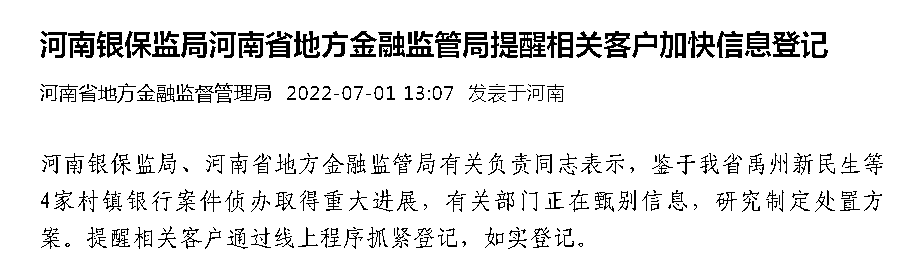

# 追踪 | 河南 4 家村镇银行案件侦办取得重大进展

> 原文：[`mp.weixin.qq.com/s?__biz=MzIyMDYwMTk0Mw==&mid=2247538978&idx=5&sn=8c4d52ccf36ad5fe1b76f6ce94cc6d0d&chksm=97cb921aa0bc1b0c559bab6665b46aa6200e515934203788129c1dbd0d13bfdadfdbdebf864d&scene=27#wechat_redirect`](http://mp.weixin.qq.com/s?__biz=MzIyMDYwMTk0Mw==&mid=2247538978&idx=5&sn=8c4d52ccf36ad5fe1b76f6ce94cc6d0d&chksm=97cb921aa0bc1b0c559bab6665b46aa6200e515934203788129c1dbd0d13bfdadfdbdebf864d&scene=27#wechat_redirect)

7 月 1 日，河南省地方金融监督管理局公众号发布消息，河南银保监局、河南省地方金融监管局有关负责同志表示，鉴于我省禹州新民生等 4 家村镇银行案件侦办取得重大进展，有关部门正在甄别信息，研究制定处置方案。提醒相关客户通过线上程序抓紧登记，如实登记。

**此前消息**

**银保监会回应河南个别村镇银行问题**

[`v.qq.com/iframe/preview.html?width=500&height=375&auto=0&vid=a33444kab7i`](https://v.qq.com/iframe/preview.html?width=500&height=375&auto=0&vid=a33444kab7i)

6 月 23 日，在“中国这十年”系列主题新闻发布会上，中国银行保险监督管理委员会副主席肖远企谈到最近河南个别村镇银行的问题时表示，近期河南地方公安机关还有地方金融监管部门已经就河南个别村镇银行的问题向媒体进行了通报，目前公安机关正在侦办，也抓获了一批犯罪嫌疑人，查封了一批涉案资产。银保监会将会配合地方党委政府做好相关工作，已经责成河南银保监局履行监管职责，依法保护广大人民群众合法权益。

**此前报道：**

[“河南村镇银行取款难”嫌犯被抓，幕后公司涉嫌相关犯罪已 11 年](http://mp.weixin.qq.com/s?__biz=MzIyMDYwMTk0Mw==&mid=2247538210&idx=3&sn=92d7da385b8bf1265ffca86b628d7ec7&chksm=97cb9d1aa0bc140c2768de520c724fdcdafed7c290c2dea500497939838a5817c8a571a2d8c3&scene=21#wechat_redirect)

[河南"暴雷"村镇银行储户：余额又清零了](http://mp.weixin.qq.com/s?__biz=MzIyMDYwMTk0Mw==&mid=2247538269&idx=5&sn=59b8a85bc9109ff2d774f916b44242cd&chksm=97cb9d65a0bc147379942597dad69a45a378dc7d1ba33008ddd0c8193a765e901ce221524b2a&scene=21#wechat_redirect)

[河南“取款难”村镇银行最新消息！新财富集团人去楼空，实控人疑已外逃](http://mp.weixin.qq.com/s?__biz=MzIyMDYwMTk0Mw==&mid=2247538269&idx=4&sn=8db3acfe0048b95a0766fc6fc49fc382&chksm=97cb9d65a0bc147316b1e2c17f2e5fe16c943054536736a4eb849c91b2788ec100ccdd9580be&scene=21#wechat_redirect)

[哪些第三方平台曾为河南村镇银行拉存款？](http://mp.weixin.qq.com/s?__biz=MzIyMDYwMTk0Mw==&mid=2247538269&idx=6&sn=da268b887c61d63ab4d542749f8ccb4c&chksm=97cb9d65a0bc1473fbe4b5c78543fb1e858b6dfeed15577caa1874b9a89ec3b1d11478e7186a&scene=21#wechat_redirect)

[诡异！让关系户先走？河南一村镇银行能取钱了，限时 15 分钟！](http://mp.weixin.qq.com/s?__biz=MzIyMDYwMTk0Mw==&mid=2247538722&idx=2&sn=63e58c845d59e183ccd03386bb005098&chksm=97cb931aa0bc1a0c4708d8bcf22001c497ae1971d19a900cf46f32ceff78e352d65c18021a35&scene=21#wechat_redirect)

来源：河南省地方金融监督管理局、中国新闻社  

← 向右滑动与灰产圈互动交流 →

