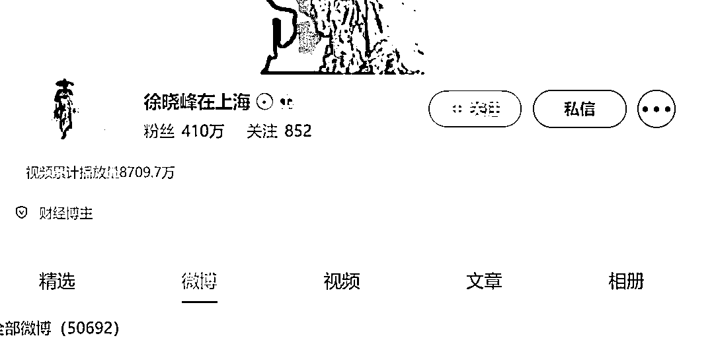
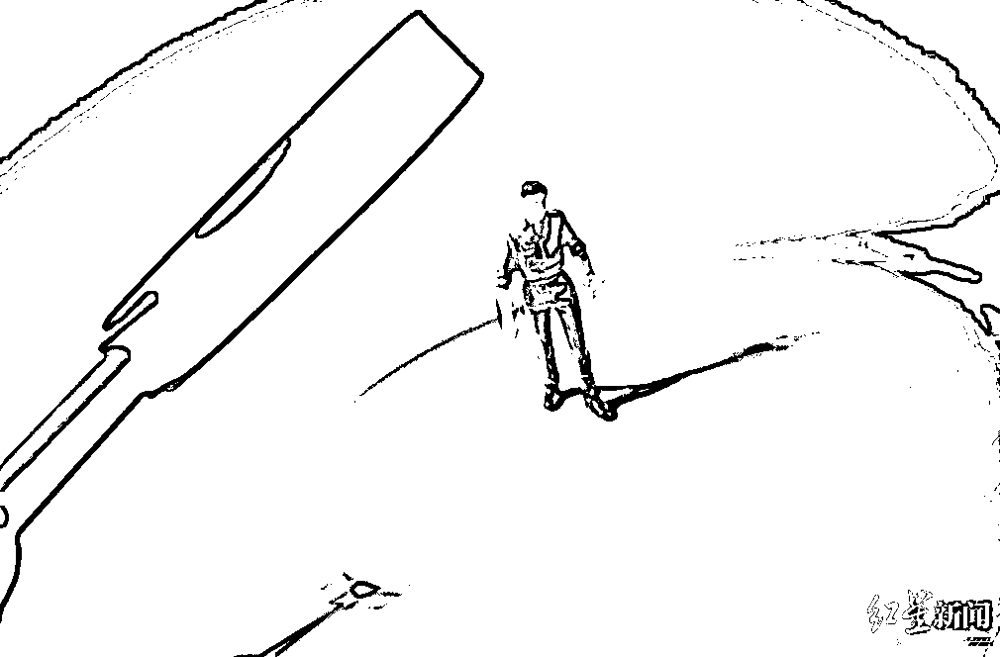
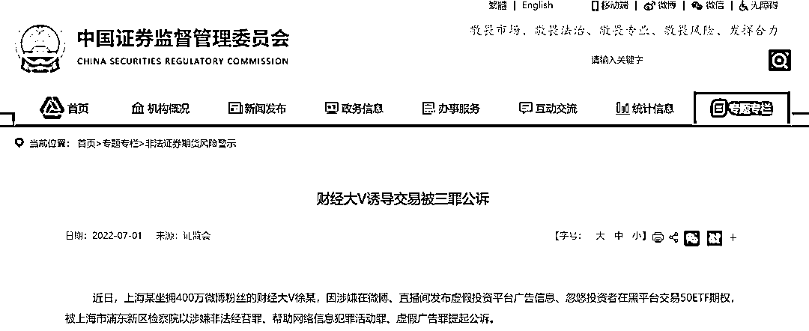
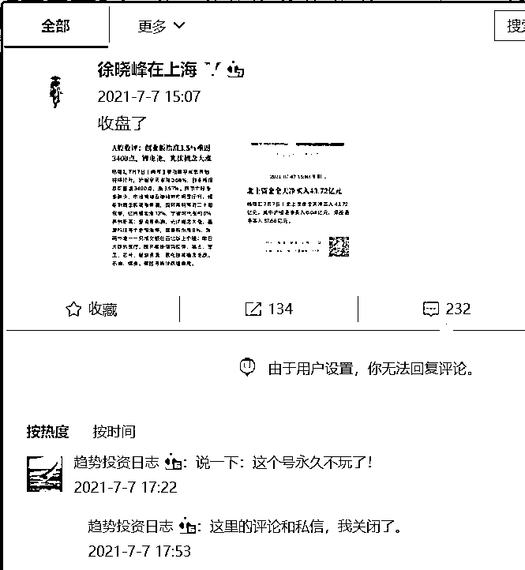
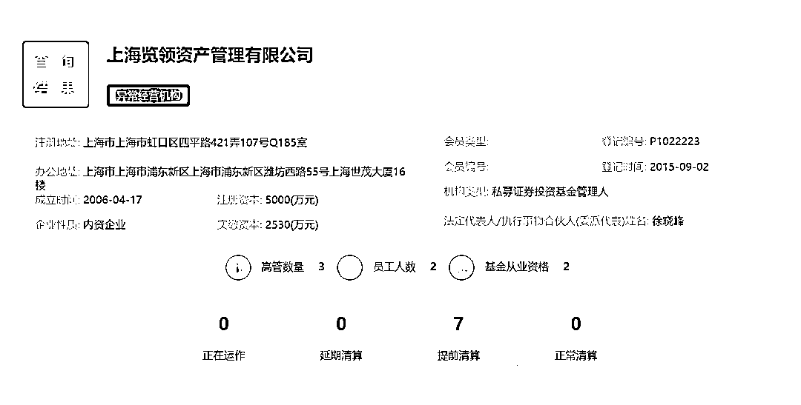

# 400 万粉丝大 V 徐某被公诉！涉嫌“三宗罪”

> 原文：[`mp.weixin.qq.com/s?__biz=MzIyMDYwMTk0Mw==&mid=2247538978&idx=6&sn=62160e28341d76caeeacf74242677c51&chksm=97cb921aa0bc1b0cd1bd6c9d3b12ac5d9c1b1ed863cd782304c1a8c4232b37f5c1a99b4a15a6&scene=27#wechat_redirect`](http://mp.weixin.qq.com/s?__biz=MzIyMDYwMTk0Mw==&mid=2247538978&idx=6&sn=62160e28341d76caeeacf74242677c51&chksm=97cb921aa0bc1b0cd1bd6c9d3b12ac5d9c1b1ed863cd782304c1a8c4232b37f5c1a99b4a15a6&scene=27#wechat_redirect)

7 月 1 日，证监会网站发布消息称，上海某坐拥 400 万微博粉丝的财经大 V 徐某，因涉嫌在微博、直播间发布虚假投资平台广告信息、忽悠投资者在黑平台交易 50ETF 期权，被上海市浦东新区检察院提起公诉。

今年 3 月，检察日报发文称，坐拥 400 余万粉丝的金融大 V 被公诉。后经媒体核实，该金融大 V 是徐晓峰。其微博账号“徐晓峰在上海”最后一条更新停留在 2021 年 7 月。

记者查询基金业协会网站发现，徐晓峰名下私募机构上海览领资产管理有限公司（以下简称“上海览领”）已为异常经营机构，7 只产品均已提前清算。

**证监会：**

**财经大 V 诱导交易被三罪公诉**

7 月 1 日，证监会网站发文称，近日，上海某坐拥 400 万微博粉丝的财经大 V 徐某，因涉嫌在微博、直播间发布虚假投资平台广告信息、忽悠投资者在黑平台交易 50ETF 期权，被上海市浦东新区检察院以涉嫌非法经营罪、帮助网络信息犯罪活动罪、虚假广告罪提起公诉。

2021 年以来，徐某利用自身财经大 V 的影响力，在微博、直播间等自媒体上大量发布含有“几千元即可开户做期权”“多空双向交易”“高杠杆、高盈利”等诱惑性词汇的广告信息，忽悠粉丝添加助理的 QQ 号或微信号，并下载“上证 ETF 期权 APP”开户交易期权。然而，该 APP 并非证监会批准设立的合法平台，而是徐某等人私自搭建的黑平台，投资者在该平台上开户交易，无法保障自身合法权益，往往损失惨重、血本无归。

经证监会上海监管局核查，徐某等人搭建黑平台，利用自身大 V 影响力发布虚假广告，在不到一年的时间里累计诱导 350 余名投资者入金，涉案金额超 3000 万元，已涉嫌构成犯罪。目前徐某已被上海市浦东新区检察院以涉嫌非法经营罪、帮助网络信息犯罪活动罪、虚假广告罪提起公诉。

**证监会在此郑重提醒广大投资者，不要轻信所谓财经大 V 推荐，要选择合法机构，远离非法平台，坚持理性投资，谨防上当受骗。**

4 个月前，检察日报曾发表文章《坐拥 400 余万粉丝的金融大 V 被公诉！》。文中称，随着粉丝们纷纷报案，某平台坐拥 400 余万粉丝的金融大 V 终于“翻车”，上海市浦东新区检察院近日以涉嫌虚假广告罪、帮助网络信息犯罪活动罪、非法经营罪对徐某提起公诉。

文章还指出，徐某自愿认罪认罚，并签署了具结书。

后经媒体证实，该金融大 V 为徐晓峰。

**名下私募产品均被提前清算**

早在 2021 年 8 月，就有消息称，大 V 徐晓峰已被警方带走，与 50ETF 期权交易 APP 有关。

徐晓峰微博账号@徐晓峰在上海 此前十分活跃，每天发微博十余条甚至数十条，2021 年 7 月 7 日，该账号不再继续更新。其关联账号@投资趋势日志 回复称，这个账号永久关闭。

停更当天，@徐晓峰在上海 称：“感谢媒体报道，造谣的说，我的基金清算了，实际上只是我个人操作的一只基金产品清盘了，基金其他产品正常运作中。”

2021 年 7 月 29 日，其关联账号@趋势投资日志 也停止了更新。

公开资料显示，徐晓峰为上海览领董事长兼总经理。

据基金业协会数据，上海览领 2015 年 9 月 2 日在基金业协会登记备案，公司管理规模在 0~5 亿之间，实际控制人、法定代表人、董事长、总经理都是徐晓峰。目前，上海览领资产在基金业协会官网显示为“异常经营机构”，7 只私募产品均被提前清算。

**向粉丝“挥刀”**

**套路：非法代理账号、发布虚假广告**

检察日报文章指出，2019 年，陈某、李某（均另案处理）等人与他人签订代理合同，代理期权分仓软件，在未获得国家有关部门批准，未取得期货、期权经营资质的情况下，从事非法经营期权的活动。为了将此分仓软件宣传出去，陈某找到了朋友大 V 徐某。两人签订合作协议约定，徐某帮助陈某代理该分仓软件，利用徐某的影响力引流粉丝至该分仓软件上进行投资，徐某每单收取佣金 20 元左右。

此后，徐某便在平台上发文进行宣传推广。徐某还让自己团队的员工在直播间推广此产品，并通过自己的客服人员招揽客户进行投资，参与期权买卖业务，从中赚取佣金。经审计，徐某涉及 12 个代理账户，涉案金额 1600 余万元，违法所得 150 余万元。

“这个交易软件是个分仓软件，肯定不正规，因为之前有类似的分仓系统被证监会处罚过。”徐某作为私募管理人员，具备相应的金融知识，明知使用场外分仓系统违反国家金融管理规定，但为了利益，仍然毫不犹豫向粉丝“挥刀”，割起了“韭菜”。

非法经营证券期货并非徐某唯一的来钱手段，徐某交代，“有中介来找我们这些大 V 发广告，基本都是导流，他们把编好的内容发给我，里面的短链接附有二维码。”这样的广告，徐某每条收取 2 万元至 3 万元费用，后来涨到 5 万元。

2019 年 3 月，徐某接了条股票咨询交流的广告，不久就有粉丝陆续向徐某和平台反映该链接为诈骗链接，徐某还因此被禁言了一段时间。2020 年 6 月，徐某在明知新广告链接与先前被举报的诈骗链接相同的情况下，只是在广告后添加了“不要做股票以外的投资”等提醒，仍继续多次发布该广告，非法获利 39 万元。

除了上述已查实为诈骗链接的广告外，徐某还发布了多条其他广告，经审计，徐某发布虚假广告非法获利 19 万余元。

来源：红星新闻，潇湘晨报

← 向右滑动与灰产圈互动交流 →

