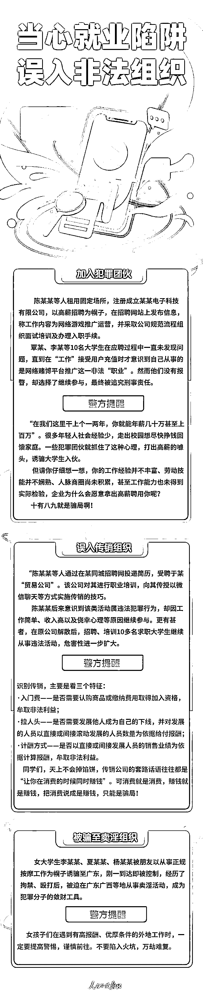
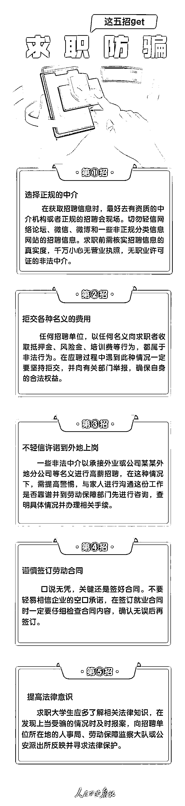
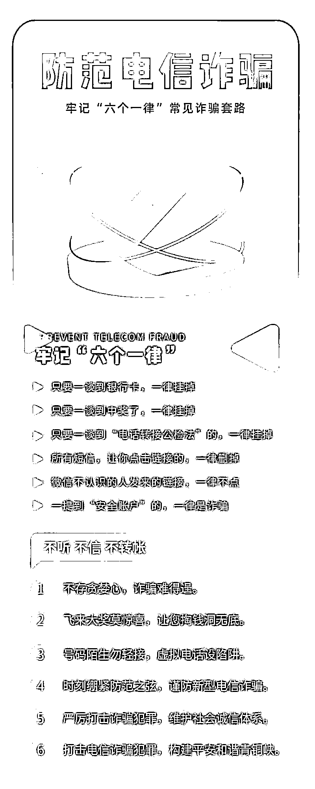

# 高校毕业季，遇到这些就业诈骗“坑”请立刻绕道！

> 原文：[`mp.weixin.qq.com/s?__biz=MzIyMDYwMTk0Mw==&mid=2247538978&idx=8&sn=434c47bdc3d2debb76c4fd8bea9dd4e5&chksm=97cb921aa0bc1b0c5d0b75957a77b582918102daef9ff5859677b4085a5529201804aa6ecf5f&scene=27#wechat_redirect`](http://mp.weixin.qq.com/s?__biz=MzIyMDYwMTk0Mw==&mid=2247538978&idx=8&sn=434c47bdc3d2debb76c4fd8bea9dd4e5&chksm=97cb921aa0bc1b0c5d0b75957a77b582918102daef9ff5859677b4085a5529201804aa6ecf5f&scene=27#wechat_redirect)

就业是最大的民生。

近年来，受新冠肺炎疫情等影响，高校毕业生就业形势严峻复杂。

面对难得的就业机会，一些毕业生不敢“挑挑拣拣”，有工作就干，这就在无形中给不法分子带来了“套路”求职人员的机会。

小编们梳理了多种求职就业中容易陷入的“坑“，以此警示即将迈入社会的学生们引以为戒！

**一、“培训贷”陷阱**

****案例：**毕业生李某在一 App 上看到线上培训视频制作的广告，称“包教包会，学完变大神”。原本就有想法做自媒体创业的李某看到后心动不已，贷款支付了 5999 元培训费，上了一段课程后发现教的都是网上能搜到的知识，而且对方也没有提供原本承诺的派单赚钱服务。要求退款被拒后，李某踏上了漫长维权路。**

****反诈中心提醒****：**不要轻易添加自称“老师”的陌生人微信，不要轻易参加打着“兼职赚钱“幌子的培训班，更不要轻易在陌生网页及平台上转账汇款、办理贷款。如不慎踏入“培训贷”陷阱或者遇到疑似“培训贷”诈骗的情形，应积极收集并留存有关证据，涉嫌诈骗的应向公安机关报案，勇于用法律手段维护自己的合法权益。**

****识别要点：****

**1.诱导办理“培训贷”“助学金”等各种名目的贷款**

**2.承诺学完可以接单赚钱**

**3.签订“不平等条约”**

****二、收费陷阱****

******案例：**林某坚、盛某生等人以位于某市宝来企业管理信息咨询中心为窝点，打着招工旗号先以体检、充饭卡等为由向求职者索取钱财，随后以求职者考试不合格为由拒不退还求职者钱财。****

********反诈中心**提醒****：**收费是最常见的招聘陷阱之一，不少不良机构都会以押金、保证金等借口向求职者收取各种费用，得手后便提出各种苛刻的要求迫使求职者自动放弃。****

******识别要点：******

******1\. 对招聘职位许以高薪******

******2\. 承诺工作很轻松******

******3\. 面试很简单，轻易即可录取******

******4\. 对方表现急切，要求你尽快交钱******

********三、中介陷阱********

**********案例：**李某在网上看到某公司能够帮助介绍高薪货车司机和跟车员，公司薪酬待遇相当优越。于是，他第二天就来到位于郑州市某商务写字楼的的公司应聘，待通过面试且签订“入职通知书”后，又按照公司要求缴纳了保险金。********

******然而，当其真正来到应聘单位后，才发现公司安排的工作和待遇与其承诺的内容大相径庭，甚至还了解到：所应聘的公司并未与任何劳务公司签订委托代招工协议，感觉被骗，遂报警。******

**********反诈中心**提醒****：**这类求职陷阱利用求职者渴望高薪职位的心理，许诺能够以特殊渠道得到心仪的工作，借此收取中介费和押金。******

********识别要点：********

******1\. 吹嘘门多路宽，无正规流程******

******2\. 缴费后久无音讯或直接被拒******

********四、试用陷阱********

**********案例：**刘某是应届毕业生，经过一番“海投”终于找到了工作，并和公司商议试用期 3 个月。“疫情期间工作不好找，公司说试用期没工资，我想着熬一熬就过去了，于是便答应了。”但让他无法接受的是，试用期结束公司却拒绝给他转正，也不支付任何工资。刘洋不愿再耗下去，选择了离职。********

**********反诈中心**提醒：**一些不良企业，往往以试用期的名义骗取廉价劳动力，或是非法延长试用期，或是在试用期即将期满时以各种借口辞退求职者。******

********识别要点：********

******1\. 要求先入职，试用期满后再签约******

******2\. 试用期内不予办理社会保险******

******3\. 试用期所做工作与实际应聘岗位不符******

********五、协议陷阱********

**********案例：**“因工作需要公司要求员工加班时，员工不得拒绝、请假；女职工进入公司两年内不得生育……”“这样的劳动合同我怎么签？”“你觉得不能接受就不要签，下面还有人等着面试呢！”这是一名毕业生在上海一家公司应聘时的真实对话。即便明知是霸王条款，这位刚刚大学毕业的女生，犹豫之中还是在白纸上落下了自己的名字。********

**********反诈中心**提醒****：**协议陷阱也是很多职场新人会踩的坑，黑心企业往往通过口头协议、拒签协议、签订霸王协议等方式，欺诈求职者。******

********识别要点：********

******1\. 找理由拒签就业协议书******

******2\. 签订协议后借故收回******

******3\. 在协议中添加霸王条约******

********六、扣押证件陷阱********

**********案例：**护士余某 2015 年初到一家民营医院工作。该民营医院在招聘护士时要求所有人将护士执业证书全部上交，说是到离职的时候再还给他们。********

******2015 年年底， 余某因为和领导在工作上产生矛盾， 要求辞职， 并向医院索要自己的护士执业证， 可是医院拒绝归还给她。 ******

**********反诈中心**提醒****：**任何单位和个人都无权扣留他人证件原件，求职者不要将证件原件交付他人。需要提供证件复印件的，要注明具体用途。******

********识别要点：********

******1.扣留身份证、毕业证、学位证等证件******

********一些大学生在网络招聘中，********

********本想轻轻松松日入千元，********

********殊不知，********

********他们正一步步被不法分子利用，********

********走上违法犯罪的道路。********

************

************

************

************

******来源：人民公安报，洛阳反诈中心，天下有诈******

************************

******← 向右滑动与灰产圈互动交流 →******

************