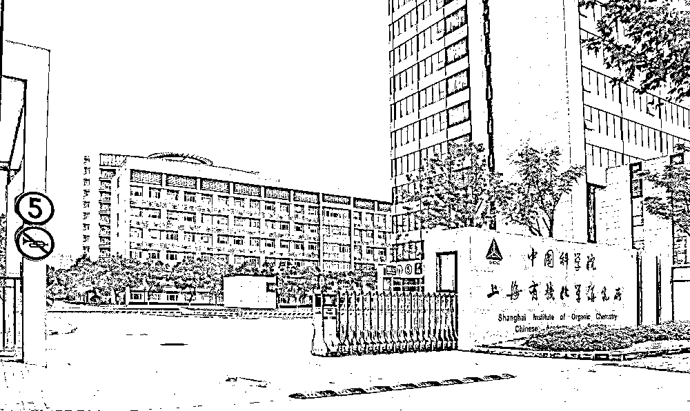
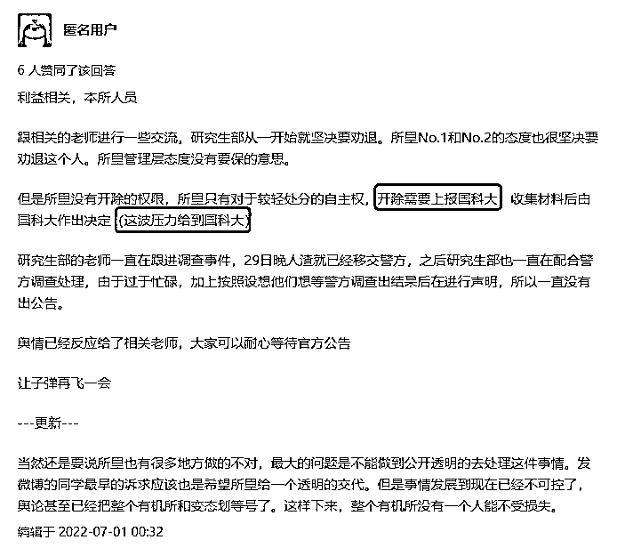
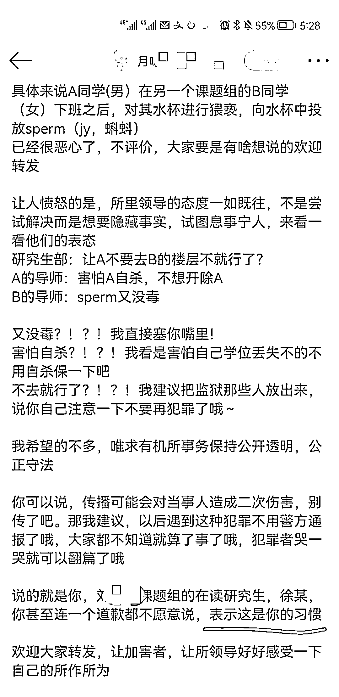
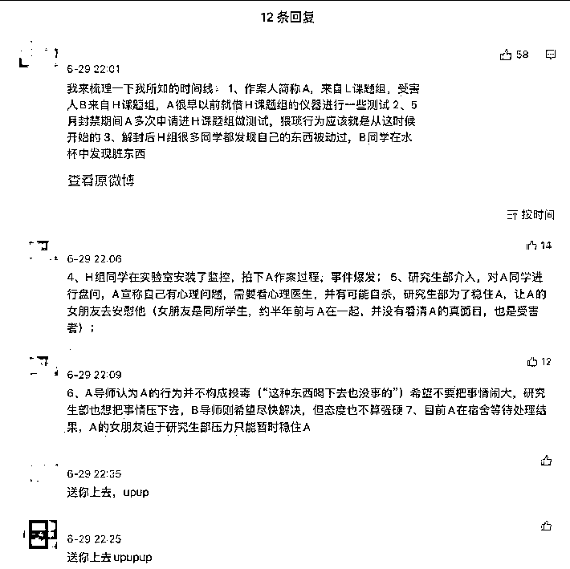
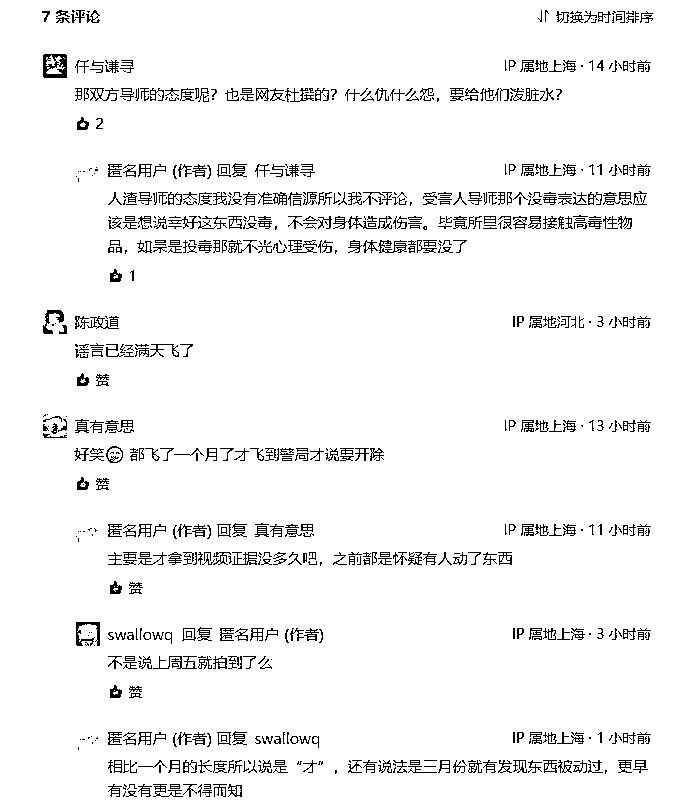
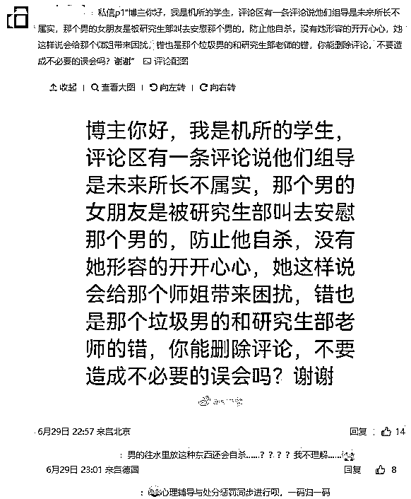
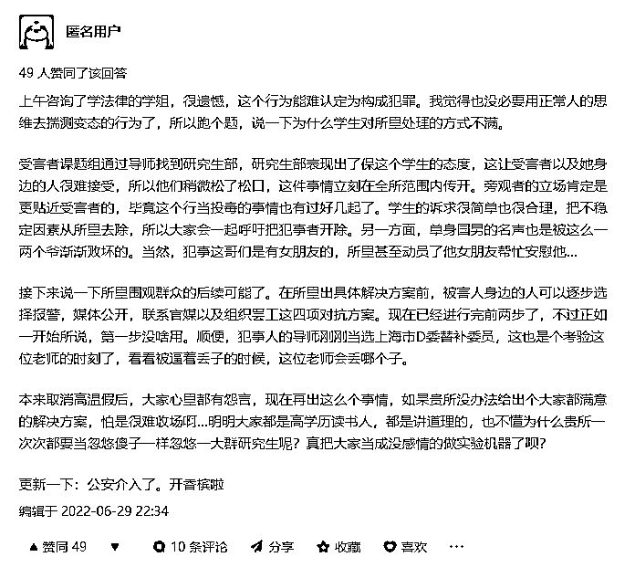
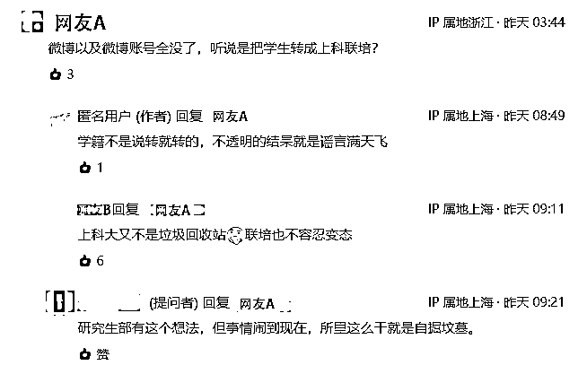

# 太无耻！上海一博士向女生杯中投放 sperm

> 原文：[`mp.weixin.qq.com/s?__biz=MzIyMDYwMTk0Mw==&mid=2247539048&idx=1&sn=2d9b37a1ea77303144a4493bf3b8ec82&chksm=97cb9250a0bc1b46d4d54c27c0cfd71ce71d3898e66f4917b2c1cc964398fc1105f3a6428215&scene=27#wechat_redirect`](http://mp.weixin.qq.com/s?__biz=MzIyMDYwMTk0Mw==&mid=2247539048&idx=1&sn=2d9b37a1ea77303144a4493bf3b8ec82&chksm=97cb9250a0bc1b46d4d54c27c0cfd71ce71d3898e66f4917b2c1cc964398fc1105f3a6428215&scene=27#wechat_redirect)

6 月 30 日，有网友爆料称中国科学院上海有机所一男生向女生杯中**投放 J 液**，引发关注。

该帖称“同学在实验室安装监控，拍下了作案过程”。7 月 1 日，中科院上海有机所副所长刘文回应东方网·纵相视频表示，“**这个事所里正在严肃处理，肯定会严肃认真地去处理**。”

6 月 30 日深夜，资深媒体人凯雷在头条号上表示上机所博士投稿：上海有机所男博士 A 向同学 B（女）投放精 y 事件，博士 A 已被抓！**但传言有偏差！**全所气愤，所里报警通宵配合警方办案！**该研究所的权限是劝退，开除只能由国科大**（中国科学院大学）**做出**。

凯雷转发的原文如下：

凯雷您好，关于有机所的事情我想发个投稿，希望您能帮忙澄清一下。关于所里的态度，所里几个领导包括研究生部老师都很气愤，对于这个人的处理一直是坚持要劝退。但是因为国科大的相关规定研究所是不能做开除处分的，**开除只能由国科大做出，需要整理材料上报，要一定的时间。**

研究生部老师一直在配合警方办案，**嫌疑人已经移交公安机关**，从领导的层面上来说不存在包庇保护的想法，研究生部的老师也一直通宵跟着公安机关处理调查。

最开始发微博的同学的描述因为也是道听途说来，所以关于老师的态度很多也是传来传去有所偏差。利益相关本所学生，匿名感谢🙏

凯雷的爆料与知乎上一位匿名用户的爆料内容相符：“所里没有开除的权限，所里只有对于较轻处分的自主权，开除需要上报国科大，收集材料后由国科大作出决定（这波压力给到国科大）”

“研究生部的老师一直在跟进调查事件，29 日晚人渣就已经移交警方，之后研究生部也一直在配合警方调查处理，由于过于忙碌，加上按照设想他们想等警方调查出结果后在进行声明，所以一直没有出公告。”

此前，在网络上爆料如下：

有网友对该爆料作了注解：

然而，网友和不少学生们对此纠正信息并不买账：

在知乎上，一位匿名的研究所学生是这样说的： 

来源：东方网·纵相视频、凯雷的社交媒体、知乎、帝都高校圈

← 向右滑动与灰产圈互动交流 →

