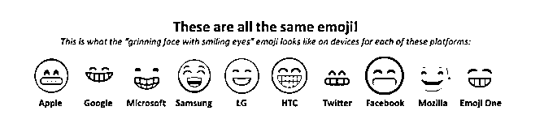
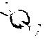
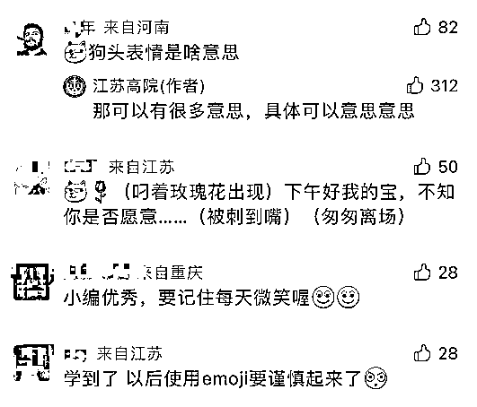

# 你发的每一个微信表情，都可能成为“呈堂证供”！

> 原文：[`mp.weixin.qq.com/s?__biz=MzIyMDYwMTk0Mw==&mid=2247539048&idx=7&sn=c009e07b80d02c8449eeed71b97c4061&chksm=97cb9250a0bc1b46ccdcd4e9377173c04ef0c9ced47ee495927e9f92558ca35094ea9e04a4e8&scene=27#wechat_redirect`](http://mp.weixin.qq.com/s?__biz=MzIyMDYwMTk0Mw==&mid=2247539048&idx=7&sn=c009e07b80d02c8449eeed71b97c4061&chksm=97cb9250a0bc1b46ccdcd4e9377173c04ef0c9ced47ee495927e9f92558ca35094ea9e04a4e8&scene=27#wechat_redirect)

微信作为常用的通讯工具

已经成为了每个人的日常

熟练运用每一个表情符号

也成为职场人必备技能

但是

**你有没有想过**

**表情符号也有可能成为**

**“呈堂证供”呢？**

近日，江苏高院发文科普
已有表情包被写入判决书

经检索裁判文书网，

2018 年以来，

全国共有 158 起以表情符号作为证据的案件，

其中 2018 年 8 件、2019 年 23 件、

2020 年 66 件、2021 年 61 件，

增幅明显。

不过文章表示

表情符号的司法认定

实践中还存在困难

** 含义解读难度大 **

表情符号的表意解读具有较强主观性，缺乏统一标准，法院难以精准“翻译”当事人的真实意思。

如在广东地区一起房屋租赁纠纷案中，承租方刘某某在租赁期满后，面对出租方多次提醒、提出加租意愿，既不表示继续承租，也不表示搬离案涉房屋，只是回复了一个“太阳”表情符号。后双方就该表情是否代表达成加租合意产生分歧，出租方起诉至法院并据此主张承租方同意加租，得到了法院的支持。

在一起人格权纠纷案中，被告马某某因与原告刘某某发生矛盾，便通过微信向刘某某发送了多个“炸弹”的表情符号表达情绪，刘某某认为该表情系人身威胁之意，于是诉至法院要求马某某进行赔礼道歉，后双方在法院调解下达成和解。

此外，同一表情符号在不同手机设备中也会存在显示差异，如苹果 IOS 系统中的“尴尬微笑”表情在安卓系统中显示为“开心大笑”，极易造成双方理解误差。 

不同平台上的“微笑”emoji 

**犯罪暗语甄别难**

部分“黄赌毒”犯罪案件中，犯罪分子利用表情符号替代敏感词表达隐喻含义以逃避侦查。

如某组织卖淫罪案中，卖淫人员以“笑脸”表情符号代指嫖娼人员，向上线报送交易数量。

再如某非法利用信息网络罪案中，犯罪分子潘某某先后创建 4 个聊天群，宣传和出售其自制的迷奸药、催情药等违禁物品，同时为了逃避公安机关的侦查和打击，潘某某在聊天群内与买家使用“糖果”“酒杯”等符号代指违禁药品并进行交易。

此外，一些犯罪分子直接将表情符号作为犯罪工具实施犯罪，以增加识别、打击难度。 

如某诈骗罪案中，犯罪分子打着微商的幌子，以抽奖为名引诱受害者添加微信好友并通过微信发送“剪刀石头布”表情参与猜拳游戏，之后利用作弊软件使受害者误以为自己取胜，“自愿”通过所谓的“中奖低价”购买劣质、假冒的名牌包包、化妆品等，涉及受害人 900 余人，案值 720 余万元。

**效力认定存分歧**

不同法院对表情符号是否具有证据效力持不同意见。

如广州中院在一起仓储合同纠纷案中认为，表情符号是辅助表达心情、情感和想法的可视化图像，不能仅凭表情符号而认定为法律意义上的承诺，故没有认定当事人发送的“OK”表情系同意之意。

而厦门中院在一民间借贷纠纷中则认为，根据日常交流习惯和聊天语境，当事人发送的“OK”表情符号应视为对对方请求的同意，并据此作出裁判。

此外，对具有中性含义的表情符号也存在不同理解。

如某买卖合同纠纷案中，卖方将未结算款项明细通过微信发送给买方，买方仅回复“别说话”的表情符号，一审法院认为买方未对结算款项进行确认，遂驳回卖方的诉讼请求。二审法院则认为买方既未予回复、也未否认，应视为对卖方主张的默认，对一审判决进行了改判。

**法院提醒：**

网络聊天时使用表情符号，已成为广大网友们必不可少的输入习惯。表情符号有利于网络交流的情感化、趣味化和简约化，一定程度上弥补了文字难以表达的情绪态度，然而，不当甚至恶意使用表情符号也会导致消极结果，衍生出纠纷、侵权甚至违法犯罪等诸多法律问题。互联网不是法外之地，网络语境下使用表情符号也需谨慎，因此我们提醒您：

●由于表情符号的含义可能存在多种解读，因此在涉及到切身利益的网络对话中，**对于表明态度的**关键信息**应尽量使用**文字**形式进行表达，或者选择不容易引起歧义的表情符号，以明确双方真实意思，避免造成不必要的误会和纠纷。同时，注意**对相关聊天记录进行留存**，便于在纠纷发生后用于维权举证。**

●网络发言要遵守网络道德规范，**善意使用表情符号**，如果滥用言论自由权利，随意使用表情符号侮辱、诽谤、威胁他人，将会构成侵害他人名誉权，并承担相应法律责任，如果情节严重的，甚至将可能构成诽谤罪，面临严厉的刑事处罚。

●**自己制作或传播表情符号时，应注意**合理界限****，避免给他人合法权益、社会道德秩序带来伤害。如未经他人同意，制作以他人肖像为内容的表情包，即便未以营利为目的，亦可能构成侵害他人肖像权。

●在一些利用表情符号实施的电信网络诈骗犯罪中，犯罪分子通过非接触式手段实施犯罪，犯罪手法新颖隐蔽，危害严重，因此面对网络空间的诱惑时一定要提高警惕，谨防上当。如遭遇诈骗，应及时报警，避免产生更大的损失。

**网友：狗头表情是啥意思？******

**表情包要注意使用场合**

****善意使用****

****而且把握合理界限****

****你会用了吗？****

  点赞是一种鼓励，在看是最好支持  

**来源：江苏高院、中国青年报**

← 向右滑动与灰产圈互动交流 →

