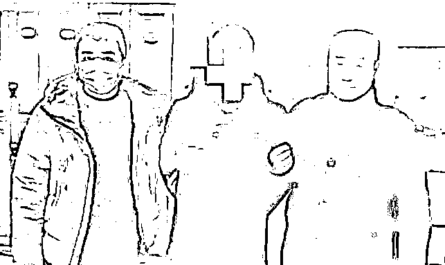

# 多名女子遭假冒空军飞行员诈骗

> 原文：[`mp.weixin.qq.com/s?__biz=MzIyMDYwMTk0Mw==&mid=2247539077&idx=4&sn=db0fd64249f7a772a0276406fbdde182&chksm=97cb92bda0bc1bab55343c845a358fbd3d284e6c0db491a69550057cf8d4596f8ef3396b3eed&scene=27#wechat_redirect`](http://mp.weixin.qq.com/s?__biz=MzIyMDYwMTk0Mw==&mid=2247539077&idx=4&sn=db0fd64249f7a772a0276406fbdde182&chksm=97cb92bda0bc1bab55343c845a358fbd3d284e6c0db491a69550057cf8d4596f8ef3396b3eed&scene=27#wechat_redirect)

# **9 名女子遭假冒空军飞行员诈骗**

**初中学历男子冒充空军飞行员**

**与 9 名女子“谈恋爱”****并骗财骗色**

近日，当地法院判处

涉案的刘某某**有期徒刑 2 年**

责令退赔非法占有的钱款 

刘某某（中）

▼

去年 12 月

小丽（化名）在某相亲网站

认识自称“王某某”的男子

**其头像是军官证照片**

**个人信息显示毕业于国防科技大学**

正在部队服役，离异

在扬州有房产

转业后将安置在某机场工作

王某某自称是**空军飞行员**

两人开始交往

其间

小丽多次表示想看对方的证件内页

被以各种理由推脱

“王某某”还**多次向她借钱**

 **小丽**偶然看到王某某的身份证****

****发现他本名“刘某某”****

**察觉到被骗，将其拉黑**

**小丽此后在相亲网站动态留言板**

****看到另一女生向“刘某某”喊话****

****要他还钱****

**便与该女生联系**

**确定“刘某某”就是“王某某”**

**更确认“兵哥哥”是假的，于是报警**

****今年 1 月，刘某某被警方刑拘****

**小编发现**

**打军人旗号在相亲网站交友的并不少见**

**▼**

****

**据警方侦查**

**和小丽有相同遭遇的还有**8 名女性****

**均在相亲网站认识的刘某某**

****有的还发展到谈婚论嫁的地步****

**刘某某以恋爱为名**

**与多名受害人发生性关系**

**并**骗取财物合计****20436 元****

**刘某某其实**早已婚育****

****没有入伍经历，初中文化****

****是某公司钣金工，****曾因诈骗入狱****

**另 8 名女子的受骗经历**

****2020 年 10 月****

**刘某通过相亲平台结识王女士，**谎称其系南京空军部队转业军人**，离异，现为民航飞行员。在与王女士同居期间，刘某以帮助王某的哥哥找工作、帮助王某的小孩在南京军区上学为由，骗取人民币 12545 元。**

****2021 年 6 月****

**刘某通过相亲平台结识张女士，**谎称其在扬州有房产，现在部队服役**，愿与其结婚。在骗取被害人张女士的信任后与其发生关系，乘隙盗走被害人存于手机微信的人民币 1200 元，并将其汽车偷开出去玩乐。**

****2021 年 7 月****

**刘某通过相亲平台结识姜女士，**谎称其为南京军区退役军官**，在得到姜女士信任后，刘某以“部队规定个人银行账号禁止绑定支付宝和微信”为由，骗取姜女士人民币 1491 元。**

****2021 年 9 月****

**刘某通过相亲平台结识夏女士，**谎称其在南京军区担任空军飞行员中校**，并以带夏女士去见亲友为由将其带至宝应县开房。后夏女士发觉刘某并无带其去见亲友的迹象，怀疑被骗后与其分手。**

****2021 年 11 月****

**刘某通过相亲平台结识叶女士，**谎称其为****南京军区东部战区****驾驶“歼 20”的空军上校。**两人确定恋爱关系后，叶女士在相亲平台上看到了姜女士的留言“刘某是骗子，欠我钱”后，不再与刘某联系。**

****2021 年 11 月****

**刘某通过相亲平台结识黄女士，**谎称其在东部战区担任空军飞行员**。以恋爱结婚为名骗取被害人黄女士信任后，刘某将黄女士带至宝应县开房。黄女士在与其同居三日后向其提出查看相关证件，但刘某无法提供，后双方分手。**

****2021 年 12 月****

**刘某通过相亲平台结识杨女士，**谎称其是南京空军部队飞行员**，并表示要与杨女士结婚。后以带杨女士去 4S 店看车购车作为订婚礼物为名，骗取杨女士的信任并与其发生性关系。**

****2022 年 1 月****

**刘某通过相亲平台结识何女士，**谎称其为东部战区空十师军官**，以恋爱结婚为名骗取被害人何女士信任后，告知在部队处对象需“恋爱报告”，要审查女方犯罪记录信息、有无信用卡还款问题，提出找人帮助何女士解决信用卡逾期问题，并以找战友为由，骗取被害人人民币 5200 元。**

**关于假军人婚恋诈骗**

**我想说几句**

**1、几乎所有假军人婚恋诈骗，都会采用网络交友的手段，这其中平台的监管有失职之处，尤其是类似的相亲网站，**对注册用户信息缺乏严格审核**，被不法分子钻了空子。**

**假军人吴某某被审问片段**

****他通过短视频平台认识被骗女性****

****诈骗 4 位女性共 5 万余元****

**▼**

 **[`mp.weixin.qq.com/mp/readtemplate?t=pages/video_player_tmpl&action=mpvideo&auto=0&vid=wxv_1330898843889926144`](https://mp.weixin.qq.com/mp/readtemplate?t=pages/video_player_tmpl&action=mpvideo&auto=0&vid=wxv_1330898843889926144)** 

**假军人凌某被审问片段**

****他一共诈骗 3 位女性共 23 万余元****

****其真实身份为滴滴司机****

**▼**

 **[`mp.weixin.qq.com/mp/readtemplate?t=pages/video_player_tmpl&action=mpvideo&auto=0&vid=wxv_1359975114666016769`](https://mp.weixin.qq.com/mp/readtemplate?t=pages/video_player_tmpl&action=mpvideo&auto=0&vid=wxv_1359975114666016769)** 

**2、假军人婚恋诈骗“成功率”高的原因有两点，**一是利用了民众对军人职业天然的信任感；二是利用军地之间的信息差。****

**3、恋爱中不要有太强烈的**“制服崇拜”**，这会影响你的基本判断。**

**4、恋爱中要尽量少一些**“利益交换”**，有可能是“杀猪盘”。**

**假军人“杀猪盘”的“经典话术”**

**▼**

****

**5、**所有找你要钱的借钱的，一律视为骗子！****

**2020 年**

**假军人徐某与被骗女性的聊天记录**

****他以在部队受伤需手术为由****

****用明显的 PUA 话术****

****诈骗当事人 37 万余元****

**▼**

****

****6、如果真的想找军人，可以适当了解一些国防知识，比如案例中涉及的“南京军区”，百度即可知，该军区已于 2016 年撤销。****

**7、恋爱最重要的不是核验身份，而是听其言观其行，**那种没谈几天就急于亲近的，那种刻意炫耀“从军经历”吹牛的**……多半不是合适的婚恋对象。** 

**2020 年**

**假军人罗某与被骗女士的聊天记录**

**他一共**诈骗了 90 余万元****

**▼**

****

****

****

**8、军恋中，军人的基本信息是可以了解的，比如**部队大致地址、军线电话、任职岗位**等，这些比军装照、证件照等更容易核实。**

**9、**发现自己遇到假军人，请立即报警！****

**假军人刘某的社交账号及聊天记录**

****他刚出狱 3 个月，就假冒军人骗财骗色****

****且专挑婚姻不幸福或离婚的女士****

**▼**

****

****

**今年 5 月**

****被假军人骗走 15 万元的单亲妈妈****

**▼**

********

****请大家务必提高警惕****

****也呼吁有关部门加大查处力度****

****让假军人无利可图、无处藏身****

****人人喊打****

**来源：大 R 说安全，中国人民解放军解放军报社**

******](https://mp.weixin.qq.com/s?__biz=Mzg5ODAwNzA5Ng==&mid=2247487973&idx=1&sn=1b62da6f2018402862a5c375e10c355e&chksm=c06878b2f71ff1a4fbe7df4dec626aa7e696154751693bf16f6c6a302ceaa4d1959040c70518&scene=21#wechat_redirect)**

**← 向右滑动与灰产圈互动交流 →**

****