# "进过方舱的不要、阳过的不要"？

> 原文：[`mp.weixin.qq.com/s?__biz=MzIyMDYwMTk0Mw==&mid=2247539157&idx=3&sn=a8c20c1108533d23a8c052748f553585&chksm=97cb92eda0bc1bfbccdb3882c679e14da3c46408ab00188174e94bf5af73ac004be99ff1ea6b&scene=27#wechat_redirect`](http://mp.weixin.qq.com/s?__biz=MzIyMDYwMTk0Mw==&mid=2247539157&idx=3&sn=a8c20c1108533d23a8c052748f553585&chksm=97cb92eda0bc1bfbccdb3882c679e14da3c46408ab00188174e94bf5af73ac004be99ff1ea6b&scene=27#wechat_redirect)

**“进过方舱的不要、阳过的不要”** 

这是最近一段时间

不少求职者遇到的问题

无论在微信兼职群里

还是去招聘会现场

找工作时

不少企业都会要求查验

近两个月的核酸检测记录

求职者曾经阳性

则拒绝招录

记者记录了**几位感染者**

**治愈出院后的求职受阻记**

同时也随机走访了 

浦东和松江两区的一些劳务中介

试图求证在当下的上海

**有过新冠阳性确诊经历的求职者**

**找不到工作到底是个例**

**还是普遍的情况**

上海方舱志愿者阳性康复后求职遭拒

六月的上海依然热得让人闷得慌。22 时许，在上海临港某写字楼的地下室里，陈峰习惯性地找了几个纸箱子，熟练地把纸箱沿着缝隙撕开，将纸板平铺在水泥地上，这就是他今晚的“床”，旁边放了一瓶水、充电宝和几盒蚊香。

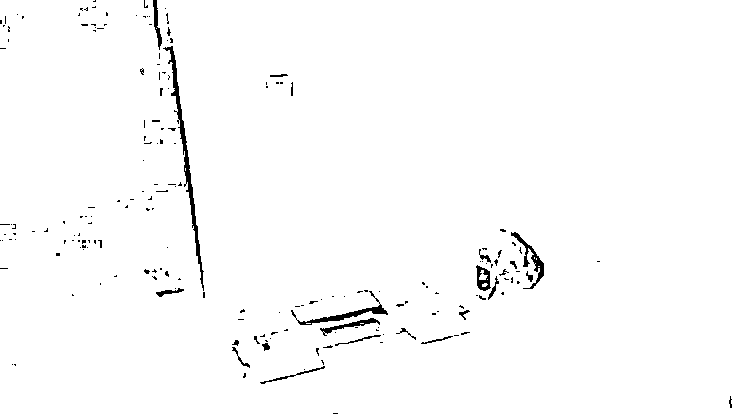

陈峰晚上睡觉的地方 

准备入睡时，一束刺眼的手电筒灯光突然打了过来，原来是写字楼的保安，保安提醒他和同伴们，不允许打地铺，尽快离开。陈峰只得起身，收拾好他的全部行李，走到户外，一番寻找后，他将希望寄托在不远处公园内的凉亭里。**这已经是自 6 月 1 日起离开方舱后，他在上海“流浪”的第 30 天。**

陈峰是湖北十堰人，今年 28 岁，单身未婚，父母都在农村务农，身体不大好。他之前一直在广东工作和上班，在电子厂、工地都工作过，随着疫情的反复，他也做了很多防疫方面的工作。

**4 月 7 日，通过一家劳务派遣公司的介绍，他和其他几位同伴从广州来到上海，打算在方舱做志愿者，**开始给的价格是一天工资 800 块，陈峰心想，赚钱的同时，也能为抗疫做一份贡献，这个工作还不错。12 日开始，陈峰便正式进入国家会展中心方舱里面工作。

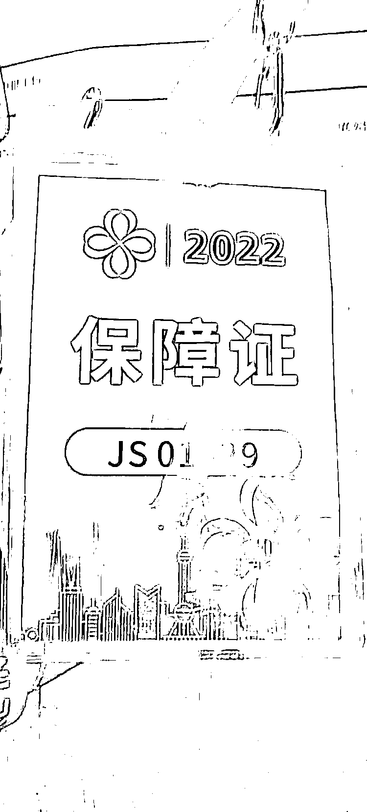

保障证 

4 月 20 日这天，陈峰被安排上夜班——从凌晨三点到第二天早上九点，当天晚上上班前要抗原检测，**陈峰被检查出了两条杠，同时他也出现四肢无力、嗓子痛等症状，随后即被确诊为阳性并在方舱内接受治疗，直到治愈出院。**

出院以后，陈峰没有固定的住所，找住宿的时候，**一些小旅馆发现他 4 月两次核酸检测记录为阳性，就拒绝了他住宿的要求。**于是，他开始了自己的“流浪”生活。

眼下，陈峰只能暂时露宿在临港的公园里，晚上就睡在公园的椅子上，害怕蚊子咬得睡不着，他买了蚊香。他将行李放置在公园另一处“隐秘的角落”， 一大桶水、一个大书包装得鼓鼓囊囊、一个大黑色垃圾袋里面装满衣服杂物，所有东西堆在角落里，用雨布盖着藏好。

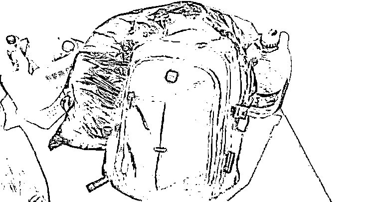

陈峰行李 

往后，当人们来公园里露营野餐时，会想到这里曾经是有过阳性记录的外来务工者无家可归时寄身的地方么？

“‘阳’过的我们找工作为何这么难”

陈峰一边“流浪”，一边找一份临时的工作。在他加的几个微信群里，不管是电子厂、还是保安、快递分拣员等，都在招聘要求里写到：**“阳过的不要、进过方舱的不要。”**这让他有点错愕，自己这样的情况难道就找不到工作了吗？在网上看工作的同时，陈峰也打算去招聘现场去碰碰运气。

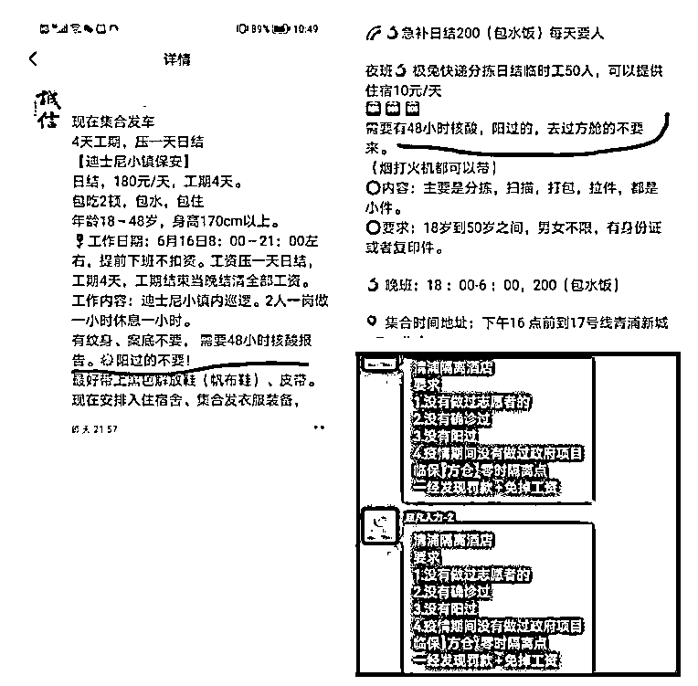

6 月 15 日，背着双肩包，拉着行李箱的陈峰，走在浦东新区周浦镇的一个公交车站旁，看到路旁有人摆着招工广告的易拉宝，招工的人看到陈锋，问道：**“兄弟，你有没有在方舱里待过？之前阳过没有？”**陈峰想起之前在网上看到的很多招聘广告里特别提到的这一条，不敢告诉对方自己曾经阳过，便试探性地回了句，“没有啊。”没想到对方熟练地说道，**“那你打开手机里的随申办，我看看你近两个月的核酸检测记录怎么样。”**听罢，陈峰无奈地摇了摇头，离开了公交车站。

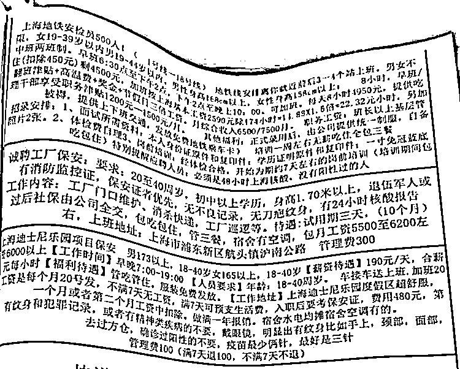

迪士尼招聘信息 

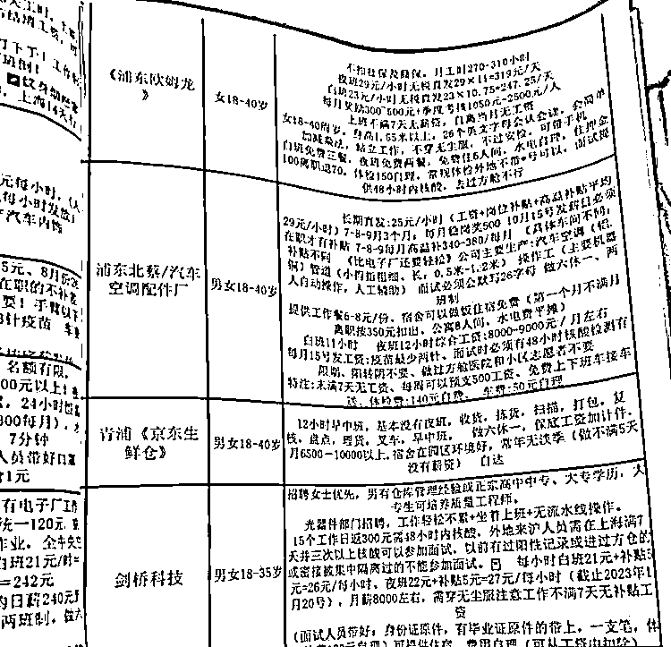

欧姆龙招聘信息

陈峰把自己的遭遇发在了和其他方舱工友一起建的微信群里，很快就有其他人回复，**表示也遭遇了和他相类似的情况。**

刘硕和陈峰一样，他们一起从广州来上海，并在国家会展中心方舱里一起担任志愿者工作。也曾被确诊为新冠感染者，治愈出院后复阳过两次，再次出院后，在隔离酒店隔离了一周多。

刘硕从隔离酒店出来后的第一件事就是找工作。但他看到很多招聘广告里都写道：**阳过的不要、进过方舱的不要。**暂时不打算回老家的刘硕准备在上海先租个房子，朋友给他推荐了浦东新区康桥的房源，朋友还特地嘱咐他两点：**不要说是他介绍过来的，也不要说自己曾经阳过。**但刘硕觉得，这又不是什么丢人的事情，**自己曾经为抗疫做过贡献也算是英雄，于是他就如实地和房东讲了自己的情况，房东一开始不想收，但最终还是让刘硕住了下来。**

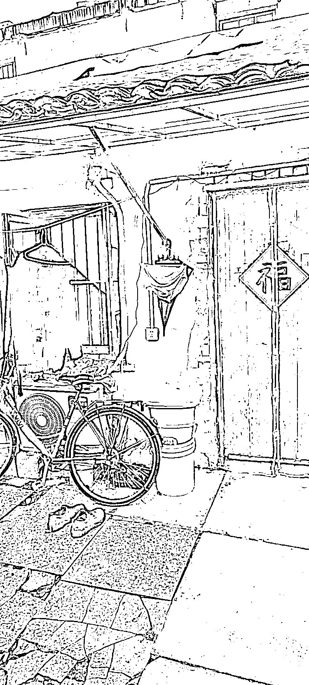

刘硕在上海的住处 

**同样，来自于山西忻州的曾鸣在苏州和上海的求职之路同样坎坷。**在上海务工的他此前曾感染过新冠，治愈出院后的他，先是去了南通隔离，隔离结束后去了苏州，但苏州几家电子厂都要求查验近两个月的核酸检测记录，屡屡碰壁的他只好打道回上海。

除了网上招聘，曾鸣也去过松江车墩的一些劳务公司，对方也要求当场查验近两个月的核酸检测记录。目前他也和陈峰一起，晚上随便找个空地打地铺，吃饭基本上靠路边的小炒店、便利店里的泡面来解决。

记者随机走访部分劳务中介：

“不要阳过的”

在浦东秀沿路康新公路一带，集中了大量劳务介绍所，沿街店面一字排开，此地是上海最大的劳务市场之一。我们走进的第一家中介“XX 人力”主要业务是为各大快递公司招工，记者在一边试探性地问了句：“阳过的不行吗？”前台小哥迟疑了一阵：**“……有阳的话可以问问别的企业。”**

当被告知记者曾于 4 月份因为新冠阳性入住过方舱后，边上另一名求职者插了句：“4 月份的话就没事。”

此时前台小哥询问：“进厂工作可以吗？有些厂查得不严。张江那里有些做医疗器械的小厂，应该可以，工资 6500 元/月差不多。”

沿着康新公路右拐到了秀沿路，是一家专招饿了么骑手的中介。接待我们的一名年轻女员工告知，只要符合年满 18 周岁和没有犯罪记录两项条件，就可以报名。但是厂里不接受曾经的阳性感染者。

离开饿了么骑手中介，我们来到“XX 劳务派遣”店面，在听说记者曾经阳过后，接待我们的小哥回答得有些语无伦次：“阳过……不要紧。有很多厂不行，但有的厂没事，达丰可以。”

在随后记者走访的几家工厂，招工人员也表示不接受阳过的人员。

网友评论

**不少网友表示** 

**确有此事**

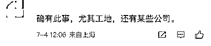

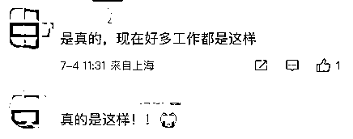

**有网友说** 

**这就是招工歧视**

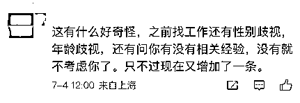

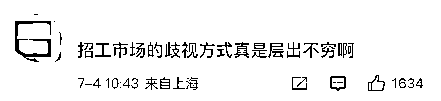

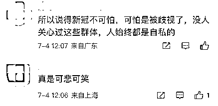

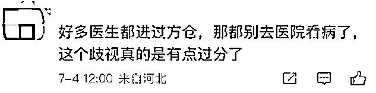

**个别网友认为**

**这样做也有企业的考虑**

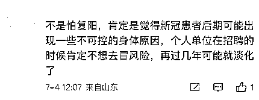

**有网友担心**

**这样还有谁会去做志愿者？**

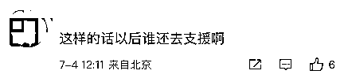

**也有网友呼吁** 

**这样的事必须妥善解决**

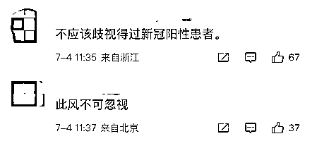

**到底是谁在制造歧视？**

**他们曾为抗疫做出过贡献**

**我们应当给予他们一定的保护**

**希望有关部门** 

**能够帮助他们**

**使他们应有的权利得到维护**

**你怎么看？**

（为保护受访者隐私，本文均使用化名）

来源：新民晚报综合

← 向右滑动与灰产圈互动交流 →

