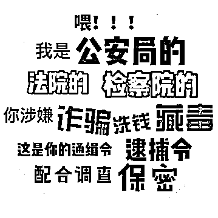
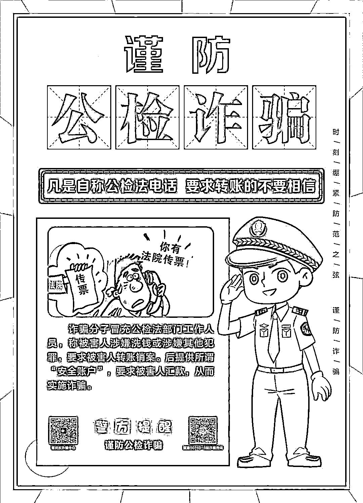
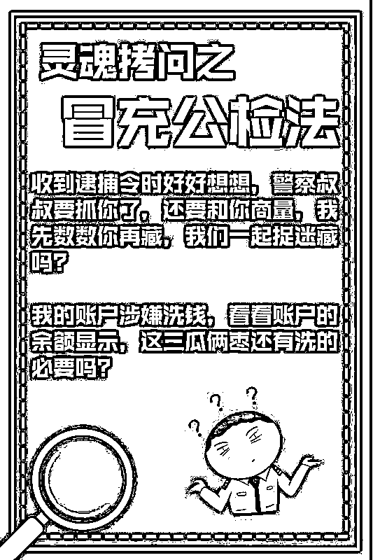

# 请一定认真读完!女子哭诉老公 5 小时内被电信诈骗 91 万惨痛经历!

> 原文：[`mp.weixin.qq.com/s?__biz=MzIyMDYwMTk0Mw==&mid=2247539157&idx=4&sn=2879ef34075a89555fd7c60b153790d5&chksm=97cb92eda0bc1bfbac8d7c2a48072b672aa66300cc2692107aad5bb1a6badf325c0417b23e02&scene=27#wechat_redirect`](http://mp.weixin.qq.com/s?__biz=MzIyMDYwMTk0Mw==&mid=2247539157&idx=4&sn=2879ef34075a89555fd7c60b153790d5&chksm=97cb92eda0bc1bfbac8d7c2a48072b672aa66300cc2692107aad5bb1a6badf325c0417b23e02&scene=27#wechat_redirect)

2022 年 5 月 17 日下午 18∶00 到晚上 23∶00 点，对于我们家庭来说是灭顶之灾。**我的老公遭受到整整 5 小时的电信诈骗诈骗总金额高达 91.6 万**。如果不是我的警觉及时报警，估计还要有 5 万元的财产损失，甚至更多。我不得不感慨诈骗分子的厉害，当我报警见到老公后，他的第一句话是∶**你真的认为我是被电信诈骗了吗? 我的家庭被掏空老底，叫我们如何去抵御老人生大病的风险?** 两家老人都已经年迈，身上都有不同程度的慢性疾病，万一发生大病，作为儿女，当他们躺在病床上，指望儿女拿钱去解救生命，我们却因为手头没有任何钱而无能为力时，这种悲哀及无可奈何真的无法想象，根本就承受不起。

**我心疼我的老公，从来就没有遇到这么大的事。**小时候虽然家在农村，但是父母可以承担学费，应付日常开支，顺利读书，考上大学。毕业后从学校面试到工作，一直兢兢业业上班结婚时也没有因为采礼等而受到困扰，一直顺风顺水上班，努力赚钱养家，出门是上班，下班围着老婆孩子转。上孝父母，优待女儿，尊重妻子，善待兄妹。没有任何不良嗜好，不抽烟喝酒，也不吃喝嫖赌、作监犯科。从来不给他人找麻烦，虽然家庭条件一般，但也过的好，是一个典型拿死工资，没有多余想法的普通打工仔。谁知不发生事则已，一发生却这么的严重，2.5 小时就被诈骗份子掏空了十年家底，还背上负债。他一直内疚自责，说对不起我，对不起孩子，对不起父母。一切都是他造成的，不管打他骂他都行，但是作为男人他不能倒下，他倒下了，我们母女还怎么办?

**我是全职妈妈，没有收入，当我知道被诈骗 34 万的时候，嚎啕大哭，****他都要给我跪下了。**等到警局录口供，**核对损失账户时，一笔又一笔时，总金额高达 91.6 万时，我家老公直接坐在地上，手抖了、脚软了，不停的哆嗦。**这时我反而因为刚才的痛哭而没有了眼泪，我知道这个时候如果我再去埋怨他，那就是不给他活路了。所以我擦于眼泪，安慰他，告知他，他是家里的顶梁柱，不能倒下，否则我们母女该如何自处。家里就他一个人赚钱，家里不能没有他，他比钱重要。给他一根柱子，让他有精神支柱，否则后果不堪设想。出事到现在（截至这篇文章）已经 5 天了，老公看上去啥都正常，该吃饭吃饭，该让他接送孩子上学就上学，该去上班去上班，该外出就外出。他看似跟正常人一样，但是我是他的身边人，**他晚上整宿整宿睡不着觉，一直回想诈骗电话 5 小时的详细过程，用他现在清醒的状态分析，说那么多漏洞，几乎可以说是漏洞百出，怎么就发现不了呢?**与此同时，他的思维、反应速度、敏捷程度都比发生事情前要慢了很多，表情麻木，一个指令一个动作，做着这个事突然问我，我要干吗?哦，我要干这个啊，立马去干了;而且走路走着走着偏了方向;他还说很多诈骗情节他已经记不起来了…我知道他是创伤后应激反应，这种应激反应因人而异，短则几天，慢则几个月，甚至更久。**我们夫妻商量，把我们的经历分享给大家，让其它家庭再也不要经历我们所经历的了。**但是我深深的替老公痛心，一方面接受这件事带来的创伤，调整心态，努力赚钱养家，一方面还要面对公之于众带来的各种压力，因为这个世界上总有些人，就是把别人贬低来获取优越感、满足感。不过这是我们自己的选择，所有可能的后果，我们都要承担，这一刻只能豁出去。除此之外还能怎样，因为我们已经没有任何能损失的了。另一方面他还要面对来自我和孩子的压力，看到我们就心生愧疚、灰头土脸，没有任何自信，不再生机勃勃。

这件事把一个男人压弯了腰，但因为有老婆和孩子而必须挺起来。而**这一切的源头仅仅是因为在一个普通的不能在普通的下班时段，接到了一个以北京号码为显示的诈骗电话，为了不影响征信，不祸及妻儿而按照他们指令操作了**。历时 5 小时。这 5 小时是我老公的终生噩梦，我心疼他。一个努力工作赚钱养家，本分老实、不伤害他人，认真负责，有男人担当的男人要经历如此的痛彻心扉，要经历家逢巨变带来的惨痛。别人劝导、开解我们，钱没了可以再赚，人没事就好，还是要向前看。包括我自己在内也是这样劝导他的，表明对他的态度，因为他 10 年来对我的宽容，发生事情之后，我将跟他共同承担，共进退，不离不弃。但是不管怎样安慰，如果不是当事人，就没法感同身受。钱没了还可以再赚，内心的煎熬，内心的创伤，等到年老时，对老婆、孩子说，如果不是那时遭遇电信诈骗，我们家条件会更好一点，我愧对你们。为什么一个不偷不抢、老实本分的男人要承受这份终生遗憾? **问题出在那里，诈骗为何如此猖獗，各大社区都在广而告之，还会越发越多，涉案金额越来越大?是什么造就了今日这个局面，不应该引人思考吗?我老公的电信诈骗不是个案**。我心疼他，也心疼他在孩子面前强装啥事没有。

我也心疼我的孩子，没发生事时，每天忙碌生活、学习，发生事后爸爸妈妈再怎么强装笑容，本着大人祸事，不祸及子女，希望尽可能维持她的生活轨迹不变，但十岁的孩子已经醒事，事情是瞒不住的。我轻描淡写的告知她，就是爸爸的钱都没了，你的生活不会受影响。她说，是不是坏人转走了爸爸的钱，转走了多少?我说转走了几十万。**她说，这么多啊、长大之后我要当警察，抓坏人，把你们的钱找回来**。我说你不是一直想当医生吗?疫情让你不能去学校了。她问我，哪个赚钱多?我说∶ **警察工资少，好的手术医生才赚的多，特别是治疗癌症、大型手术的医生，几个小时就不少钱**。我的目的是想引导她有更大的抱负，谁知她说∶那我就当医生吧，哪个赚钱多，我就想当什么。小小年纪，已经把赚钱多少植入她的内心，开始萌芽。从来没有任何金钱概念，只要多讨要爸爸妈妈几块零花钱就特别开心的她，内心有了变化。尽管我们小心翼翼，她也受到影响，只能随着时间推移慢慢淡化吧。同时我也心疼她没有独立的房间，10 岁了，还挤在客厅的一个上下铺，没有私人空间。原本我认为这些很正常，我把租房的钱转换费用用途，转成培养她各项技能。并且开导她，爸爸妈妈能力有限，不能给你一个独立的房间，妈妈可以给你一张体面的床，等你上初中后，学位用完，把小房子卖掉，加上手上存款，置换一套大点的。我也积极关注学校周边的小产权，买不起商品房（周边 80 多平 400 多-500 多万），我买小产权房快速来解决孩子住房问题，同时解决接送问题，让我重返职场，为家庭发光发热。谁知因为这次变故，我再也没有多余想法了，一家三口还要继续挤在这套小房子里生活。现在不是 3 年，是 5 年，可能是 10 年。因为手无余粮，心发慌，做任何事都没有底气，腰杆子不硬。我知道我可以租房处理，但是租房就会产生额外费用，我想结余的多一点、更多一点来应对爸爸妈妈、外公外婆的大病风险。他们有的 70 多，最小 64 岁，而且身上都有病，谁也说不好哪天发生意外，若躺在病床，我拿不出一分钱，我会愧疚一生。所以只能委屈我的孩子继续跟我们挤在小房子里，尽量节省一点、再省一点来快速把老底积累起来，抗风险。我心中有愧，却又无可奈何。

**我心疼我的父母、公婆。**我的父母早年因为父亲生意失败，子女教育。本着再苦再累也不能耽误孩子原则，辛苦 15 年才全部供完子女，还完贷款。等到我大学毕业之后，才开始手中有结余，开始在县城购置地皮建房，好不容易把房子建起来，还完一切因为建房而引起的外债，又因为手头没有任何钱就不敢停止任何脚步，多年来一直都是做小本生意，做的是个体力活，直到去年因为前列腺炎、脑梗两次入院。医生告知不能干重活我们也不支持，怕赚的钱还不够去医院。我们兄妹商量每月每人给 1000 元，加起来 3000 元够日常开支。谁知给了仅仅三个月，我怕老公压力大，直接跟父母告知实情，暂时取消了这笔 1000 元赡养费，告知他们等我出去工作赚钱了，再给他们续上。我的父母一生苦操劳。根源是一次生意失败，掏空家底，偿还债务、供养三个子女上学，上养父母。那时候亲戚远离，不仅借不到一分钱，还瞧不起。日子才过顺遂没几年，腰杆子才升直没几年。人到老年又遇到女婿被诈骗的一干二净，心痛，只能跟着心痛。为父、为母者，子女遇到这样的大事.只能安慰和劝解.并放弃自己的利益了，更加的节衣缩食。我心疼我的公公、婆婆，因为公公有些退休金，结婚十年，乃至老公大学毕业，17 年从来不张口问子女要-分钱，总说自己有钱花。给他们买点几十、上百元的东西，都说买的贵，老家啥都有，衣服 30 块就能买一件。外面买的贵，总说不要、不要，给我们节约一切开销。70 来岁的人还种地种小米，说能够自家人吃，不用去买。父母和公婆都是老实本分、任劳任怨，人到老年还要经历儿子、女婿的遭遇。这已经不是我们三口之家在经历，而是一个大家庭在经历这次巨变。我心疼我的父母、公婆。

**我也心疼我的兄弟姐妹。**他们也不富裕，也在为自己的子女奋斗，过着自给自足的生活。本来我家条件最好，可以成为抵御风险的中流砥柱。现在已经不行了，原本明年我侄女考上大学，我想帮衬她几万元钱让她学习技能，不要让她大学的日子虚度，这一刻也不行了，我没有帮衬的底气。

**我更心疼我自己，**小时候爸爸生意失败，从 9 岁到 24 岁大学毕业，每年都面临交不起学费的困境。长达 15 年家里总是缺钱状态，只要涉及到交钱就特别焦虑，不敢问爸爸要，知道爸爸没钱。不管爸爸如何努力、用心呵护，并不曾耽误我上大学，但是年轻不懂事，也经不住事，一心只想出去赚钱，不成为家庭拖累，导致不能全身心投入学习，从学霸变学渣。我自认为家庭的变故还是影响了我的性格、学业、思维，乃至人际交往。导致我外强中干，内心懦弱。不到万不得已，从不求人。包括我结婚后婆婆帮忙带了几年孩子，后面没让她带。不仅仅因为公公在家没人看护，其实我内心就是不想求人，包括我的家人。结婚后我不敢生二胎，孩子多负担大，同时再也不想让我的孩子经历我小时候缺钱的经历，只有亲身经历上十年的人才感同身受。不敢有车贷，房贷，不敢拿老公的血汗钱去做生意，我怕亏。家里一人赚钱，三家花。万一亏了就是身陷泥潭，家里生活品质要倒退好多年。现在的投资，那怕是租个门面也要好几十万，我根本就承载不了因为亏损而带来的后果。所以我裹足不前，在家闲置，宁愿维持现在的生活平衡。我当全职妈妈的底气在于不生二胎，没有房贷，没有车贷，老公收入能维持开销，还有一些结余。另外希望女儿多点技能，开心顺遂的长大。她长大也要面临工作，没有本事就赚不到更多的钱，既然给得起，就尽量多付出一些来给女儿铺路。作为全职妈妈，我不是没有焦虑，没有收入我自认为没有足够的底气和尊严，所以在没有完全经济独立下，我选择了对自己节约，不买化妆品，不多余买衣服，生活尽量能省则省，2、3 年都清水洗脸了，衣服也是几十快钱的淘宝货，越来越没有形象，越来越没有底气。外面的企业动辄要求 35 岁以内，孩子要看管，到点要下班，周末不能加班，寒暑假不能中断。没有企业愿意要我们这样的祖宗。话说很多兼职可以赚到钱，又有几个不是以失败告终，真的不是那么简单就能成功的。所以我选择用心带孩子，几个培训班要接送。还要洗衣、做饭、拖地扫地。等到白发从生、别人都说比我大的老公看上去比我小的时候，心里真不是滋味，我已经跌入谷底。我在反思为什么我混成了这样，仅仅是因为孩子拌住了我的腿，仅仅是因为我没有本金、不敢拿老公钱做生意?我怎样才能扭转这个对我不利的局面?再不赚钱，我就老了，钱是我的保障。思维决定行为，去年年初我才顿悟，赚不到钱，是我只想着赚，没实质做事。只有能力提升了，做好项，做深做精，钱就来了。我开始从一味的节约，下降自己的开支。变成投资自己。我顿悟出一切最好的投资，是投资自己，本钱最小，风险最小。这时候问题来了，我已经 40 岁，还有什么行业要我?我报了培训班，也不停的考证，我想在照顾女儿的同时，开始为自己的再就业找一条路，增加自己的就业资本，我在摸索着哪项将是我的最终职业，越老越值钱。因为我已经浪费了太多最好的年华，现在必须双倍赚回才行。想等孩子安顿好了，培训班级别冲到顶峰，不是半途而废，一项一项的圆满结束，一项一项舍下，再等一年重回职场。因为只要放弃，想捡起来就特别困难。我的孩子也因为我的理念跟安排非常忙碌、平时无休，周未无休，寒暑假无休。我想让她冲的快一点，再快一点，我好早日赚钱.她也能习得技能， 不是半途而废，二者兼顾，实现共赢。往往孩子的坚持其实是大人的坚持，只要你不松口，其实还是挺愿意的，与其在家看电视虚度，不如出去上课。所以我全年送孩子的培训班就将近 300 到 400 次，还不包括接送，洗衣、做饭。我也是特别忙碌的。我在快速奔跑，闺女在快速奔跑，老公也在稳健的为家庭创收，各司其职。为什么一个普通的家庭，原来很快乐、知足，仅仅因为一场 5 小时的变故，就被缴械投降，杀的片甲不留? 我心疼我自己。

这一刻我意识到我不仅仅是一个不会赚钱只会带孩子的家庭主妇，不再是一个不能跟老公一起抗风险的女人;不是一个只会哭泣，认栽的可怜虫。我是一个女儿，应该也必须为父母的赡养、大病做点什么;**我是一个妻子，不是大难临头各自飞，还可以夫妻一体. 不离不弃，共同渡过难关，我不希望我的老公后半生，都为这件事情而内疚自责，成为他一生的痛。我要为老公做点什么，尽量降低对他的伤害。我更是我女儿的母亲，**已经委屈她跟我们挤了十年，没能力给我独立小房间，未来十年还要继续这样。我要为我的女儿做点什么。对于任何一个普通家庭来说，91.6 万都是一个大金额，我的存款啊，平时节衣缩食，就是为了储蓄的多点，现在全没了，还背债，**对于一个没有任何收入的女人来说，91.6 万就是我的命，我的底气，谁要我的命，我就跟谁拼命**。谁夺走了我家庭的根基， 老公的笑容， 把—个男人弄的灰头十脸，我就跟他拼命。谁收割了我原本想给孩子一个独立房间的资本，让我的孩子跟我们又承受数十年如一日的拥挤，谁动了她的奶酪，我更是要跟他拼命。我最看中的就是孩子，我愿意牺牲掉自己最好的年华，节约一切可以在自己身上花的钱来积极培养她，丰富她的能力，让她健康的成长。为母则刚，我也要为我的孩子做点什么。今日我已经沉入谷底，没有什么可以损失，我的家庭背一身债务，更没有什么可损失的，最坏的结果也不过如此了。太在平这 91.6 万了，我们要多久才能赚回来，用结余再次累计回来，我们在最好的 30 岁到 40 岁用最好的 10 年年华才累计了这么多，现在在 40 到 50 岁的年岁，父母年岁更大，不知大病何时来临，上有老、下有小。10 年是否还能顺利的累计 90 万，我的孩子还没有独立房间，我悲痛焦灼。如果不做点事，我可能只会在家哭泣，悲痛，我必须现在站出来为捍卫我的家庭而战。诈骗分子们，你已战，我便战。**你收割了我的家庭，我们就把自己贡献出来当典型，****积极参与到反电信诈骗中去，警醒世人，让你无人可诈****，我会动用手中的笔，迈开自己的腿，用行动反电信诈骗、希望通过我们的努力**，让居民更加小心谨慎，再也不要有人中招了，后果实在是难以承受。**同时衷心希望公安局能抓尽一切犯罪分子，让居民多份保障，不要躲过了疫情，抗过了病灾，而在诈骗中身陷泥潭。**

来源：天下有诈

← 向右滑动与灰产圈互动交流 →

