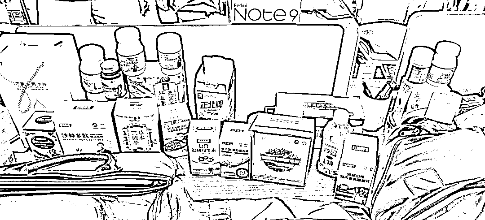

# 一年骗了一个亿！骗子心里很不安

> 原文：[`mp.weixin.qq.com/s?__biz=MzIyMDYwMTk0Mw==&mid=2247539157&idx=5&sn=a2ece5d5c7bec59a36bf88f707e2ef1e&chksm=97cb92eda0bc1bfbdeab1ed4c1076d653a1101904b4161ebe9f13b058759a2a88dbbdaf4419e&scene=27#wechat_redirect`](http://mp.weixin.qq.com/s?__biz=MzIyMDYwMTk0Mw==&mid=2247539157&idx=5&sn=a2ece5d5c7bec59a36bf88f707e2ef1e&chksm=97cb92eda0bc1bfbdeab1ed4c1076d653a1101904b4161ebe9f13b058759a2a88dbbdaf4419e&scene=27#wechat_redirect)

如果不是民警破案

淮南的陈师傅怎么也不会相信

**自己花近 200 元一瓶买来的保健品**

**竟然是成本只有 10 元的普通糖果**

6 月 28 日

淮南市公安局田家庵分局成功

打掉一个专门针对中老年群体

售卖虚假保健品的诈骗犯罪团伙

抓获犯罪嫌疑人**26 名**

**冻结涉案**资金 2 亿余元****

****资产**2000 余万元******

******扣押金条**38 公斤********

 ********藏在居民楼里的实体店******** 

******今年 5 月中旬，民警李杰在淮南市田家庵区前锋村开展走访时，发现一个售卖保健品的实体店隐藏在居民楼里。******

******“这个店不是门面房，开在居民楼里卖给谁？”细心的民警觉得蹊跷，便暗中仔细观察，发现实体店的保健品包装盒上并没有俗称“蓝帽子”保健食品标志，当即判断这家店有问题。******

************

******▲警方查获的“保健品”******

******民警经过进一步侦查，确定这家实体店主要是通过网络售卖各种保健食品。“他们只发展 50 岁以上中老年人为客户，50 岁以下的不发展。”民警还发现实体店负责人另外在该市谢家集区、凤台县等地的居民区里开有 3 家店，其就是该产品在淮南的代理商。******

******“他们在线上卖产品，线下又有实体店，这让很多中老年人相信他们是正规公司，有店在那儿又跑不掉，也就相信他们的产品是正规的。”民警粗略统计，在淮南有近千名中老年人通过网络购买他们的产品。******

 ********背后老板冒充专家授课******** 

******随着侦查深入，民警发现实体店的背后隐藏着一个“大公司”，这个公司注册地在山东潍坊，公司核心成员分布在北京、山东潍坊两地，全国实体店 600 余家，客户多达 26 万余人。******

************

******▲诈骗团伙总部******

******“这个公司经营模式是专门针对中老年的心理需求，找一些小厂生产食品，这些不具备药用和保健作用的产品，通过制作话术对产品进行包装，极力宣传产品的药用及保健功效。”5 月 23 日，警方在掌握了大量证据后，确定这是一个专门诈骗中老年人钱财的犯罪团伙，立即成立了专案组全面展开侦查。******

******很快，民警通过分析确定尹某某、张某某为该团伙主要犯罪嫌疑人，两人名下两张银行卡近一年流入资金竟然多达 3 亿余元。******

************

******▲警方查扣的金条******

******“尹某某还把自己包装成北京一所知名大学中医临床专业毕业，执业医师，高级中医健康管理师，某院士工作站干细胞疗法负责人，与另一位假冒专家每天在直播间授课。”民警注意到，这伙人为了让更多的老人相信他们的产品有疗效，还找人在直播间里当“托”，说自己吃了这些保健品后，效果非常好，身体较过去好多了。******

 **********警方收网端掉骗子总部********** 

********民警发现这个公司开设网络直播间授课时间较为固定，基本上都是早 8 点和晚 8 点，为躲避警方进入直播间侦查，进入直播间都输入经过确认的手机号。********

********为了稳住新老客户，老客户发展一位新客户就会得到一个红包，新人在直播间如果能听 50 分钟课，也会得到一个红包。“其实，这些红包里只有 1、2 块钱。”尽管红包里的诱惑不多，可仍然有很多老人在他们的“话术”诱导下，在包装成专家的迷惑下，相信他们的产品有疗效。********

********在警方查获的聊天信息中，有老人询问癌症患者是否可以服用他们的产品、有的患者服用产品出现不良反应时，该团伙成员就利用事先制作好的“话术”回复“都可以服用”、“服用后的排毒反应”进行搪塞。警方针对这个公司产品对互联网信息进行梳理，结果发现有很多老人的亲属在网上进行投诉。********

********5 月 30 日，淮南市公安局统一协调，对这个公司的淮南代理商和山东潍坊的诈骗团伙总部开展收网行动，抓获犯罪嫌疑人 26 名，扣押作案电脑、手机、各类培训笔记、工作日志、记单账本。********

****************

 **********赃款上亿，让骗子也不安********** 

********据主要犯罪嫌疑人尹某某、张某某交代，两人都曾经做过保健品销售，2020 年底，两人在山东的一个食品展销会上认识，因看到保健品的利润可观，便于 2021 年合伙在山东注册了一家公司，发展全国代理商，制作话术，聘请“讲师”，开设网络直播间，而他们的保健产品则是食品加工厂生产的糖果，成本只有 10 元左右，包装成各种有疗效的各种保健品进行网络销售。********

********“尹某某和张某某自己都没有想到这个‘生意’这么挣钱，短短的一年多时间，两人都挣了近亿元。”民警在检查尹某某老婆的手机时，发现手机银行上的余额有 2000 多万元，另外还在其家中发现 38 公斤金条。尹某某交代，因为有这么多的钱在账上让他感到不安，所以就买了 1500 万元的金条存放在家中，作为留给女儿的财富；民警检查嫌疑人张某某的手机，也发现手机银行上的余额有 4000 余万元。********

****************

********▲嫌疑人张某某的手机银行余额有 4000 多万元******** 

********目前，警方已对涉案犯罪嫌疑人依法采取刑事强制措施。********

********来源：警方微信公众号，巴蜀反诈********

********************************

********← 向右滑动与灰产圈互动交流 →********

****************