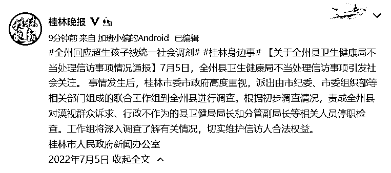
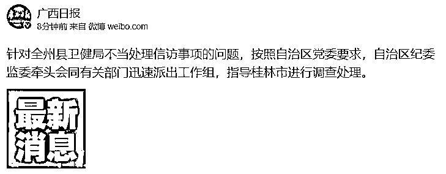
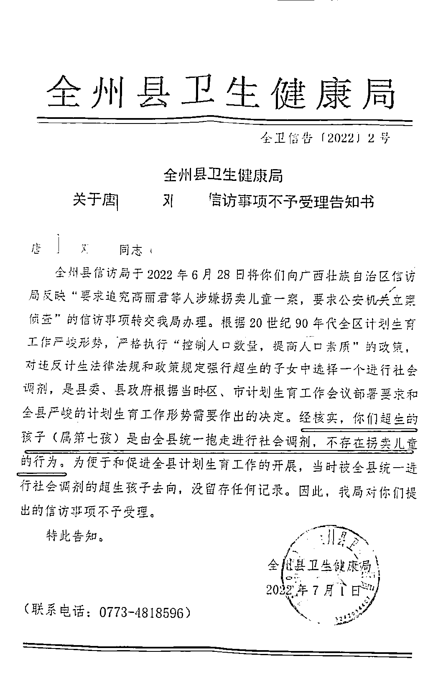

# 简直就是匪夷所思！孩子居然还能被“调剂”？

> 原文：[`mp.weixin.qq.com/s?__biz=MzIyMDYwMTk0Mw==&mid=2247539233&idx=1&sn=da871428b3321a8b47891ccd367a7670&chksm=97cb9119a0bc180f1ef0924fbafd990642ce283621e5bf1fbba362a1d0374b6799fe47e0a928&scene=27#wechat_redirect`](http://mp.weixin.qq.com/s?__biz=MzIyMDYwMTk0Mw==&mid=2247539233&idx=1&sn=da871428b3321a8b47891ccd367a7670&chksm=97cb9119a0bc180f1ef0924fbafd990642ce283621e5bf1fbba362a1d0374b6799fe47e0a928&scene=27#wechat_redirect)

据@桂林晚报，5 日下午，桂林市政府新闻办公室发布情况说明称，**全州县卫健局存在不当处理信访事项行为，该局局长和分管副局长等相关人员已被停职检查**，市纪委、市委组织部等相关部门已组成联合工作组调查此事。

**全文如下：**

> **关于全州县卫生健康局不当处理信访事项情况通报**
> 
> 7 月 5 日，全州县卫生健康局不当处理信访事项引发社会关注。 
> 
> 事情发生后，桂林市委市政府高度重视，派出由市纪委、市委组织部等相关部门组成的联合工作组到全州县进行调查。
> 
> 根据初步调查情况，责成全州县对漠视群众诉求、行政不作为的县卫健局局长和分管副局长等相关人员停职检查。工作组将深入调查了解有关情况，切实维护信访人合法权益。
> 
> 桂林市人民政府新闻办公室
> 
> 2022 年 7 月 5 日

另据@广西日报，针对全州县卫健局不当处理信访事项的问题，按照自治区党委要求，**自治区纪委监委牵头会同有关部门迅速派出工作组，指导桂林市进行调查处理。**

 

[`v.qq.com/iframe/preview.html?width=500&height=375&auto=0&vid=j3346hyxq1v`](https://v.qq.com/iframe/preview.html?width=500&height=375&auto=0&vid=j3346hyxq1v)

官方回应超生孩子被抱走调剂：多人不当处理信访事项被停职

**此前报道**

# **超生孩子被社会调剂？"80 年代确有该政策"**

7 月 5 日上午，一份落款为广西桂林全州县卫生健康局的“信访事项不予受理告知书”，迅速引发舆论争议。

该告知书指出，全州县信访局于 2022 年 6 月 28 日将唐某某和邓某某向广西壮族自治区信访局反映“要求追究高某某等人涉嫌拐卖儿童一案，要求公安机关立案侦查”的信访事项转交我局（全州县卫生健康局）办理。

该告知书表示，根据 20 世纪 90 年代全区计划生育工作严峻形势，严格执行“控制人口数量，提高人口素质”的政策，对违反计生法律法规和政策规定强行超生的子女中选择一个进行社会调剂，是县委、县政府根据当时区、市计划生育工作会议部署要求和全县严峻的计划生育工作形势需要作出的决定。

“经核实，**你们超生的孩子（属第七孩）是由全县统一抱走进行社会调剂**，不存在拐卖儿童的行为。为便于和促进全县计划生育工作的开展，当时被全县统一进行社会调剂的超生孩子去向，没留存任何记录。因此，我局对你们提出的信访事项不予受理。”

[`v.qq.com/iframe/preview.html?width=500&height=375&auto=0&vid=q3346gxtr7l`](https://v.qq.com/iframe/preview.html?width=500&height=375&auto=0&vid=q3346gxtr7l)

广西“被调剂超生子女”母亲发声：30 多年来一直在寻找 想让孩子知道还有亲生的爸妈

全州县卫生健康局“信访事项不予受理告知书”（网络截图）

[`v.qq.com/iframe/preview.html?width=500&height=375&auto=0&vid=g33467np6h1`](https://v.qq.com/iframe/preview.html?width=500&height=375&auto=0&vid=g33467np6h1)

来源：@桂林晚报、@广西日报

](http://mp.weixin.qq.com/s?__biz=Mzg5ODAwNzA5Ng==&mid=2247488048&idx=1&sn=5f1a2dc36389d2b861c357245f46d596&chksm=c0687b67f71ff2710229f2db6e0c294c3868cbcd26995e9148ab4b2cf8d47afe5d6142fe8d01&scene=21#wechat_redirect)

← 向右滑动与灰产圈互动交流 →

