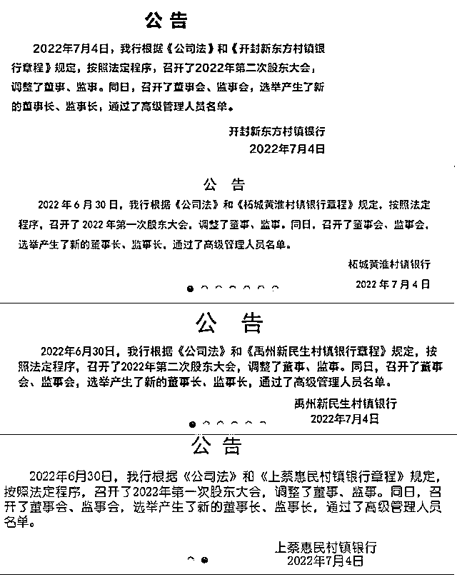

# 河南 4 家村镇银行同时更换董事长、监事长及高管

> 原文：[`mp.weixin.qq.com/s?__biz=MzIyMDYwMTk0Mw==&mid=2247539233&idx=2&sn=6b331632b3af6be998d96766c36131c2&chksm=97cb9119a0bc180f9009ae1e86931ab1f6fd32fcb94555df35f3dc68e56614e22a1f51aa177e&scene=27#wechat_redirect`](http://mp.weixin.qq.com/s?__biz=MzIyMDYwMTk0Mw==&mid=2247539233&idx=2&sn=6b331632b3af6be998d96766c36131c2&chksm=97cb9119a0bc180f9009ae1e86931ab1f6fd32fcb94555df35f3dc68e56614e22a1f51aa177e&scene=27#wechat_redirect)

**此前报道：**

> [科普一下河南村镇银行的事情](http://mp.weixin.qq.com/s?__biz=MzIyMDYwMTk0Mw==&mid=2247536540&idx=2&sn=b7cc8b4bf7c434a65dc0bfa2ddd825d6&chksm=97cb84a4a0bc0db2399b14c486188ed740444d00a0cf6855863f3df6de8a76e55ef77c4b4115&scene=21#wechat_redirect)
> 
> [“河南村镇银行取款难”嫌犯被抓，幕后公司涉嫌相关犯罪已 11 年](http://mp.weixin.qq.com/s?__biz=MzIyMDYwMTk0Mw==&mid=2247538210&idx=3&sn=92d7da385b8bf1265ffca86b628d7ec7&chksm=97cb9d1aa0bc140c2768de520c724fdcdafed7c290c2dea500497939838a5817c8a571a2d8c3&scene=21#wechat_redirect)
> 
> [哪些第三方平台曾为河南村镇银行拉存款？](http://mp.weixin.qq.com/s?__biz=MzIyMDYwMTk0Mw==&mid=2247538269&idx=6&sn=da268b887c61d63ab4d542749f8ccb4c&chksm=97cb9d65a0bc1473fbe4b5c78543fb1e858b6dfeed15577caa1874b9a89ec3b1d11478e7186a&scene=21#wechat_redirect)
> 
> [河南"暴雷"村镇银行储户：余额又清零了](http://mp.weixin.qq.com/s?__biz=MzIyMDYwMTk0Mw==&mid=2247538269&idx=5&sn=59b8a85bc9109ff2d774f916b44242cd&chksm=97cb9d65a0bc147379942597dad69a45a378dc7d1ba33008ddd0c8193a765e901ce221524b2a&scene=21#wechat_redirect)
> 
> [河南“取款难”村镇银行最新消息！新财富集团人去楼空，实控人疑已外逃](http://mp.weixin.qq.com/s?__biz=MzIyMDYwMTk0Mw==&mid=2247538269&idx=4&sn=8db3acfe0048b95a0766fc6fc49fc382&chksm=97cb9d65a0bc147316b1e2c17f2e5fe16c943054536736a4eb849c91b2788ec100ccdd9580be&scene=21#wechat_redirect)
> 
> [诡异！让关系户先走？河南一村镇银行能取钱了，限时 15 分钟！](http://mp.weixin.qq.com/s?__biz=MzIyMDYwMTk0Mw==&mid=2247538722&idx=2&sn=63e58c845d59e183ccd03386bb005098&chksm=97cb931aa0bc1a0c4708d8bcf22001c497ae1971d19a900cf46f32ceff78e352d65c18021a35&scene=21#wechat_redirect)

河南 4 家村镇银行同时更换董事长监事长及高管。

7 月 4 日，河南禹州新民生村镇银行、柘城黄淮村镇银行、上蔡惠民村镇银行、开封新东方村镇银行 4 家村镇银行在官网发布公告称，近日召开了董事会、监事会，选举产生了新的董事长、监事长，通过了高级管理人员名单。这 4 家村镇银行的公告内容几乎一致。

7 月 1 日，河南地方金融监督管理局官网发布的消息显示，河南银保监局、河南省地方金融监管局有关负责同志表示，鉴于我省禹州新民生等 4 家村镇银行案件侦办取得重大进展，有关部门正在甄别信息，研究制定处置方案。提醒相关客户通过线上程序抓紧登记，如实登记。

[`v.qq.com/iframe/preview.html?width=500&height=375&auto=0&vid=o3345tnne8w`](https://v.qq.com/iframe/preview.html?width=500&height=375&auto=0&vid=o3345tnne8w)

6 月 23 日，银保监会副主席肖远企在中共中央宣传部举行的党的十八大以来金融领域改革与发展情况发布会上谈及近期发生的河南村镇银行风险事件时表示，最近河南地方公安机关和地方金融监管部门已经就河南个别村镇银行的问题进行了通报，目前公安机关正在侦办，也抓获了一批犯罪嫌疑人，查封了一批涉案资产。银保监会未来会继续配合地方党委政府做好相关工作。银保监会已经责成河南银保监局履行属地监管职责，依法保护广大人民群众合法权益。

6 月 18 日，河南银保监局、河南省地方金融监管局有关负责人表示，各级金融管理部门密切配合公安机关开展调查，禹州新民生等村镇银行线上交易系统被河南新财富集团操控和利用的犯罪事实已初步查明，相关资金情况正在排查。

[`v.qq.com/iframe/preview.html?width=500&height=375&auto=0&vid=s3344y5gwb9`](https://v.qq.com/iframe/preview.html?width=500&height=375&auto=0&vid=s3344y5gwb9)

来源|澎湃新闻 陈佩珍

← 向右滑动与灰产圈互动交流 →

