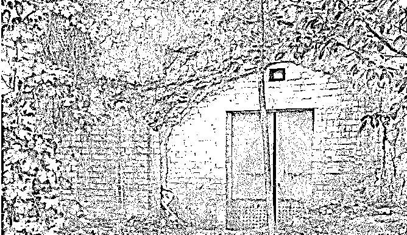
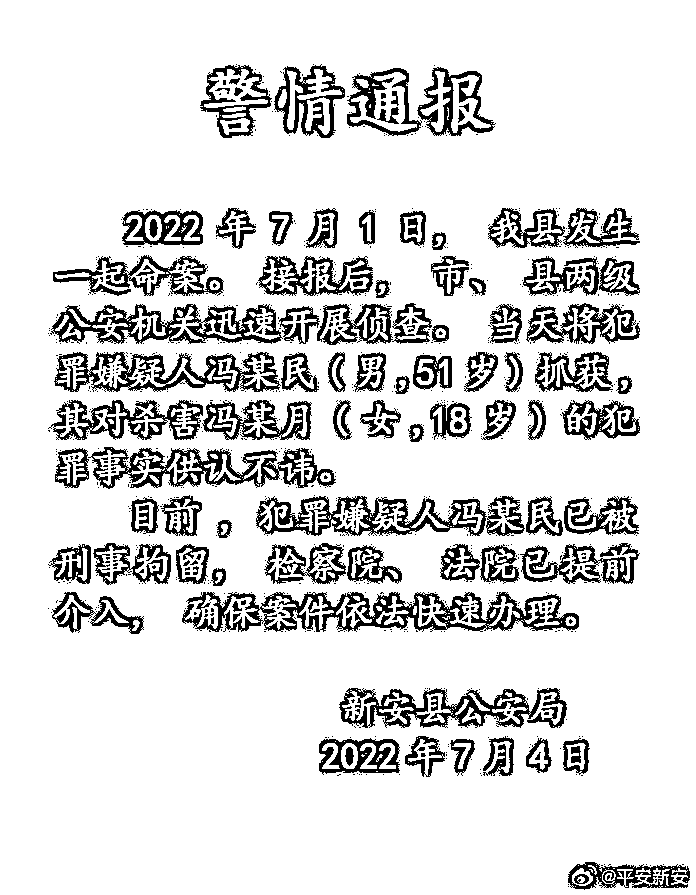
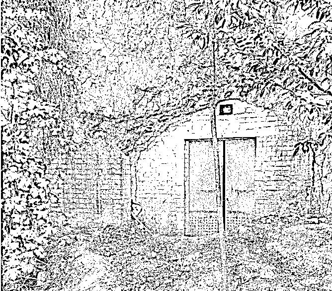

# 女孩高考后被亲戚杀害

> 原文：[`mp.weixin.qq.com/s?__biz=MzIyMDYwMTk0Mw==&mid=2247539233&idx=3&sn=0f5b38f2bedd2673ec6df27803a08d0e&chksm=97cb9119a0bc180fdc38d799bce8df60e777ade9fa7efb9346a292887aad5a4ebbfebd783e34&scene=27#wechat_redirect`](http://mp.weixin.qq.com/s?__biz=MzIyMDYwMTk0Mw==&mid=2247539233&idx=3&sn=0f5b38f2bedd2673ec6df27803a08d0e&chksm=97cb9119a0bc180fdc38d799bce8df60e777ade9fa7efb9346a292887aad5a4ebbfebd783e34&scene=27#wechat_redirect)

7 月 4 日晚，河南省洛阳市新安县公安局微博账号@平安新安 通报称，2022 年 7 月 1 日，该县发生一起命案。接报后，市、县两级公安机关迅速开展侦查。当天将犯罪嫌疑人冯某民（男， 51 岁）抓获，其对杀害冯某月（女， 18 岁）的犯罪事实供认不讳。

目前，犯罪嫌疑人冯某民已被刑事拘留，检察院、法院已提前介入，确保案件依法快速办理。

**此前报道：**

**洛阳女生高考后被杀害**

**村民称凶手是同村人**

高考季，本该是等待录取通知书的日子，有的人却再也等不来自己的录取通知书了。

7 月 4 日传来噩耗：河南省洛阳市新安县八陡山村 18 岁少女冯某月惨遭杀害。

据悉，这个女孩高考成绩 601 分，已填报完志愿。据网友爆料表示，冯某月 2022 年 7 月 1 日下午在自己家中遇害。记者经多方采访获悉，案发五六个小时后警方已将犯罪嫌疑人抓获。一位村民透露：犯罪嫌疑人是女孩同村的一位亲戚。

**疑似亲人发声：**

**18 岁少女在家填志愿不幸殒命**

据多位网友报料，疑似受害者的哥哥称，妹妹冯某月于 2022 年 7 月 1 日下午在自己家中遇害。妹妹刚参加完今年高考，当日在家中填报高考志愿，父母出门办事。

不幸随之而来，犯罪嫌疑人闯入家中，将她拖入废弃洞口杀害后逃回自家，作案手段极其残忍，本人及家人与作案者无冤无仇，竟下此狠手。花季般的年龄，梦想还都没有实现，未来还未开启，就这样逝去。父母已经伤心欲绝，寻死觅活的。我刚刚毕业参加工作，对事情也没有处理能力。希望有关部门能够予以关注，能够给予一些法律援助，希望犯罪嫌疑人能得到应有的惩罚，给妹妹一个公道，同时，希望能够以此促进农村法制建设，不要再发生类似案件。

记者相继联系报料网友，并试图通过报料视频联系到受害者哥哥，暂未获得回应。

疑似案发现场（图据网络）

**村委会负责人：已抓获嫌疑犯**

记者联系到的村委会一位负责人说，冯某月遇害一案，在官方没公布之前，有些东西不能说，官方马上就要公布了。

该负责人证实，案发后五六个小时后，警方就把嫌疑犯抓起来了。他说，已经看到网络上的报料帖，并证实确实为受害者家属所发，当地公安部门已经介入了。他家里出了这事，大家都很同情。他们家是当天晚上 6 点 20 分报的案，晚上 10 点钟之前就把嫌疑人给抓走了。但网上一些报料太不真实。

这名村委会负责人说：“可能家属当时觉得气愤吧。很多情况，相关部门都在调查。这个案件属于突发事件，警方几个小时就把案件搞得很清楚了。现在又传成这样，不知道现在的人咋想的。”

**村民：犯罪嫌疑人为女孩同一家族的亲戚**

据疑似遇害女孩家属在社交平台上留言：“事情发生时警察来了一趟，现在什么消息都没有，我们也没有联系，只能静静等待。”报料网友也发布消息称：“据说警察来了一趟，之后就没消息了”，还有一些网友提出质疑：“当天人都抓住了，不要乱说。”报料网友称自己也是从家属的报料平台上搬来的。

记者采访到一村民说，村里都知道这事。这个案子当时就破了，“犯罪嫌疑人是受害人家族里的一个亲戚，我们平时和这个人也没啥接触。”

[`v.qq.com/iframe/preview.html?width=500&height=375&auto=0&vid=j3346iv6qmp`](https://v.qq.com/iframe/preview.html?width=500&height=375&auto=0&vid=j3346iv6qmp)

来源：封面新闻，南风窗

← 向右滑动与灰产圈互动交流 →

