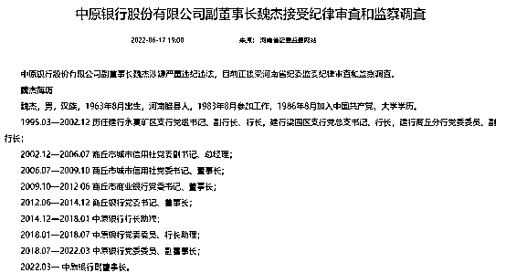
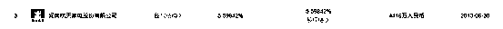
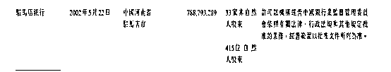
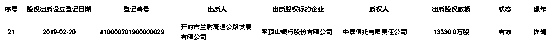

# 中原银行一年两高管被查 隐秘股东与暴雷河南村镇银行有关

> 原文：[`mp.weixin.qq.com/s?__biz=MzIyMDYwMTk0Mw==&mid=2247539233&idx=4&sn=a0b38d9ec6204be8e69c3e72d634584b&chksm=97cb9119a0bc180f1e6b3453080ea0cde81620cc692cc8e3d4fc5fd101aeeefc8cd4667314b7&scene=27#wechat_redirect`](http://mp.weixin.qq.com/s?__biz=MzIyMDYwMTk0Mw==&mid=2247539233&idx=4&sn=a0b38d9ec6204be8e69c3e72d634584b&chksm=97cb9119a0bc180f1e6b3453080ea0cde81620cc692cc8e3d4fc5fd101aeeefc8cd4667314b7&scene=27#wechat_redirect)

**核心提示：**

1 6 月 17 日，中原银行股份有限公司副董事长魏杰涉嫌严重违纪违法被查，这已是一年内该行被查的第二位高管。凤凰网《风暴眼》发现，中原银行隐秘股东与河南新财富集团存在千丝万缕的联系。而新财富集团正是近期多家爆雷的村镇银行背后大股东。

2 据凤凰网《风暴眼》不完全统计，吕奕及其新财富集团盘踞的银行高达 30 家。其中就包括中原银行于 2013 年吸收合并的驻马店银行，此外，中原银行于今年 2 月和 4 月吸收合并的洛阳银行和平顶山银行也与新财富集团关系密切。知情人士告诉凤凰网《风暴眼》，入股相关银行的新财富关联公司，“背后的吕老板很有势力”。

——————————

据河南省纪委监委官网 6 月 17 日消息，中原银行股份有限公司副董事长魏杰涉嫌严重违纪违法，目前正接受河南省纪委监委纪律审查和监察调查。

中原银行继而公布，该行执行董事、副董事长魏杰由于个人原因，于 2022 年 6 月 17 日向该行董事会提交辞呈，辞去该行执行董事、副董事长、战略发展委员会委员、关联交易控制委员会委员及风险管理委员会委员的职务。

魏杰 1963 年 8 月出生，河南睢县人，1983 年 8 月参加工作，1986 年 8 月加入中国共产党，大学学历。2014 年 12 月起，魏杰任中原银行行长助理；2018 年 1-7 月，任中原银行党委委员、行长助理；2018 年 7 月-2022 年 3 月，任中原银行党委委员、副董事长；2022 年 3 月以后任中原银行副董事长。 

这不是中原银行第一个落马的高管。6 月 10 日，中央纪委国家监委网站发布通报称，河南省纪委监委对河南投资集团有限公司原首席发展顾问窦荣兴严重违纪违法问题进行了立案审查调查，而窦荣兴正是中原银行的原董事长。

据报道，窦荣兴自 2014 年 12 月担任中原银行党委书记、董事长。2021 年 8 月 25 日，由于工作调整，窦荣兴辞去中原银行执行董事、董事长及战略发展委员会主任委员的职务。紧接着，窦荣兴被撤销全国政协委员资格。

上述通报提到，窦荣兴丧失纪法底线，大搞权钱交易，利用职务便利为他人在获得贷款、企业经营、职务调整等方面谋利，并非法收受巨额财物；违规发放贷款，数额特别巨大。

近期河南银行可谓风波不断。4 月 18 日，河南、安徽 6 家村镇银行暴雷，银保监会有关部门负责人表示，4 家村镇银行股东——河南新财富集团投资控股有限公司（下称“新财富集团”）通过内外勾结、利用第三方平台以及资金掮客等吸收公众资金，涉嫌违法犯罪，公安机关已立案调查。

新财富集团的实际控制人为吕奕，其一生大多都在搞贷款。凤凰网《风暴眼》不完全统计，吕奕及其新财富集团盘踞的银行高达 30 家。值得注意的是，此次涉事的中原银行与备受关注的新财富集团也存在千丝万缕的联系。

中原银行是河南省首家省属地方法人银行，成立于 2014 年 12 月 23 日，总部设在中国河南省郑州市。2017 年 7 月 19 日，中原银行在联交所主板挂牌上市。

凤凰网《风暴眼》发现，2013 年 12 月 10 日，中原银行在成立之初曾合并十三家城市商业银行完成重组，其中一家为驻马店银行，其股东中有新财富集团的影子。

正是在重组前，即 2013 年 6 月 30 日，河南新财富集团的关联公司河南航天家电股份有限公司（下称“航天家电公司”）突击入股，出资 4416 万人民币，获得驻马店银行的 5.6%股权。重组后，航天家电也借此成为中原银行的股东。

知情人士告诉凤凰网《风暴眼》，航天家电公司背后的吕老板很有势力，除了在开封拥有航天商场，还拥有兰尉高速以及五星级酒店、宾馆等。在公开资料中，开封市兰尉高速公路发展有限公司的实际控制人正是新财富集团的吕奕。

不过此后因为借贷合同纠纷，航天家电公司持有的中原银行 7533.0484 万股股权于 2020 年 8 月 28 日被河南兰考农商行申请冻结。

此外，今年 2 月和 4 月，中原银行正式吸收合并了洛阳银行和平顶山银行，承继及承接其全部资产、负债、业务、人员、合同及其他一切合法权利和义务。而这两家银行均与新财富集团关系密切。

兰尉高速曾是平顶山银行的持股股东。2018 年年末，平顶山银行在 2019 年度同业存单发行计划中披露了变更后的“最大十名股东持股情况”。其中，第三大股东为开封市兰尉高速公路发展有限公司，持股占比 8.12%。

除了兰尉高速，南阳市进财钢材经销有限公司也实际持有平顶山银行 7160.0 万股权。而进财钢材公司的法人正是新财富前高管张学生，因而也疑似新财富的关联公司。

知情人士告诉凤凰网《风暴眼》，平顶山银行高管与吕奕交好。公开资料中，2018 年，平顶山银行原党委书记、董事长牛君彬因受贿 5000 余万元落马，被判执行有期徒刑 12 年，并处罚金 300 万元。 

另一家吸收合并的洛阳银行，于 2016 年由河南海菱实业发展有限公司持股 3.5%，而海菱实业的早期投资人、高管张磊曾担任新财富集团高管，目前是开封市兰尉高速公路发展有限公司通许服务区法人代表。

虽然村镇银行暴雷事件暂未波及更多农商行，但新财富集团带来的影响仍未消除。网上流传的一份文件显示，仅东南部一个省份就有受损储户 25593 人，涉及存款 58113 笔，金额共计 20.43 亿元。储户胡先生告诉凤凰网《风暴眼》，他从 2020 年 7 月开始通过度小满在禹州新民生村镇银行、上蔡惠民村镇银行和柘城黄淮村镇银行分别存入 30 万、30 万和 23 万元，原本想着“鸡蛋不能放进同一个篮子里”，没想到其背后是同一个大股东。

凤凰网《风暴眼》曾报道过[《一个失地的农民：失去了儿子 在河南银行里又失去了拿命换来的钱》](http://mp.weixin.qq.com/s?__biz=MzA4MDcwNTQxMg==&mid=2651040268&idx=1&sn=65649fd732df9491e2911d1eee8fb85b&chksm=845728e7b320a1f1bcd4cd14de07a19bddd7954c68a5b3744245c3f486796d956bf32e626152&scene=21#wechat_redirect)，这些储户中有人已经没有劳动能力，唯一的储蓄是儿子去世时公司给的 100 万赔偿金，却在银行中离奇失踪；有人家里婆婆换肾急需用钱，但始终没有等到放款。

官方似乎对银行风险早有预警。早在 2020 年，为化解中小银行风险，河南就曾决定增资入股村镇银行。2021 年 9 月，河南投资集团以间接入股形式补充 40 家农村信用社（含农商银行）资本，其中就包括河南村镇银行涉事的主角之一——许昌农商行。2022 年上半年，中原银行吸收合并上述新财富入股的银行，也是为了再次化解金融风险。此次副董事长被查，具体原因尚未可知，河南银行的整治风暴或许刚刚开始。

凤凰网《风暴眼》出品 文：吕银玲  编辑：刘培

← 向右滑动与灰产圈互动交流 →

