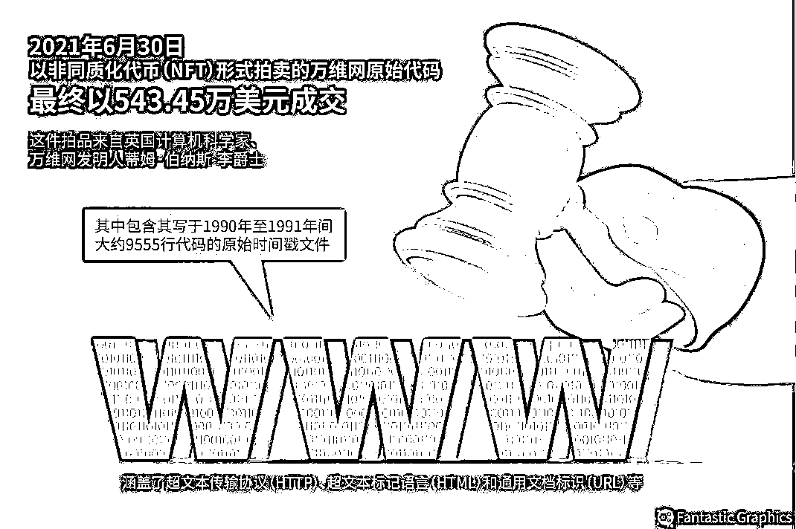
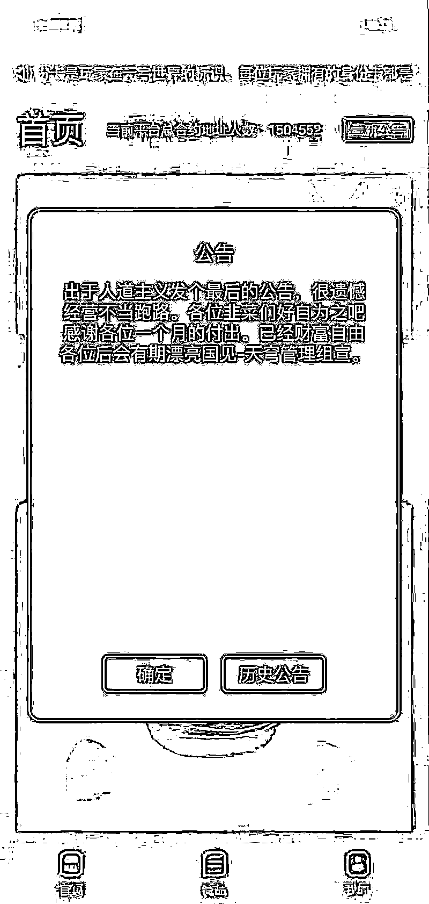
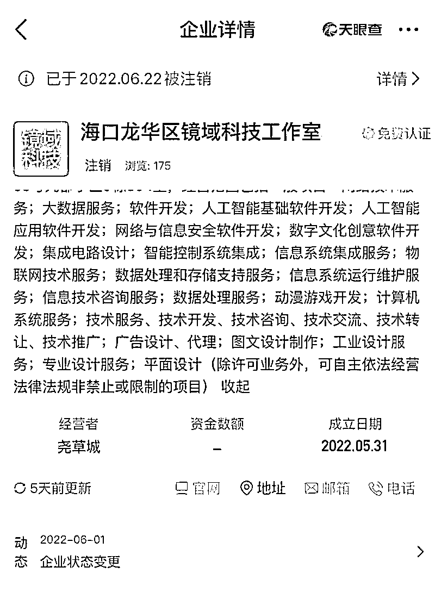
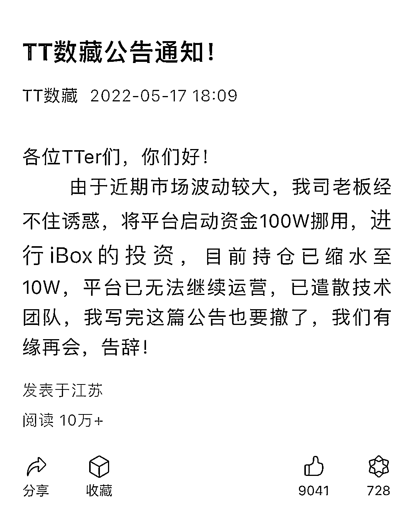
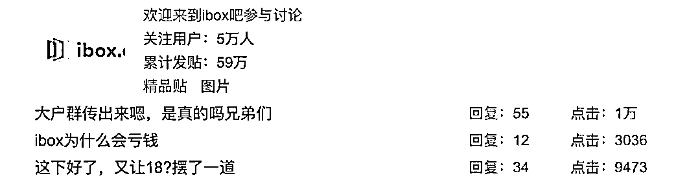
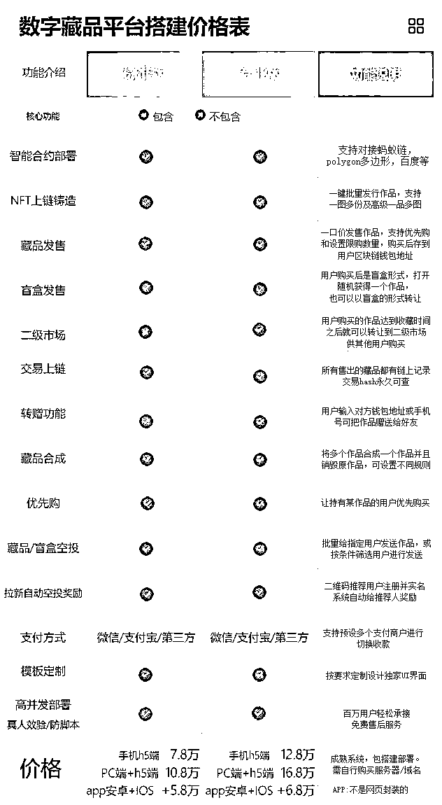
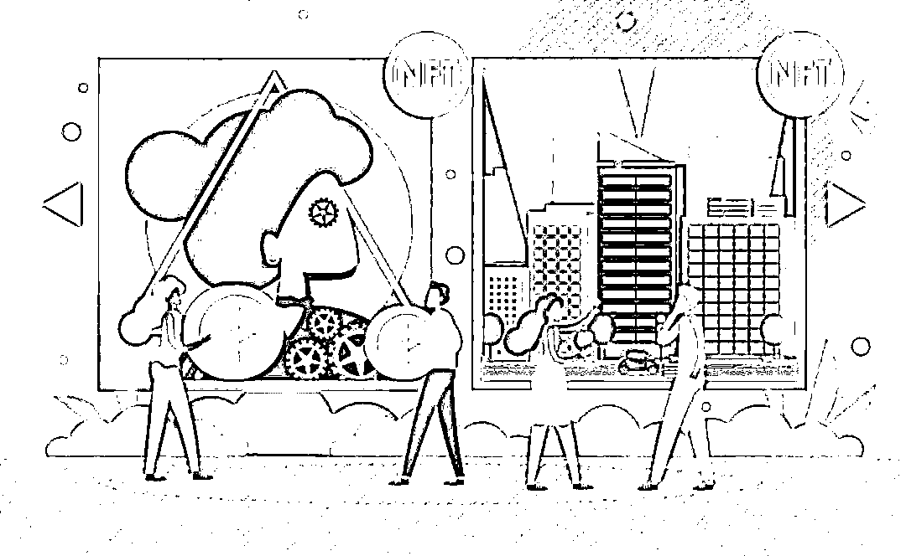

# 崩盘跑路、一日牛熊、老鼠仓……数藏平台“挖坑”手法何其多？

> 原文：[`mp.weixin.qq.com/s?__biz=MzIyMDYwMTk0Mw==&mid=2247539233&idx=5&sn=7c21150be9ce1ec3371f70d3cce6c058&chksm=97cb9119a0bc180f5a4fb0d7d5557bef18e6579dcd5c6fc8172d6776e6ae853058efd18a467c&scene=27#wechat_redirect`](http://mp.weixin.qq.com/s?__biz=MzIyMDYwMTk0Mw==&mid=2247539233&idx=5&sn=7c21150be9ce1ec3371f70d3cce6c058&chksm=97cb9119a0bc180f5a4fb0d7d5557bef18e6579dcd5c6fc8172d6776e6ae853058efd18a467c&scene=27#wechat_redirect)

非同质化代币（NFT）这股风潮越演越烈。

海外价值数百万元的 NFT 头像、国内转手翻几倍的数字藏品，“NFT”以及与其有关的“造富神话”，此前已吸引了大批投机者参与其中。

2021 年 6 月 30 日，万维网原始代码以 NFT 形式拍出，成交价 543 万美元。

然而，一旦泡沫被戳破，数字藏品寄售或流转市场或成为一场割韭菜的闹剧。

近日，数字藏品平台“光艺数藏”寄售市场上藏品价格暴跌、平台负责人老鼠仓、无法提现、疑似跑路等话题，成为数藏行业讨论的焦点。

6 月 29 日，涉事的“光艺数藏艺术”官网发布两则澄清、辟谣公告。

不过，截至目前，光艺数藏官方网站已出现卡顿甚至无法打开的情况。

## ******多家平台陷“跑路”风波****** 

**6 月 28 日夜间，有多个玩家在社群中表示光艺数藏“一度暴跌 80%、无法提现、涉及洗钱导致玩家银行卡显示异常、跑路”等问题。**

**次日，“光艺数藏”官网发布辟谣公告表示“因平台负责人账号被黑，传出谣言，请各位用户不要相信未经查实的跑路谣言。平台将正常运营，所有用户的正常提现都能得到保障。”**

**有玩家对南都湾财社记者表示，在短时间时间内创世勋章这款藏品从数千元降至 500 元，“光艺数藏这个台子 5 月才起来，之前 299 元的创世勋章被炒至上万元，现在的地板价在约 700 元，目前还是有人在抄底，我等提现了就不会碰这个平台了，亏了一千多元当交学费了”。**

**实际上，今年 6 月，陷入“跑路”、“暴跌”传闻的国内多家数藏平台不止一家。**

**6 月初，一张“天穹数藏跑路”的页面弹窗公告截图在数藏圈引发风波。弹窗内容称：“出于人道主义发个最后的公告。很遗憾由于经营不当跑路。各位韭菜们好自为之吧。感谢各位一个月的付出。”**

****

**随后天穹数藏辟谣称，“平台运行正常，目前正在测试新版本功能以及优化，对于恶意造谣以及 PS 的始作俑者，平台正在追查出处。”**

**资料显示，天穹数藏于今年 4 月上线，提供数字艺术藏品发售、挂售市场、求购市场、拍卖市场以及“合成阁”和“铸造大厅”板块，链条相对完整。截至目前，该平台显示总合约地址人数已经接近 160 万人。“跑路”虽为假，但天穹数藏平台曾出现黑客攻击，并遭多位玩家投诉其拒不发货、不予退款的问题。**

**有资深玩家对南都湾财社记者表示，对于平台方而言，如果不是非跑不可，一般都会想办法修补，“只要发售藏品，就有收入分成，如果有寄售市场，还能赚手续费”。**

****

****“消失的平台”****

**有的平台忙着辟谣，有的平台就真的消失了。**

**其中，一家名为“镜域数藏”的平台 6 月初起盘，6 月就末崩盘，存在时间不足一个月。南都湾财社记者注意到，“镜域数藏”实体控制公司名为“海口龙华区镜域科技工作室”，工作室成立于 2022 年 5 月 31 日，6 月 22 日时已经注销。**

****

**据购买者在黑猫投诉上称，6 月 15 日，该平台利用抽奖小程序白名单中奖的方式让用户购买创世数字藏品，一份 188 元，共计 1971 份，但结束后客服不再回复，也没收到藏品。按照全部售完计算，该平台“卷走”了超过 37 万元。**

**此外，一个名为“TT 数藏”的公号发布公告称：“由于近期市场波动较大，我司老板经不住诱惑，将平台启动资金 100W 挪用，进行 iBox 的投资，目前持仓已缩水至 10W，平台已无法继续运营，已遣散技术团队”。**

**** 

**业内人士表示，大部分玩家只关注稀缺性，忽视数字藏品本身的价值，买入 NFT 数字藏品的唯一动机是卖给下一个人、找人接盘，数字藏品二级市场交易成为一个“击鼓传花游戏”，而游戏总有停的时候。**

**国内一家数藏平台 CEO 曾对南都记者解释称，NFT 最初的故事在国内并没有讲通，即购买者没有形成对 NFT 这个数字内容的所有权，充其量是个“观赏者”，“平台各自为战。如果平台跑路、倒闭，用户购买的相关资产也会随之化为乌有”。**

## ******** 

## ****既当“裁判”又当“运动员”****

**据南都湾财社记者不完全统计，截至 6 月 30 日，市场上有超过 700 家数藏平台，其中 1/4 开了寄售、流转等业务。港股上市公司“疯狂体育”旗下的乾坤数藏也开始了寄售功能内测。在寄售市场，所报价格均为已购消费者报出，平台充当“提供交易服务”的角色，每一次“转售”，平台均收取手续费。**

**北京市中盾律师事务所高级合伙人邓雷对南都湾财社记者表示，此类平台金融化证券化的倾向比较明显，相当于变相地成立了交易所，“这与现行政策不符，行走在灰色地带”。**

**** 

**南都湾财社记者注意到，数藏市场存在门槛低、准入规则不健全等问题，参与机构鱼龙混杂，部分藏品价格被炒至过高，已出现暴跌蔓延之势，例如此前火热的 iBOX、HOTDOG、唯一、七级宇宙等均出现藏品价格“一日牛熊”的状态。**

**值得注意的是，数字藏品投资者中拥有相当比例的 00 后、大学生。换句话说，数字藏品投机炒作风险已向校园蔓延。**

**中国移动通信联合会元宇宙产业委员会执行主任于佳宁表示，一些项目打着数字藏品的名义，但其实脱离了文创产业的本质，完全是投机炒作工具，价格缺乏价值支撑。市场中甚至也存在所谓“庄家”或者“大户”，通过早期的二级市场交易，以及外挂等技术手段大肆囤积数字藏品，随后再高价买卖从而进行炒作，严重危害了市场公平性和可持续性。有必要在开展相关研究基础上，制定指导意见，引导产业和大众客观理性看待数字藏品。**

**“艺术品本身难定价，再叠加区块链和虚拟币的玩法，价格波动大，二级市场控制，杠杆投资场外配资，最后割韭菜，和之前的 ICO 的套路没有太大的区别”，中国社会科学院金融研究所金融科技研究室主任尹振涛告诉南都湾财社记者。**

****

**被传“跑路”的光艺数藏被玩家爆料称，已经拿到了光艺数藏负责人“梁某某”的账号。在梁某某的光艺数藏账号中，持有大量数字藏品，比如总量 29999 份的藏品，该账号持有 11820 个，还有上千个盲盒、几十个创世藏品等，涉嫌操纵寄售市场的价格。**

**关于梁某某光艺数藏账号中持有大量数字藏品的问题，南都记者向光艺数藏咨询，暂未得到回复。**

**记者注意到，据光艺数藏官网的《服务协议》内容，光艺数藏由佛山宏天创电子商务有限公司所有，法定代表人为梁天赐，与上述被曝光的“梁某某”同名。南都湾财社记者拨打网传的电话并无人接听，但可以往网传的梁某的银行卡中打款。**

**业内人士指出，在数藏圈，大平台基本都是走正规路线，但是不少小公司、小平台出发点是以盈利为主，创始人或者员工持有部分藏品并参与买卖是“心照不宣”的。“有些平台会公示给平台或者项目方留多少藏品，但玩得野的就不会”，比如一份藏品显示公开发行 10000 份，但实际发售可能就 6000 份，剩下的 4000 份分散给平台或者项目方开设的账户里，二者合作哄抬价格，将价格推高后抛售砸盘。**

**今年 5 月，各大官方媒体曾直接点名批评 iBOX，而近期有 iBOX 的玩家对南都记者透露称，自从 2 月购买了几个藏品后，就一直没登录过平台，但 5 月初登录账号发现，交易记录里有很多买入卖出的记录。**

**** 

**贴吧上关于 iBOX 的讨论热度很高** 

**对此，iBOX 回应南都湾财社记者称，“不存在虚假交易，技术反馈有被盗号的情况，是因为有人使用了第三方外挂软件，其手机号和身份信息会托管至第三方”。还有一种只抢购但不支付、俗称“锁单”的炒作方式。**

**南都湾财社记者注意到，数藏平台一开始并没有锁仓次数的限制，前期一些团体会建立一部分付费群，选择一款热度比较小的藏品，提前先囤一批藏品在手上，再呼吁群内的人的锁仓。**

**“把价格低的藏品循环锁定，自己手上的藏品则挂高出售，让群外的人高价去接他们出售的藏品”，一位数藏玩家说。在这些过程中，新手常常会被其夸张的涨幅和一夜暴富的幻象引诱入局,让投机者趁机大量出货大赚一笔。**

**“这种价格高度偏离价值的现状，与平台、项目方的关系息息相关”，一位数藏平台的创始人对南都湾财社记者表示，目前市面上有寄售市场业务的数藏平台，许多都会采取与项目方共同运营或者全权代运营的方式，“这也意味着平台一边发行着藏品，一边也能通过营销手段或者二级市场给藏品抬价，既当着裁判，又当着运动员”。**

## ******** 

## ****“快钱”还能挣多久？****

**在采访中，北京市盈科(深圳)律师事务所合伙人郭志浩表示，数字藏品的价格来源于其底层的权利价值映射。正确的衡量一个数字藏品的价格，不仅要考虑到它的稀缺性、独特性，还要考虑到它的底层权利或价值到底是什么？如果没有合理的权利或价值作为底层映射，单纯的炒作不可持续。**

**据南都湾财社记者通过 2 个月的测试发现，目前市面上的很多平台用户体验并不好，平台的 APP 或者 H5 页面问题较多，如登录卡顿、藏品突然消失、充值提现难等。**

**一位业内人士给南都记者的数藏平台搭建价格表显示，搭建一个含手机 H5、PC 网页端、APP（安卓、IOS 均具备）的数藏平台价格约为 16 万元，如果加上寄售市场功能，成本约 23 万元，“但外包的很容易出问题，比如被外挂攻击、上不了链等”。**

****

**收益方面，除了发行藏品的收益外，有寄售市场的平台还能收取手续费。以 HOTDOG 为例，“流转中心”里购买数藏，再次转售时手续费高达 10%，当交易频次增加时，平台抽佣就会越多。**

**业内人士对南都湾财社记者表示，最近两个月平台增多，藏品发行频率也在增加，在供给大量增加的背景下，需求却没跟上，数藏玩家破圈仍不明显，“现在发行的藏品出现了卖不动的情况”。**

**同时，数藏平台频频出现提现难以及跑路传闻，加之暴涨暴跌的市场行情，已经“洗”出了不少玩家。此外，“目前处于监管套利期，各平台疯狂发新，炒作，目的就是要‘及时行乐’，抓紧圈钱”，业内人士一针见血地指出。**

**** 

**在数字藏品价格涨跌背后，投诉也接连不断。目前，仅在黑猫投诉上，关于数字藏品的投诉就超过 3000 条。消费者投诉问题主要集中在平台涉嫌炒作、哄抬价格；商家虚假发货、不退款；数据丢失，购买藏品被盗等。**

**中国社会科学院金融研究所金融科技研究室主任尹振涛对南都湾财社记者称，数字藏品仍处于发展初期，“藏品定价是否公允、运营平台的技术安全、规范经营管理等问题存在监管空白，如果平台不作为甚至跑路，对于普通投资者而言，也存在投诉维权无门，法院及仲裁受理难等现实问题。”**

***封面图为素材图，与本文提及内容无关**

****说说，你接触过 NFT 吗？****

****留言区见**** 

**来源：南都 APP·湾财社 采写：南都·湾财社记者 叶露 编辑:石力**

********

**← 向右滑动与灰产圈互动交流 →**

****