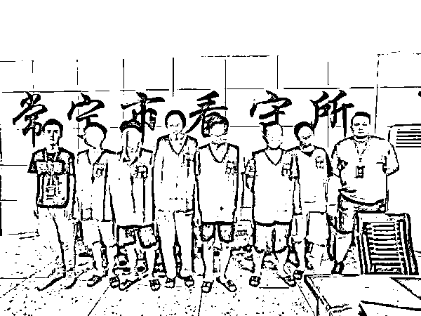
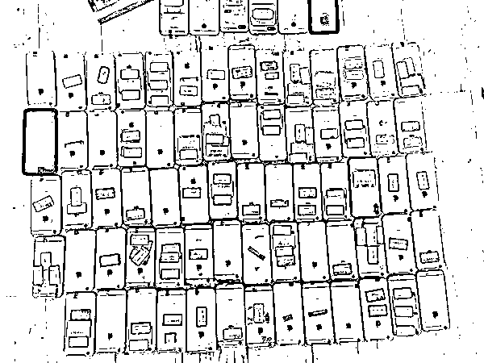

# 七人组团专骗外国人，失手原因笑出腹肌

> 原文：[`mp.weixin.qq.com/s?__biz=MzIyMDYwMTk0Mw==&mid=2247539233&idx=6&sn=133e4a1afc0275c6df2dab95f42af3d5&chksm=97cb9119a0bc180fdf1256d0114213d282718029426317c4f97fb7afb7562254d7d9cd2ecb43&scene=27#wechat_redirect`](http://mp.weixin.qq.com/s?__biz=MzIyMDYwMTk0Mw==&mid=2247539233&idx=6&sn=133e4a1afc0275c6df2dab95f42af3d5&chksm=97cb9119a0bc180fdf1256d0114213d282718029426317c4f97fb7afb7562254d7d9cd2ecb43&scene=27#wechat_redirect)

假扮白富美、高富帅网络“交友”，欺骗受害人感情，诱导受害人投资、博彩或者直接向受害者索取钱财，这种诈骗方式被称为“杀猪盘”。近期，这一电信网络诈骗方式又出现了新变种：诈骗分子开始瞄准外国人，利用翻译软件和外国网友聊天“交友”，以相同手段获取被害人信任后骗取钱财，这种诈骗被称为“杀洋盘”。

常宁公安抓获的“杀洋盘”团伙。本文图片除标注外均为 常宁公安

近日，湖南常宁市公安局成功摧毁一个“杀洋盘”电信网络诈骗团伙，在广州番禺抓获涉嫌诈骗的团伙成员 7 人。

7 月 5 日，湖南常宁警方告诉澎湃新闻，该局反诈中心民警在工作中发现一个以常宁市宜阳街道办事处人周某（男，30 岁）为首的“杀洋盘”电信网络诈骗团伙。由于案件涉及地域广、涉案人员多，为了彻底摧毁该电诈团伙，常宁市副市长、市公安局长罗鹏亲自调度部署，从全局抽调精干力量 10 人成立专案组展开全面调查。通过缜密侦查，循线深挖，专案组民警掌握了该电诈团伙的犯罪事实和藏身之处。

被抓时“杀洋盘”正在实施诈骗。

6 月 27 日，专案组民警赶赴广东广州番禺，在当地警方的大力支持下，一举捣毁以周某为首的电诈团伙窝点，抓获团伙成员 7 人，现场缴获作案工具电脑 10 台、手机 74 部、境外电话卡上百张。民警在抓捕时，犯罪嫌疑人正在实施诈骗，电脑聊天界面以及手机界面全部是英文。

常宁公安查获的团伙成员作案工具

“初步调查发现，该团伙以前曾与缅北、老挝等地电信诈骗窝点有接触或关联。”常宁市公安局相关工作人员介绍，“他们都是本地乡镇的，文化水平不高。”

“杀洋盘”未翻译前的话术本页面。

经进一步调查发现，周某等人电诈团伙主要针对外籍人员实施诈骗，犯罪嫌疑人按照印度、中东地区外籍人员特征对自己的社交账号进行前期包装，用复制好的话术通过翻译软件与对方沟通，诱导投资实施诈骗。目前，犯罪嫌疑人周某等 7 人均已被依法刑事拘留。案件正在进一步办理中。

“这是我们第一次办这种案件。”常宁市公安局相关工作人员说，“由于受害者在国外，资金流转也不如国内‘杀猪盘’清晰，目前我们在取证方面正积极和检察院交流。”

澎湃新闻搜索发现，近期，四川南充、湖南长沙、湖北丹江口等多地警方也破获类似案件。

据封面新闻报道，今年 5 月，四川南充市公安局顺庆区分局捣毁一“杀洋盘”电诈团伙，抓获犯罪嫌疑人 50 余名，查扣作案电脑 30 余台，作案手机 100 余部。该案犯罪嫌疑人黄某曾在缅北从事电信网络诈骗犯罪活动，回国内后邀约罗某等人“重操旧业”，在福建某地租用“办公场地”，开设“科技公司”，大量招募“业务员”，黄某等人编写了“七天速战法”“拒绝视频聊天话术”“感情价值观话术”等诈骗话术，在境外网站打包购买亚裔“白富美”个人形象和日常生活照片，对“业务员”进行包装，指导“业务员”使用翻译软件与境外网友“网恋交友”，并将受害人引诱至虚假网络投资平台进行诈骗。

6 月 10 日，长沙开福区人民检察院发布的一起公诉案件显示，2021 年 12 月，湖南省长沙市开福区一家网络科技公司 108 名员工因涉嫌诈骗被公安机关抓获。经调查，犯罪嫌疑人葛某某伙同梁某、张某等人于 2021 年 8 月开设“公司”，从江西多地招揽“总监”入职，再通过招聘网站、软件等平台招揽业务员，由“总监”管理，用境外聊天软件假扮有钱、漂亮的女性或有为、帅气的男士，添加澳大利亚、新加坡、菲律宾等外籍受害人，通过暧昧聊天等方式建立信任后，引导外籍受害人向该公司搭建的虚拟币杠杆交易平台进行投资交易，再通过后台操作让受害人充值的虚拟币爆仓，从而非法占有受害人的虚拟币。2021 年 9 月至 12 月，该公司通过上述方式共涉嫌诈骗外籍人士人民币 1600 余万元。

丹江口警方查获的“杀洋盘”现场。图片来源：丹江口警方

6 月 13 日，湖北丹江口市警方捣毁一个“杀洋盘”电信诈骗团伙，5 名团伙成员全部落网。**据警方通报，因为该诈骗团诈骗时都用的英文聊天，为了严谨取证，刑侦大队还特意请来 4 名英语老师现场对聊天记录进行翻译取证。结果聊天软件中的聊天内容，让 4 名高校英语老师也看得一头雾水，这些聊天记录不是语法错误，就是词不达意。****犯罪嫌疑人潘某等人交代，他们在行骗过程中，只是机械地从上线提供的话术材料中复制里面的语句发给对方，或者通过常规的翻译软件翻译出能表达自己意思的语句发给对方。****后来，潘某等人坚持学习基本的英文短句，并在每个人的电脑上下载多款即时翻译软件，以希望能提高“工作”效率。但由于外语水平太差，潘某的 5 人诈骗团伙成立 1 个多月来，尚未成功过一次，反倒搭进去水电费等成本好几千元。**

来源：澎湃新闻

← 向右滑动与灰产圈互动交流 →

